## ALPHA I.MX系统移植与使用 - HQ

[TOC]

------

#### 注意

- 系统移植注意的几个点
  - 开发板如果是通过tftp下载内核和设备树并进行启动的话，是将内核和设备树下载到RAM里面，断电丢失。
  - 无论是通过emmc还是sd卡的uboot启动，在执行 `setenv`后将保存更改
- 

------

# 内核移植步骤

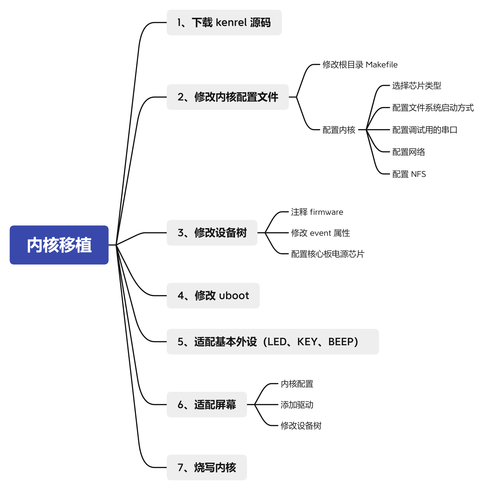

# 阿尔法开发板使用

【正点原子】I.MX6U嵌入式Linux驱动开发指南V1.6 

### 前期准备工作

【正点原子】I.MX6U嵌入式Linux驱动开发指南V1.6 

1. 安装ssh，配置FileZilla   （4.2）

2. 安装交叉编译工具链及相关库  （4.3.1）

3. 安装烧写软件imxdownload  （8.4.3）

4. Ubuntu下NFS和SSH服务开启 （4.2）

   1. > 
      >
      > 


### 固化系统（初试）

【正点原子】I.MX6U用户快速体验V1.9.pdf

1. 安装CH340驱动，MobaXterm串口调试终端软件 （2.1）
2. 固化系统 - 2.2
   1. 使用mfgtool上位机固化系统（OTG方式）
      1. 固化系统到SD卡
      2. 固化系统到emmc
   2. 使用脚本固化系统（虚拟机内）
      1. 固化系统到SD卡
      2. 固化系统到emmc

### ATK I.MX6U 交叉编译（初试）

【正点原子】I.MX6U用户快速体验V1.9.pdf

1. 安装Poky交叉编译工具链（4.2）
2. 编译出厂源码U-boot  (4.3)
3. 编译出厂源码内核及模块 （4.4）

### 开发板网络环境搭建

参考教程【【正点原子】I.MX6U网络环境TFTP&NFS搭建手册V1.3.1】

### 其他模块使用

#### 配置wifi模块

【正点原子】I.MX6U用户快速体验V1.9 —— 第三章 ATK I.MX6U功能测试 3.24 SDIO WIFI测试

1. 模块型号  RTL8189_WIFI 版本 1.4

2. 按照教程步骤，初始化 —— 配置无线账号密码 —— 测试连接

   > 
   >
   > 
   >
   > 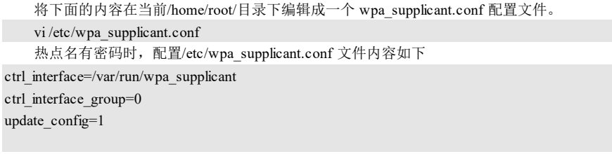
   >
   > 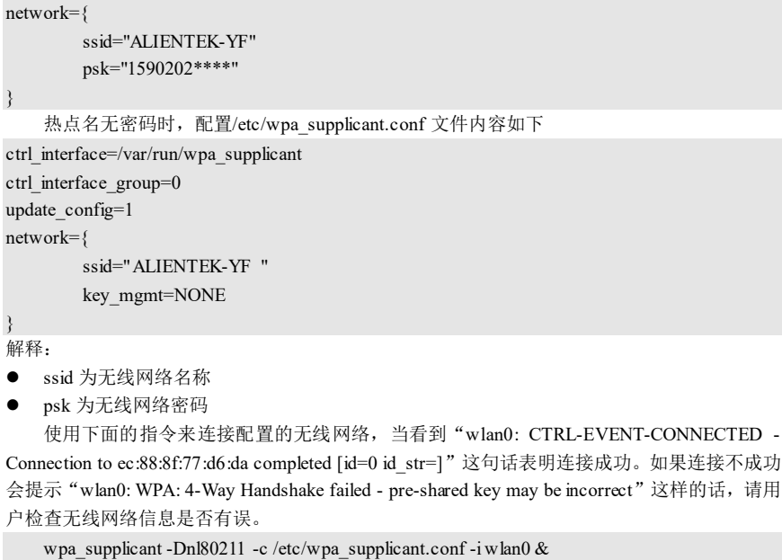
   >
   > 

3. 配置成功

   > 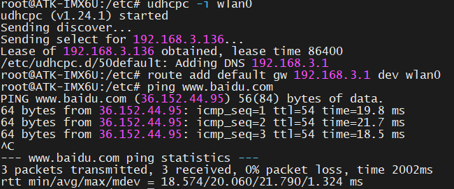

4. ssh连接

   > 

5. 每次开机都要进行初始化配置，如，运行脚本（安装驱动模块，解锁射频，杀死后天运行的程序），开启SDIO WIFI，连接配置的无线网络。所以写了一个脚本如下（由于汉字乱码，没有加上注释）。

   > 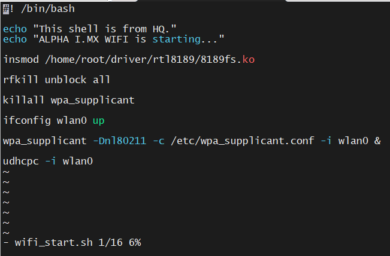

### 开机网络自启动设置

1. > 
   >
   > 
   >
   > 


### Linux内核挂载文件系统的几种方式

搭建NFS环境可另外参考教程【【正点原子】I.MX6U网络环境TFTP&NFS搭建手册V1.3.1】

#### 1. 启动系统时通过nfs方式挂载（挂载的为文件系统）

- 设置环境变量 bootargs 来挂载 nfs 共享目录下的 rootfs 文件系统到开发板内存中。

- `setenv bootargs 'console=ttymxc0,115200 root=/dev/nfs nfsroot=192.168.10.100:/home/alientek/linux/nfs/rootfs,proto=tcp rw ip=192.168.10.50:192.168.10.100:192.168.10.1:255.255.255.0::eth0:off'`

- > 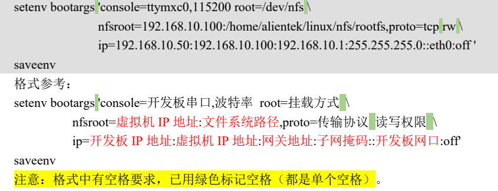

> `/mnt/rootfs/rootfs`文件夹路径
>
> `192.168.1.105`为客户端ip
>
> `192.168.1.88`  为ubootip

#### 2.启动系统时从块设备挂载（挂载的为文件系统）

- `bootargs=console=ttySAC2,115200 root=/dev/mmcblk0p2 rw init=/linuxrc rootfstype=ext2`

> `mmcblk0p2`代表0号mmc的2扇区
>
> `rootfstype=ext2`文件系统格式

#### 3.在系统中通过nfs挂载（挂载的为文件夹）

参考教程【【正点原子】I.MX6U网络环境TFTP&NFS搭建手册V1.3.1 - 第三章，第四章】

1. 虚拟机安装NFS服务

2. 虚拟机设置NFS共享目录

3. 虚拟机配置NFS服务

4. 开发板通过NFS挂载文件系统（实验成功）

   `mount -t nfs -o nolock,nfsvers=3 192.168.1.101:/home/hq/linux/nfs get/`

   挂载到的本地文件夹可使用绝对路径或相对路径   `../get/`   
   
   > 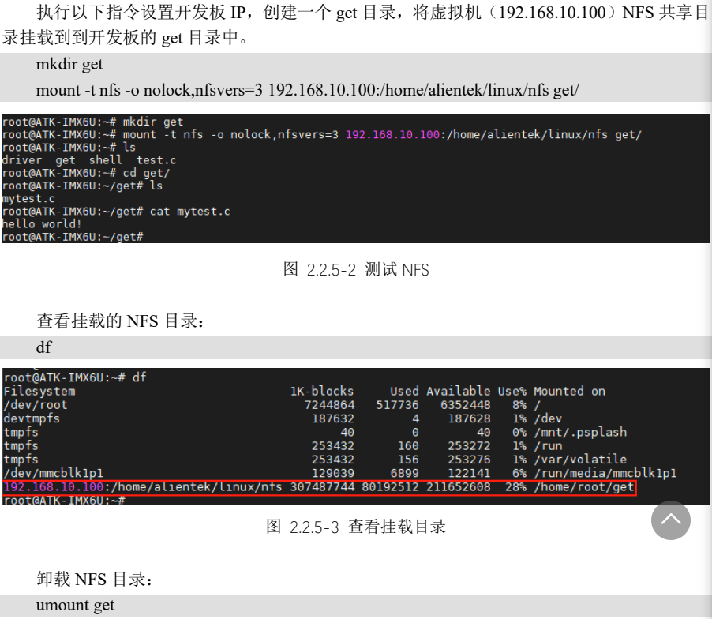

**其他步骤**

1. 使用网络nfs给开发板挂载Ubuntu的文件系统

   ```cpp
   使用网络nfs给开发板挂载ubuntu的文件系统：
   
   ubuntu先安装nfs服务：sudo apt-get install nfs-kernel-server rpcbind
   配置相关文件夹为nfs文件夹：sudo vi /etc/exports
   在最后一行加上文件夹路径：/home/qing/work/nfs/rootfs_friendlycore-focal_4.14   *(rw,sync,no_root_squash)
   然后重启ubuntu服务：sudo /etc/init.d/nfs-kernel-server restart
   被挂载的文件夹最好 ：chmod 777  xxx/
   
   在开发板里面也要安装nfs服务：sudo apt-get install nfs-kernel-server rpcbind
   重启开发板的nfs服务:        sudo /etc/init.d/nfs-kernel-server restart
   然后挂载ubuntu配置好的文件夹到你想挂载到的目录了：sudo mount -t nfs 192.168.43.167:/home/qing/work/nfs/rootfs_friendlycore-focal_4.14/ /mnt/ -o nolock
   要退出挂载就：sudo umount /mnt/   要先退出这个挂载的目录，不然会提示你正busy
   ```

   > 


# Linux系统移植学习

【正点原子】I.MX6U嵌入式Linux驱动开发指南V1.6  ——  第三章 系统移植篇 （P683）


## U-Boot使用实验（第三十章）

1. U-Boot初次编译（30.2）

2. U-Boot烧写与启动（30.3）

3. U-Boot命令使用（30.4）

   1. 环境变量操作命令

   2. 内存操作命令

   3. 网络操作命令

      1. 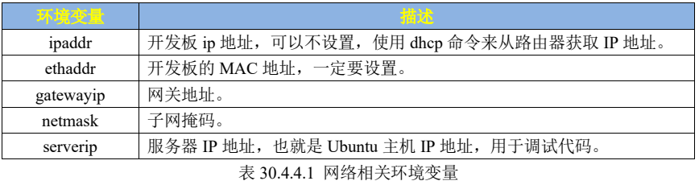

      2. ```cpp
         //配置网络环境变量
         setenv ipaddr 192.168.3.140
         setenv ethaddr b8:ae:1d:02:00:00
         setenv gatewayip 192.168.3.1
         setenv serverip 192.168.3.138
         setenv netmask 255.255.255.0
         saveenv
         ```
      
      3. uboot网络常用命令
      
         1. `ping`    开发板的网络能否使用，是否可以和服务器(Ubuntu 主机)进行通信，通过 ping 命令就可
            以验证，直接 ping 服务器的 IP 地址即可
         2. `dhcp`   dhcp 用于从路由器获取 IP 地址，前提得开发板连接到路由器上的，如果开发板是和电脑
            直连的，那么 dhcp 命令就会失效。直接输入 dhcp 命令即可通过路由器获取到 IP 地址
      
      4. 使用tftp下载文件过程
      
         1. `sudo server tftpd-hpa start`   Ubuntu中启动tftp服务器
      
         2. ```cpp
            //设置 bootargs 和 bootcmd 这两个环境变量，开发板启动后将自动运行，下载
            setenv bootargs 'console=ttymxc0,115200 root=/dev/mmcblk1p2 rootwait rw'
            setenv bootcmd 'tftp 80800000 zImage; tftp 83000000 imx6ull-alientek-emmc.dtb; bootz 80800000 - 83000000'`
            saveenv
            ```
      
         3. ```cpp
            //手动下载
            zImage 和 imx6ull-14x14-evk.dtb 下载到开发板中并启动：
            tftp 80800000 zImage   //开发板下载虚拟机tftpboot文件夹中的zImage文件到DRAM的0X80800000地址处
            tftp 83000000 imx6ull-14x14-evk.dtb   //下载设备树
            bootz 80800000 - 83000000  //启动内核
            ```
      
      5. nfs命令   （nfs 网络文件系统）
      
         1. 通过 nfs 可以在计算机之间通过网络来分享资源，比如我们将 linux 镜像和设备树文件放到 Ubuntu 中，然后在 uboot 中使用 nfs 命令将 Ubuntu 中的 linux 镜像和设备树下载到开发板的 DRAM 中。
      
         2. ```cpp
            使用前准备工作
            sudo apt-get install nfs-kernel-server  //安装nfs
            
            sudo vi /etc/exports  //修改nfs配置文件，将nfs运行挂载的目录在exports中定义
            //以后在后面添加如下所示内容： 
            /home/kennan/linux/nfs *(rw,sync,no_root_squash)
            
            //开发板使用命令
            nfs 80800000 192.168.3.140:/home/hq/linux/nfs/zImage
            ```
      
         3. ```cpp
            使用时，开发板一直连接不上
            重启NFS服务，使用如下命令： sudo service nfs-kernel-server restart
            此时可以运行以下命令来显示共享的目录：
            showmount -e
            在nfs运行的过程中，修改了/etc/exports配置文件，可以使用exportfs命令使改动生效，具体命令：
            sudo exportfs -rv
            上述方法试了之后还是不行的，又继续搜到如下方案，
            在host文件中将开发板的IP地址增加进去，
            host文件在/etc/hosts中
            sudo vi /etc/hosts
            打开后加入 10.0.0.5    /home/kennan/linux/nfs/    
            
            也可能是uboot中使用得NFS版本为V2版本，而ubuntu中的NFS版本为V3,V4及以上版本，从而导致uboot不能再NFS服务器中找到文件
            
            解决办法为：让buntu中得NFS兼容V2。修改/etc/default/nfs-kernel-server 文件。
            
            操作方法如下：
            
            （1）打开文件：sudo vim /etc/default/nfs-kernel-server (注意一定要sudo或者root权限)
            
            （2）修改如图：
                
            最后重启Ubuntu
            ```
      
         4. > 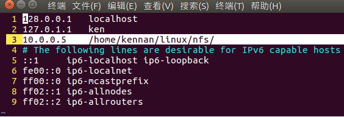
            >
            > 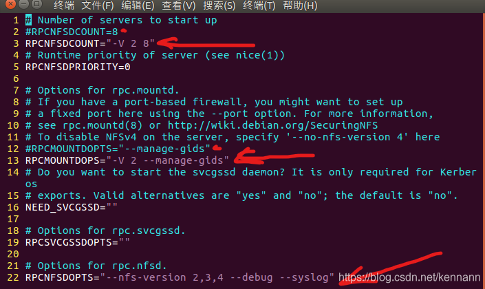
            >
            > 


   4. 其他格式文件系统操作命令
      1. EMMC和SD卡操作命令
      2. FAT格式文件系统操作命令
      3. EXT格式文件系统操作命令
   5. BOOT操作命令
      1. 通过bootz命令启动zImage镜像文件
   6. 其他常用命令


## U-Boot顶层Makefile详解（第三十一章）

分析正点原子提供的uboot源码，重点是分析uboot启动流程

1. U-Boot工程目录分析

   > 
   >
   > 

2. VScode工程搭建（便于阅读源码）

3. U-Boot顶层Makefile分析（在编译 uboot 之前一定要使用 defconfig 来配置 uboot）

   1. 版本号

   2. MAKEFLAGS变量

   3. 命令输出

   4. 静默输出

   5. 设置编译结果输出目录

   6. 代码检查

   7. 模块编译

   8. 获取主机架构和系统

   9. 设置目标架构、交叉编译器和配置文件

   10. 调用scripts/Kbuild.include

   11. 交叉编译工具变量设置

   12. 导出其他变量

   13. make xxx_defconfig过程

   14. Makefile.build脚本分析

   15. make过程

       > 


## U-Boot启动流程详解（第三十二章）

分析uboot的启动流程，理清uboot是如何启动的。通过对uboot启动流程的梳理，可以掌握一些外设是在哪里被初始化的，当我们需要修改这些外设驱动的时候就会心里有数。另外，通过分析uboot的启动流程可以了解Linux内核是如何被启动的。

1. 链接脚本u-boot.lds详解

2. U-Boot启动流程详解

   1. reset函数源码详解

   2. lowlevel_init函数详解

   3. s_init函数详解

   4. _main函数详解

   5. board_init函数详解

      - > 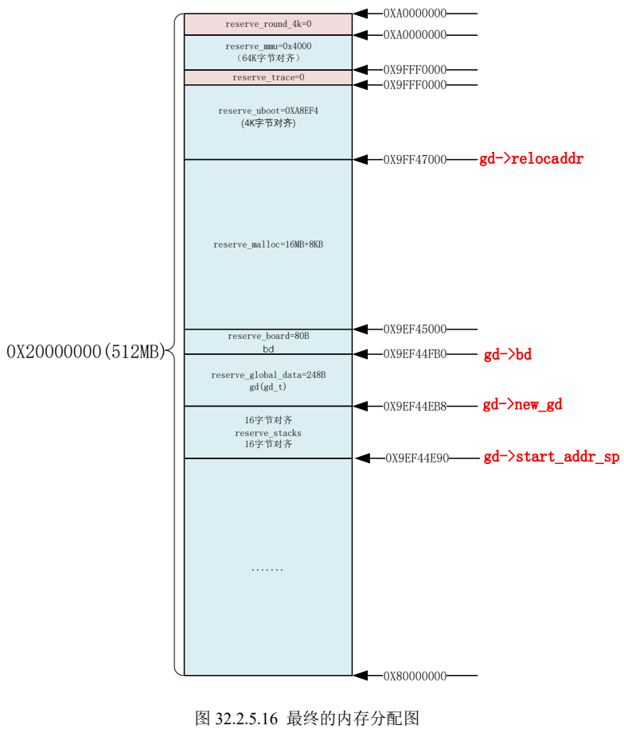

   6. relocate_code函数详解

   7. relocate_vectors函数详解

      - 重定位向量表

   8. board_init_r函数详解

   9. run_main_loop函数详解

      - uboot启动后3秒倒计时，判断是否要进入uboot命令模式

   10. cli_loop函数详解

       - uboot的命令行处理函数

   11. cmd_process函数详解

3. bootz启动Linux内核过程

   >

   1. images全局变量
   2. do_bootz函数
   3. bootz_start函数
   4. do_bootm_states函数
   5. bootm_os_get_boot_func函数
      - do_bootm_states 会调用 bootm_os_get_boot_func 来查找对应系统的启动函数
   6. do_bootm_linux函数
      - do_bootm_linux 就是最终启动 Linux 内核的函数


## U-Boot移植（第三十三章）

学习如何将NXP官方的 uboot 移植到正点原子的 I.MX6ULL 开发板上，学习如何在 uboot 中添加我们自己的板子。

1. NXP官方开发板 uboot 编译测试

   1. 查找NXP官方的开发板默认配置文件

   2. 编译NXP官方开发板对于的uboot

      - 三种编译方式

        - 直接命令行编译

          - `make ARCH=arm CROSS_COMPILE=arm-linux-gnueabihf- mx6ull_14x14_evk_emmc_defconfig`
          - `make V=1 ARCH=arm CROSS_COMPILE=arm-linux-gnueabihf- -j16`

        - 在顶层 Makefile 中直接给 ARCH 和CORSS_COMPILE 赋值

          - > 

          - `make mx6ull_14x14_evk_emmc_defconfig`

          - `make V=1 -j16`

        - 编写shell脚本

          - ```shell
            1 #!/bin/bash
            2 make ARCH=arm CROSS_COMPILE=arm-linux-gnueabihf- distclean
            3 make ARCH=arm CROSS_COMPILE=arm-linux-gnueabihfmx6ull_14x14_evk_emmc_defconfig
            4 make V=1 ARCH=arm CROSS_COMPILE=arm-linux-gnueabihf- -j16 
            ```

          - `./mx6ull_14x14_evk_emmc.sh`

   3. 烧写验证与驱动测试

      - `./imxdownload u-boot.bin /dev/sdc`   //烧写到SD卡中，不能烧写到/dev/sda或sda1里面

2. 在U-Boot中添加自己的开发板 (参考 NXP 官方的 I.MX6ULL EVK 开发板，学习如何在 uboot 中添加我们的开发板或者开发平台。)

   1. 添加开发板默认配置文件
      - 我们一般做产品的时候就会参考原厂的开发板做硬件，然后在原厂提供的 BSP 包上做修改，将 uboot 或者 linux kernel 移植到我们的硬件上。这个就是uboot 移植的一般流程：
        ①、在 uboot 中找到参考的开发平台，一般是原厂的开发板。
        ②、参考原厂开发板移植 uboot 到我们所使用的开发板上。
   2. 添加开发板对应的头文件
   3. 添加开发板对应的板级文件夹
   4. 修改U-Boot图形界面配置文件
   5. 使用新添加的板子配置编译uboot
   6. LCD驱动修改
   7. 网络驱动修改
   8. 其他需要修改的地方

3. bootcmd和bootargs环境变量

   1. 环境变量bootcmd
      - bootcmd 保存着 uboot 默认命令，uboot 倒计时结束以后就会执行 bootcmd 中的命令。这些命令一般都是用来启动 Linux 内核的，比如读取 EMMC 或者 NAND Flash 中的 Linux 内核镜像文件和设备树文件到 DRAM 中，然后启动 Linux 内核。
      - 可以在 uboot 启动以后进入命令行设置 bootcmd 环境变量的值。如果 EMMC 或者 NAND 中没有保存 bootcmd 的值，那么 uboot 就会使用默认的值，板子第一次运行 uboot 的时候都会使用默认值来设置 bootcmd 环境变量。
   2. 环境变量bootargs
      - bootargs 保存着 uboot 传递给 Linux 内核的参数
      - 常用参数
        - console 用来设置Linux终端（控制台）
        - root 用来设置根文件系统的位置
        - rootfstype 用于指定根文件系统类型

4. uboot启动Linux测试

   1. 从EMMC启动Linux系统
   2. 从网络启动Linux系统


## U-Boot图形化配置及其原理（第三十四章）

在前两章中我们知道 uboot 可以**通过 mx6ull_alientek_emmc_defconfig 来配置**，或者**通过文**
**件 mx6ull_alientek_emmc.h 来配置 uboot**。还有另外一种配置 uboot 的方法，就是图形化配置，以前的 uboot 是不支持图形化配置，只有 Linux 内核才支持图形化配置。不过不知道从什么时候开始，uboot 也支持图形化配置了，本章我们就来学习一下如何**通过图形化配置 uboot**，并且学习一下图形化配置的原理，因为后面学习 Linux 驱动开发的时候可能要修改图形配置文件。

1. U-Boot图形化配置体验
2. menuconfig图形化配置原理
   1. make menuconfig 过程分析
   2. Kconfig 语法简介


## Linux内核顶层Makefile详解（第三十五章）

1. Linux内核获取

2. Linux内核初次编译

   - ```cpp
     顶层 Makefile 代码段
     252 ARCH ?= arm
     253 CROSS_COMPILE ?= arm-linux-gnueabihf
     ---------------------------------------------
     make xxx_defconfig //使用默认配置文件配置 Linux
     make menuconfig //启动图形化配置界面
     make -j16 //编译 Linux
     ```

   - ```cpp
     mx6ull_alientek_emmc.sh 文件内容
     1 #!/bin/sh
     2 make ARCH=arm CROSS_COMPILE=arm-linux-gnueabihf- distclean
     3 make ARCH=arm CROSS_COMPILE=arm-linux-gnueabihf- imx_v7_defconfig //配置工程
     4 make ARCH=arm CROSS_COMPILE=arm-linux-gnueabihf- menuconfig  //打开图形化界面进行配置
     5 make ARCH=arm CROSS_COMPILE=arm-linux-gnueabihf- all -j16  //进行编译
     ```

3. Linux工程目录分析

   - >
     >
     >
     >
     >

4. VSCode工程创建

5. 顶层Makefile详解
   1. make xxx_defconfig过程
   2. Makefile.build脚本分析
   3. make过程
   4. built-in.o文件编译生成过程
   5. make zImage过程
      - vmlinux、Image、zImage、uImage的区别
        - vmlinux 是 ELF 格式的文件，但是在实际中我们不会使用 vmlinux，而是使用 zImage 或 uImage 这样的 Linux 内核镜像文件
        - vmlinux 是编译出来的最原始的内核文件，是未压缩的，比如正点原子提供的 Linux 源
          码编译出来的 vmlinux 差不多有 16MB
        - Image 是 Linux 内核镜像文件，但是 Image 仅包含可执行的二进制数据。Image 就是使
          用 objcopy 取消掉 vmlinux 中的一些其他信息，比如符号表什么的。但是 Image 是没有压缩过的，Image 保存在 arch/arm/boot 目录下，其大小大概在 12MB 左右
        - zImage 是经过 gzip 压缩后的 Image，经过压缩以后其大小大概在 6MB 左右
        - uImage 是老版本 uboot 专用的镜像文件，uImag 是在 zImage 前面加了一个长度为 64
          字节的“头”，这个头信息描述了该镜像文件的类型、加载位置、生成时间、大小等信息。但是新的 uboot 已经支持了 zImage 启动！所以已经很少用到 uImage 了，除非你用的很古老的 uboot。


## Linux内核启动流程（第三十六章）

Linux 内核启动流程就分析到这里，**Linux 内核最终是需要和根文件系统打交道的，需要挂载根文件系统，并且执行根文件系统中的 init 程序，以此来进去用户态。**这里就正式引出了根文件系统，根文件系统也是我们系统移植的最后一片拼图。Linux 移植三巨头：uboot、Linuxkernel、rootfs(根文件系统)。

1. 链接脚本vmlinux.lds
2. Linux内核启动流程分析
   1. Linux内核入口stext
   2. _mmap_switched函数
   3. start_kernel函数
   4. rest_init函数
   5. init进程


## Linux内核移植（第三十七章）

简单总结一下移植步骤：
①、在 Linux 内核中查找可以参考的板子，一般都是半导体厂商自己做的开发板。
②、编译出参考板子对应的 zImage 和.dtb 文件。
③、使用参考板子的 zImage 文件和.dtb 文件在我们所使用的板子上启动 Linux 内核，看能否启动。
④、如果能启动的话就万事大吉，如果不能启动那就悲剧了，需要调试 Linux 内核。不过一般都会参考半导体官方的开发板设计自己的硬件，所以大部分情况下都会启动起来。启动Linux 内核用到的外设不多，一般就 DRAM(Uboot 都初始化好的)和串口。作为终端使用的串口一般都会参考半导体厂商的 Demo 板。
⑤、修改相应的驱动，像 NAND Flash、EMMC、SD 卡等驱动官方的 Linux 内核都是已经提供好了，基本不会出问题。重点是网络驱动，因为 Linux 驱动开发一般都要通过网络调试代码，所以一定要确保网络驱动工作正常。如果是处理器内部 MAC+外部 PHY 这种网络方案的话，一般网络驱动都很好处理，因为在 Linux 内核中是有外部 PHY 通用驱动的。只要设置好复位引脚、PHY 地址信息基本上都可以驱动起来。
⑥、Linux 内核启动以后需要根文件系统，如果没有根文件系统的话肯定会崩溃，所以确定 Linux内核移植成功以后就要开始根文件系统的构建。

1. 创建VSCode工程

2. NXP官方开发板Linux内核编译
   1. 修改顶层Makefile
   
   2. 配置并编译Linux内核
   
      - `make dtbs`   在Linux内核源码根目录下输入，命令为只编译设备树
   
   3. Linux内核启动测试
   
      - 从EMMC启动Linux系统
   
        - 从 EMMC 启动也就是将编译出来的 Linux 镜像文件 zImage 和设备树文件保存在 EMMC
          中，uboot 从 EMMC 中读取这两个文件并启动，这个是我们产品最终的启动方式。
        - 检查一下 EMMC 的分区 1 中有没有zImage 文件和设备树文件，输入命令“ls mmc 1:1”
        - `setenv bootargs 'console=ttymxc0,115200 root=/dev/mmcblklp2 rootwait rw'`
        - `setenv bootcmd 'mmc dev 1; fatload mmc 1:1 80800000 zImage; fatload mmc 1:1 83000000 imx6ull-alientek-emmc.dtb; bootz 80800000 - 83000000;'`
        - `saveenv`
   
      - 从网络启动Linux系统
   
        - 我们可以设置 linux 从网络启动，也就是将 linux 镜像文件和根文件系统都放到 Ubuntu 下某个指定的文件夹中，这样每次重新编译 linux 内核或者某个 linux 驱动以后只需要使用 cp 命令将其拷贝到这个指定的文件夹中即可，这样就不用需要频繁的烧写 EMMC，这样就加快了开发速度。
   
        - 以通过 nfs 或者 tftp 从 Ubuntu 中下载 zImage 和设备树文件，根文件系统的话也可以通过 nfs 挂载。
   
        - 使用 tftp 从 Ubuntu 中下载 zImage 和设备树文件，前提是要将 zImage 和设备树文件放到 Ubuntu 下的 tftp 目录中
   
        - 使用tftp下载文件过程
   
          1. `sudo server tftpd-hpa start`   Ubuntu中启动tftp服务器
   
          2. ```cpp
             //设置 bootargs 和 bootcmd 这两个环境变量，开发板启动后将自动运行，下载
             setenv bootargs 'console=ttymxc0,115200 root=/dev/mmcblk1p2 rootwait rw'
             setenv bootcmd 'tftp 80800000 zImage; tftp 83000000 imx6ull-alientek-emmc.dtb; bootz 80800000 - 83000000'`
             saveenv
             ```
   
          3. ```cpp
             //手动下载zImage 和 imx6ull-14x14-evk.dtb 下载到开发板中并启动：
             tftp 80800000 zImage   //开发板下载虚拟机tftpboot文件夹中的zImage文件到DRAM的0X80800000地址处
             tftp 83000000 imx6ull-14x14-evk.dtb   //下载设备树
             bootz 80800000 - 83000000  //启动内核
             ```
   
   4. 根文件系统缺失错误
   
3. 在Linux中添加自己的开发板
   1. 添加开发板默认配置文件
   2. 添加开发板对于的设备树文件
   3. 编译测试
   
4. CPU主频和网络驱动修改
   1. CPU主频修改
   2. 使能8线EMMC驱动
   3. 修改网络驱动
   4. 保持修改后的图形化配置文件


## 根文件系统构建（第三十八章）

 rootfs(根文件系统)。学习一下根文件系统的组成以及如何构建根文件系统。这是 Linux 移植的最后一步，根文件系统构建好以后就意味着我们已经拥有了一个完整的、可以运行的最小系统。以后我们就在这个最小系统上编写、测试 Linux 驱动，移植一些第三方组件，逐步的完善这个最小系统。最终得到一个功能完善、驱动齐全、相对完善的操作系统。

1. 根文件系统简介

   - Linux 中的根文件系统更像是一个文件夹或者叫做目录(在我看来就是一个文件夹，只不过是特殊的文件夹)，在这个目录里面会有很多的子目录。根目录下和子目录中会有很多的文件，这些文件是 Linux 运行所必须的，比如库、常用的软件和命令、设备文件、配置文件等等。以后我们说到文件系统，如果不特别指明，统一表示根文件系统。

   - 根文件系统首先是内核启动时所 mount(挂载)的第一个文件系统，内核代码映像文件保存在根文件系统中，而系统引导启动程序会在根文件系统挂载之后从中把一些基本的初始化脚本和服务等加载到内存中去运行。

   - 嵌入式 Linux 并没有将内核代码镜像保存在根文件系统中，而是保存到了其他地方。比如 NAND Flash 的指定存储地址、EMMC 专用分区中。根文件系统是 Linux 内核启动以后挂载(mount)的第一个文件系统，然后从根文件系统中读取初始化脚本，比如 rcS，inittab 等。根文件系统和 Linux 内核是分开的，单独
     的 Linux 内核是没法正常工作的，必须要搭配根文件系统。如果不提供根文件系统，Linux 内核在启动的时候就会提示内核崩溃(Kernel panic)的提示。

   - 常用子目录

     - > 
       >
       > 
       >
       > 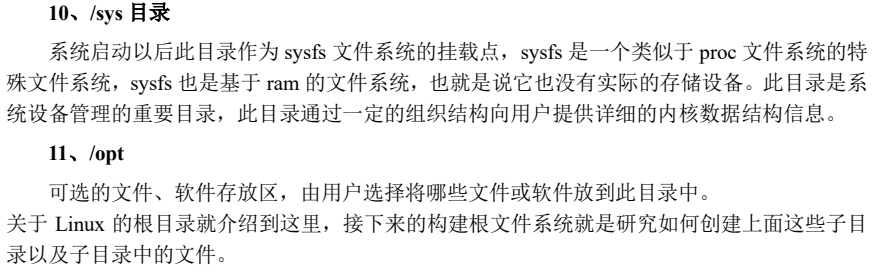

2. BusyBox构建根文件系统
   1. BusyBox简介
      1. BusyBox 是一个集成了大量的 Linux 命令和工具的软件，像 ls、mv、ifconfig 等命令 BusyBox 都会提供。BusyBox 就是一个大的工具箱，这个工具箱里面集成了 Linux 的许多工具和命令。一般下载 BusyBox 的源码，然后配置 BusyBox，选择自己想要的功能，最后编译即可。BusyBox 可以在其官网下载到，官网地址为：https://busybox.net/。
   2. 编译BusyBox构建根文件系统
   3. 向根文件系统添加lib库
   4. 创建其他文件夹

3. 根文件系统初步测试

   - ```cpp
     => setenv bootargs 'console=ttymxc0,115200 root=/dev/nfs nfsroot=192.168.3.140:/home/hq/linux/nfs/rootfs,proto=tcp rw ip =192.168.3.139:192.168.3.140:192.168.3.1:255.255.255.0::eth0:off
     
     ```

   - 

4. 完善根文件系统
   1. 创建/etc/init.d/rcS文件
   2. 创建/etc/fstab文件
   3. 创建/etc/inittab文件

5. 根文件系统其他功能测试
   1. 软件运行测试
   2. 中文字符测试
   3. 开机自启动测试
   4. 外网连接测试


## 系统烧写（第三十九章）

本章我们使用 NXP 提供的 MfgTool 工具通过 USB OTG 口向开发板的 EMMC 中烧写 uboot、Linux kernel、.dtb(设备树)和 rootfs 这四个文件。

1. MfgTool工具简介
2. MfgTool工具原理简介
3. 烧写NXP官方系统
4. 烧写自制的系统
5. 改造我们自己的烧写工具


## 开发板信息

阿尔法 - 根目录

> 

阿尔法 - BOOT

> 

虚拟机SD卡标识

> 
>
> 


