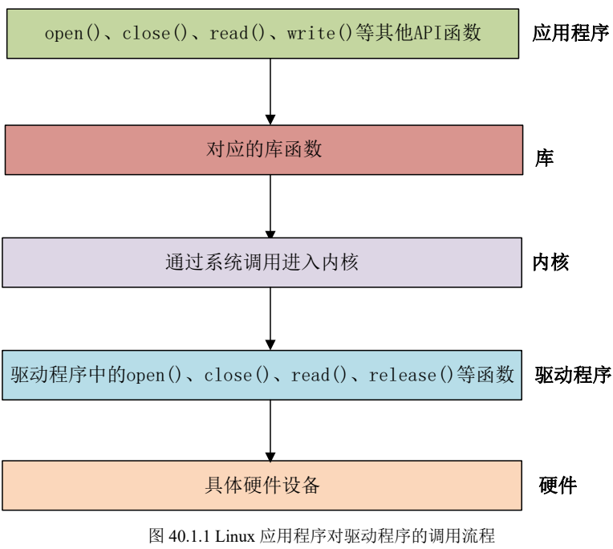
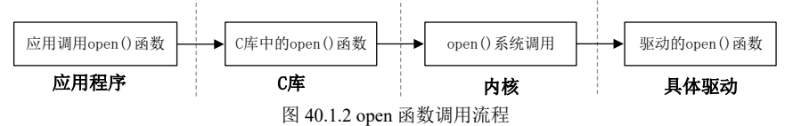
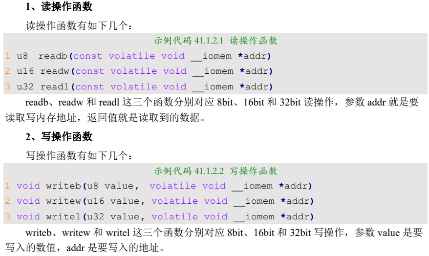
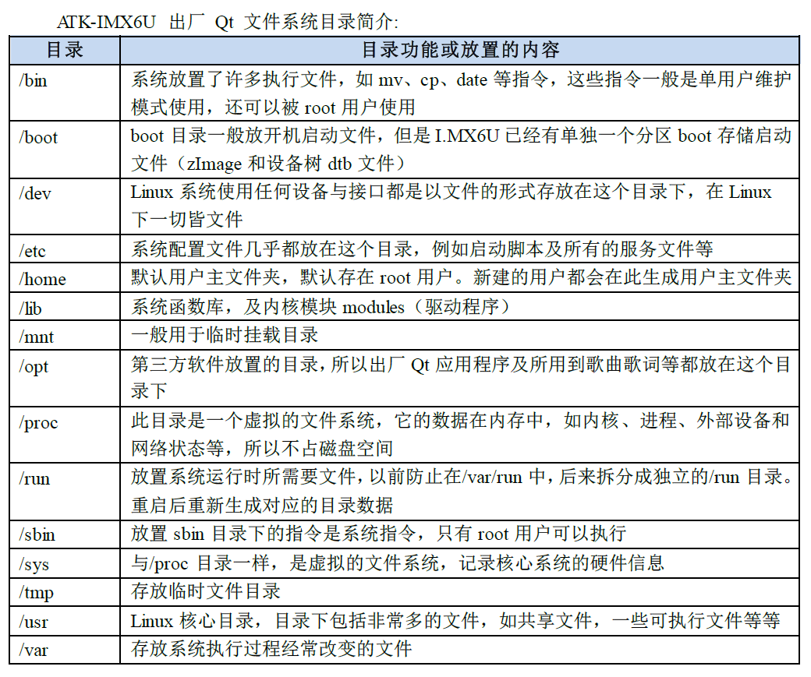
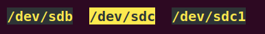
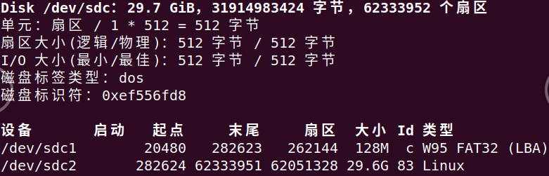

## ALPHA I.MX驱动学习笔记 - HQ

[TOC]

------

#### 注意

- 

------

## ALPHA I.MX驱动学习目录

【【正点原子】I.MX6U嵌入式Linux驱动开发指南V1.6 - 第四篇 ARM Linux驱动开发篇 P1023】

### 重点学习章节：

其他章节根据需要查阅，这里只列出博主常用的内容。

> 


## 第四十章 字符设备驱动开发

【【正点原子】I.MX6U嵌入式Linux驱动开发指南V1.6 - 第四十章 字符设备驱动开发 P1024】

1. 字符设备驱动简介

   - 字符设备是 Linux 驱动中最基本的一类设备驱动，字符设备就是一个一个字节，按照字节
     流进行读写操作的设备，读写数据是分先后顺序的。比如我们最常见的点灯、按键、IIC、SPI，
     LCD 等等都是字符设备，这些设备的驱动就叫做字符设备驱动。

   - 应用程序运行在用户空间，而 Linux 驱动属于内核的一部分，因此驱动运行于内核空间。

   - > 

   - > 

2. 字符设备驱动开发步骤

   1. 驱动模块的加载和卸载

      - Linux 驱动有两种运行方式，第一种就是将驱动编译进 Linux 内核中，这样当 Linux 内核启
        动的时候就会自动运行驱动程序。第二种就是将驱动编译成模块(Linux 下模块扩展名为.ko)，在
        Linux 内核启动以后使用“insmod”命令加载驱动模块。

      - ```cpp
        insmod drv.ko  //加载驱动模块
        modprobe drv.ko  //加载驱动模块，并能够分析模块的依赖性，检查错误，更智能，推荐使用
        
        rmmod drv,ko  //卸载驱动模块，推荐使用
        modprobe -r drv.ko  //使用 modprobe 命令可以卸载掉驱动模块所依赖的其他模块，前提是这些依赖模块已经没有被其他模块所使用，否则就不能使用 modprobe 来卸载驱动模块
        ```

   2. 字符设备注册与注销

   3. 实现设备的具体操作函数

   4. 添加LICENSE和作者信息

3. Linux设备号

   1. 设备号的组成
   2. 设备号的分配

4. chrdevbase字符设备驱动开发实验

   1. 实验程序编写
   
      - 编译的时候要保证，使用的内核文件为正确的，即，自己移植成功的或者用官方移植成功的，否则会报错
   
      - ```cpp
        1 KERNELDIR := /home/zuozhongkai/linux/IMX6ULL/linux/temp/linux-imxrel_imx_4.1.15_2.1.0_ga_alientek
        2 CURRENT_PATH := $(shell pwd)
        3 obj-m := chrdevbase.o
        4 
        5 build: kernel_modules
        6 
        7 kernel_modules:
        8 $(MAKE) -C $(KERNELDIR) M=$(CURRENT_PATH) modules
        9 clean:
        10 $(MAKE) -C $(KERNELDIR) M=$(CURRENT_PATH) clean
        ```
   
      - 
   
   2. 编写测试APP
   
      - `arm-linux-gnueabihf-gcc chrdevbaseApp.c -o chrdevbaseApp`
   
   3. 编译驱动程序和测试APP
   
   4. 运行测试


## 第四十一章 嵌入式Linux LED 驱动开发实验

【【正点原子】I.MX6U嵌入式Linux驱动开发指南V1.6 - 第四十一章 嵌入式Linux LED 驱动开发实验 P1051】

1. Linux下LED灯驱动原理

   1. 地址映射

   2. I/O内存访问函数

      - > 

2. 硬件原理图分析

3. 实验程序编写

   1. LED灯驱动程序编写
   2. 编写测试APP

4. 运行测试

   1. 编译驱动程序和测试APP
      1. 从服务器挂载（注意，是挂载，而非下载，虚拟机里面的文件更改将同步到开发板）rootfs根文件系统
         - `setenv bootargs 'console=ttymxc0,115200 root=/dev/nfs rw nfsroot=192.168.3.140:/home/hq/linux/nfs/rootfs ip=192.168.3.9:192.168.3.140:192.168.3.1:255.255.255.0::eth0:off'`
      2. 从服务器下载内核及设备树，并启动
         - `setenv bootcmd 'tftp 80800000 zImage;tftp 83000000 imx6ull-alientek-emmc.dtb;bootz 80800000 - 83000000'`
      3. 启动开发板，新建 `lib/modules/4.1.15(内核版本号)`
      4. 将led.ko和ledAPP文件复制到`lib/modules/4.1.15`文件下
      4. `depmod`   第一次加载驱动的时候需要运行此命令
      5. `insmod led.ko`  加载驱动文件    /    `modprobe led.ko`  此指令更智能
         - `lsmod`  查看当前系统中存在的模块   /    `cat /proc/devices`  查看当前系统中有没有led这个设备
      6. `mknod /dev/led c 200 0`  创建设备节点文件，
         - 驱动加载成功需要在/dev 目录下创建一个与之对应的设备节点文件，应用程序就是通过操作这个设备节点文件来完成对具体设备的操作。
      7. `./ledApp /dev/led 1`    打开led灯
      8. `rmmod led.ko`   卸载驱动模块
   2. 运行测试


## 第四十二章 新字符设备驱动实验

【【正点原子】I.MX6U嵌入式Linux驱动开发指南V1.6 - 第四十二章 新字符设备驱动实验 P1064】

> 字符设备驱动开发重点是使用 register_chrdev 函数注册字符设备，当不再使用设备的时候就使用
> unregister_chrdev 函数注销字符设备，驱动模块加载成功以后还需要手动使用 mknod 命令创建设备节点。register_chrdev 和 unregister_chrdev 这两个函数是老版本驱动使用的函数，现在新的字符设备驱动已经不再使用这两个函数，而是使用Linux内核推荐的新字符设备驱动API函数。本节我们就来学习一下如何编写新字符设备驱动，并且在驱动模块加载的时候自动创建设备节点文件。

1. 新字符设备驱动原理
   1. 分配和释放设备号
   2. 新的字符设备注册方法
2. 自动创建设备节点
   1. mdev机制
   2. 创建和删除类
   3. 创建设备
   4. 参考示例
3. 设置文件私有数据
4. 硬件原理图分析
5. 实验程序编写
   1. LED灯驱动程序编写
   2. 编写测试APP
6. 运行测试
   1. 编译驱动程序和测试APP
   2. 运行测试


## 第四十三章 Linux设备树

【【正点原子】I.MX6U嵌入式Linux驱动开发指南V1.6 - 第四十三章 Linux设备树 P1079】

> 因为在新版本的 Linux 中，ARM 相关的驱动全部采用了设备树(也有支持老式驱动
> 的，比较少)，最新出的 CPU 其驱动开发也基本都是基于设备树的，比如 ST 新出的 STM32MP157、
> NXP 的 I.MX8 系列等。我们所使用的Linux版本为 4.1.15，其支持设备树，所以正点原子 I.MX6UALPHA 开发板的所有 Linux 驱动都是基于设备树的。

1. 什么是设备树

   - 设备树(Device Tree)，将这个词分开就是“设备”和“树”，描述设备树的文件叫做 DTS(Device 
     Tree Source)，这个 DTS 文件采用树形结构描述板级设备，也就是开发板上的设备信息，比如
     CPU 数量、 内存基地址、IIC 接口上接了哪些设备、SPI 接口上接了哪些设备等等

   - > 

2. DTS、DTB和DTC

3. DTS语法

   1. `.dtsi`头文件

   2. 设备节点

   3. 标准属性

   4. 根节点compatible属性

      - > 

   5. 向节点追加或修改内容

4. 创建小型模板设备树

5. 设备树在系统中的体现

6. 特殊节点

   1. aliases子节点
   2. chosen子节点

7. Linux内核解析DTB文件

8. 绑定信息文档

9. 设备树常用OF操作函数

   1. 查找节点的OF函数
   2. 查找父/子节点的OF函数
   3. 提取属性值的OF函数
   4. 其他常用的OF函数


## 第四十四章 设备树下的LED驱动实验

【【正点原子】I.MX6U嵌入式Linux驱动开发指南V1.6 - 第四十四章 设备树下的LED驱动实验 P1120】

1. 设备树LED驱动原理
2. 硬件原理图分析
3. 实验程序编写
   1. 修改设备树文件
   2. LED灯驱动程序编写
   3. 编写测试APP
4. 运行测试
   1. 编译驱动程序和测试APP
   2. 运行测试
      - 点灯成功


## 第四十五章 pinctrl和gpio子系统实验

【【正点原子】I.MX6U嵌入式Linux驱动开发指南V1.6 - 第四十五章 pinctrl和gpio子系统实验 P1132】

1. pinctrl子系统
   1. pinctrl子系统简介
      - 传统的配置 pin 的方式就是直接操作相应的寄存器，但是这种配置方式比较繁琐、而且容易出问题(比如 pin 功能冲突)。pinctrl 子系统就是为了解决这个问题而引入的，pinctrl 子系统主要工作内容如下：
        ①、获取设备树中 pin 信息。
        ②、根据获取到的 pin 信息来设置 pin 的复用功能
        ③、根据获取到的 pin 信息来设置 pin 的电气特性，比如上/下拉、速度、驱动能力等。
   2. IMX6ULL的pinctrl子系统驱动
   3. 设备树中添加pinctrl节点模板
2. gpio子系统
   1. gpio子系统简介
   2. IMX6ULL的gpio子系统驱动
   3. gpio子系统API函数
   4. 设备树中添加gpio节点模块
   5. 与gpio相关的OF函数
3. 硬件原理图分析
4. 实验程序编写
   1. 修改设备树文件
   2. LED灯驱动程序编写
   3. 编写测试APP
5. 运行测试
   1. 编写驱动程序和测试APP
   2. 运行测试


## 第四十七章 Linux并发与竞争

【【正点原子】I.MX6U嵌入式Linux驱动开发指南V1.6 - 第四十七章 Linux并发与竞争 P1175】

Linux是一个多任务操作系统，肯定会存在多个任务共同操作同一段内存或者设备的情况，**多个任务甚至中断都能访问的资源叫做共享资源**，就和共享单车一样。在驱动开发中要注意对共享资源的保护，也就是要处理对共享资源的并发访问。比如共享单车，大家按照谁扫谁骑走的原则来共用这个单车，如果没有这个并发访问共享单车的原则存在，只怕到时候为了一辆单车要打起来了。在 Linux 驱动编写过程中对于**并发控制**的管理非常重要，本章我们就来学习一下如何在 Linux 驱动中处理并发。

1. 并发与竞争
2. 原子操作
   1. 原子操作简介
   2. 原子整形操作API函数
   3. 原子位操作API函数
3. 自旋锁
   1. 自旋锁简介
   2. 自旋锁API函数
   3. 其他类型的锁
   4. 自旋锁使用注意事项
4. 信号量
   1. 信号量简介
   2. 信号量API函数
5. 互斥体
   1. 互斥体简介
   2. 互斥体API函数


## 第四十八章 Linux并发与竞争实验

【【正点原子】I.MX6U嵌入式Linux驱动开发指南V1.6 - 第四十八章 Linux并发与竞争实验 P1188】

1. 原子操作实验
   1. 实验程序编写
   2. 运行测试
2. 自旋锁实验
   1. 实验程序编写
   2. 运行测试
3. 信号量实验
   1. 实验程序编写
   2. 运行测试
4. 互斥体实验
   1. 实验程序编写
   2. 运行测试


## 第四十九章 Linux按键输入实验

【【正点原子】I.MX6U嵌入式Linux驱动开发指南V1.6 - 第四十九章 Linux按键输入实验 P1212】

在前几章我们都是使用的 GPIO 输出功能，还没有用过 GPIO 输入功能，本章我们就来学习一下如果在 Linux 下编写 GPIO 输入驱动程序。I.MX6U-ALPHA 开发板上有一个按键，我们就使用此按键来完成 GPIO 输入驱动程序，同时利用第四十七章讲的原子操作来对按键值进行保护。

1. Linux下按键驱动原理
2. 硬件原理图分析
3. 实验程序编写
   1. 修改设备树文件
   2. 按键驱动程序编写
   3. 编写测试APP
4. 运行测试
   1. 编译驱动程序和测试APP
   2. 运行测试


## 第五十章 Linux内核定时器实验

【【正点原子】I.MX6U嵌入式Linux驱动开发指南V1.6 - 第五十章 Linux内核定时器实验 P1223】

定时器是我们最常用到的功能，一般用来完成定时功能，本章我们就来学习一下 Linux 内核提供的定时器 API 函数，通过这些定时器 API 函数我们可以完成很多要求定时的应用。Linux内核也提供了短延时函数，比如微秒、纳秒、毫秒延时函数，本章我们就来学习一下这些和时间有关的功能。

1. Linux时间管理和内核定时器简介
   1. 内核时间管理简介
   2. 内核定时器简介
   3. Linux内核短延时函数
2. 硬件原理图分析
3. 实验程序编写
   1. 修改设备树文件
   2. 定时器驱动程序编写
   3. 编写测试APP
4. 运行测试
   1. 编译驱动程序和测试APP
   2. 运行测试


## 第五十一章 Linux中断实验

【【正点原子】I.MX6U嵌入式Linux驱动开发指南V1.6 - 第五十一章 Linux中断实验 P1240】

不管是裸机实验还是 Linux 下的驱动实验，中断都是频繁使用的功能，关于 I.MX6U 的中断原理已经在第十七章做了详细的讲解，在裸机中使用中断我们需要做一大堆的工作，比如配置寄存器，使能 IRQ 等等。Linux 内核提供了完善的中断框架，我们只需要申请中断，然后注册中断处理函数即可，使用非常方便，不需要一系列复杂的寄存器配置。本章我们就来学习一下如何在 Linux 下使用中断。

1. Linux中断简介
   1. Linux中断API函数
   2. 上半部与下半部
   3. 设备树中断信息节点
   4. 获取中断号
2. 硬件原理图分析
3. 实验程序编写
   1. 修改设备树文件
   2. 按键中断驱动程序编写
   3. 编写测试APP
4. 运行测试
   1. 编译驱动程序和测试APP
   2. 运行测试


## 第五十二章 Linux阻塞和非阻塞IO实验

【【正点原子】I.MX6U嵌入式Linux驱动开发指南V1.6 - 第五十二章 Linux阻塞和非阻塞IO实验 P1264】

阻塞和非阻塞 IO 是 Linux 驱动开发里面很常见的两种设备访问模式，在编写驱动的时候一定要考虑到阻塞和非阻塞。本章我们就来学习一下阻塞和非阻塞 IO，以及如何在驱动程序中处理阻塞与非阻塞，如何在驱动程序使用等待队列和 poll 机制。

1. 阻塞和非阻塞IO
   1. 阻塞和非阻塞简介
   2. 等待队列
   3. 轮询
   4. Linux驱动下的poll操作函数
2. 阻塞IO实验
   1. 硬件原理图分析
   2. 实验程序编写
   3. 运行测试
3. 非阻塞IO实验
   1. 硬件原理图分析
   2. 实验程序编写
   3. 运行测试


## 第五十三章 异步通知实验

【【正点原子】I.MX6U嵌入式Linux驱动开发指南V1.6 - 第五十三章 异步通知实验 P1290】

在前面使用阻塞或者非阻塞的方式来读取驱动中按键值都是应用程序主动读取的，对于非阻塞方式来说还需要应用程序通过 poll 函数不断的轮询。最好的方式就是驱动程序能主动向应用程序发出通知，报告自己可以访问，然后应用程序在从驱动程序中读取或写入数据，类似于我们在裸机例程中讲解的中断。Linux 提供了异步通知这个机制来完成此功能，本章我们就来学习一下异步通知以及如何在驱动中添加异步通知相关处理代码。

1. 异步通知
   1. 异步通知简介
   2. 驱动中的信号处理
   3. 应用程序对异步通知的处理
2. 硬件原理图分析
3. 实验程序编写
   1. 修改设备树文件
   2. 程序编写
   3. 编写测试APP
4. 运行测试
   1. 编译驱动程序和测试APP
   2. 运行测试


## 第五十四章 platform设备驱动实验

【【正点原子】I.MX6U嵌入式Linux驱动开发指南V1.6 - 第五十四章 platform设备驱动实验 P1303】

我们在前面几章编写的设备驱动都非常的简单，都是对IO进行最简单的读写操作。像I2C、SPI、LCD 等这些复杂外设的驱动就不能这么去写了，Linux 系统要考虑到驱动的可重用性，因此提出了驱动的分离与分层这样的软件思路，在这个思路下诞生了我们将来最常打交道的platform 设备驱动，也叫做平台设备驱动。本章我们就来学习一下 Linux 下的驱动分离与分层，以及 platform 框架下的设备驱动该如何编写。

1. Linux驱动的分离与分层
   1. 驱动的分隔与分离
   2. 驱动的分层
2. platform平台驱动模型简介
   1. platform总线
   2. platform驱动
   3. platform设备
3. 硬件原理图分析
4. 试验程序编写
   1. platform设备与驱动程序编写
   2. 测试APP编写
5. 运行测试
   1. 编译驱动程序和测试APP
   2. 运行测试


## 第五十五章 设备树下的platform驱动编写

【【正点原子】I.MX6U嵌入式Linux驱动开发指南V1.6 - 第五十五章 设备树下的platform驱动编写 P1330】

上一章我们详细的讲解了 Linux 下的驱动分离与分层，以及总线、设备和驱动这样的驱动框架。基于总线、设备和驱动这样的驱动框架，Linux 内核提出来 platform 这个虚拟总线，相应的也有 platform 设备和 platform 驱动。上一章我们讲解了传统的、未采用设备树的 platform 设备和驱动编写方法。最新的 Linux 内核已经支持了设备树，因此在设备树下如何编写 platform驱动就显得尤为重要，本章我们就来学习一下如何在设备树下编写 platform 驱动。

1. 设备树下的platform驱动简介
2. 硬件原理图分析
3. 实验程序编写
   1. 修改设备树文件
   2. platform驱动程序编写
   3. 编写测试APP
4. 运行测试
   1. 编译驱动程序和测试APP
   2. 运行测试


## 第五十六章 Linux自带的LED灯驱动实验 

【【正点原子】I.MX6U嵌入式Linux驱动开发指南V1.6 - 第五十六章 Linux自带的LED灯驱动实验 P1340】

前面我们都是自己编写 LED 灯驱动，其实像 LED 灯这样非常基础的设备驱动，Linux 内核已经集成了。Linux 内核的 LED 灯驱动采用 platform 框架，因此我们只需要按照要求在设备树文件中添加相应的 LED 节点即可，本章我们就来学习如何使用 Linux 内核自带的 LED 驱动来驱动 I.MX6U-ALPHA 开发板上的 LED0。

1. Linux内核自带LED驱动使能
2. Linux内核自带LED驱动简介
   1. LED灯驱动框架分析
   2. module_platform_driver函数简介
   3. gpio_led_probe函数简介
3. 设备树节点编写
4. 运行测试


## 第五十八章 Linux INPUT子系统实验 

【【正点原子】I.MX6U嵌入式Linux驱动开发指南V1.6 - 第五十八章 Linux INPUT子系统实验  P1360】

按键、鼠标、键盘、触摸屏等都属于输入(input)设备，Linux 内核为此专门做了一个叫做 input子系统的框架来处理输入事件。输入设备本质上还是字符设备，只是在此基础上套上了 input 框架，用户只需要负责上报输入事件，比如按键值、坐标等信息，input 核心层负责处理这些事件。本章我们就来学习一下 Linux 内核中的 input 子系统。

1. input子系统
   1. input子系统简介
   2. input驱动编写流程
   3. input_even结构体
2. 硬件原理图分析
3. 实验程序编写
   1. 修改设备树文件
   2. 按键input驱动程序编写
   3. 编写测试APP
4. 运行测试
   1. 编译驱动程序和测试APP
   2. 运行测试
5. Linux自带按键驱动程序的使用
   1. 自带按键驱动程序源码简析
   2. 自带按键驱动程序的使用


## 第六十一章 Linux I2C驱动实验

【【正点原子】I.MX6U嵌入式Linux驱动开发指南V1.6 - 第六十一章 Linux I2C驱动实验 P1417】

I2C 是很常用的一个串行通信接口，用于连接各种外设、传感器等器件，在裸机篇已经对I.MX6U 的 I2C 接口做了详细的讲解。本章我们来学习一下如何在 Linux 下开发 I2C 接口器件驱动，重点是学习 Linux 下的 I2C 驱动框架，按照指定的框架去编写 I2C 设备驱动。本章同样以 I.MX6U-ALPHA 开发板上的 AP3216C 这个三合一环境光传感器为例，通过 AP3216C 讲解一下如何编写 Linux 下的 I2C 设备驱动程序。

1. Linux I2C驱动框架简介
   1. I2C总线驱动
   2. I2C设备驱动
   3. I2C设备和驱动匹配过程
2. I.MX6U的I2C适配器驱动分析
3. I2C设备驱动编写流程
   1. I2C设备信息描述
   2. I2C设备数据收发处理流程
4. 硬件原理图分析
5. 实验程序编写
   1. 修改设备树
   2. AP3216C驱动编写
   3. 编写测试APP
6. 运行测试
   1. 编译驱动程序和测试APP
   2. 运行测试


## 第六十二章 Linux SPI驱动实验 

【【正点原子】I.MX6U嵌入式Linux驱动开发指南V1.6 - 第六十二章 Linux SPI驱动实验  P1451】

上一章我们讲解了如何编写 Linux 下的 I2C 设备驱动，SPI 也是很常用的串行通信协议，本章我们就来学习如何在 Linux 下编写 SPI 设备驱动。本章实验的最终目的就是驱动 I.MX6UALPHA 开发板上的 ICM-20608 这个 SPI 接口的六轴传感器，可以在应用程序中读取 ICM-20608的原始传感器数据。

1. Linux下SPI驱动框架简介
   1. SPI主机驱动
   2. SPI设备驱动
   3. SPI设备和驱动匹配过程
2. I.MX6U SPI主机驱动分析
3. SPI设备驱动编写流程
   1. SPI设备信息描述
   2. SPI设备数据收发处理流程
4. 硬件原理图分析
5. 实验程序编写
   1. 修改设备树
   2. 编写ICM20680驱动
   3. 编写测试APP
6. 运行测试
   1. 编译驱动程序和测试APP
   2. 运行测试


## 第七十四章 Regmap API实验 

【【正点原子】I.MX6U嵌入式Linux驱动开发指南V1.6 - 第七十四章 Regmap API实验 P1769】

我们在前面学习 I2C 和 SPI 驱动的时候，针对 I2C 和 SPI 设备寄存器的操作都是通过相关的 API 函数进行操作的。这样 Linux 内核中就会充斥着大量的重复、冗余代码，但是这些本质上都是对寄存器的操作，所以为了方便内核开发人员统一访问 I2C/SPI 设备的时候，为此引入了 Regmap 子系统，本章我们就来学习一下如何使用 RegmapAPI 函数来读写 I2C/SPI 设备寄存器。

1. Regmap API简介
   1. 什么是Regmap
   2. Regmap驱动框架
   3. Regmap操作函数
   4. regmap_config掩码设置
2. 实验程序编写
3. 运行测试


## 第七十五章 Linux IIO驱动实验

【【正点原子】I.MX6U嵌入式Linux驱动开发指南V1.6 - 第七十五章 Linux IIO驱动实验 P1783】

工业场合里面也有大量的模拟量和数字量之间的转换，也就是我们常说的 ADC 和 DAC。而且随着手机、物联网、工业物联网和可穿戴设备的爆发，传感器的需求只持续增强。比如手机或者手环里面的加速度计、光传感器、陀螺仪、气压计、磁力计等，这些传感器本质上都是ADC，大家注意查看这些传感器的手册，会发现他们内部都会有个 ADC，传感器对外提供 IIC或者 SPI 接口，SOC 可以通过 IIC 或者 SPI 接口来获取到传感器内部的 ADC 数值，从而得到想要测量的结果。Linux 内核为了管理这些日益增多的 ADC 类传感器，特地推出了 IIO 子系统，本章我们就来学习如何使用 IIO 子系统来编写 ADC 类传感器驱动。

1. IIO子系统简介
   1. iio_dev
   2. iio_info
   3. iio_chan_spec
2. IIO驱动框架创建
   1. 基础驱动框架建立
   2. IIO设备申请与初始化
3. 实验程序编写
   1. 使能内核IIO相关配置
   2. ICM20608的IIO驱动框架搭建
   3. 完善icm20608_read_raw函数
   4. 完善icm20608_write_raw函数
4. 测试应用程序编写
   1. linux文件流读取
   2. 编写测试APP
   3. 运行测试


## 开发板信息

阿尔法 - 根目录

> 

阿尔法 - BOOT

> 

虚拟机SD卡标识

> 
>
> 


