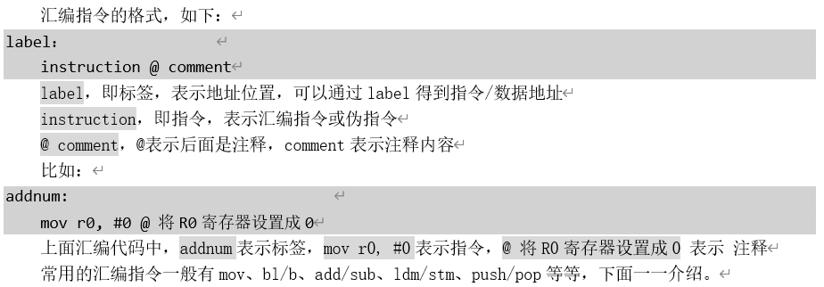
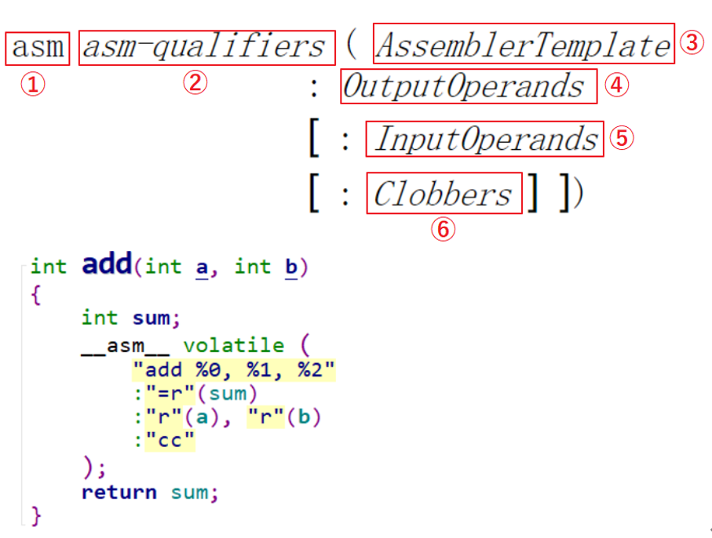

## 韦东山驱动大全课程学习笔记 - HQ

[TOC]

------

#### 注意

- 

------

## 目录

## 补充知识 ARM汇编学习

【嵌入式Linux应用开发完全手册V4.0_韦东山全系列视频文档-IMX6ULL开发板】

【第13篇 IMX6ULL裸机开发 - 第五章 LED程序设计的编程知识 P814】

1. ARM处理器程序运行的过程

   - ARM处理器是三级流水线：取指->译码->执行，循环执行。

2. ARM架构的简单介绍

   1. 运行模式
   2. 寄存器组

3. 汇编与机器码、汇编指令

   1. 汇编与机器码

   2. 汇编指令

      > 
      >
      > 

4. 进制

   1. 如何理解它们的区别
   2. 在C语言中怎么表示这些进制
   3. 十六进制与二进制转换关系

5. 大/小端模式与位操作

   1. 大/小端模式
      - 大端模式（Big-endian），是指数据的高字节保存在内存的低地址中，而数据的低字节保存在内存的高地址中
      - 小端模式（Little-endian），是指数据的高字节保存在内存的高地址中，而数据的低字节保存在内存的低地址中
   2. 位操作

6. 汇编程序调用C程序

   1. ATPCS规则
      - ATPCS即ARM-THUMB procedure call standard（ARM-Thumb过程调用标准）的简称，是基于ARM指令集和THUMB指令集过程调用的规范，规定了调用函数如何传递参数，被调用函数如何获取参数，以何种方式传递函数返回值。
   2. 汇编程序如何向C程序的函数传递参数
   3. C程序如何返回结果给汇编程序
   4. C函数为何要用栈

7. C语言汇总读写寄存器

8. start.S解析

   - > 

9. 根据led.dis分析代码的整体运行流程

   - > 
     >

## 第一章 同步与互斥

【个人学习笔记 - Linux驱动学习笔记 - 同步与互斥】

1. 内联汇编

   1. C语言实现加法

   2. 使用汇编函数实现加法

      - > 

   3. 内联汇编语法

      - > 
        >
        > 
        >
        > 
        >
        > 

   4. 编写内联汇编实现加法

   5. earlyclobber的例子

2. 同步与互斥的失败例子

3. 原子操作的实现原理与使用

   1. 原子变量的内核操作函数

      - | 函数名                 | 作用                                             |
        | ---------------------- | ------------------------------------------------ |
        | atomic_read(v)         | 读出原子变量的值，即v->counter                   |
        | atomic_set(v,i)        | 设置原子变量的值，即v->counter = i               |
        | atomic_inc(v)          | v->counter++                                     |
        | atomic_dec(v)          | v->counter--                                     |
        | atomic_add(i,v)        | v->counter += i                                  |
        | atomic_sub(i,v)        | v->counter -= i                                  |
        | atomic_inc_and_test(v) | 先加1，再判断新值是否等于0；等于0的话，返回值为1 |
        | atomic_dec_and_test(v) | 先减1，再判断新值是否等于0；等于0的话，返回值为1 |

   2. 原子变量的内核实现

      1. ATOMIC_OP在UP系统中的实现
      2. ATOMIC_OP在SMP系统中的实现
         - SMP就是Symmetric Multi-Processors，对称多处理器；UP即Uni-Processor，系统只有一个单核CPU。

   3. 原子变量使用案例

   4. 原子位结束

      1. 原子位的内核操作函数

         - | 函数名                    | 作用                                                     |
           | ------------------------- | -------------------------------------------------------- |
           | set_bit(nr,p)             | 设置(*p)的bit nr为1                                      |
           | clear_bit(nr,p)           | 清除(*p)的bit nr为0                                      |
           | change_bit(nr,p)          | 改变(*p)的bit nr，从1变为0，或是从0变为1                 |
           | test_and_set_bit(nr,p)    | 设置(*p)的bit nr为1，返回该位的老值                      |
           | test_and_clear_bit(nr,p)  | 清除(*p)的bit nr为0，返回该位的老值                      |
           | test_and_change_bit(nr,p) | 改变(*p)的bit nr，从1变为0，或是从0变为1；返回该位的老值 |

      2. 原子位的内核实现

4. Linux锁的介绍与使用

   1. 锁的类型

      1. 自旋锁

         - | 自旋锁         | 描述                     |
           | -------------- | ------------------------ |
           | raw_spinlock_t | 原始自旋锁(后面讲解)     |
           | bit spinlocks  | 位自旋锁(似乎没什么意义) |

      2. 睡眠锁

         - | 休眠锁              | 描述                                           |
           | ------------------- | ---------------------------------------------- |
           | mutex               | mutual exclusion，彼此排斥，即互斥锁(后面讲解) |
           | rt_mutex            |                                                |
           | semaphore           | 信号量、旗语(后面讲解)                         |
           | rw_semaphore        | 读写信号量，读写互斥，但是可以多人同时读       |
           | ww_mutex            |                                                |
           | percpu_rw_semaphore | 对rw_semaphore的改进，性能更优                 |

   2. 锁的内核函数

      1. 自旋锁

         - | 函数名                               | 作用                                         |
           | ------------------------------------ | -------------------------------------------- |
           | spin_lock_init(_lock)                | 初始化自旋锁为unlock状态                     |
           | void spin_lock(spinlock_t *lock)     | 获取自旋锁(加锁)，返回后肯定获得了锁         |
           | int spin_trylock(spinlock_t *lock)   | 尝试获得自旋锁，成功获得锁则返回1，否则返回0 |
           | void spin_unlock(spinlock_t *lock)   | 释放自旋锁，或称解锁                         |
           | int spin_is_locked(spinlock_t *lock) | 返回自旋锁的状态，已加锁返回1，否则返回0     |

      2. 信号量semaphore

         - | 函数名                                                | 作用                                                         |
           | ----------------------------------------------------- | ------------------------------------------------------------ |
           | DEFINE_SEMAPHORE(name)                                | 定义一个struct semaphore name结构体，  count值设置为1        |
           | void sema_init(struct semaphore *sem, int val)        | 初始化semaphore                                              |
           | void down(struct semaphore *sem)                      | 获得信号量，如果暂时无法获得就会休眠  返回之后就表示肯定获得了信号量  在休眠过程中无法被唤醒，  即使有信号发给这个进程也不处理 |
           | int down_interruptible(struct semaphore *sem)         | 获得信号量，如果暂时无法获得就会休眠，  休眠过程有可能收到信号而被唤醒，  要判断返回值：  0：获得了信号量  -EINTR：被信号打断 |
           | int down_killable(struct semaphore *sem)              | 跟down_interruptible类似，  down_interruptible可以被任意信号唤醒，  但down_killable只能被“fatal signal”唤醒，  返回值：  0：获得了信号量  -EINTR：被信号打断 |
           | int down_trylock(struct semaphore *sem)               | 尝试获得信号量，不会休眠，  返回值：  0：获得了信号量  1：没能获得信号量 |
           | int down_timeout(struct semaphore *sem, long jiffies) | 获得信号量，如果不成功，休眠一段时间  返回值：  0：获得了信号量  -ETIME：这段时间内没能获取信号量，超时返回  down_timeout休眠过程中，它不会被信号唤醒 |
           | void up(struct semaphore *sem)                        | 释放信号量，唤醒其他等待信号量的进程                         |

      3. 互斥量mutex

         - | 函数名                                                       | 作用                                                         |
           | ------------------------------------------------------------ | ------------------------------------------------------------ |
           | mutex_init(mutex)                                            | 初始化一个struct mutex指针                                   |
           | DEFINE_MUTEX(mutexname)                                      | 初始化struct mutex mutexname                                 |
           | int mutex_is_locked(struct mutex *lock)                      | 判断mutex的状态  1：被锁了(locked)  0：没有被锁              |
           | void mutex_lock(struct mutex *lock)                          | 获得mutex，如果暂时无法获得，休眠  返回之时必定是已经获得了mutex |
           | int mutex_lock_interruptible(struct mutex *lock)             | 获得mutex，如果暂时无法获得，休眠;  休眠过程中可以被信号唤醒，  返回值：  0：成功获得了mutex  -EINTR：被信号唤醒了 |
           | int mutex_lock_killable(struct mutex *lock)                  | 跟mutex_lock_interruptible类似，  mutex_lock_interruptible可以被任意信号唤醒，  但mutex_lock_killable只能被“fatal signal”唤醒，  返回值：  0：获得了mutex  -EINTR：被信号打断 |
           | int mutex_trylock(struct mutex *lock)                        | 尝试获取mutex，如果无法获得，不会休眠，  返回值：  1：获得了mutex，  0：没有获得  注意，这个返回值含义跟一般的mutex函数相反， |
           | void mutex_unlock(struct mutex *lock)                        | 释放mutex，会唤醒其他等待同一个mutex的线程                   |
           | int atomic_dec_and_mutex_lock(atomic_t *cnt, struct mutex *lock) | 让原子变量的值减1，  如果减1后等于0，则获取mutex，  返回值：  1：原子变量等于0并且获得了mutex  0：原子变量减1后并不等于0，没有获得mutex |

      4. semaphore和mutex的区别

         - |                                | semaphore              | mutex                 |
           | ------------------------------ | ---------------------- | --------------------- |
           | 几把锁                         | 任意，可设置           | 1                     |
           | 谁能解锁                       | 别的程序、中断等都可以 | 谁加锁，就得由谁解锁  |
           | 多次解锁                       | 可以                   | 不可以，因为只有1把锁 |
           | 循环加锁                       | 可以                   | 不可以，因为只有1把锁 |
           | 任务在持有锁的期间可否退出     | 可以                   | 不建议，容易导致死锁  |
           | 硬件中断、软件中断上下文中使用 | 可以                   | 不可以                |

   3. 何时用何种锁

   4. 内核抢占（preempt）等额外的概念

   5. 使用场景

      1. 只在用户上下文加锁
      2. 在用户上下文与Softirqs之间加锁
      3. 在用户上下文与Tasklet之间加锁
      4. 在用户上下文与Timer之间加锁
      5. 在Tasklet与Timer之间加锁
      6. 在Softirq之间加锁
      7. 硬中断上下文

5. 自旋锁spinlock的实现

   1. 自旋锁的内核结构体
   2. spinlock在UP系统中的实现
   3. spinlock在SMP系统中的实现

6. 信号量semaphore的实现

   1. semaphore的内核结构体
   2. down函数的实现
   3. up函数的实现

7. 互斥量mutex的实现

   1. mutex的内核结构体
   2. mutex_lock函数的实现
      1. fastpath
      2. slowpath
   3. mutex_unlock函数的实现
      1. fastpaht
      2. slowpath

