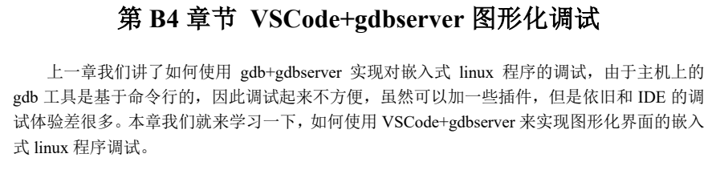
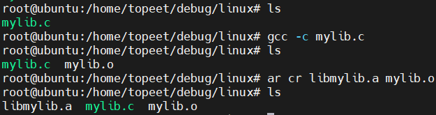
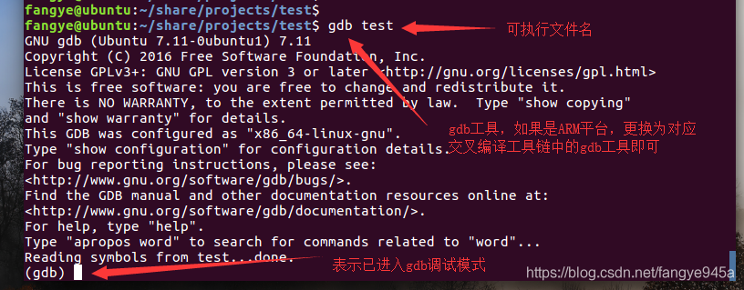
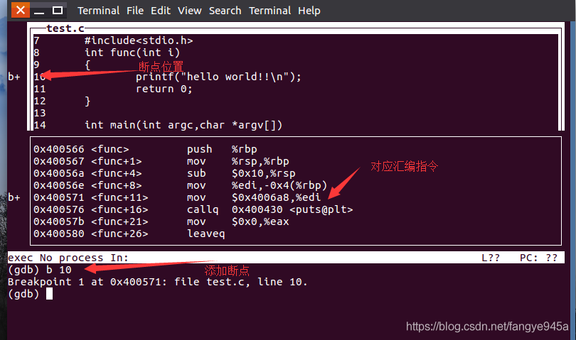

## GDB学习笔记 - HQ

[TOC]

------

#### 注意

- 

------

# GDB调试搭建与使用


### 开发板 + 虚拟机 命令行调试

1. GDB移植

   1. 获取 gdb 和 gdbserver 源码
   2. 编译 gdb
      1. 编译 gdb
      2. 关闭交叉编译器自带的 gdb
   3. 移植 gdbserver

2. 使用 GDB 进行嵌入式程序调试

   1. 编写一个测试应用

      > 

   2. GDB 调试程序

      1. `l命令`
      2. `b命令`
      3. `c命令`
      4. `s命令`
      5. `n命令`
      6. `p命令`
      7. `q命令`


### VSCode + gdbserver 图形化调试



1. 虚拟机中的 VSCode 设置

   1. 安装插件，配置 `launch.json` 文件

   2. 启动调试

      > 

2. VSCode 调试方法

   1. 控制程序运行
   2. 断点添加
   3. 监视变量


## GDB参考学习文章

在ARM、Linux平台开发C/C++项目时，多多少少会遇到一些程序上的bug。小工程还好，如果是个大工程，代码量又大，就很难定位问题了。这时候使用gdb调试器便能轻松的帮忙定位代码bug。

关于GDB的使用，之前也有分享过：

[**GDB调试器原来那么简单**](http://mp.weixin.qq.com/s?__biz=MzU5MzcyMjI4MA==&mid=2247490016&idx=1&sn=5258b874e09ae12bfd64fcb057ec7446&chksm=fe0d7727c97afe311dd9f1e3f4e494f3699aece3e9676ff251753da954978556f0e80dd044c0&scene=21#wechat_redirect)

[**手把手教你使用VSCode + gdb + gdbserver调试ARM程序**](http://mp.weixin.qq.com/s?__biz=MzU5MzcyMjI4MA==&mid=2247496372&idx=1&sn=3a65f292edffb02b9a97ec50ecd77986&chksm=fe0e9c73c9791565eaaf64b9386aaf1f94e4bad4036ec41344ca3ca5dbe9df22513d7b74223f&scene=21#wechat_redirect)

可结合阅读。

### 一、使用方法

如下为示例代码：



在编译代码的时候，加上调试选项 -g，如下所示：

```
gcc -g test.c -o test
```

利用gdb调试器来运行程序：gdb <可执行程序名>



### 二、gdb的控制

1、(gdb)  **`l(L)`** ，可查看源码，(gdb) L 1，从第一行开始查看。


2、(gdb)  **`r(run)`** ，即可从头开始运行代码，遇到设置的断点、段错误和程序运行结束时自动回到gdb命令行。


3、运行代码时如需带参数，可在r 后面添加。如：（gdb）r arg1 arg2


4、(gdb)  **`b n`**   在第n行设置断点（程序运行到这个位置会停下来）。


5、(gdb)  **`n`** 程序往下执行一行代码(不会进入函数里面)。


6、(gdb)  **`s(step)`** 程序往下执行一行代码。（会进入函数里面将函数展开）


7、(gdb)  **`p(print) <表达式>`** 打印表达式的值，表达式可以是任何C语言的有效表达式，如变量、数字、函数调用等。


8、(gdb)  **`c(continue)`** 程序将继续向下运行，遇到设置的断点、段错误和程序运行结束时自动回到gdb命令行 。


9、(gdb)  **`bt 或 where`** 显示程序堆栈信息，一般在遇到段错误时使用 。


10、(gdb)  **`q`** 然后输入 **`y`** 退出gdb调试。


11、程序运行时输入 **`ctrl+c`** ，回到gdb调试模式，输入(gdb)  **`signal <信号>`** ，向程序发送信号。


12、(gdb)  **`layout split`** 显示源代码和汇编窗口，能够看到断点位置，对照代码调试，更加直观。



### 三、相关连接

**程序编译：**

> https://blog.csdn.net/csdn_kou/article/details/81407195

**gdb更多用法：**

> https://blog.csdn.net/yimingsilence/article/details/72153049
>
> http://www.cnblogs.com/qigaohua/p/6077790.html

**调试多文件程序：**

> https://blog.csdn.net/niepangu/article/details/52887803
>
> https://blog.csdn.net/timsley/article/details/51000667

**调试多线程程序：**

> http://www.cnblogs.com/lsgxeva/p/8078670.html


