## Makefile学习笔记 - HQ

[TOC]

------

#### 注意

- 

------

## Makefile编译不同目录源文件方法整理

### makefile编译不同目录下的源文件 - HQ

参考下面案例4进行编写

原始项目文件目录

> 

编译

> 

编译后目录

> 

make clean

> 

```makefile

# 作者：HQ
# 时间：2022-05-18
 
# 编译器名称：=是给变量赋值
CC = gcc
 
# 编译器选项：-g打开调试选项，程序崩溃后可以看到崩溃前的各种信息
CFLAGS = -g
 
# 编译出来的应用程序名称
TARGETS := VisitorMS_test_demo1
 
# 文件路径
src1 = ./core/system
src2 = ./core/controlDevice
src3 = ./core/inputCommand
srch = ./include
 
# 一个文件夹下的源文件; wildcard：变量定义时通配符会失效，而使用函数wildcard才能使*通配符有效; $用于对变量取值
# = 是最基本的赋值
# := 是覆盖之前的值
# ?= 是如果没有被赋值过就赋予等号后面的值
# += 是添加等号后面的值
# filter-out 排除一组文件; notdir去除文件路径
# SRC1 := $(filter-out $(src1)/test.c, $(SRC1))
# SRC1 := $(notdir $(SRC1))
SRC1 = $(wildcard $(src1)/*.c)
SRC2 = $(wildcard $(src2)/*.c)
SRC3 = $(wildcard $(src3)/*.c)
SRCH = $(wildcard $(srch)/*.h)
 
# 输出字符串进行显示，类似于printf
$(Presentation ==== build files: $(SRC1) $(SRC2) $(SRC3) ====)
$(Presentation ==== build files: $(SRCH) ====)
 
# 头文件查找路径
INCLUDE= -I$(srch)
 
# .c需要先编译成.o，生成所有的.o目标名称; patsubst字符串替换; %匹配任何同类型文件
OBJ1 = $(patsubst %.c, %.o, $(SRC1))
OBJ2 = $(patsubst %.c, %.o, $(SRC2))
OBJ3 = $(patsubst %.c, %.o, $(SRC3))
OBJH = $(patsubst %.c, %.o, $(SRCH))
 
# all伪标签，可以用make all命令
all : $(TARGETS) 
 
# : 冒号之前的是标签，make命令后可以跟着的参数，如果没有参数则使用第一个遇到的标签作为默认参数
# 标签后面的行数以tab起始（不能是空格），里面的命令会循环执行
# 从所有的.o编译的文件链接成可执行程序
# 行首的@表示编译时不回显信息，调试makefile时可以将@放开，在最外层加打印就用$(warning 字符串1 $(变量名) 字符串2)
# $对变量取值; $^所有依赖文件; $@所有目标文件
# -o 是gcc的链接命令
$(TARGETS) : $(OBJ1) $(OBJ2) $(OBJ3) $(OBJH)
	@echo "prepare Link "
	@$(CC) $^ -o $@ -lwiringPi -lpthread
	@echo "prepare successfully!"
 
# 将所有.c编译成.o，只自动查找和编译$(OBJ1) $(OBJ2) $(OBJ3) $(OBJH)需要的.c
# -c 是gcc的编译命令; $<第一个依赖文件
%.o : $(src1)/%.c
	@echo "prepare compile1 "
	$(CC) -c $< $(CFLAGS ) $(INCLUDE) -o $@
	@echo "compiled_1 "$<" successfully!"

%.o : $(src2)/%.c
	@echo "prepare compile2 "
	$(CC) -c $< $(CFLAGS ) $(INCLUDE) -o $@
	@echo "compiled_2 "$<" successfully!"

%.o : $(src3)/%.c
	@echo "prepare compile3 "
	$(CC) -c $< $(CFLAGS ) $(INCLUDE) -o $@
	@echo "compiled_3 "$<" successfully!"
 
%.o : %.c 
	@echo "prepare compile_h "
	@$(CC) -c $< $(CFLAGS) $(INCLUDE) -o $@
	@echo "compiled_h "$<" successfully!"


 
# .PHONY定义伪标签; 用于make clean清除所有以前编译的中间文件
.PHONY : clean
clean:
	@-rm $(TARGETS) $(OBJ1) $(OBJ2) $(OBJ3)
#	Windows cmd命令行时用del替换rm
#	@del $(TARGETS) $(OBJ1) $(OBJ2) $(OBJ3) $(OBJH) 
	@echo "cleanup complete!"
```

### makefile编译不同目录下的源文件 - 1

整体目录结构

> 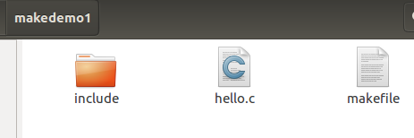

hello.c

```c
#include"myhead.h"
int main(void)
{
   printf("hello world\n");
   return 0;
}
```

include文件夹下放着 myhead.h文件，myhead.h文件的内容如下

```c
#include<stdio.h>
```

makefile文件的内容如下

```bash
hello:hello.o
	gcc hello.o -o hello
hello.o:hello.c
	gcc -c -I include hello.c -o hello.o
.PHONY:clean
clean:
	rm *.o hello
```

编写不同目录下文件时的makefile文件时利用到了

```
指令：-I dir指定被包含的makefile所在目录
```

执行效果如下

> 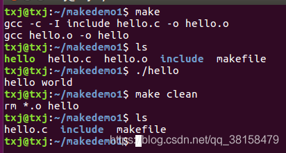

单独把变量放在一个.mk文件中时的编写方式

```bash
#AB=-c -Wall
include config.mk
hello:hello.o
	gcc hello.o -o hello
hello.o:hello.c
	gcc $(AB) -I include hello.c -o hello.o
.PHONY:clean
clean:
	rm *.o hello

12345678910
```

config.mk的内容为：AB=-c -Wall

执行效果如下

> 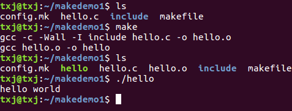
> 注：这种情况适合用在变量较多的情况下

### makefile编译不同目录下的源文件 - 2

https://wenku.baidu.com/view/bf97197774232f60ddccda38376baf1ffd4fe374.html

**目录组织**

目录结构下，头文件在include下，源文件在src下，客户端程序在main.c在makefile文件下。

```
--Makefile
--include头文件目录
	--xxx.h
--src源文件目录
	--xxx.c
--main.c客户端程序
```

**Makefile**

由于在不同的目录下，我们在编译.c文件时，他们的路径就会有多个，匹配模式就要写多个。

```makefile
target = app
# 由于.c文件在不同的文件下，那么匹配模式要匹配不同文件下的%.c文件
src1 = $(wildcard ./src/*.c)
src2 = $(wildcard ./*.c)
obj1 = $(patsubst %.c, %.o, $(src1))
obj2 = $(patsubst %.c, %.o, $(src2))
src = ./src/

$(target):$(obj1) $(obj2)
	gcc $^ -o $@
# gcc $(obj) -o $(target)
# 编译src下的.c文件为.o文件
%.o: $(src)%.c
	gcc -c $< -o $@
# 编译当前文件下的main.c文件
%.o: %.c
	gcc -c $< -o $@

.PHONY: clean # 防止外面有clean文件阻止执行clean
clean:
# -mkdir /root/aaa # 在命令前加- 当前命令出错，仍然可以往后执行
	-rm $(target) $(obj1) $(obj2) -f
hellO:
	echo "hello world"
```

### makefile编译不同目录下的源文件 - 3

https://wenku.baidu.com/view/4b60eaf31a5f312b3169a45177232f60ddcce7f0.html

**文件组织**

```
--Makefile
--src目录
	--main.cpp
	--func.cpp
	--head目录
		--head.cpp
		--head.h
--obj目录
```

**Makefile**

```makefile
DIR_OBJ = ./obj
DIR_SRC = ./src

SRC = $(wildcard ${DIR_SRC}/*.cpp ${DIR_SRC}/head/*.cpp)
OBJ = $(patsubst %.cpp, ${DIR_OBJ}/%.O, $(notdir $(SRC)))
INC = $(patsubst %, -I%, $(shell find src -name '[a-zA-Z0-9]*'.h))

BIN_TARGET = main

CC = g++
CFLAGS = -g -Wall $(INC)

${BIN_TARGET}: ${OBJ}
	$(CC) $(OBJ) -o $@
	
${DIR_OBJ}/%.O: ${DIR_SRC}/head/%.cpp
	$(CC) $(CFLAGS) -c $< -o $@

${DIR_OBJ}/%.O: ${DIR_SRC}/%.cpp
	$(CC) $(CFLAGS) -c $< -o $@

# 防止命名冲突例如有名为clean的文件
.PHONY: clean
clean:
	find ${DIR_OBJ} -name *.o -exec rm -rf{} \;
```

### makefile编译不同目录下的源文件 - 4

https://blog.csdn.net/qq582880551/article/details/123598473

整个工程源码地址（可下载后自行编译）：[才鲸 / 嵌入式知识图谱WiKi](https://gitee.com/langcai1943/embedded-knowledge-wiki/tree/develop/source/lib/module_core)

参考网址：[Makefile多目录源文件](https://blog.csdn.net/qq_23087589/article/details/80668983)

**makefile**

```makefile
# 作者：HQ
# 时间：2022-05-18
 
# 编译器名称：=是给变量赋值
CC = gcc
 
# 编译器选项：-g打开调试选项，程序崩溃后可以看到崩溃前的各种信息
CFLAGS = -g
 
# 编译出来的应用程序名称
TARGETS := module_core_demo
 
# 文件路径
src1 = ../group_buf_queue
src2 = .
 
# 一个文件夹下的源文件; wildcard：变量定义时通配符会失效，而使用函数wildcard才能使*通配符有效; $用于对变量取值
# = 是最基本的赋值
# := 是覆盖之前的值
# ?= 是如果没有被赋值过就赋予等号后面的值
# += 是添加等号后面的值
# filter-out 排除一组文件; notdir去除文件路径
SRC1 = $(wildcard $(src1)/*.c)
SRC1 := $(filter-out $(src1)/group_buf_queue_unitest.c, $(SRC1))
SRC1 := $(notdir $(SRC1))

SRC2 = $(wildcard *.c)
 
# 输出字符串进行显示，类似于printf
$(warning ==== build files: $(SRC1) $(SRC2) ====)
 
# 头文件查找路径
INCLUDE= -I$(src1)
 
# .c需要先编译成.o，生成所有的.o目标名称; patsubst字符串替换; %匹配任何同类型文件
OBJ1 = $(patsubst %.c, %.o, $(SRC1))
OBJ2 = $(patsubst %.c, %.o, $(SRC2))
 
# all伪标签，可以用make all命令
all : $(TARGETS) 
 
# : 冒号之前的是标签，make命令后可以跟着的参数，如果没有参数则使用第一个遇到的标签作为默认参数
# 标签后面的行数以tab起始（不能是空格），里面的命令会循环执行
# 从所有的.o编译的文件链接成可执行程序
# 行首的@表示编译时不回显信息，调试makefile时可以将@放开，在最外层加打印就用$(warning 字符串1 $(变量名) 字符串2)
# $对变量取值; $^所有依赖文件; $@所有目标文件
# -o 是gcc的链接命令
$(TARGETS) : $(OBJ1) $(OBJ2)
	@echo "prepare Link "
	@$(CC) $^ -o $@
	@echo "prepare successfully!"
 
# 将所有.c编译成.o，只自动查找和编译$(OBJ1) $(OBJ2)需要的.c
# -c 是gcc的编译命令; $<第一个依赖文件
%.o : $(src1)/%.c
	@echo "prepare compile1 "
	$(CC) -c $< $(CFLAGS ) $(INCLUDE) -o $@
	@echo "compiled_1 "$<" successfully!"
 
%.o : %.c 
	@echo "prepare compile2 "
	@$(CC) -c $< $(CFLAGS) $(INCLUDE) -o $@
	@echo "compiled_2 "$<" successfully!"
 
# .PHONY定义伪标签; 用于make clean清除所有以前编译的中间文件
.PHONY : clean
clean:
	@-rm $(TARGETS) $(OBJ1) $(OBJ2)
#	Windows cmd命令行时用del替换rm
#	@del $(TARGETS) $(OBJ1) $(OBJ2)
	@echo "cleanup complete!"
```

**运行结果**

```shell
jim@DESKTOP-SVP3BEM MINGW64 /d/3_doc/嵌入式知识图谱WiKi/source/lib/module_core (develop)
$ make clean
Makefile:33: ==== build files: arch_buffer_config.c group_buf_queue.c group_buf_queue_init.c pair_list.c module.c module1.c module2.c module3.c module_queue.c module_unitest.c ====
cleanup complete!
 
jim@DESKTOP-SVP3BEM MINGW64 /d/3_doc/嵌入式知识图谱WiKi/source/lib/module_core (develop)
$ make
Makefile:33: ==== build files: arch_buffer_config.c group_buf_queue.c group_buf_queue_init.c pair_list.c module.c module1.c module2.c module3.c module_queue.c module_unitest.c ====
prepare compile1
gcc -c ../group_buf_queue/arch_buffer_config.c  -I../group_buf_queue -o arch_buffer_config.o
compiled_1 ../group_buf_queue/arch_buffer_config.c successfully!
prepare compile1
gcc -c ../group_buf_queue/group_buf_queue.c  -I../group_buf_queue -o group_buf_queue.o
compiled_1 ../group_buf_queue/group_buf_queue.c successfully!
prepare compile1
gcc -c ../group_buf_queue/group_buf_queue_init.c  -I../group_buf_queue -o group_buf_queue_init.o
compiled_1 ../group_buf_queue/group_buf_queue_init.c successfully!
prepare compile1
gcc -c ../group_buf_queue/pair_list.c  -I../group_buf_queue -o pair_list.o
compiled_1 ../group_buf_queue/pair_list.c successfully!
prepare compile2
compiled_2 module.c successfully!
prepare compile2
compiled_2 module1.c successfully!
prepare compile2
compiled_2 module2.c successfully!
prepare compile2
compiled_2 module3.c successfully!
prepare compile2
compiled_2 module_queue.c successfully!
prepare compile2
compiled_2 module_unitest.c successfully!
prepare Link
prepare successfully!
```


## gcc学习

1. `gcc -v`		查看GCC编译器版本号

2. `gcc xxxx.c`    编译xxxx.c，生成的可执行文件名称设为默认

3. `gcc xxxx.c -o xxx`   编译xxxx.c并指定生成的可执行文件名称为xxx

4. 编译命令

   > 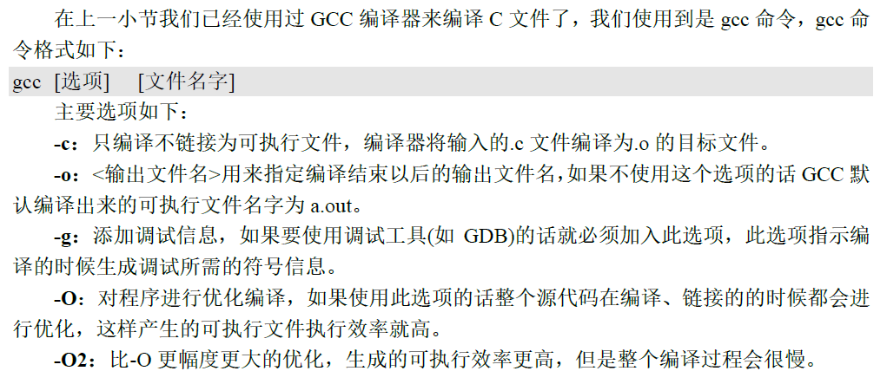

5. 编译流程

   > 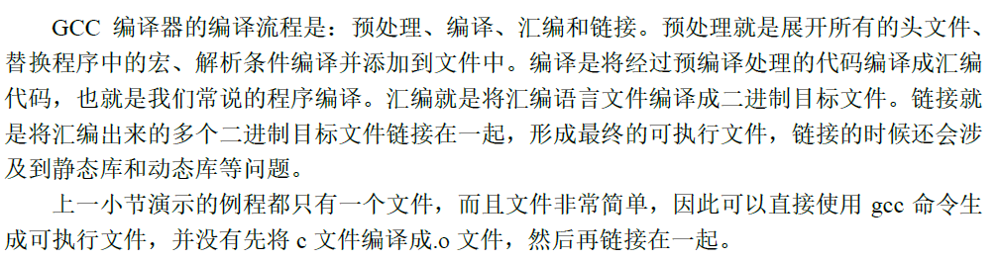

   


## Makefile学习

### 定义

解决大工程编译的工具： make，描述哪些文件需要编译、哪些需要重新编译的文件就叫做 Makefile。

Makefile就跟脚本文件一样， Makefile里面还可以执行系统命令。使用的时候只需要一个 make命令即可完成整个工程的自动编译，极大的提高了软件开发的效率。

### 案例

>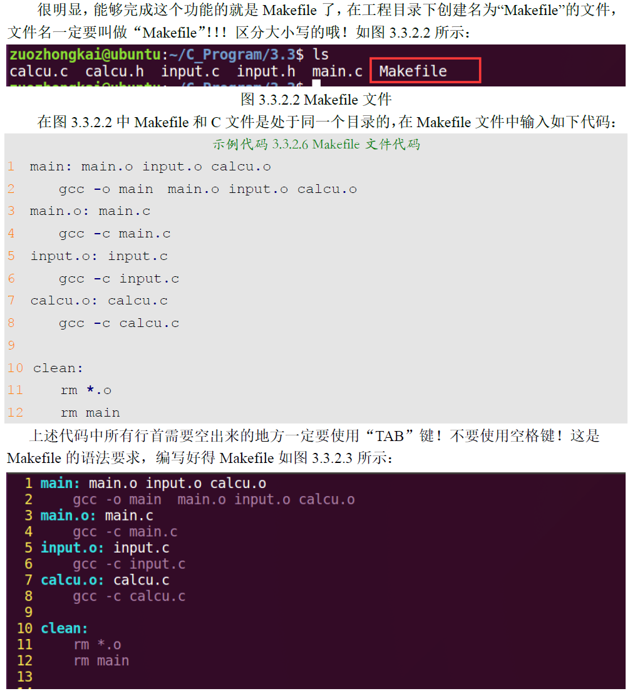
>
>


## Makefile 规则格式


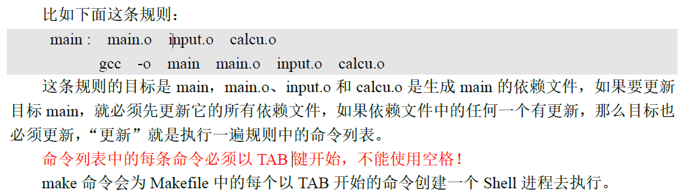


## Makefile 变量


### 赋值符


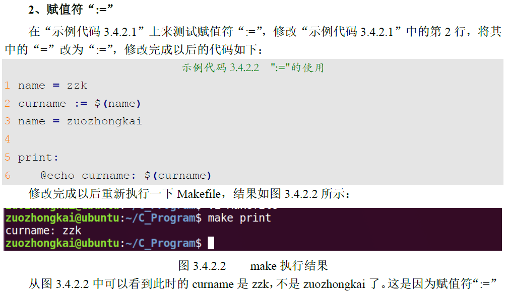

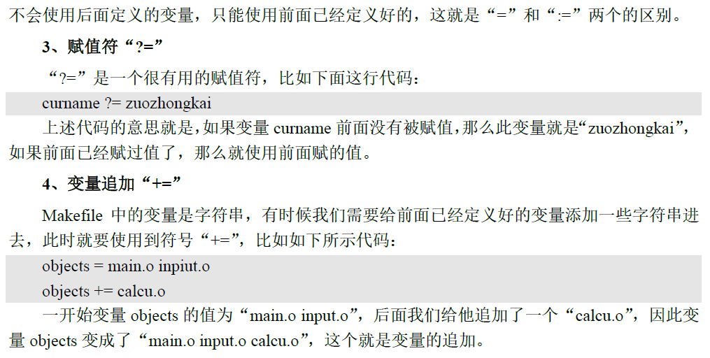


## Makefile 模式规则

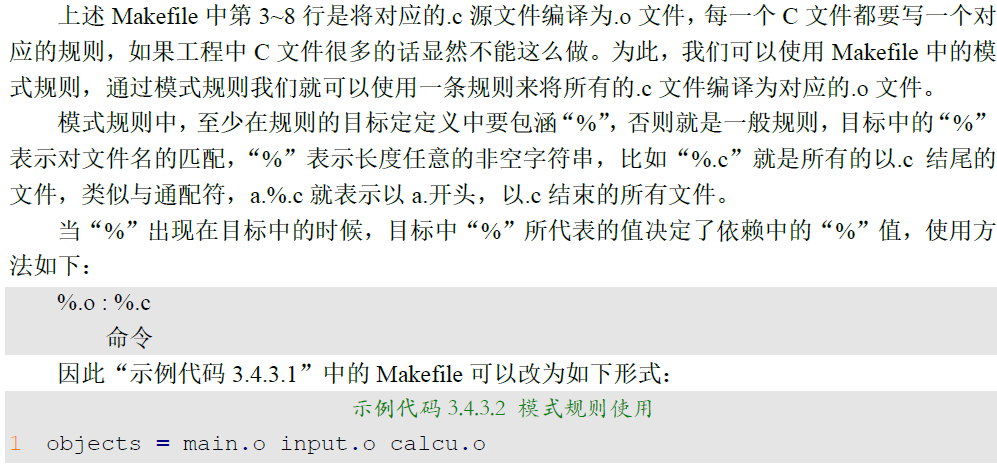


## Makefile 自动化变量 

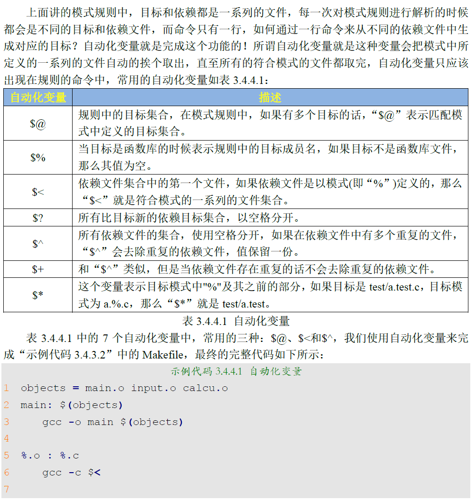

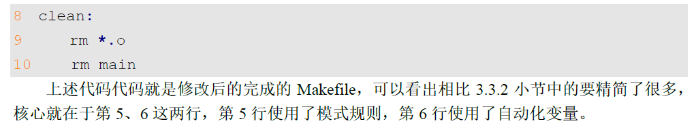


## Makefile 伪目标


## Makefile 条件判断


## Makefile 函数使用


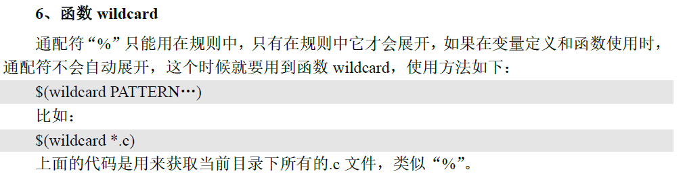


# Makefile常用基础知识梳理 - 摘录

https://mp.weixin.qq.com/s?__biz=Mzg5ODYzNDU4Nw==&mid=2247484476&idx=1&sn=52f55ba6786d9930d75e5f21993b897b&chksm=c05ec208f7294b1e2fbea43db0992154f4f446df42fbb6e271f23327aaaa51ee9acbffd407d6&token=835109125&lang=zh_CN&scene=21#wechat_redirect

本次我们来介绍关于Makefile的一些知识。Makefile的教程网上已经很多了，这篇推文也结合网上诸多知识来进行一次梳理及总结。

## 什么是make、Makefile？

make是一个 **`构建工具`**，主要用于C/C++项目。

Makefile是一个编译脚本，使用 **`make`** 工具解释Makefile（makefile）文件中的指令（编译指令）进行我们的项目编译。

在Linux环境下进行开发，工程源文件较少时，直接使用gcc进行编译。源文件较多及工程复杂时，就可以使用 **`Makefile（makefile）`** 来对我们的工程进行管理，然后使用 **`make`** 工具解释Makefile（makefile）文件中的指令（编译指令）进行我们的项目编译。即借助Makefile可以做到 **`自动化编译`** 。

## Makefile的实例

1、基础实例

万年不变helloworld，使用make编译hello.c。对应的Makefile文件：

```
hello:hello.c
 gcc hello.c -o hello
```

2、开源项目实例

之前我们在[实践分享 | 基于framebuffer的lvgl的移植使用](https://mp.weixin.qq.com/s?__biz=MzU5MzcyMjI4MA==&mid=2247494528&idx=1&sn=cebcf7d7986d19d005968df1c5b1af9c&chksm=fe0e8547c9790c51372e870922a839def8a3f4f5c78478a879c8ae4ac625b0dd80e5f7d69f00&token=852026141&lang=zh_CN&scene=21#wechat_redirect)中也是使用Makefile来管理工程：

```
#
# Makefile
#
CC ?= gcc
LVGL_DIR_NAME ?= lvgl
LVGL_DIR ?= ${shell pwd}
CFLAGS ?= -O3 -g0 -I$(LVGL_DIR)/ -Wall -Wshadow -Wundef -Wmaybe-uninitialized -Wmissing-prototypes -Wno-discarded-qualifiers -Wall -Wextra -Wno-unused-function -Wundef -Wno-error=strict-prototypes -Wpointer-arith -fno-strict-aliasing -Wno-error=cpp -Wuninitialized -Wmaybe-uninitialized -Wno-unused-parameter -Wno-missing-field-initializers -Wtype-limits -Wsizeof-pointer-memaccess -Wno-format-nonliteral -Wno-cast-qual -Wunreachable-code -Wno-switch-default -Wno-switch-enum -Wreturn-type -Wmultichar -Wformat-security -Wno-ignored-qualifiers -Wno-error=pedantic -Wno-sign-compare -Wno-error=missing-prototypes -Wdouble-promotion -Wclobbered -Wdeprecated -Wempty-body -Wtype-limits -Wshift-negative-value -Wstack-usage=1024 -Wno-unused-value -Wno-unused-parameter -Wno-missing-field-initializers -Wuninitialized -Wmaybe-uninitialized -Wall -Wextra -Wno-unused-parameter -Wno-missing-field-initializers -Wtype-limits -Wsizeof-pointer-memaccess -Wno-format-nonliteral -Wpointer-arith -Wno-cast-qual -Wmissing-prototypes -Wunreachable-code -Wno-switch-default -Wswitch-enum -Wreturn-type -Wmultichar -Wno-discarded-qualifiers -Wformat-security -Wno-ignored-qualifiers -Wno-sign-compare
LDFLAGS ?= -lm
BIN = demo


#Collect the files to compile
MAINSRC = ./main.c

include $(LVGL_DIR)/lvgl/lvgl.mk
include $(LVGL_DIR)/lv_drivers/lv_drivers.mk
include $(LVGL_DIR)/lv_examples/lv_examples.mk

OBJEXT ?= .o

AOBJS = $(ASRCS:.S=$(OBJEXT))
COBJS = $(CSRCS:.c=$(OBJEXT))

MAINOBJ = $(MAINSRC:.c=$(OBJEXT))

SRCS = $(ASRCS) $(CSRCS) $(MAINSRC)
OBJS = $(AOBJS) $(COBJS)

## MAINOBJ -> OBJFILES

all: default

%.o: %.c
 @$(CC)  $(CFLAGS) -c $< -o $@
 @echo "CC $<"
    
default: $(AOBJS) $(COBJS) $(MAINOBJ)
 $(CC) -o $(BIN) $(MAINOBJ) $(AOBJS) $(COBJS) $(LDFLAGS)

clean: 
 rm -f $(BIN) $(AOBJS) $(COBJS) $(MAINOBJ)
```

执行一个make命令很方便地就生成了可执行程序demo。

## Makefile的常用知识

前面分享了两个Makefile实例，大概知道Makefile里面都有些什么内容了。我们学习编程语言的时候，最开始都是先学习一些基本的概念及语法，同样的，对于Makefile，我们想要看懂Makefile文件或者要自己能修改、写出Makefile文件，自然也要学习一些Makefile的基本语法。

Makefile的内容很多，这里我们只专注于一些常用的Makefile知识点，基础知识掌握得牢固之后，其它一些冷门的、高级的用法我们在实践中遇到再去查资料学习也不迟。

就比如我们学习编程语言，有了基础之后，就可以去写代码实践了，而不是把厚厚的一本参考书的所有知识点都啃完之后采取动手，一下子输入太多知识而没有及时去实践巩固，就很容易忘记。

本文分享Makefile的如下几点常用知识：

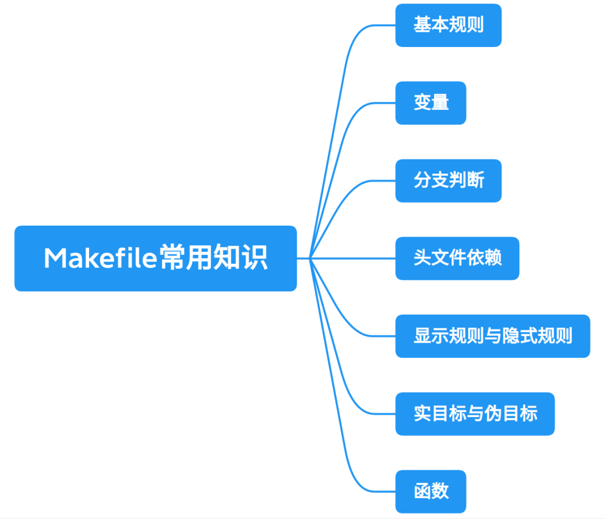

### 1、基本规则

Makefile文件中最重要的是规则。基本规则的格式如下：

```
# 基本规则
target:prerequisites 
    command
```

其中，**`target`** 为目标，**`prerequisites`** 为依赖。**`command`** 为make需要执行的命令。

> Makefile文件使用#进行注释。

- 目标：往往是程序的中间或者最终生成的文件名，比如目标文件、可执行文件等。
- 依赖：是指用来产生目标文件的输入文件名，一个目标往往依赖于一个或多个文件。
- 命令：是指任何一个文件发生改动之后，需要重新生成目标文件需要执行的命令，这里可以有多条命令，但是每个命令必须单独占一行，且需要注意的是，每个命令的前面必须有一个 **`<tab键>`** ，因为make是用过来识别命令行的，进而完成相应的动作。

对照着我们上面举例的两个Makefile文件，看看是不是都遵循着这样的规则。

### 2、变量

Makefile中的变量与编程语言中的变量的概念有点不一样，跟C语言的宏倒是有些类似，用于记录一些信息，在Makefile被解析执行时，变量调用的地方就可以使用这些信息。特别是多处要用到同样的信息、用到较长的信息时，定义变量就很有优势。

#### （1）定义变量

定义变量有赋值的过程，Makefile提供了四种赋值方式，如：

```
# 直接给变量赋值。
VAR = xxx
# 是在该变量没有被赋值的情况下为其赋值。
VAR ?= xxx
# 将":="右边中包含的变量直接展开给左边的变量赋值。
VAR := xxx
# 追加赋值，可以往变量后面增加新的内容。
VAR += xxx
```

定义及使用变量：

```
# 定义变量
VAR = xxx
# 使用变量
$(VAR)
```

对于以上四种赋值方式，可以看个网上易懂的例子：

```
例子：
a = 1
b = 2
c := $(a) 3
d = 4
d ?= 5
b += 6
结果：
a=1
c=1 3
d=4
b=2 6
```

#### （2）内置变量

Make命令提供一系列内置变量，常用的有：

| 变量名   | 说明                              |
| -------- | --------------------------------- |
| CURDIR   | 当前路径                          |
| CC       | C语言编译器的名称                 |
| CPP      | C语言预处理器的名称               |
| CXX      | C++语言的编译器名称               |
| RM       | 删除文件程序的名称                |
| CFLAGS   | C语言编译器的编译选项，无默认值   |
| CPPFLAGS | C语言预处理器的编译选项，无默认值 |
| CXXFLAGS | C++语言编译器的编译选项，无默认值 |

更多内置变量，可查阅：

> https://www.gnu.org/software/make/manual/html_node/Implicit-Variables.html

### 3、分支判断

Makefile中，分支判断有如下几种情况：

- ifeq：判断参数是否不相等，相等为 true，不相等为 false。
- ifneq：判断参数是否不相等，不相等为 true，相等为 false。
- ifdef：判断是否有值，有值为 true，没有值为 false。
- ifndef：判断是否有值，没有值为 true，有值为 false。

使用方法类似C语言中的if用法。格式如：

```
ifeq (ARG1, ARG2)
...
else
...
endif
```

例如根据不同的CPU架构选择不同的编译器：

```
ARCH ?= x86
ifeq ($(ARCH),x86)
 CC = gcc
else
 CC = arm-linux-gnueabihf-gcc
endif

hello:hello.c
 $(CC) hello.c -o hello
 @echo $(CC)
```

> 在echo前面加上echo可以关闭回显。

上面这一段Makefile中的变量arch的值默认为x86，我们也可以在执行make命令时指定变量的值，就可以在不修改Makefile文件的情况下灵活地切换编译器，如：

```
make ARCH=x86
make ARCH=arm
```

### 4、头文件依赖

有些工程用，各模块有自己的一个Makefile文件，提供给工程总的Makefile文件使用。总的Makfile文件可以使用关键字 **`include`** 包含其它Makefile文件，格式如：

```
include <filenames>
```

例如上面实例中的：

```
include $(LVGL_DIR)/lvgl/lvgl.mk
include $(LVGL_DIR)/lv_drivers/lv_drivers.mk
include $(LVGL_DIR)/lv_examples/lv_examples.mk
```

### 5、显示规则与隐式规则

#### （1）显示规则

**`显式规则`**。显式规则说明了，如何生成一个或多的的目标文件。这是由 Makefile 的书写者明显指出，要生成的文件，文件的依赖文件，生成的命令。如

```
hello:hello.o
    gcc hello.o -o hello
```

这就是一条显示规则。工程较简单时，常常使用显示规则来编写Makefile。但工程的结构比较复杂时，Makefile文件中常常会穿插着一些隐式规则来简化Makefile。下面看看是什么时隐式规则。

#### （2）隐式规则

**`隐式规则`** 。隐含规则是系统或用户预先定义好的一些特殊规则，主要是一些常用的依赖关系和更新命令。隐含规则中出现的目标文件和依赖文件都只使用文件的扩展名。

如果Makefile 文件里面没有显式给出文件的依赖关系的时候，make 就会根据文件的扩展名找到相应的隐含规则，然后按照隐含规则来更新目标。隐式规则的例子如：

```
hello:hello.o
    $(CC) $^ -o $@
```

其中，**`$@`** 代表了目标文件 ，**`$<`** 代表了所有依赖文件。其中，  **`$@`** 与 **`$<`** 也称作系统的 **`自动化变量`** 。类似的还有如下几个常用的自动化变量：

- @ 类似，但 $% 仅匹配“库”类型的目标文件。
- $<：依赖中的第一个目标文件。
- $+：所有的依赖目标，即使依赖中有重复的也原样保留。
- $?：所有比目标要新的依赖目标。

### 6、实目标与伪目标

Makefile 文件中的目标分为两类：实目标和伪目标。

#### （1）实目标

实目标是真正要生成的以文件形式存放在磁盘上的目标。如：

```
hello:hello.o
    $(CC) $^ -o $@ 
```

其中，**`hello`** 文件就是实目标。

#### （2）伪目标

伪目标不要求生成实际的文件，它主要是用于完成一些辅助操作。如：

```
clean:
    rm -rf hello.o hello
```

其中的 **`clean`** 就是一个伪目标。我们在命令里面输入命令：**`make clean`** 就可以执行删除操作：

```
rm -rf hello.o hello
```

但是这种书写形式不是很严谨，因为可能在当前目录下面存在文件名为 clean 的文件，因为这时候， 后面没有依赖文件，所以make 就认为这个文件是最新的，所以就不会执行 **`rm -rf hello.o hello`** 。所以为了避免这种情况的发生，Makefile使用**`.PHONY`**  来区分伪目标，使用如：

```
.PHONY:clean
clean:
    rm -rf hello.o hello
```

使用 **`.PHONY`** 说明clean是一个伪目标。

类似 **`.PHONY`** 这样的特殊的内置目标名称还有很多，可查阅：

> https://www.gnu.org/software/make/manual/html_node/Special-Targets.html#Special-Targets

### 7、函数

Makefile中有很多使用的内置函数，借助这些函数可以使我们的Makefile更为简洁。Makefile函数的调用方式与使用变量的方式类似，如：

```
$(函数名 参数)
```

或者：

```
${函数名 参数}
```

下面介绍一些常用的函数：

#### （1）wildcard函数

wildcard函数用于获取文件列表，并使用空格分隔开。语法如：

```
$(wildcard 匹配规则)
```

例如我们有如下工程：

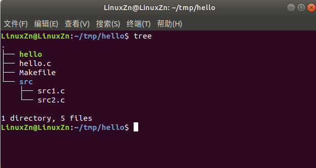

我们可以使用wildcard函数获取src文件夹下的文件：

```
SRC_FILES = $(wildcard src/*.c)

target1:
 @echo $(SRC_FILES)
```

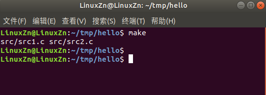

#### （2）patsubst函数

patsubst函数功能为模式字符串替换。语法如：

```
$(patsubst 匹配规则, 替换规则, 输入的字符串)
```

patsubst函数看起来貌似有点复杂，不做过多解释，看个例子就知道什么意思了。还是使用上面的例子：

```
OBJ_FILES = $(patsubst %.c, %.o, hello.c)

target1:
 @echo $(OBJ_FILES)
```

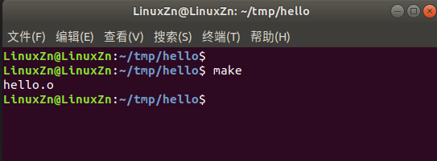

我们输入的hello.c符合匹配规则**`%.c`**，所以按照替换规则**`%.o`**进行替换得到hello.o。

> %是一个通配符，用于匹配任意个字符。

#### （3）subst函数

subst函数功能为字符串替换。语法如：

```
$(subst 源字符串, 目标字符串, 输入的字符串)
```

例子：

```
INPUT_STR = hello world
OUTPUT_STR = $(subst hello, HELLO, $(INPUT_STR))

target1:
 @echo $(OUTPUT_STR)
```

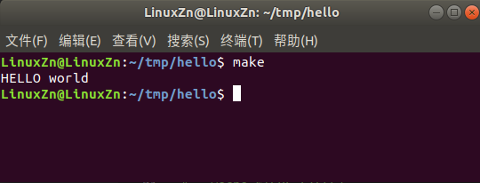

subst函数把输入字符串 **`hello world`** 中的源字符串hello替换成目标字符串HELLO。

#### （4）notdir函数

notdir函数用于去除文件路径中的目录部分。语法如：

```
$(notdir 文件名)
```

使用上面的例子来演示：

```
SRC_FILES = $(notdir src/src1.c)

target1:
 @echo $(SRC_FILES)
```

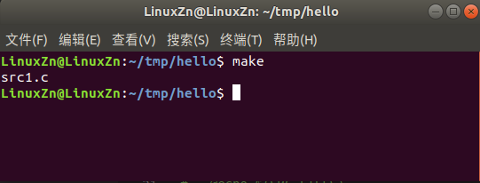

notdir函数去掉了src/src1.c前面的路径src/，输出src1.c。这里只是输出了一个文件，我们可以与上面的wildcard函数结合使用输出多个文件，如：

```
SRC = $(wildcard src/*.c)
SRC_FILES = $(notdir $(SRC))

target1:
 @echo $(SRC_FILES)
```

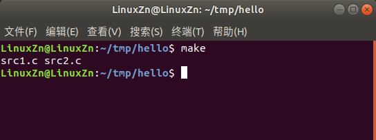

先是使用wildcard函数获取带有路径的文件列表，再使用notdir函数去掉前面的路径。

更多内置函数可查阅：

> https://www.gnu.org/software/make/manual/html_node/Functions.html

## 练习

根据我们上面学习的知识，我们可以来练习给如下工程编写一个Makefile文件：

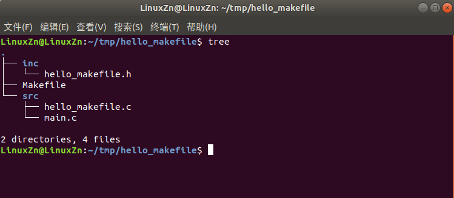

**Makefile：**

```
# 默认架构
ARCH ?= x86

# 源文件目录
SRCS_DIR = src

# 头文件目录
INCS_DIR = inc

# 编译输出目录
BUILD_DIR = build

# 源文件
SRCS = $(wildcard $(SRCS_DIR)/*.c)

# 头文件
INCS = $(wildcard $(INCS_DIR)/*.h)

# 目标文件
OBJS = $(patsubst %.c, $(BUILD_DIR)/%.o, $(notdir $(SRCS)))

# C编译选项，显示警告
CFLAGS = -Wall

# 目标APP
TARGET_APP = hello_makefile

# 根据ARCH选择编译器
ifeq ($(ARCH), x86)
 CC = gcc
else
 CC = arm-linux-gnueabihf-gcc
endif

# 链接
$(BUILD_DIR)/$(TARGET_APP):$(OBJS) 
 $(CC) -o $@ $^ -I$(INCS_DIR) $(CFLAGS)

# 编译
$(BUILD_DIR)/%.o:$(SRCS_DIR)/%.c $(INCS)
 @mkdir -p $(BUILD_DIR)
 $(CC) -c -o $@ $< -I$(INCS_DIR) $(CFLAGS)

# 清除
.PHTHY:clean
clean:
 rm -rf $(BUILD_DIR)
```

以上就是本次的分享，学习了这些Makefile基础知识之后，我们就可以看懂很多工程的Makefile文件。当然，Makefile知识很多，本文并未列出，实际遇到的时候可以再去查阅相关资料，如：

- https://www.gnu.org/software/make/manual/
- https://blog.csdn.net/haoel/article/details/2886/
- http://c.biancheng.net/view/7161.html
- http://www.ruanyifeng.com/blog/2015/02/make.html
- https://doc.embedfire.com/linux/imx6/base/zh/latest/linux_app/makefile.html#


