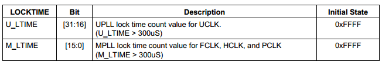
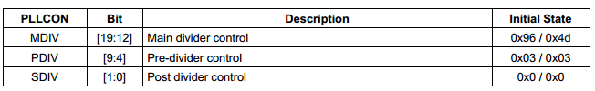
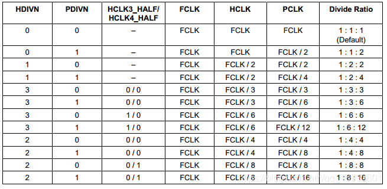
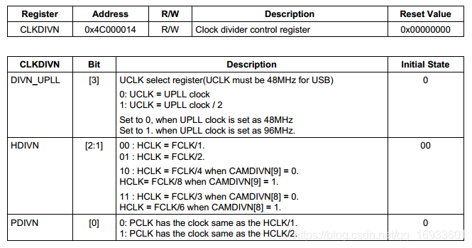

## Uboot到内核的启动流程 - HQ

[TOC]

------

#### 注意

- https://blog.csdn.net/qq_16933601/article/details/106244510

------

## Bootloader启动流程分析

  Bootloader的启动过程可以分为单阶段、多阶段两种。通常多阶段的 Bootloader能提供更为复杂的功能以及更好的可移植性。从固态存储设备上启动的 Bootloader大多都是两阶段的启动过程。第一阶段使用汇编来实现，它完成一些依赖于CPU体系结构的初始化，并调用第二阶段的代码；第二阶段则通常使用C语言来实现，这样可以实现更复杂的功能，而且代码会有更好的可读性和可移植性。
  一般而言，这两个阶段完成的功能可以如下分类：

### Bootloader第一阶段的功能

#### 硬件设备初始化

  首先需要设置时钟，设置MPLL（具体参见下面的FCLK HCLK PCLK 部分）。接着设置CLKDIVN地址为0x4C000014，写入0x05,表示设置分频系数为FCLK:HCLK:PCLK=1:4:8。接着，关闭看门狗，关中断，启动ICACHE，关闭DCACHE和TLB，关闭MMU（ICACHE为指令缓存，可以不关闭，指令直接操作的硬件，实际的物理地址。但是DCACHE就必须要关闭，此时MMU没有使能，虚拟地址映射不成功，sdram无法访问，DCACHE无数据）。start.s具体代码如下：

```c
	/* 设置时钟 */
		ldr r0, =0x4c000014
		//	mov r1, #0x03;			
		mov r1, #0x05;			  // FCLK:HCLK:PCLK=1:4:8
		str r1, [r0]
	
		/* 如果HDIVN非0，CPU的总线模式应该从“fast bus mode”变为“asynchronous bus mode” */
		mrc p15, 0, r1, c1, c0, 0		/* 读出控制寄存器 */ 
		orr r1, r1, #0xc0000000 		/* 设置为“asynchronous bus mode” */
		mcr p15, 0, r1, c1, c0, 0		/* 写入控制寄存器 */
	
		/* MPLLCON = S3C2440_MPLL_200MHZ */
		ldr r0, =0x4c000004
		ldr r1, =S3C2440_MPLL_400MHZ
		str r1, [r0]
		/* 启动ICACHE */
		mrc p15, 0, r0, c1, c0, 0	@ read control reg
		orr r0, r0, #(1<<12)
		mcr p15, 0, r0, c1, c0, 0	@ write it back
```

  这里具体讲下是如何设置FCLK HCLK PCLK。
  FCLK又称为**内核时钟**，是提供给ARM920T 的时钟。
  HCLK又称为**总线时钟**，是提供给用于存储器控制器，中断控制器，LCD 控制器，DMA 和 USB 主机模块的 AHB总线(advanced high-performance bus)的时钟。
  PCLK又称为**I/O接口时钟**，是提供给用于外设如WDT，IIS，I2C，PWM 定时器，MMC/SD 接口，ADC，UART，GPIO，RTC 和SPI的 APB (advanced peripherals bus)总线的时钟。

  S3C2440 FLCK值为400MHz，HCLK值为100MHz、PCLK值为50MHz。那么这些值通过什么方法计算出来呢？S3C2440上的时钟源是12MHz，如果想让CPU工作在更高频率上，就需要通过PLL（锁相环）来提高主频。S3C2440上的PLL有两种，一种是MPLL，它是用来产生FCLK、HCLK、PCLK的高频工作时钟；还有一种是UPLL，用来为USB提供工作频率。S3C2440时钟体系如下：


  从时序图中，我们可以看到，上电之后，如果什么都不设置，FCLK和晶振的频率相等。当设置PLL后，CPU并不是马上就使用设置好的高频时钟，而是有一段锁定时间，在这段时间里，CPU停止运行，等12MHz变成高频时钟稳定以后，整个系统再重新运行。

  开启MPLL的过程：
  1、设置LOCKTIME变频锁定时间
  2、设置FCLK与晶振输入频率（Fin）的倍数
  3、设置FCLK，HCLK，PCLK三者之间的比例
  从手册上可以看到，LOCKTIME的默认时间是0xFFFFFFFF，控制方法如图：
  （刚设置好PLL时，系统认为这是PLL还没稳定，所有这时不用PLL的时钟，而用外部晶振做时钟，将PLL锁住，过了LOCKTIME后认为PLL已经稳定了，才使用PLL给系统提供时钟）

  FCLK与Fin的倍数通过MPLLCON寄存器设置，三者之间有以下关系：
  MPLL(FCLK) = (2 * m * Fin)/(p*2^s)
  其中：m = MDIV + 8, p = PDIV + 2, s = SDIV
  PLL配置寄存器如图：

  当设置完MPLL之后，就会自动进入LockTime变频锁定期间，LOCKTIME之后，MPLL输出稳定时钟频率。
   FCLK、HCLK、PCLK的设置比例如图：


  如果HDIV设置为非0，CPU的总线模式要进行改变，默认情况下FCLK = HCLK，CPU工作在fast bus mode快速总线模式下，HDIV设置为非0后， FCLK与HCLK不再相等，要将CPU改为asynchronous bus mod异步总线模式，可以通过下面的嵌入汇编代码实现：

```c
__asm__(
    "mrc    p15, 0, r1, c1, c0, 0\n"        /* 读出控制寄存器 */ 
    "orr    r1, r1, #0xc0000000\n"          /* 设置为“asynchronous bus mode” */
    "mcr    p15, 0, r1, c1, c0, 0\n"        /* 写入控制寄存器 */
    );
```

#### 为加载 Bootloader的第二阶段代码准备RAM空间（初始化内存空间）

  lowlevel_init中设置相应BANK地址，主要用来设置SDRAM。内存是被映射在了0x30000000-0x40000000的位置，即**bank6与bank7**。那么在内存时序设置的时候，主要关心的，就是bank6与bank7。当然，bank0也是需要关注的，因为它是启动时，启动程序存放的位置。但是bank0是由OM[1:0]，即板子上的那几个小开关中的两个来控制的，所以这里程序上是不用管它的。

```c
SMRDATA:
		.long 0x22011110	 //BWSCON
		.long 0x00000700	 //BANKCON0
		.long 0x00000700	 //BANKCON1
		.long 0x00000700	 //BANKCON2
		.long 0x00000700	 //BANKCON3  
		.long 0x00000740	 //BANKCON4
		.long 0x00000700	 //BANKCON5
		.long 0x00018005	 //BANKCON6
		.long 0x00018005	 //BANKCON7
		.long 0x008C04F4	 // REFRESH
		.long 0x000000B1	 //BANKSIZE
		.long 0x00000030	 //MRSRB6
		.long 0x00000030	 //MRSRB7
```

  接下来设置栈地址指向NAND，准备初始化NANDFLASH。

```c
	ldr	sp, =(CONFIG_SYS_INIT_SP_ADDR)//等于0x30000f80
	bic	sp, sp, #7 /* 8-byte alignment for ABI compliance */

	bl nand_init_ll
```

  初始化NANDFLASH，其中包括设置时序NFCONF，(参考芯片手册和2440手册设置nandflsh的启动时序)。TACLS表示的建立所用的时间，TWRPH0表示nWE写控制信号的持续时间，TWRPH1表示数据生效所用的时间，什么时候可以读数据。 最后就是使能NFCONT NAND Flash控制器，初始化ECC, 禁止片选。到这里，NANDFLASH的初始化就完成了。下面就可以进行重定位了。

```c
void nand_init_ll(void)
{
#define TACLS   0
#define TWRPH0  1
#define TWRPH1  0
	/* 设置时序 */
	NFCONF = (TACLS<<12)|(TWRPH0<<8)|(TWRPH1<<4);
	/* 使能NAND Flash控制器, 初始化ECC, 禁止片选 */
	NFCONT = (1<<4)|(1<<1)|(1<<0);	
}
```

#### 复制 Bootloader的第二阶段代码到SDRAM空间中（重定位）

  首先判断是NOR启动还是NAND启动，如果是NAND启动就直接拷贝数据。拷贝代码之前，要传递给拷贝函数三个参数，源，目的，长度。读取NAND的话要参考芯片手册的NAND读取数据的时序，选中NAND，发出读命令，发出地址，发出读命令，判断状态，读取数据，取消选中等。

```c
	bl copy_code_to_sdram
	bl clear_bss                         //清除bss段(参考自制uboot章节)
12
void copy_code_to_sdram(unsigned char *src, unsigned char *dest, unsigned int len)
{	
	int i = 0;
	
	/* 如果是NOR启动 */
	if (isBootFromNorFlash())
	{
		while (i < len)
		{
			dest[i] = src[i];
			i++;
		}
	}
	else
	{
		//nand_init();
		nand_read_ll((unsigned int)src, dest, len);
	}
}

void clear_bss(void)
{
	extern int __bss_start, __bss_end__;
	int *p = &__bss_start;
	
	for (; p < &__bss_end__; p++)
		*p = 0;
}
12345678910111213141516171819202122232425262728
```

  最后要清除bss。bss段不占用空间，都是未初始化的全局变量或者已经初始化为零的变量，本来就是零，直接清零就好。不清零的话未初始化的变量可能会存在未知的数值。

#### 设置好栈

  设置栈跳转到SDRAM执行。

```c
ldr pc,=call_board_init_f            //绝对跳转,跳到SDRAM上执行
1
```

#### 跳转到第二阶段代码的C入口点

  跳转到SDRAM执行剩下的程序。

```c
call_board_init_f:
.globl base_sp
base_sp:
	.long 0

	ldr	r0,=0x00000000
	bl	board_init_f
	
	/*unsigned int id 的值存在r0中，正好给board_init_r使用*/
	ldr r1, =_TEXT_BASE
	/*重新设置栈到之前的位置 指向原来addr_sp += 128;*/
	ldr sp,base_sp  
	/*调用第二阶段代码*/
	bl	board_init_r
1234567891011121314
```

### Bootloader第二阶段的功能

#### 初始化本阶段要使用到的硬件设备

  为了方便开发，至少要初始化一个串口以便程序员与 Bootloader进行交互。

#### 检测系统内存映射（ memory map）

  所谓检测内存映射，就是确定板上使用了多少内存、它们的地址空间是什么。由于嵌入式开发中 Bootloader多是针对某类板子进行编写，所以可以根据板子的情况直接设置，不需要考虑可以适用于各类情况的复杂算法。

#### 将内核映象和根文件系统映象从 Flash上读到SDRAM空间中

  Flash上的内核映象有可能是经过压缩的，在读到SDRAM之后，还需要进行解压。当然，对于有自解压功能的内核，不需要 Bootloader来解压。将根文件系统映象复制到SDRAM中，这不是必需的。这取决于是什么类型的根文件系统以及内核访问它的方法。

  将内核存放在适当的位置后，直接跳到它的入口点即可调用内核。调用内核之前，下列条件要满足：
  **（1）CPU寄存器的设置**
  R0=0（规定）。
  R1=机器类型ID；对于ARM结构的CPU，其机器类型ID可以参见 linux/arch/arm tools/ mach-types
  R2=启动参数标记列表在RAM中起始基地址（下面会详细介绍如何传递参数）。
  **（2）CPU工作模式**
  必须禁止中断（IRQ和FIQ，uboot启动是一个完整的过程，没有必要也不能被打断）
  CPU必须为SVC模式（为什么呢？主要是像异常模式、用户模式都不合适。具体深入的原因自己可以查下资料）。
  **（3） Cache和MMU的设置**
  MMU必须关闭。
  指令 Cache可以打开也可以关闭。
  数据 Cache必须关闭。

#### 为内核设置启动参数

  Bootloader与内核的交互是单向的， Bootloader将各类参数传给内核。由于它们不能同时行，传递办法只有一个：**Bootloader将参数放在某个约定的地方之后，再启动内核，内核启动后从这个地方获得参数**。

  除了约定好参数存放的地址外，还要规定参数的结构。Linu2.4x以后的内核都期望以**标记列表**（ tagged_list）的形式来传递启动参数。标记，就是**一种数据结构**；标记列表，就是挨着存放的多个标记。标记列表以标记 `ATAG CORE`开始，以标记 `ATAG NONE`结束。

  标记的数据结构为tag，它由一个 tag_header结构和一个联合(union)组成。 tag_ header结构表小标记的类型及长度，比如是表示内存还是表示命令行参数等。对于不同类型的标记使用不同的联合(union)，比如表示内存时使用 tag_mem32，表示命令行时使用 tag_cmdline。

  bootloader与内核约定的参数地址，设置内存的起始地址和大小，指定根文件系统在那个分区，系统启动后执行的第一个程序linuxrc，控制台ttySAC0等。

#### 调用内核

  调用内核就是uboot启动的最后一步了。到这里就uboot就完成了他的使命。


### uboot启动内核详解

  下面我们来展开说下uboot具体是如何调用内核的，引导内核启动的。

#### uboot与Linux内核之间的参数传递

  我们知道，uboot启动后已经完成了基本的硬件初始化（如：内存、串口等），接下来它的主要任务就是加载Linux内核到开发板的内存，然后跳转到Linux内核所在的地址运行。

  具体是如何跳转呢？做法很简单，**直接修改PC寄存器的值为Linux内核所在的地址**，这样CPU就会从Linux内核所在的地址去取指令，从而执行内核代码。

  在前面我们已经知道，在跳转到内核以前，uboot需要做好以下三件事情：

  **(1) CPU寄存器的设置**
  R0=0。
  R1=机器类型ID；对于ARM结构的CPU，其机器类型ID可以参见 linux/arch/arm tools/ mach-types
  R2=启动参数标记列表在RAM中起始基地址。
  **(2) CPU工作模式**
  必须禁止中断（IRQs和FIQs）
  CPU必须为SVC模式
  **(3) Cache和MMU的设置**
  MMU必须关闭
  指令 Cache可以打开也可以关闭
  数据 Cache必须关闭

  其中上面第一步CPU寄存器的设置中，就是通过R0,R1,R2三个参数给内核传递参数的。（[ATPCS规则可以参考](https://blog.csdn.net/qq_16933601/article/details/102788924)）

##### 为什么要给内核传递参数呢？

  在此之前，uboot已经完成了硬件的初始化，可以说已经”适应了“这块开发板。然而，内核并不是对于所有的开发板都能完美适配的（如果适配了，可想而知这个内核有多庞大，又或者有新技术发明了，可以完美的适配各种开发板），此时对于开发板的环境一无所知。所以，要想启动Linux内核，uboot必须要给内核传递一些必要的信息来告诉内核**当前所处的环境**。

##### 如何给内核传递参数？

  因此，uboot就把**机器ID通过R1传递给内核**，Linux内核运行的时候首先就从R1中读取机器ID来判断是否支持当前机器。这个机器ID实际上就是开发板**CPU的ID**，每个厂家生产出一款CPU的时候都会给它指定一个唯一的ID，大家可以到uboot源码的arch\arm\include\asm\mach-type.h文件中去查看。

  **R2存放的是块内存的基地址**，这块内存中存放的是uboot给Linux内核的其他参数。这些参数有内存的**起始地址、内存大小、Linux内核启动后挂载文件系统的方式等信息**。很明显，参数有多个，不同的参数有不同的内容，为了让Linux内核能精确的解析出这些参数，双方在传递参数的时候要求参数在存放的时猴需要**按照双方规定的格式存放**。

  **除了约定好参数存放的地址外，还要规定参数的结构**。Linux2.4.x以后的内核都期望以标记列表（tagged_list）的形式来传递启动参数。标记，就是一种数据结构；标记列表，就是挨着存放的多个标记。标记列表以标记`ATAG_CORE`开始，以标记`ATAG_NONE`结束。

  标记的数据结构为tag，它由一个tag_header结构和一个联合（union）组成。tag_header结构表示标记的类型及长度，比如是表示内存还是表示命令行参数等。对于不同类型的标记使用不同的联合（union），比如表示内存时使用tag_ mem32，表示命令行时使用 tag_cmdline。具体代码见arch\arm\include\asm\setup.h。

  从上面可以看出，struct_tag结构体由structtag_header+联合体union构成，结构体struct tag_header用来描述每个tag的头部信息，如tag的类型，tag大小。联合体union用来描述每个传递给Linux内核的参数信息。
  下面以传递内存标记、传递命令行参数为例来说明参数的传递。
  **(1)设置开始标记ATAG_CORE**

```c
	tag->hdr.tag  = ATAG_CORE;
	tag->hdr.size = tag_size(tag_core);
	tag->u.core.flags = params->u1.s.flags & FLAG_READONLY;
	tag->u.core.pagesize = params->u1.s.page_size;
	tag->u.core.rootdev = params->u1.s.rootdev;

	tag = tag_next(tag);
1234567
```

  涉及到的结构体定义如下

```c
struct tag_header {
	__u32 size;
	__u32 tag;
};

/* The list must start with an ATAG_CORE node */
#define ATAG_CORE	0x54410001

struct tag_core {
	__u32 flags;		/* bit 0 = read-only */
	__u32 pagesize;
	__u32 rootdev;
};
12345678910111213
```

  其中tag_next，tag_size定义如下，指向当前标记的结尾

```c
#define tag_next(t)	((struct tag *)((u32 *)(t) + (t)->hdr.size))
#define tag_size(type)	((sizeof(struct tag_header) + sizeof(struct type)) >> 2)
12
```

  **(2)设置内存标记**

```c
	t->hdr.tag = ATAG_MEM;
	t->hdr.size = tag_size(tag_mem32);
	t->u.mem.start = CFG_GLOBAL_RAM_BASE;
	t->u.mem.size = CFG_GLOBAL_RAM_SIZE;

	t = tag_next(t);
123456
```

  相关结构体定义如下

```c
#define ATAG_MEM	0x54410002

struct tag_mem32 {
	__u32	size;
	__u32	start;	/* physical start address */
};
123456
```

  **(3)设置命令行参数标记**

  命令行参数是一个字符串，一般用它来告诉内核挂载根文件系统的方式。由uboot的bootargs环境变量提供，它的内容有如下两种格式

```c
root=nfs nfsroot=202.193.61.237:/work/nfs_root/first_fs ip=202.193.61.196 init=/linuxrc console=ttySAC0,115200
1
root=/dev/mtdblock2 ip=202.193.61.196 init=/linuxrc console=ttySAC0,115200
1
```

| 名称    | 含义                                                         |
| ------- | ------------------------------------------------------------ |
| root    | 告诉Linux内核挂载根文件系统的方式，nfs表示以NFS服务的方式挂载根文件系统，/dev/mtdblock2表示根文件系统在MTD设置的第二个分区上。 |
| nfsroot | 告诉Linux内核，以NFS方式挂载根文件系统时，根文件系统所在主机的P地址和路径 |
| ip      | 告诉Linux内核，启动后它的p地址                               |
| init    | 告诉Linux内核，启动的第一个应用程序是根目录下的linuxrc程序   |
| console | 告诉Linux区内核，控制台为ttySAC0,波特率为115200              |

```c
tag = tag_next(tag);
tag->hdr.tag = ATAG_CMDLINE;
tag->hdr.size = (strlen(params->commandline) + 3 +
		 sizeof(struct tag_header)) >> 2;
strcpy(tag->u.cmdline.cmdline, params->commandline);

tag = tag_next(tag);
1234567
```

  相关结构体定义如下

```c
/* command line: \0 terminated string */
#define ATAG_CMDLINE	0x54410003

struct tag_cmdline {
	char	cmdline[1];	/* this is the minimum size */
};
123456
```

  **(4)设置结束标记**

```c
	tag->hdr.tag = ATAG_NONE;
	tag->hdr.size = 0;
12
```

  我们明白了运行Linux区内核的时候，uboot需要给内核的传递的参数，接下来我们就来看看如何从uboot中跳到Linux内核。

#### uboot跳转到Linux内核

  在uboot中可以使用go和bootm来跳转到内核，这两个命令的区别如下：

  (1) go命令仅仅修改pc的值到指定地址

  格式：`go addr`

  (2) bootm命令是uboot专门用来启动uImage格式的Linux内核，它在修改pc的值到指定地址之前，会设置传递给Linux内核的参数，用法如下：

  格式：`bootm addr`

##### uboot中bootm命令实现

  bootm命令在uboot源码common/cmd_bootm.c中实现，它的功能如下：

  （1）读取uImage头部，把内核拷贝到合适的地方。

  （2）把参数给内核准备好。

  （3）引导内核。

  当我们使用我们在uboot使用bootm命令后，bootm命令会从uImage头中读取信息后，发现是Linux内核，就会调用do_bootm_linux()函数，函数的具体实现bootm.c中

```c
int do_bootm_linux(int flag, int argc, char *argv[], bootm_headers_t *images)
{
	/* No need for those on ARM */
	if (flag & BOOTM_STATE_OS_BD_T || flag & BOOTM_STATE_OS_CMDLINE)
		return -1;

	if (flag & BOOTM_STATE_OS_PREP) {
		boot_prep_linux(images);
		return 0;
	}

	if (flag & BOOTM_STATE_OS_GO) {
		boot_jump_linux(images);
		return 0;
	}

	boot_prep_linux(images);
	boot_jump_linux(images);
	return 0;
}
1234567891011121314151617181920
```

  do_bootm_linux 函数最终会 跳转执行 boot_prep_linux 和 boot_jump_linux 函数，首先分析 boot_prep_linux 函数(位于 bootm.c 文件中)：

```c
static void boot_prep_linux(bootm_headers_t *images)
{
    char *commandline = getenv("bootargs");　　　　　　//从环境变量中获取 bootargs 的值

　　。。。。。。。
        setup_board_tags(&params);　　　　　　
        setup_end_tag(gd->bd);　　　　//将 tag 参数保存在指定位置
    } else {
        printf("FDT and ATAGS support not compiled in - hanging\n");
        hang();
    }
    do_nonsec_virt_switch();
}
12345678910111213
```

   从代码可以看出来，boot_prep_linux，主要功能是将 tag 参数保存到指定位置，比如 bootargs 环境变量 tag，串口 tag，接下来分析 boot_jump_linux 函数(位于 bootm.c 文件中)：

```c
static void boot_jump_linux(bootm_headers_t *images, int flag)
{
    unsigned long machid = gd->bd->bi_arch_number;　　　　　　//获取机器id (在 board/samsung/jz2440/jz2440.c 中设置，为 MACH_TYPE_SMDK2410(193))
    char *s;
    void (*kernel_entry)(int zero, int arch, uint params);
    unsigned long r2;
    int fake = (flag & BOOTM_STATE_OS_FAKE_GO);

    kernel_entry = (void (*)(int, int, uint))images->ep;　　　　//获取 kernel的入口地址，此处应为 30000000

    s = getenv("machid");　　　　　　　　//从环境变量里获取机器id　(本例中还未在环境变量里设置过机器 id)
    if (s) {　　　　　　　　　　　　//判断环境变量里是否设置机器id
        strict_strtoul(s, 16, &machid);　　　　//如果设置则用环境变量里的机器id
        printf("Using machid 0x%lx from environment\n", machid);
    }

    debug("## Transferring control to Linux (at address %08lx)" \
        "...\n", (ulong) kernel_entry);
    bootstage_mark(BOOTSTAGE_ID_RUN_OS);
    announce_and_cleanup(fake);

    if (IMAGE_ENABLE_OF_LIBFDT && images->ft_len)
        r2 = (unsigned long)images->ft_addr;
    else
        r2 = gd->bd->bi_boot_params;　　　　//获取 tag参数地址，gd->bd->bi_boot_params在 setup_start_tag 函数里设置
if (!fake) kernel_entry(0, machid, r2); }　　//进入内核
1234567891011121314151617181920212223242526
```

  通过分析可以看出，最终进入内核的函数为 ：

```c
kernel_entry(0, machid, r2)
1
```

  到这里bootm就成功给内核传递了参数，并跳转到了内核。关于go命令的实现可以自己参考内核，在cmd_boot.c文件中，所不同的是，go命令实现的时候没有设置参数，只是简单的跳转执行。如果想要使用go来跳转到Linux内核，我们需要做简单的修改，有兴趣的可以自己研究下，这里就不展开讲了。

  至此，uboot就启动了内核。启动内核后就是挂载根文件系统了，下篇将具体介绍是如何挂载根文件系统的。
  [构建根文件系统](https://blog.csdn.net/qq_16933601/article/details/103206897)

##### 内核镜像格式vmlinuz和zImage和uImage

  最后插讲下内核的不同映像格式的区别：

  （1）uboot经过编译直接生成的elf格式的可执行程序是u-boot，这个程序类似于windows下的exe格式，在操作系统下是**可以直接执行的**。但是这种格式**不能用来烧录下载**。我们用来烧录下载的是u-boot.bin，这个东西是由u-boot使用arm-linux-objcopy工具进行加工（主要目的是去掉一些无用的）得到的。这个u-boot.bin就叫镜像（image），镜像就是用来烧录到iNand中执行的。

  （2）linux内核经过编译后也会生成一个elf格式的可执行程序，叫vmlinux或vmlinuz，这个就是**原始的未经任何处理加工的原版内核elf文件**；嵌入式系统部署时烧录的一般不是这个vmlinuz/vmlinux，而是要用objcopy工具去制作成烧录镜像格式（就是u-boot.bin这种，但是内核没有.bin后缀），经过制作加工成烧录镜像的文件就叫Image（制作把78M大的精简成了7.5M，因此这个制作烧录镜像主要目的就是**缩减大小，节省磁盘**）。

  （3）原则上Image就可以直接被烧录到Flash上进行启动执行（类似于u-boot.bin），但是实际上并不是这么简单。实际上linux的作者们觉得Image还是太大了所以对Image进行了压缩，并且在image压缩后的文件的**前端附加了一部分解压缩代码**。构成了一个压缩格式的镜像就叫zImage。（因为当年Image大小刚好比一张软盘（软盘有2种，1.2M的和1.44MB两种）大，为了节省1张软盘的钱于是乎设计了这种压缩Image成zImage的技术）。

  （4）uboot为了启动linux内核，还发明了一种内核格式叫uImage。uImage是由zImage加工得到的，uboot中有一个工具，可以将zImage加工生成uImage。注意：uImage不关linux内核的事，linux内核只管生成zImage即可，然后uboot中的mkimage工具再去由zImage加工生成uImage来给uboot启动。**这个加工过程其实就是在zImage前面加上64字节的uImage的头信息即可**。

  （5）原则上uboot启动时应该给他uImage格式的内核镜像，但是实际上uboot中也可以支持zImage，是否支持就看x210_sd.h中是否定义了LINUX_ZIMAGE_MAGIC这个宏。所以大家可以看出：有些uboot是支持zImage启动的，有些则不支持。但是**所有的uboot肯定都支持uImage启动**。

  （6）如果直接在kernel底下去make uImage会提供mkimage command not found。解决方案是去uboot/tools下cp mkimage /usr/local/bin/，复制mkimage工具到系统目录下。再去make uImage即可。

  通过上面的介绍我们了解了内核镜像的各种格式，如果通过uboot启动内核，**Linux必须为uImage格式**。


