## 同步与互斥笔记 - HQ

[TOC]

------

#### 注意

- 

------

# 《从0学Linux驱动》- 手册截图

【参考资料《从0学Linux驱动》公众号 [一口Linux]】

## Linux中的并发机制 - 图片

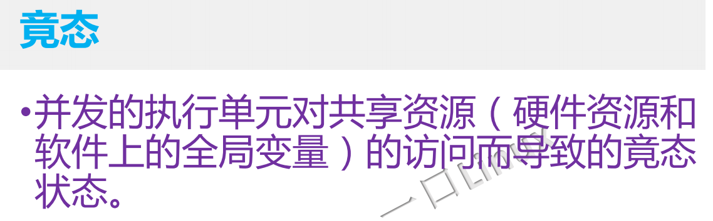

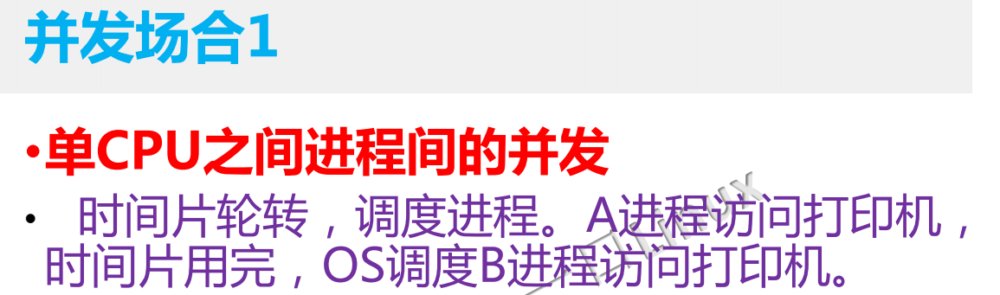

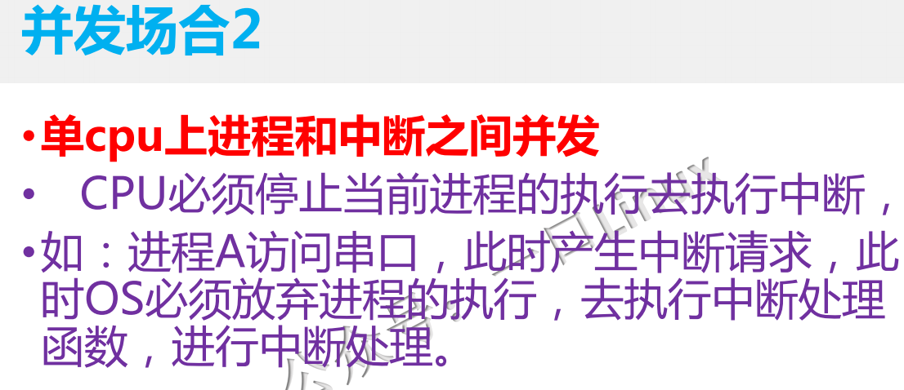

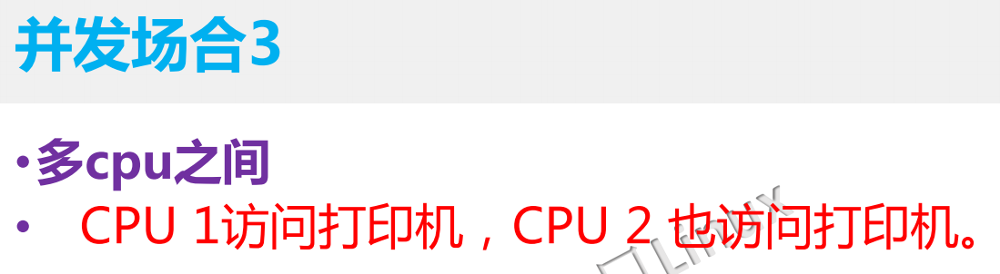

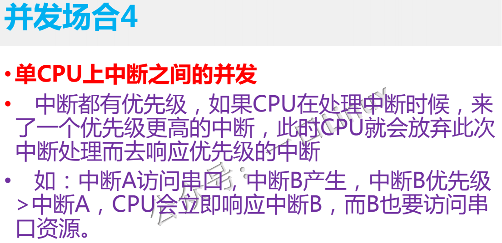

## 原子操作 - 图片

## 互斥体 - 图片

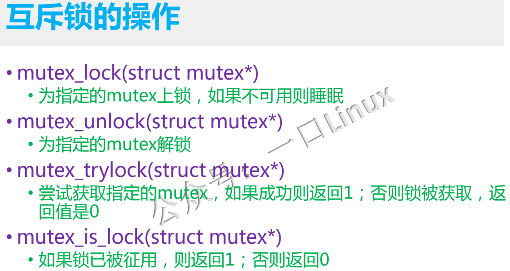

## 信号量 - 图片

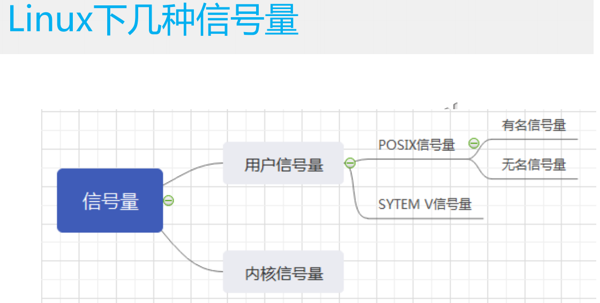

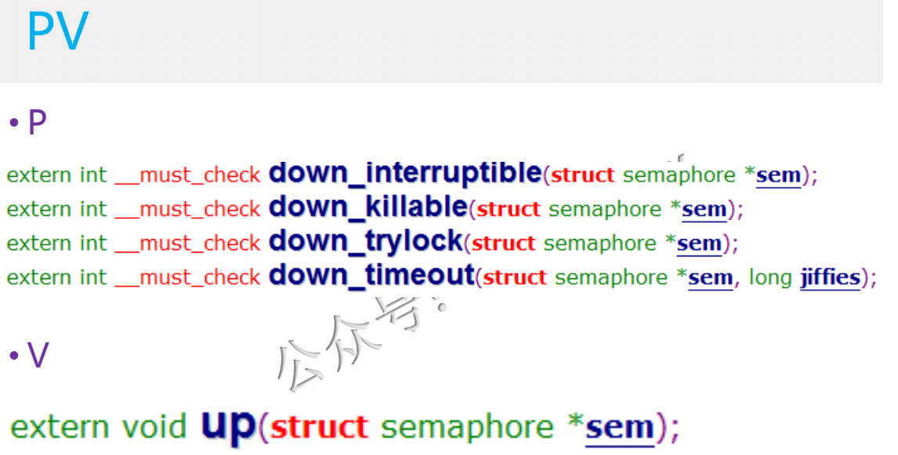

## 自旋锁 - 图片

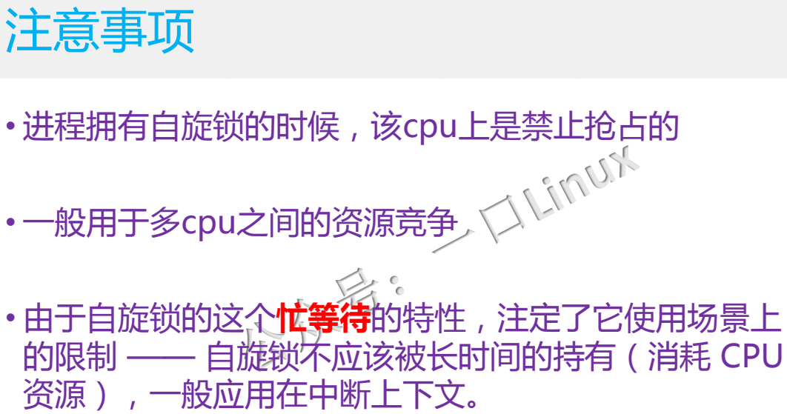

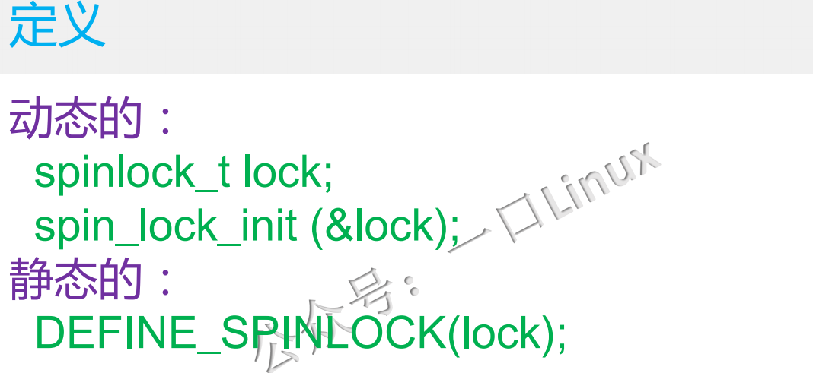

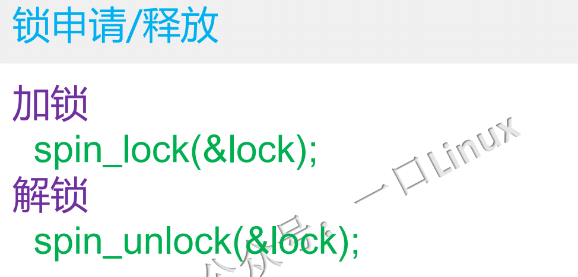

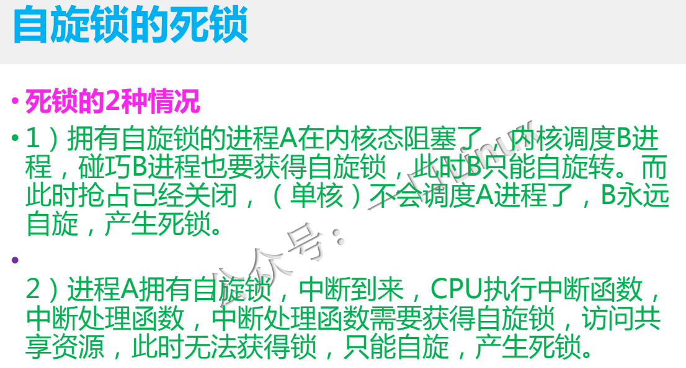

## 同步机制总结对比 - 图片

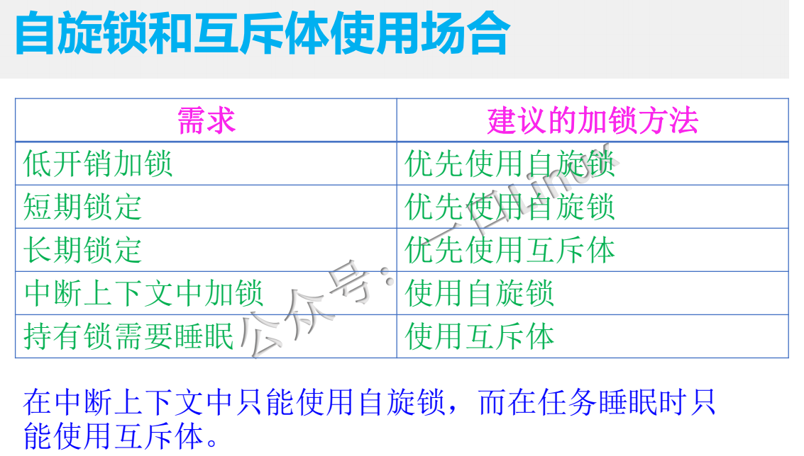

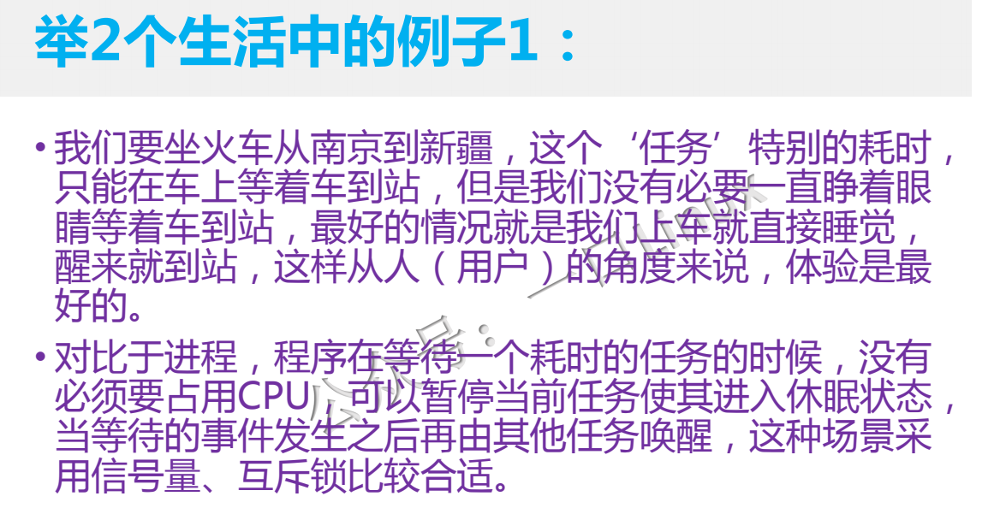

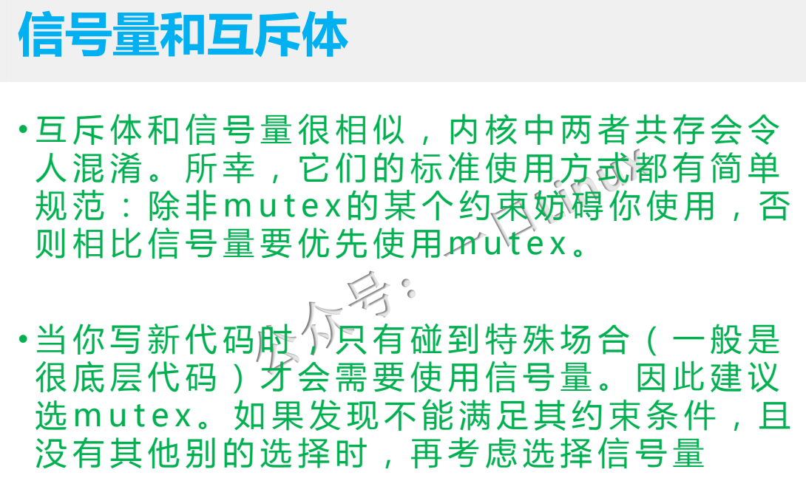

