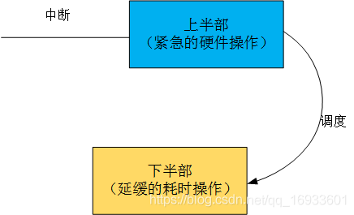
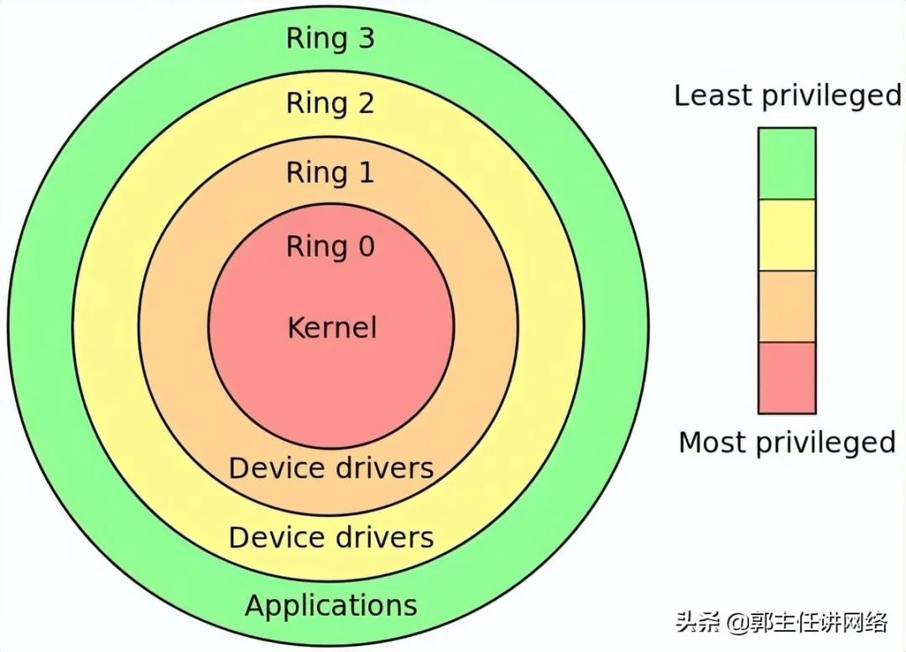

## 进程 & 中断上下文 - HQ

[TOC]

------

#### 注意

- [文章摘自](https://blog.csdn.net/qq_16933601/article/details/107239908?ops_request_misc=%7B%22request_id%22%3A%22161962026516780264032212%22%2C%22scm%22%3A%2220140713.130102334.pc_blog.%22%7D&request_id=161962026516780264032212&biz_id=0&utm_medium=distribute.pc_search_result.none-task-blog-2~blog~first_rank_v2~rank_v29-1-107239908.pc_v2_rank_blog_default&utm_term=%E4%B8%AD%E6%96%AD%E9%A1%B6%E5%8D%8A%E9%83%A8%E5%92%8C%E5%BA%95%E5%8D%8A%E9%83%A8%E7%9A%84%E7%90%86%E8%A7%A3)

------

# 中断上半部、下半部的概念

  设备的中断会打断内核进程中的正常调度和运行，系统对更高吞吐率的追求势必要求中断服务程序尽量短小精悍。但是，这个良好的愿望往往与现实并不吻合。在大多数真实的系统中，当中断到来时，要完成的工作往往并不会是短小的，它可能要进行较大量的耗时处理。
  下图描述了Linux内核的中断处理机制。为了在中断执行时间尽量短和中断处理需完成的工作尽量大之间找到一个平衡点，Linux将中断处理程序分解为两个半部：顶半部和底半部。


  顶半部用于完成尽量少的**比较紧急的功能**，它往往只是简单地**读取寄存器中的中断状态**，并在清除中断标志后就进行“**登记中断**”的工作。“登记中断”意味着将底半部处理程序挂到该设备的底半部执行队列中去。这样，顶半部执行的速度就会很快，从而可以服务更多的中断请求。

  现在，中断处理工作的重心就落在了底半部的头上，需用它来完成中断事件的绝大多数任务。底半部**几乎做了中断处理程序所有的事情**，而且可以被**新的中断打断**，这也是底半部和顶半部的最大不同，因为**顶半部往往被设计成不可中断**。底半部相对来说并不是非常紧急的，而且相对比较耗时，不在硬件中断服务程序中执行。

  尽管顶半部、底半部的结合能够善系统的响应能力，但是，僵化地认为Linux设备驱动中的中断处理一定要分两个半部则是不对的。**如果中断要处理的工作本身很少，则完全可以直接在顶半部全部完成**。

  其他操作系统中对中断的处理也采用了类似于 Linux的方法，真正的硬件中断服务程序都斥尽量短。因此，许多操作系统都提供了中断上下文和非中断上下文相结合的机制，将中断的耗时工作保留到非中断上下文去执行。

# 实现中断下半部的三种方法

## 软中断

  软中断（ Softirq）也是一种传统的底半部处理机制，它的执行时机通常是**顶半部返回的时候**， tasklet是基于软中断实现的，因此也运行于软中断上下文。

  在Linux内核中，用 softing_action结构体表征一个软中断，这个结构体包含软中断处理函数指针和传递给该函数的参数。使用 open_softirq（）函数可以注册软中断对应的处理函数，而 raise_softirq（）函数可以触发一个软中断。

  软中断和 tasklet运行于软**中断上下文**，仍然属于原子上下文的一种，而工作队列则运行于**进程上下文**。因此，在软中断和 tasklet处理函数中**不允许睡眠**，而在**工作队列处理函数中允许睡眠**。

  local_bh_disable（）和 llocal_bh_enable（）是内核中用于禁止和使能软中断及 tasklet底半部机制的函数

> 版权声明：本文为博主原创文章，遵循 CC 4.0 BY-SA 版权协议，转载请附上原文出处链接和本声明。
> 本文链接：https://blog.csdn.net/qq_16933601/article/details/107239908

## 软中断模版

```c
asmlinkage void do_softirq(void)
{
    __u32 pending;
    unsigned long flags;

    /* 判断是否在中断处理中，如果正在中断处理，就直接返回 */
    if (in_interrupt())
        return;

    /* 保存当前寄存器的值 */
    local_irq_save(flags);

    /* 取得当前已注册软中断的位图 */
    pending = local_softirq_pending();

    /* 循环处理所有已注册的软中断 */
    if (pending)
        __do_softirq();

    /* 恢复寄存器的值到中断处理前 */
    local_irq_restore(flags);
}
12345678910111213141516171819202122
```

## tasklet

  tasklet的使用较简单，它的执行上下文是软中断，执行时机通常是顶半部返回的时候。我们只需要定义 tasklet及其处理函数，并将两者关联则可，例如

```c
void my_tasklet_func(unsigned long); /*定义一个处理函数*/
DECLARE_TASKLET(my_tasklet, my_tasklet_func, data);
/*定义一个tasklet结构my_tasklet，与my_tasklet_func(data)函数相关联*/
123
```

  代码DECLARE_TASKLET（my_tasklet，my_tasklet_func，data）实现了定义名称为my_tasklet的tasklet，并将其与my_tasklet_func（）这个函数绑定，而传入这个函数的参数为data。
在需要调度tasklet的时候引用一个tasklet_schedule（）函数就能使系统在适当的时候进行调度运行：

```c
tasklet_schedule(&my_tasklet);
1
```

  使用tasklet作为底半部处理中断的设备驱动程序模板下所示（仅包含与中断相关的部
分）。

## tasklet函数模版

```c
/* 定义tasklet和底半部函数并将它们关联 */
void xxx_do_tasklet(unsigned long);
DECLARE_TASKLET(xxx_tasklet, xxx_do_tasklet, 0);

/* 中断处理底半部 */
void xxx_do_tasklet(unsigned long)

...


/* 中断处理顶半部 */
 irqreturn_t xxx_interrupt(int irq, void *dev_id)
{
 ...
 tasklet_schedule(&xxx_tasklet);
 ...
}

/* 设备驱动模块加载函数 */
 int __init xxx_init(void)
{
 ...
 /* 申请中断 */
 result = request_irq(xxx_irq, xxx_interrupt,
 0, "xxx", NULL);
 ...
 return IRQ_HANDLED;
}

/* 设备驱动模块卸载函数 */
 void __exit xxx_exit(void)
{
 ...
 /* 释放中断 */
 free_irq(xxx_irq, xxx_interrupt);
 ...
}
12345678910111213141516171819202122232425262728293031323334353637
```

  上述程序在模块加载函数中申请中断（第24~25行），并在模块卸载函数free_irq(xxx_irq, xxx_interrupt);中释放它。对应于xxx_irq的中断处理程序被设置为xxx_interrupt（）函数，在这个函数中，tasklet_schedule（&xxx_tasklet）调度被定义的tasklet函数xxx_do_tasklet（）在适当的时候执行。

## 工作队列

  工作队列的使用方法和tasklet非常相似，但是工作队列的执行上下文是内核线程，因此可以调度和睡眠。下面的代码用于定义一个工作队列和一个底半部执行函数

```c
struct work_struct my_wq; /* 定义一个工作队列 */
void my_wq_func(struct work_struct *work); /* 定义一个处理函数 */
12
```

  通过INIT_WORK（）可以初始化这个工作队列并将工作队列与处理函数绑定：

```c
INIT_WORK(&my_wq, my_wq_func);
/* 初始化工作队列并将其与处理函数绑定 */
12
```

  与tasklet_schedule（）对应的用于调度工作队列执行的函数为schedule_work（），如：

```c
schedule_work(&my_wq); /* 调度工作队列执行 */
1
```

## 工作队列函数模版

```c
/* 定义工作队列和关联函数 */
struct work_struct xxx_wq;
void xxx_do_work(struct work_struct *work);

/* 中断处理底半部 */
void xxx_do_work(struct work_struct *work)

...


/*中断处理顶半部*/
 irqreturn_t xxx_interrupt(int irq, void *dev_id)
{
 ...
 schedule_work(&xxx_wq);
 ...
 return IRQ_HANDLED;
}

/* 设备驱动模块加载函数 */
 int xxx_init(void)
{
 ...
 /* 申请中断 */
 result = request_irq(xxx_irq, xxx_interrupt,
 0, "xxx", NULL);
 ...
 /* 初始化工作队列 */
 INIT_WORK(&xxx_wq, xxx_do_work);
 ...
}

/* 设备驱动模块卸载函数 */
 void xxx_exit(void)
{
 ...
 /* 释放中断 */
 free_irq(xxx_irq, xxx_interrupt);
 ...
}
12345678910111213141516171819202122232425262728293031323334353637383940
```

  工作队列早期的实现是在每个CPU核上创建一个worker内核线程，所有在这个核上调度的工作都在该worker线程中执行，其并发性显然差强人意。在Linux 2.6.36以后，转而实现“Concurrency-managedworkqueues”，简称cmwq，cmwq会自动维护工作队列的线程池以提高并发性，同时保持了API的向后兼容。

# 进程上下文和中断上下文

[谈谈进程上下文、中断上下文及原子上下文的一些概念](https://blog.csdn.net/qq_16933601/article/details/107305828)

## 软中断和硬中断的区别

**硬中断：**

  1. 硬中断是由**硬件产生**的，比如，像磁盘，网卡，键盘，时钟等。**每个设备或设备集都有它自己的IRQ（中断请求）**。基于IRQ，CPU可以将相应的请求分发到对应的硬件驱动上（注：硬件驱动通常是内核中的一个子程序，而不是一个独立的进程）。

  2. 处理中断的驱动是需要运行在CPU上的，因此，当中断产生的时候，CPU会中断当前正在运行的任务，来处理中断。在有多核心的系统上，一个中断通常只能中断一颗CPU（也有一种特殊的情况，就是在大型主机上是有硬件通道的，它可以在没有主CPU的支持下，可以同时处理多个中断。）。

  3. **硬中断可以直接中断CPU**。它会引起内核中相关的代码被触发。对于那些需要花费一些时间去处理的进程，中断代码本身也可以被其他的硬中断中断。

  4. 对于时钟中断，内核调度代码会将当前正在运行的进程挂起，从而让其他的进程来运行。它的存在是为了让调度代码（或称为调度器）可以调度多任务。

**软中断：**

  1. 软中断的处理非常像硬中断。然而，它们仅仅是由**当前正在运行的进程**所产生的。

  2. 通常，软中断是一些对I/O的请求。这些请求会调用内核中可以调度I/O发生的程序。**对于某些设备，I/O请求需要被立即处理，而磁盘I/O请求通常可以排队并且可以稍后处理**。根据I/O模型的不同，进程或许会被挂起直到I/O完成，此时内核调度器就会选择另一个进程去运行。I/O可以在进程之间产生并且调度过程通常和磁盘I/O的方式是相同。

  3. 软中断仅与内核相联系。而内核主要负责对需要运行的任何其他的进程进行调度。一些内核允许设备驱动的一些部分存在于用户空间，并且当需要的时候内核也会调度这个进程去运行。

  4. **软中断并不会直接中断CPU**。也**只有当前正在运行的代码（或进程）才会产生软中断**。这种中断是一种需要内核为正在运行的进程去做一些事情（通常为I/O）的请求。有一个特殊的软中断是Yield调用，它的作用是请求内核调度器去查看是否有一些其他的进程可以运行。

## 硬中断、软中断和信号的区别

  硬中断是**外部设备对CPU的中断**，软中断是**中断底半部的一种处理机制**，而信号则是由**内核（或其他进程）对某个进程的中断**。在涉及系统调用的场合，人们也常说通过软中断（例如ARM为swi）陷入内核，此时软中断的概念是指由**软件指令引发的中断**，和我们这个地方说的softirq是两个完全不同的概念，一个是software，一个是soft。
  需要特别说明的是，软中断以及基于软中断的tasklet如果在某段时间内大量出现的话，内核会把后续软中断放入ksoftirqd内核线程中执行。总的来说，**中断优先级高于软中断**，**软中断又高于任何一个线程**。软中断适度线程化，可以缓解高负载情况下系统的响应。


## Linux CPU 的上下文切换 - 文章摘录

[摘自 - 一口Linux博文](https://mp.weixin.qq.com/s/Gy_jkq9G-eYsornTnymG4Q)

我们都知道 Linux 是一个多任务操作系统，它支持的任务同时运行的数量远远大于 CPU 的数量。当然，这些任务实际上并不是同时运行的（Single CPU），而是因为系统在短时间内将 CPU 轮流分配给任务，造成了多个任务同时运行的假象。

### CPU 上下文（CPU Context）

在每个任务运行之前，CPU 需要知道在哪里加载和启动任务。这意味着系统需要提前帮助设置 CPU 寄存器和程序计数器。

CPU 寄存器是内置于 CPU 中的小型但速度极快的内存。程序计数器用于存储 CPU 正在执行的或下一条要执行指令的位置。

它们都是 CPU 在运行任何任务之前必须依赖的依赖环境，因此也被称为 “CPU 上下文”。如下图所示：

> 

知道了 CPU 上下文是什么，我想你理解 CPU 上下文切换就很容易了。“**CPU上下文切换”指的是先保存上一个任务的 CPU 上下文（CPU寄存器和程序计数器），然后将新任务的上下文加载到这些寄存器和程序计数器中，最后跳转到程序计数器。**

这些保存的上下文存储在系统内核中，并在重新安排任务执行时再次加载。这确保了任务的原始状态不受影响，并且任务似乎在持续运行。

### CPU 上下文切换的类型

你可能会说 CPU 上下文切换无非就是更新 CPU 寄存器和程序计数器值，而这些寄存器是为了快速运行任务而设计的，那为什么会影响 CPU 性能呢？

在回答这个问题之前，请问，你有没有想过这些“任务”是什么？你可能会说一个任务就是一个进程或者一个线程。是的，进程和线程正是最常见的任务，但除此之外，还有其他类型的任务。

别忘了硬件中断也是一个常见的任务，硬件触发信号，会引起中断处理程序的调用。

因此，CPU 上下文切换至少有三种不同的类型：

- **进程上下文切换**
- **线程上下文切换**
- **中断上下文切换**

让我们一一来看看。

### 进程上下文切换

Linux 按照特权级别将进程的运行空间划分为内核空间和用户空间，分别对应下图中 Ring 0 和 Ring 3 的 CPU 特权级别的 。

- 内核空间（Ring 0）拥有最高权限，可以直接访问所有资源
- 用户空间（Ring 3）只能访问受限资源，不能直接访问内存等硬件设备。它必须通过系统调用被陷入（trapped）内核中才能访问这些特权资源。

> 

从另一个角度看，一个进程既可以在用户空间也可以在内核空间运行。当一个进程在用户空间运行时，称为该进程的用户态，当它落入内核空间时，称为该进程的内核态。

从用户态到内核态的转换需要通过系统调用来完成。例如，当我们查看一个文件的内容时，我们需要以下系统调用：

- open()：打开文件
- read()：读取文件的内容
- write()：将文件的内容写入到输出文件（包括标准输出）
- close()：关闭文件

那么在上述==系统调用过程中是否会发生 CPU 上下文切换呢？当然是的==。

**这需要先保存 CPU 寄存器中原来的用户态指令的位置。接下来，为了执行内核态的代码，需要将 CPU 寄存器更新到内核态指令的新位置。最后是跳转到内核态运行内核任务。**

**那么系统调用结束后，CPU 寄存器需要恢复原来保存的用户状态，然后切换到用户空间继续运行进程。**

> 因此，==在一次系统调用的过程中，实际上有两次 CPU 上下文切换。==

但需要指出的是，**系统调用进程不会涉及进程切换，也不会涉及虚拟内存等系统资源切换。**这与我们通常所说的“进程上下文切换”不同。进程上下文切换是指从一个进程切换到另一个进程，而系统调用期间始终运行同一个进程。

系统调用过程通常被称为特权模式切换，而不是上下文切换。但实际上，在系统调用过程中，CPU 的上下文切换也是不可避免的。

### 进程上下文切换 vs 系统调用

那么进程上下文切换和系统调用有什么区别呢？首先，进程是由内核管理的，==进程切换只能发生在内核态==。因此，==进程上下文不仅包括虚拟内存、栈和全局变量等用户空间资源，还包括内核栈和寄存器等内核空间的状态。==

**所以进程上下文切换比系统调用要多出一步**：

> ==在保存当前进程的内核状态和 CPU 寄存器之前，需要保存进程的虚拟内存、栈等；并加载下一个进程的内核状态。==

根据 Tsuna 的测试报告，每次上下文切换需要几十纳秒至微秒的 CPU 时间。这个时间是相当可观的，尤其是在大量进程上下文切换的情况下，很容易导致 CPU 花费大量时间来保存和恢复寄存器、内核栈、虚拟内存等资源。这正是我们在上一篇文章中谈到的，一个导致平均负载上升的重要因素。

那么，该进程何时会被调度/切换到在 CPU 上运行？其实有很多场景，下面我为大家总结一下：

- **当一个进程的 CPU 时间片用完时，它会被系统挂起，并切换到其他等待 CPU 运行的进程。**
- **当系统资源不足（如内存不足）时，直到资源充足之前，进程无法运行。此时进程也会被挂起，系统会调度其他进程运行。**
- **当一个进程通过 sleep 函数自动挂起自己时，自然会被重新调度。**
- **当优先级较高的进程运行时，为了保证高优先级进程的运行，当前进程会被高优先级进程挂起运行。**
- **当发生硬件中断时，CPU 上的进程会被中断挂起，转而执行内核中的中断服务程序。**

了解这些场景是非常有必要的，因为一旦上下文切换出现性能问题，它们就是幕后杀手。

### 线程上下文切换

线程和进程最大的区别在于，线程是任务调度的基本单位，而进程是资源获取的基本单位。

说白了，内核中所谓的任务调度，实际的调度对象是线程；而进程只为线程提供虚拟内存和全局变量等资源。所以，对于线程和进程，我们可以这样理解：

- **当一个进程只有一个线程时，可以认为一个进程等于一个线程**
- 当一个进程有多个线程时，这些线程共享相同的资源，例如虚拟内存和全局变量。
- 此外，线程也有自己的私有数据，比如栈和寄存器，在上下文切换时也需要保存。

这样，==线程的上下文切换其实可以分为两种情况==：

- **首先，前后两个线程属于不同的进程。此时，由于资源不共享，切换过程与进程上下文切换相同。**
- **其次，前后两个线程属于同一个进程。此时，由于虚拟内存是共享的，所以切换时虚拟内存的资源保持不变，只需要切换线程的私有数据、寄存器等未共享的数据。**

显然，同一个进程内的线程切换比切换多个进程消耗的资源要少。这也是多线程替代多进程的优势。

### 中断上下文切换

除了前面两种上下文切换之外，还有另外一种场景也输出 CPU 上下文切换的，那就是中断。

为了快速响应事件，硬件中断会中断正常的调度和执行过程，进而调用中断处理程序。

**在中断其他进程时，需要保存进程的当前状态，以便中断后进程仍能从原始状态恢复。**

==与进程上下文不同，中断上下文切换不涉及进程的用户态。==因此，**即使中断进程中断了处于用户态的进程，也不需要保存和恢复进程的虚拟内存、全局变量等用户态资源。**

另外，和进程上下文切换一样，中断上下文切换也会消耗 CPU。过多的切换次数会消耗大量的 CPU 资源，甚至严重降低系统的整体性能。因此，当您发现中断过多时，需要注意排查它是否会对您的系统造成严重的性能问题。

### 结论

综上所述，无论哪种场景导致上下文切换，你都应该知道：

CPU 上下文切换是保证 Linux 系统正常运行的核心功能之一，一般不需要我们特别关注。

但是过多的上下文切换会消耗 CPU 的时间来保存和恢复寄存器、内核栈、虚拟内存等数据，从而缩短进程的实际运行时间，导致系统整体性能显着下降。


