## FreeRTOS知识整理 - HQ

[TOC]

------

#### 注意

- 来自公众号博主整理 [FreeRTOS 教程完结](https://mp.weixin.qq.com/s/50Y85yyqkLozrdiS-MSUqg)

------

## 目录


FreeRTOS 的方方面面基本都讲了，但是每个方面讲的又不多，特别适合没有太多时间，想在短时间内对 FreeRTOS 有一个整体了解的人。

[FreeRTOS（一）简介](http://mp.weixin.qq.com/s?__biz=MzIzNTgzMTIzNw==&mid=2247486648&idx=1&sn=db55deb36aefdedc686d924c164d4f62&chksm=e8e06612df97ef04ec62bcb8e1e4b950a5163b074242561264595c31c5d3d32ecabf6a258f5e&scene=21#wechat_redirect)

[FreeRTOS（二）源码](http://mp.weixin.qq.com/s?__biz=MzIzNTgzMTIzNw==&mid=2247486673&idx=1&sn=19dc1c309f670fb9dc9ce46c57b1883f&chksm=e8e0667bdf97ef6d30cde7ac008717b569256b9898bac69dc6d32d8c9b7b1e398c5d27a4611a&scene=21#wechat_redirect)

[FreeRTOS（三）移植到 STM32](http://mp.weixin.qq.com/s?__biz=MzIzNTgzMTIzNw==&mid=2247486683&idx=1&sn=1d04b71aee1e7122e475b6dbf861952d&chksm=e8e06671df97ef6790dab7869e5c520306b0162fa4855610ba5c7cfa268ccfd0eea5dd11b51e&scene=21#wechat_redirect)

[FreeRTOS（四）：命名规则](http://mp.weixin.qq.com/s?__biz=MzIzNTgzMTIzNw==&mid=2247486748&idx=1&sn=0cab9724aaf1531f4cb1c8c5683b10e0&chksm=e8e067b6df97eea0471c826d319f63046e7980e17f5241d577a3851199bab70fa68370491a48&scene=21#wechat_redirect)

[FreeRTOS（五）：中断配置和临界段](http://mp.weixin.qq.com/s?__biz=MzIzNTgzMTIzNw==&mid=2247486775&idx=1&sn=f7c9dff60644e22254444d5f5719c96c&chksm=e8e0679ddf97ee8b39ea5d2e68135b94154a419b4f60cb7bae70d2fa4f8803560a1b90e72902&scene=21#wechat_redirect)

[FreeRTOS（六）：任务](http://mp.weixin.qq.com/s?__biz=MzIzNTgzMTIzNw==&mid=2247486784&idx=1&sn=794ff40c7c3c685e375ae68a3152cd66&chksm=e8e067eadf97eefc6a0ee355e5e1d772eefda58fcb79c82f1a14bfad388d2ad4342bec1da329&scene=21#wechat_redirect)

[FreeRTOS（七）：任务相关 API 函数](http://mp.weixin.qq.com/s?__biz=MzIzNTgzMTIzNw==&mid=2247486924&idx=1&sn=28762c5f029ad635d824e6c87159dda6&chksm=e8e06766df97ee70e7066ddf7bb4905c08ff82435f429e6f8f9333aa2a89a11818c6a556c297&scene=21#wechat_redirect)

[FreeRTOS（八）：列表和列表项](http://mp.weixin.qq.com/s?__biz=MzIzNTgzMTIzNw==&mid=2247486992&idx=1&sn=a47bea5527dfbce05cf40f06699e6d74&chksm=e8e064badf97edac59c255f5a621afdc4c4a2f4f3a0e6a10bf6b53ced99ce6ffe1c9f74f5253&scene=21#wechat_redirect)

[FreeRTOS（九）：软件定时器](http://mp.weixin.qq.com/s?__biz=MzIzNTgzMTIzNw==&mid=2247486999&idx=1&sn=920f5d79b969a2db408a5210cbbb6c2e&chksm=e8e064bddf97edabd2982cdea3bcadc8522afbe837b2d1964dd590bbabee55b7f840957cb5db&scene=21#wechat_redirect)

[FreeRTOS（十）：内核控制函数](http://mp.weixin.qq.com/s?__biz=MzIzNTgzMTIzNw==&mid=2247487111&idx=1&sn=68f749df6c238750ad9171dbfcda78af&chksm=e8e0642ddf97ed3b53f19ced3dc822100b981498841ea38e6c7b63e0c19a2c30d8da99868974&scene=21#wechat_redirect)

[FreeRTOS（十一）：其他任务 API 函数](http://mp.weixin.qq.com/s?__biz=MzIzNTgzMTIzNw==&mid=2247487111&idx=2&sn=e858cc64b30e72a1326097ff82cd0e63&chksm=e8e0642ddf97ed3bdd98111f41c6c49e900ef7471b49325a5de547e8cf474683ab72f567a8b7&scene=21#wechat_redirect)

[FreeRTOS（十二）：消息队列](http://mp.weixin.qq.com/s?__biz=MzIzNTgzMTIzNw==&mid=2247487132&idx=1&sn=e21a5db857d315e499a252edf7005efe&chksm=e8e06436df97ed2073804397b9a5ca539b0a8fa4317db59ace6719a60e3a440803a3beed9f49&scene=21#wechat_redirect)

[FreeRTOS（十三）：信号量](http://mp.weixin.qq.com/s?__biz=MzIzNTgzMTIzNw==&mid=2247487136&idx=1&sn=1cef54d02ce5af6f6155258380a3dbd4&chksm=e8e0640adf97ed1c21efee2f08732fd118c21a61151c4ba5e025224358c356e54aee97941397&scene=21#wechat_redirect)

[FreeRTOS（十四）：事件标志组](http://mp.weixin.qq.com/s?__biz=MzIzNTgzMTIzNw==&mid=2247487201&idx=1&sn=d1707ccb4ecc730bc4467ed8b5fbdd5b&chksm=e8e0644bdf97ed5d72797fbb557a5b195308118c1d4217b2b727ac159f995a3401619ea3cdf0&scene=21#wechat_redirect)

[FreeRTOS（十五）：任务通知](http://mp.weixin.qq.com/s?__biz=MzIzNTgzMTIzNw==&mid=2247487280&idx=1&sn=d4ed082e4e7602d2b5a6808c7956c24a&chksm=e8e0659adf97ec8cf2b15e716d42e5342d9115723113f00e6677294367851c3762633ffe8923&scene=21#wechat_redirect)

[FreeRTOS（十六）：低功耗 Tickless 模式](http://mp.weixin.qq.com/s?__biz=MzIzNTgzMTIzNw==&mid=2247487281&idx=1&sn=22fc315134f3672110d4b1e643919b5f&chksm=e8e0659bdf97ec8d801d0aa1a26755e98a80d63525b2e6d8624e98a4531b2bfb789bd7bb44a5&scene=21#wechat_redirect)

[FreeRTOS（十七）：空闲任务](http://mp.weixin.qq.com/s?__biz=MzIzNTgzMTIzNw==&mid=2247487282&idx=1&sn=a97f87458e891188612e98cb1c1e2342&chksm=e8e06598df97ec8e4f4c6d0c897467ca54f4a36115660628edbef3604394c43c4903fed95663&scene=21#wechat_redirect)

[FreeRTOS（十八）：内存管理](http://mp.weixin.qq.com/s?__biz=MzIzNTgzMTIzNw==&mid=2247487283&idx=1&sn=c4d43e549287acbae3327994803093e9&chksm=e8e06599df97ec8f142fe585a71bf384df560333c51880e777b928655e4018d3ebec29e1c93a&scene=21#wechat_redirect)


## 补充内容

**Sensor hub 智能传感集线器**

> 智能传感集线器，是一种基于**低功耗 MCU** 和**轻量级 RTOS 操作系统**之上的软硬件结合的解决方案，其主要功能是连接并处理来自各种传感器设备的数据。诞生之初的目的主要是为了解决在移动设备端的功耗问题。
>
> 比如手机中，希望待机的情况下（主控低功耗），还可以获取各种传感器的数据，就可以在主控之外搞一个单片机，跑小系统，来接收各种传感器数据。这样设计可以使主控省电，只需要一点单片机的电。
>
> 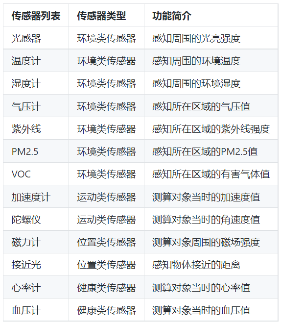


## FreeRTOS（一）简介

FreeRTOS 是一个轻量型系统，在市场上占用比例很高。如果你以前只做过裸机编程，不妨加上 FreeRTOS 试试看，可以做更多的事情。

FreeRTOS 官网：www.freertos.org

FreeRTOS 可以分为两部分：Free 和 RTOS，Free 就是免费的、自由的、 不受约束的，RTOS 是 Real Time Operating System，实时操作系统。

RTOS 不是指某一个确定的系统，而是指一类系统。比如 UCOS，FreeRTOS，RTX，RT-Thread 等这些都是 RTOS 类操作系统。

学习 RTOS 首选 UCOS，因为 UCOS 的资料很多，尤其是中文资料！FreeRTOS 的资料少，而且大多数是英文的，那为何要选择它？原因如下：

1、**FreeRTOS 免费！**这是最重要的一点，UCOS 是要收费的，学习 RTOS 系统的话 UCOS 是首选，但是做产品的话就要考虑一下成本了。显而易见的，FreeRTOS 在此时就是一个很好的 选择，当然了也可以选择其他的免费的 RTOS 系统。

2、许多其他半导体厂商产品的 SDK 包就使用 FreeRTOS 作为其操作系统，尤其是 WIFI、 蓝牙这些带协议栈的芯片或模块。

3、许多软件厂商也使用 FreeRTOS 做本公司软件的操作系统，比如著名的 TouchGFX，其 所有的例程都是基于 FreeRTOS 操作系统的。ST 公司的所有要使用到 RTOS 系统的例程也均采 用了 FreeRTOS，由此可见免费的力量啊！

4、简单，**FreeRTOS 的文件数量很少**，这个在我们后面的具体学习中就会看到，和 UCOS 系统相比要少很多！

5、文档相对齐全，在 FreeRTOS 的官网（www.freertos.org）上可以找到所需的文档和源码， 但是所有的文档都是英文版本的，而且下载 pdf 文档的时候是要收费的。

6、FreeRTOS 被移植到了很多不同的微处理器上，比如我们使用的 STM32，F1、F3、F4 和 最新的 F7 都有移植，这个极大的方便了我们学习和使用。

7、社会占有量很高，EEtimes 统计的 2015 年 RTOS 系统占有量中 FreeRTOS 已经跃升至第 一位。

### FreeRTOS 特点

FreeRTOS 是一个可裁剪的小型 RTOS 系统，其特点包括：

● FreeRTOS 的内核支持抢占式，合作式和时间片调度。

● SafeRTOS 衍生自 FreeRTOS，SafeRTOS 在代码完整性上相比 FreeRTOS 更胜一筹。

● 提供了一个用于低功耗的 Tickless 模式。

● **系统的组件在创建时可以选择动态或者静态的 RAM，比如任务、消息队列、信号量、 软件定时器等等。**

● 已经在超过 30 种架构的芯片上进行了移植。

● FreeRTOS-MPU 支持 Corex-M 系列中的 MPU 单元，如 STM32F103。

● FreeRTOS 系统简单、小巧、易用，**通常情况下内核占用 4k-9k 字节的空间。**

● 高可移植性，代码主要 C 语言编写。

● 支持实时任务和协程(co-routines 也有称为合作式、协同程序，本教程均成为协程)。

● **任务与任务、任务与中断之间可以使用任务通知、消息队列、二值信号量、数值型信号量、递归互斥信号量和互斥信号量进行通信和同步。**

● 创新的事件组(或者事件标志)。

● 具有优先级继承特性的互斥信号量。

● 高效的软件定时器。

● 强大的跟踪执行功能。

● 堆栈溢出检测功能。

● 任务数量不限。

● 任务优先级不限。

FreeRTOS 衍生出来了另外两个系统：OpenRTOS 和 SafeTROS。

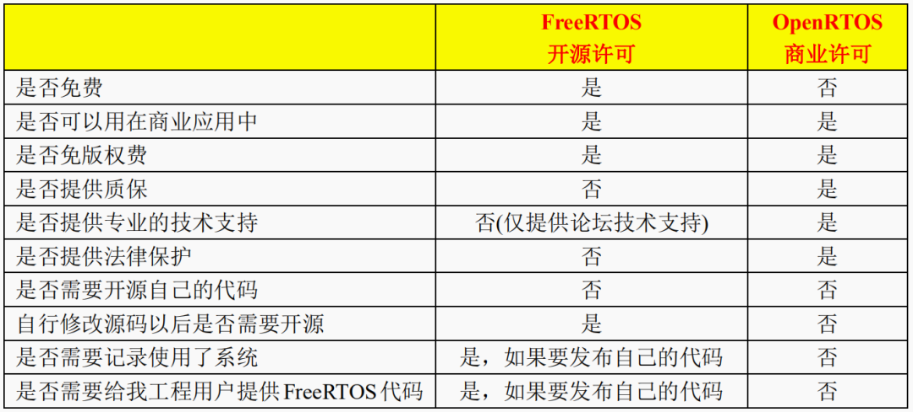

OpenRTOS 是 FreeRTOS 的商业化版本，OpenRTOS 的商业许可协议不包含任何 GPL 条款。

SafeRTOS 也是 FreeRTOS 的衍生版本，只是 SafeRTOS 过了一些安全认证，比如 IEC61508。


## FreeRTOS（二）源码

FreeRTOS 官网：https://freertos.org/

在官网中可以下载到 FreeRTOS 的源码，博主下载了一份，解压后目录如下：

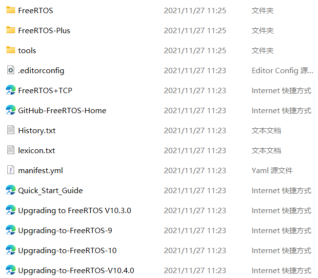

FreeRTOS 源码中有三个文件夹，7 个 HTML 格式的网页和 2 个 txt 文档，HTML 网页和 txt 文档看名字就知道是什么东西了，重点在于上面那两个文件夹：FreeRTOS 和 FreeRTOS-Plus，这两个文件夹里面的东西就是 FreeRTOS 的源码。

**1、FreeRTOS 文件夹**

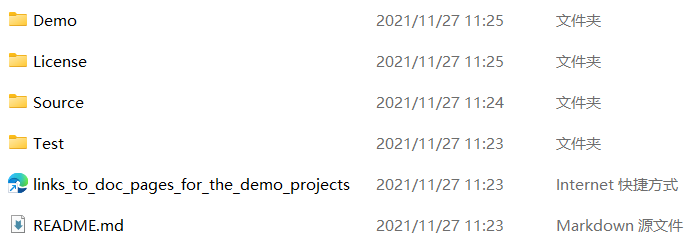

**1）Demo 文件夹**里面就是 FreeRTOS 的相关例程：

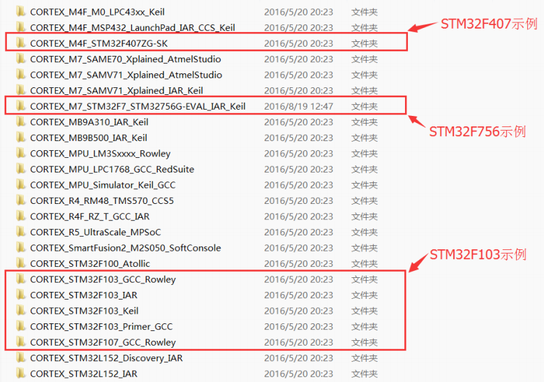

FreeRTOS 针对不同的 MCU 提供了非常多的 Demo，其中就有 ST 的 F1、F4 和 F7 的相关例程，这对于我们学习来说是非常友好的，我们在移植的时候就会参考这些例程。

**2）License 文件夹**里面就是相关的许可信息，要用 FreeRTOS 做产品的得仔细看看，尤其是要出 口的产品。

**3）Source 文件夹**里面就是 FreeRTOS 源码。

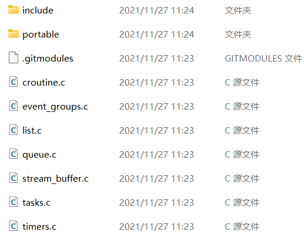

可以看出 FreeRTOS 真正的源码就这么几个 .c 文件，系统非常小，只有几 K。

重点来看一下其中的 portable 这个文件夹，FreeRTOS 是个系统，归根结底就是个纯软件的东西，它是怎么和硬件联系在一起的呢？软件到硬件中间必须有一个桥梁，**portable 文件夹里面的东西就是 FreeRTOS 系统和具体的硬件之间的连接桥梁！**不同的编译环境，不同的 MCU，其桥梁是不同的。

portable 文件夹

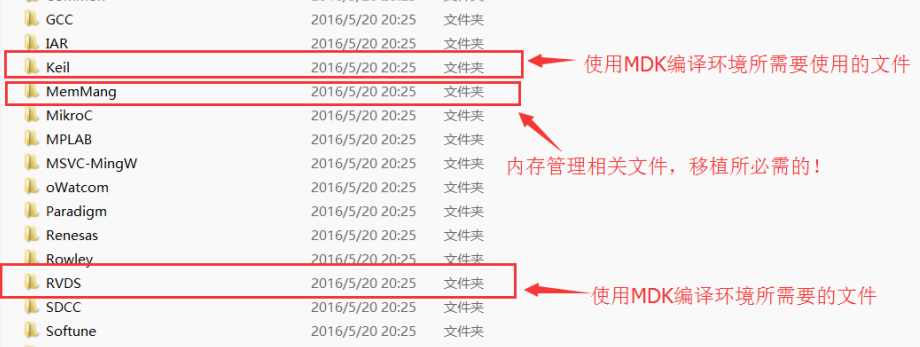

FreeRTOS 针对不同的编译环境和 MCU 都有不同的“桥梁”，以 MDK 编译环境下的 STM32F103 为例。MemMang 这个文件夹是跟内存管理相关的，我们移植的时候是**必须的**。

Keil 文件夹里面的东西肯定也是必须的，打开 Keil 文件夹以后里面只有一个文件：See-also-the-RVDS-directory.txt，意思就是参考 RVDS 文件夹里面的东西。

打开 RVDS 文件夹

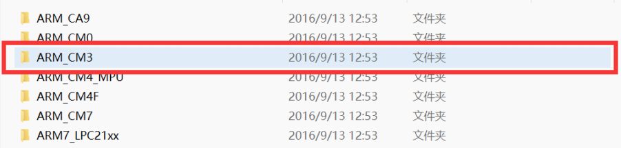

RVDS 文件夹针对不同的架构的 MCU 做了详细的分类，STM32F103 就参考 ARM_CM3，打开 ARM_CM3 文件夹：

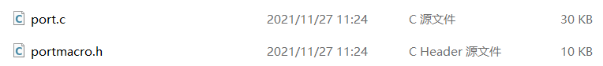

ARM_CM3 有两个文件，这两个文件就是我们移植的时候所需要的！

**2、FreeRTOS-Plus 文件夹**

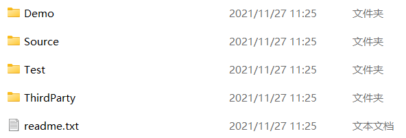

FreeRTOS-Plus 也有 Demo 和 Source，Demo 是一些例程。我们看一下 Source：

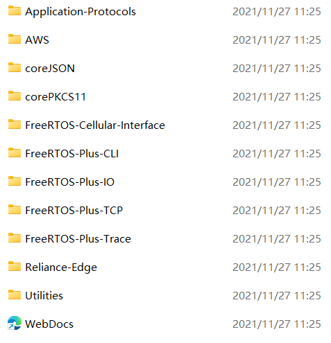

FreeRTOS-Plus 中的源码其实并不是 FreeRTOS 系统的源码，而是在 FreeRTOS 系统上另外增加的一些功能代码，比如 CLI、FAT、Trace 等等。就系统本身而言，和 FreeRTOS 里面的一模一样的，**所以我们如果只是学习 FreeRTOS 这个系统的话，FreeRTOS-Plus 就没必要看了。**


## FreeRTOS（三）移植到 STM32

> 博主手里有一个正点原子 STM32F103ZET6，行情最贵的时候买的，得好好利用。
>
> 手里还有一块韦东山 JZ2440，正点原子 imx6ull开发板，是 Linux 开发板。
>
> 后来工作遇到了安卓，想买安卓开发板，发现做安卓教程的比较少，或许是它真的太大太复杂。能跑安卓的板子比如：tiny4412，RK3399，香橙派。
>

玩了嵌入式 Linux 以后，发现单片机真简单；后来接触了安卓，觉得还是 Linux 简单。

嵌入式有三个方向：**单片机、嵌入式 Linux 、Android**，系统复杂性依次提高。

这里没有什么高低贵贱，适合什么就用什么。单片机便宜，裸机不行就上 RTOS ，也可以满足需求。

接下来就在 STM32F103 单片机上移植 FreeRTOS。

**移植 FreeRTOS**

【全文参考正点原子《STM32F1 FreeRTOS开发手册_V1.1.pdf》】这个手册讲的很详细。

以正点原子的跑马灯工程为基础，在上面扩展。在基础工程中新建一个名为 FreeRTOS 的文件夹:

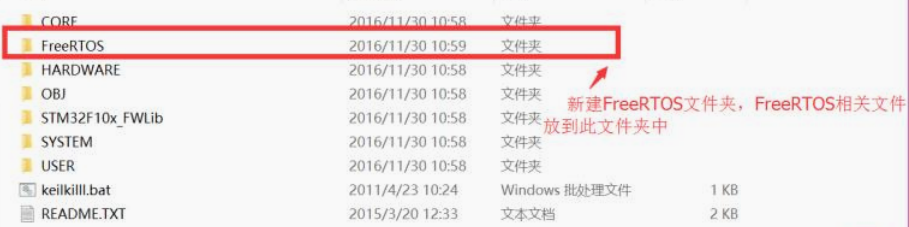

创建 FreeRTOS 文件夹以后就可以将 FreeRTOS 的源码添加到这个文件夹中，添加完以后 如图所示:

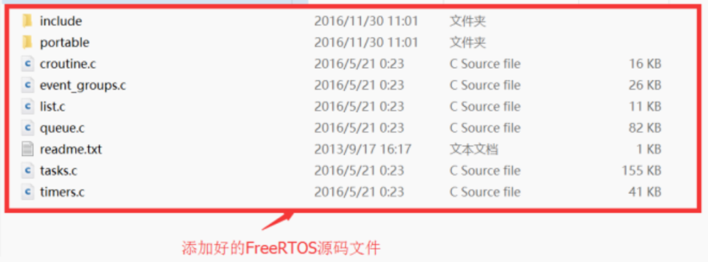

portable 文件夹，我们只需要留下 keil、MemMang 和 RVDS 这三个文件夹，其他的都可以删除掉:

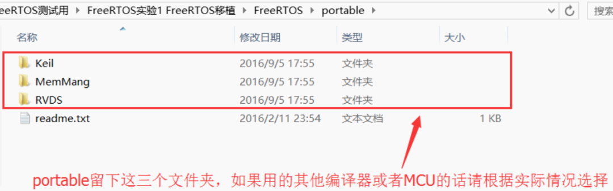

打开基础工程，新建分组 FreeRTOS_CORE 和 FreeRTOS_PORTABLE，然后向这两个分组 中添加文件

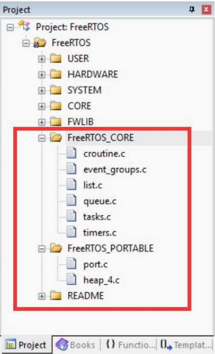

分组 `FreeRTOS_CORE` 中的文件就是 FreeRTOS 源码。`FreeRTOS_PORTABLE` 分组中的 `port.c` 和 `heap_4.c` ，`port.c` 是 RVDS 文件夹下的 ARM_CM3 中的文件，因为 STM32F103 是 Cortex-M3 内核的，因此要选择 ARM_CM3 中的 `port.c` 文件。`heap_4.c` 是 MemMang 文件夹中的，前面说了 MemMang 是跟内存管理相关的，里面有 5 个 c 文件：`heap_1.c、heap_2.c、heap_3.c、heap_4.c 和 heap_5.c`。这 5 个 c 文件是五种不同的内存管理方法。这 5 个文件都可以用来作为 FreeRTOS 的内存管理文件，只是它们的实现原理不同，各有利弊。这里我们选择 `heap_4.c`。

添加相应的头文件路径：

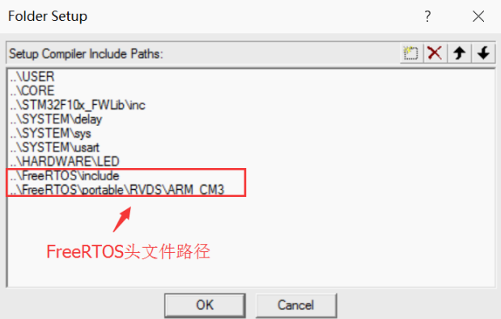

头文件路径添加完成以后编译一下，看看有没有什么错误，结果会发现提示打不开 “FreeRTOSConfig.h”这个文件

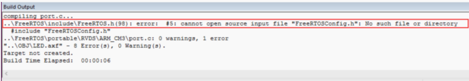

这是因为缺少 `FreeRTOSConfig.h` 文件，这个文件在哪里找呢？你可以自己创建，显然这不是一个明智的做法。我们可以找找 FreeRTOS 的官方移植工程中会不会有这个文件，打开 FreeRTOS 针对 STM32F103 的移植工程文件，文件夹是 `CORTEX_STM32F103_Keil`，打开以后官方的移植工程中有这个文件，我们可以使用这个文件，但是建议大家使用正点原子例程中的 FreeRTOSConf.h 文件，这个文件是 FreeRTOS 的系统配置文件，不同的平台其配置不同。

`FreeRTOSConfig.h` 是何方神圣？看名字就知道，他是 FreeRTOS 的配置文件，一般的操作系统都有裁剪、配置功能，而这些裁剪及配置都是通过一个文件来完成的，基本都是通过宏定义来完成对系统的配置和裁剪的。

到这里我们再编译一次，没有错误！如果还有错误的话大家自行根据错误类型查找和修改错误！


## FreeRTOS（四）：命名规则

FreeRTOS 的源码，其命名规则和 Linux 很不一样，区别如下。

在 Windows 程序和单片机程序中，习惯以如下方式命名宏、变量和函数：

```c
#define PI 3.1415926 /* 用大写字母代表宏 */ 

int minValue, maxValue; /* 变量：第一个单词全小写，其后单词的第一个字母大写 */ 

void SendData(void); /* 函数：所有单词第一个字母都大写 */
```

Linux 中以这样命名，用下划线分割：

```c
#define PI 3.1415926 

int min_value, max_value; 

void send_data(void);
```

但是 FreeRTOS 就很不一样的，一开始感觉很别扭的感觉。

### 1．FreeRTOS 编码标准

FreeRTOS的核心源代码遵从 MISRA 编码标准指南。MISRA-C全称 `Motor Industry Software Reliability Association` (汽车工业软件可靠性协会)

FreeRTOS 源代码也有一些是不符合 MISRA 标准的，大家可以去了解一下。

### 2. 命名规则

RTOS内核和演示例程源代码使用以下规则：

#### > 变量

uint32_t：前缀 ul，u 表示 unsigned，l 表示 long

uint16_t：前缀 us，s 表示 short

uint8_t：前缀 uc，c 表示 char

非 stdint 类型的变量使用前缀 x，比如基本的 Type_t 和 TickType_t 类型

非 stdint 类型的无符号变量使用前缀 ux，比如 UbaseType_t（unsigned BaseType_t）

size_t 类型的变量使用前缀 x

枚举类型变量使用前缀 e

指针类型变量在类型基础上附加前缀 p，比如指向 uint16_t 的指针变量前缀为 pus

char 类型变量前缀为 c

char * 类型变量前缀为 pc

举例：

```
size_t xQueueSizeInBytes;
uint8_t * pucQueueStorage;
```

#### > 函数

在文件作用域范围的函数前缀为 prv（一般定义是 static）

API 函数的前缀为它们的返回类型，当返回为空时，前缀为 v

返回值类型 + 所在文件 + 功能名称。比如：

vTaskDelete() 该函数返回值为 void 型，定义在 tasks.c，作用是 delete。

vTaskPrioritySet()函数的返回值为 void 型，定义在 tasks.c，函数作用是PrioritySet 设置优先级。

xQueueReceive()函数的返回值为 portBASE_TYPE 型，在 queue.c 这个文件中定义，函数作用是 receive 接收。

vSemaphoreCreateBinary()函数的返回值为 void 型，在 Semaphore.h 这个文件中定义，函数作用是 CreateBinary。

#### > 宏

宏的名字起始部分为该宏定义所在的文件名的一部分。比如：

`configUSE_PREEMPTION` 表示定义在 FreeRTOSConfig.h 文件中，作用是 USE_PREEMPTION。

`configKERNEL_INTERRUPT_PRIORITY`，表示定义在 config 文件中，作用是 KERNEL_INTERRUPT_PRIORITY 内核中断优先级的设置。

除了前缀，宏剩下的字母全部为大写，两个单词间用下划线（’_’）隔开。

### 3 数据类型

FreeRTOS 使用的数据类型主要分为 stdint.h 文件中定义的和自己定义的。其中 char 和 char * 定义的变量要特别注意。

FreeRTOS 主要自定义了以下四种数据类型：

#### TickType_t

如果用户使能了宏定义 `configUSE_16_BIT_TICKS`，那么 TickType_t 定义的就是 16 位无符号数，如果没有使能，那么 TickType_t 定义的就是 32 位无符号数。**对于 32 位架构的处理器，一定要禁止此宏定义，即设置此宏定义数值为 0 即可。**

#### BaseType_t

这个数据类型根据系统架构的位数而定，对于 32 位架构，BaseType_t 定义的是 32 位有符号数，对于 16 位架构，BaseType_t 定义的是 16 位有符号数。如果 BaseType_t 被定义成了 char 型，要特别注意将其设置为有符号数，因为部分函数的返回值是用负数来表示错误类型。

#### UBaseType_t

这个数据类型是 BaseType_t 类型的有符号版本。

#### StackType_t

栈变量数据类型定义，这个数量类型由系统架构决定，对于 16 位系统架构，StackType_t 定义的是16 位变量，对于 32 位系统架构，StackType_t 定义的是 32 位变量。

### 4.风格指南

缩进：缩进使用制表符，一个制表符等于 4 个空格。

注释：注释单行不超过 80 列，特殊情况除外。不使用 C++ 风格的双斜线（//）注释

布局：FreeRTOS的源代码被设计成尽可能的易于查看和阅读。


## FreeRTOS（五）：中断配置和临界段

FreeRTOS 的中断配置是一个很重要的内容，需要**根据所使用的 MCU 来具体配置**。这需要 了解 MCU 架构中有关中断的知识，本文结合 Cortex-M 的 NVIC 来讲解 STM32 平台下的 FreeRTOS 中断配置，分为如下几部分：

1、Cortex-M 中断

2、FreeRTOS 中断配置宏

3、FreeRTOS 开关中断

4、临界段代码

5、FreeRTOS 中断测试实验

### 1、Cortex-M 中断

Cortex-M 内核（STM32）的 MCU 提供了一个==用于中断管理的嵌套向量中断控制器(NVIC)==。**Cotex-M3 的 NVIC 最多支持 240 个 IRQ(中断请求)、1 个不可屏蔽中断(NMI)、1 个 Systick(滴答定时器)定时器中断和多个系统异常。**

**Cortex-M 处理器有多个用于管理中断和异常的可编程寄存器，这些寄存器大多数都在 NVIC 和系统控制块(SCB)中，CMSIS 将这些寄存器定义为结构体。**以 STM32F103 为例，打开 core_cm3.h，有两个结构体，NVIC_Type 和 SCB_Type，就存储了这些信息。

**优先级分组定义**

当多个中断来临的时候处理器应该响应哪一个中断是由中断的优先级来决定的，==高优先级的中断(优先级编号小)==肯定是首先得到响应，而且**高优先级的中断可以抢占低优先级的中断，这个就是中断嵌套。**

Cortex-M 处理器的**有些中断是具有固定的优先级的，比如复位、NMI、HardFault，这些中断的优先级都是负数，优先级也是最高的。**

Cortex-M 处理器有==三个固定优先级和 256 个可编程的优先级==，最多有 128 个抢占等级，但是**实际的优先级数量是由芯片厂商来决定的**。但是，绝大多数的芯片都会精简设计的，以致实际上支持的优先级数会更少，如 8 级、16 级、32 级等，比如 **STM32 就只有 16 级优先级**。

### 2、FreeRTOS 中断配置宏

1、configPRIO_BITS：设置 MCU 使用几位优先级，STM32 使用的是 4 位，因此此宏为 4

2、configLIBRARY_LOWEST_INTERRUPT_PRIORITY ：设置最低优先级。

3、configKERNEL_INTERRUPT_PRIORITY：此宏用来设置内核中断优先级。

4、configLIBRARY_MAX_SYSCALL_INTERRUPT_PRIORITY：来设置 FreeRTOS 系统可管理的最大优先级，是高于 x 的优先级不归 FreeRTOS 管理！

5、configMAX_SYSCALL_INTERRUPT_PRIORITY：低于此优先级的中断可以安全的调用 FreeRTOS 的 API 函数，高于此优先级的中断 FreeRTOS 是不能禁止的，中断服务函数也不能调用 FreeRTOS 的 API 函数！

### 3、FreeRTOS 开关中断

FreeRTOS 开关中断函数为 `portENABLE_INTERRUPTS ()`和 `portDISABLE_INTERRUPTS()`，这两个函数其实是宏定义，在 portmacro.h 中有定义，如下：

```
#define portDISABLE_INTERRUPTS()    vPortRaiseBASEPRI()
#define portENABLE_INTERRUPTS()    vPortSetBASEPRI(0)
```

可以看出开关中断实际上是通过函数 `vPortSetBASEPRI(0)`和 `vPortRaiseBASEPRI()`来实现的。

函数 `vPortSetBASEPRI()`是向寄存器 BASEPRI 写入一个值，此值作为参数 ulBASEPRI 传 递进来，`portENABLE_INTERRUPTS()`是开中断，它传递了个 0 给 `vPortSetBASEPRI()`，根据我们前面讲解 BASEPRI 寄存器可知，结果就是开中断。

函 数 `vPortRaiseBASEPRI()` 是 向 寄 存 器 BASEPRI 写 入 宏`configMAX_SYSCALL_INTERRUPT_PRIORITY` ， 那 么 优 先 级 低 于`configMAX_SYSCALL_INTERRUPT_PRIORITY` 的中断就会被屏蔽！

### 4、临界段代码

**临界段代码也叫做临界区，是指那些必须完整运行，不能被打断的代码段**，比如有的外设的初始化需要严格的时序，初始化过程中不能被打断。==FreeRTOS 在进入临界段代码的时候需要关闭中断，当处理完临界段代码以后再打开中断。==FreeRTOS 系统本身就有很多的临界段代码，这些代码都加了临界段代码保护，我们在写自己的用户程序的时候有些地方也需要添加临界段代码保护。

FreeRTOS 与 临 界 段 代 码 保 护 有 关 的 函 数 有 4 个 ：`taskENTER_CRITICAL() 、taskEXIT_CRITICAL() 、 taskENTER_CRITICAL_FROM_ISR() 和taskEXIT_CRITICAL_FROM_ISR()`，这四个函数其实是宏定义，在 task.h 文件中有定义。这四个函数的区别是前两个是任务级的临界段代码保护，后两个是中断级的临界段代码保护。

任务级临界代码保护使用方法如下：

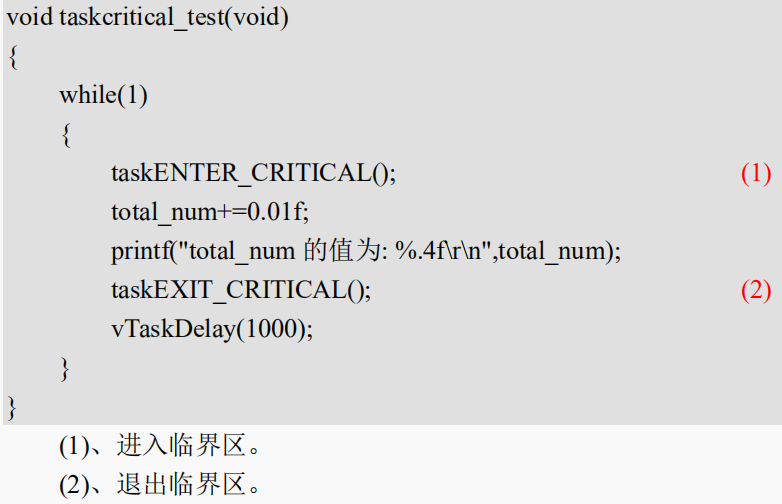

中断级临界代码保护使用方法如下：

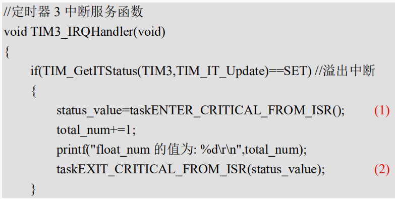

### 5、FreeRTOS 中断测试实验

设定：FreeRTOS 中优先级低于 `configMAX_SYSCALL_INTERRUPT_PRIORITY`的中断会被屏蔽掉，高于的就不会，那么我们就写个简单的例程测试一下。

使用两个定时器，一个优先级为 4，一个优先级为 5，两个定时器每隔 1s 通过串口输出一串字符串。然后在某个任务中关闭中断一段时间，查看两个定时器的输出情况。

main.c

```c
#include "sys.h"
#include "delay.h"
#include "usart.h"
#include "led.h"
#include "timer.h"
#include "FreeRTOS.h"
#include "task.h"

#define START_TASK_PRIO   1
#define START_STK_SIZE    256  
TaskHandle_t StartTask_Handler;
void start_task(void *pvParameters);

#define INTERRUPT_TASK_PRIO  2
#define INTERRUPT_STK_SIZE   256  
TaskHandle_t INTERRUPTTask_Handler;
void interrupt_task(void *p_arg);

int main(void)
{
 NVIC_PriorityGroupConfig(NVIC_PriorityGroup_4); 
 delay_init();         
 uart_init(115200);     
 LED_Init();
 //起了两个定时器，不停的打印，除非中断被关闭
 TIM3_Int_Init(10000-1,7200-1);  
 TIM5_Int_Init(10000-1,7200-1);  
 
    xTaskCreate((TaskFunction_t )start_task,            
                (const char*    )"start_task",        
                (uint16_t       )START_STK_SIZE,       
                (void*          )NULL,                 
                (UBaseType_t    )START_TASK_PRIO,      
                (TaskHandle_t*  )&StartTask_Handler);              
    vTaskStartScheduler();    
}

void start_task(void *pvParameters)
{
    taskENTER_CRITICAL();         
 
    xTaskCreate((TaskFunction_t )interrupt_task,     
                (const char*    )"interrupt_task",    
                (uint16_t       )INTERRUPT_STK_SIZE, 
                (void*          )NULL,      
                (UBaseType_t    )INTERRUPT_TASK_PRIO,  
                (TaskHandle_t*  )&INTERRUPTTask_Handler); 
 vTaskDelete(StartTask_Handler); 
    taskEXIT_CRITICAL(); 
}

void interrupt_task(void *pvParameters)
{
 static u32 total_num=0;
    while(1)
    {
   printf("秒数",total_num);
   total_num+=1;
   if(total_num==5) 
   {
    printf("关闭中断.............\r\n");
    portDISABLE_INTERRUPTS();   
    delay_xms(5000);      
    printf("打开中断.............\r\n"); 
    portENABLE_INTERRUPTS();
   }
     LED0=~LED0;
     vTaskDelay(1000);
    }
} 
```

timer.c

```c
#include "timer.h"
#include "led.h"
#include "led.h"
#include "usart.h"

void TIM3_Int_Init(u16 arr,u16 psc)
{
    TIM_TimeBaseInitTypeDef  TIM_TimeBaseStructure;
 NVIC_InitTypeDef NVIC_InitStructure;

 RCC_APB1PeriphClockCmd(RCC_APB1Periph_TIM3, ENABLE); 
 
 TIM_TimeBaseStructure.TIM_Period = arr; 
 TIM_TimeBaseStructure.TIM_Prescaler =psc; 
 TIM_TimeBaseStructure.TIM_ClockDivision = TIM_CKD_DIV1; 
 TIM_TimeBaseStructure.TIM_CounterMode = TIM_CounterMode_Up;  
 TIM_TimeBaseInit(TIM3, &TIM_TimeBaseStructure); 
 
 TIM_ITConfig(TIM3,TIM_IT_Update,ENABLE ); 

 NVIC_InitStructure.NVIC_IRQChannel = TIM3_IRQn;  
 NVIC_InitStructure.NVIC_IRQChannelPreemptionPriority = 4;  
 NVIC_InitStructure.NVIC_IRQChannelSubPriority = 0; 
 NVIC_InitStructure.NVIC_IRQChannelCmd = ENABLE; 
 NVIC_Init(&NVIC_InitStructure);  

 TIM_Cmd(TIM3, ENABLE);      
}

void TIM5_Int_Init(u16 arr,u16 psc)
{
  TIM_TimeBaseInitTypeDef  TIM_TimeBaseStructure;
 NVIC_InitTypeDef NVIC_InitStructure;

 RCC_APB1PeriphClockCmd(RCC_APB1Periph_TIM5, ENABLE); 
 
 TIM_TimeBaseStructure.TIM_Period = arr;      
 TIM_TimeBaseStructure.TIM_Prescaler =psc;      
 TIM_TimeBaseStructure.TIM_ClockDivision = TIM_CKD_DIV1;  
 TIM_TimeBaseStructure.TIM_CounterMode = TIM_CounterMode_Up; 
 TIM_TimeBaseInit(TIM5, &TIM_TimeBaseStructure);    
 
 TIM_ITConfig(TIM5,TIM_IT_Update,ENABLE );      

 NVIC_InitStructure.NVIC_IRQChannel = TIM5_IRQn;     
 NVIC_InitStructure.NVIC_IRQChannelPreemptionPriority = 5;   
 NVIC_InitStructure.NVIC_IRQChannelSubPriority = 0;    
 NVIC_InitStructure.NVIC_IRQChannelCmd = ENABLE;   
 NVIC_Init(&NVIC_InitStructure);         

 TIM_Cmd(TIM5, ENABLE);            
}

void TIM3_IRQHandler(void)
{
 if(TIM_GetITStatus(TIM3,TIM_IT_Update)==SET) 
 {
  printf("TIM3输出.......\r\n");
 }
 TIM_ClearITPendingBit(TIM3,TIM_IT_Update);  
}

void TIM5_IRQHandler(void)
{
 if(TIM_GetITStatus(TIM5,TIM_IT_Update)==SET) 
 {
  printf("TIM5输出.......\r\n");
 }
 TIM_ClearITPendingBit(TIM5,TIM_IT_Update);  
}
```

另外还有一些延时函数和串口初始化，这个都是基础的文件，可以直接copy的，就不放出来了。

编译并下载代码到开发板中，打开串口调试助手查看数据输出：

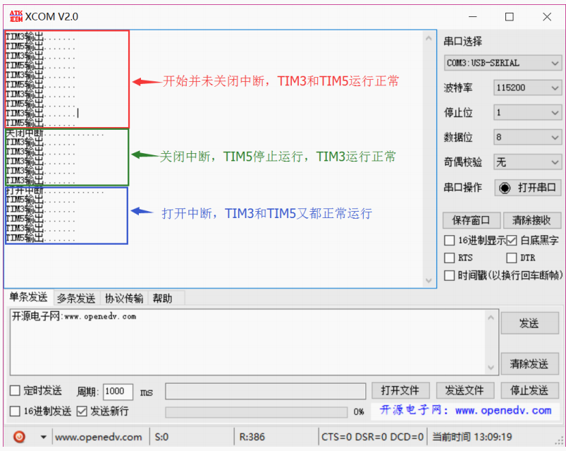

> 一开始没有关闭中断，所以 TIM3 和 TIM5 都正常运行，红框所示部分。当任务 interrupt_task()运行了 5 次以后就关闭了中断，此时由于 TIM5 的中断优先级为 5，等于 configMAX_SYSCALL_INTERRUPT_PRIORITY，因此 TIM5 被关闭。但是，TIM3 的中断优先级高于 configMAX_SYSCALL_INTERRUPT_PRIORITY，不会被关闭，所以 TIM3 正常运行，绿框所示部分。中断关闭 5S 以后就会调用函数 portENABLE_INTERRUPTS()重新打开中断，重新打开中断以后 TIM5 恢复运行，蓝框所示部分。
>


## **FreeRTOS（六）：任务**

RTOS 系统的核心就是任务管理，FreeRTOS 也不例外，而且大多数学习 RTOS 系统的工程师或者学生主要就是为了使用 RTOS 的多任务处理功能，初步上手 RTOS 系统首先必须掌握的也是任务的创建、删除、挂起和恢复等操作，由此可见任务管理的重要性。本文学习一下 FreeRTOS的任务基础知识，分为如下几部分：

1、什么是多任务系统

2、FreeRTOS 任务与协程

3、初次使用

3、任务状态

4、任务优先级

5、任务实现

6、任务控制块

7、任务堆栈

### 1、什么是多任务系统

回想一下我们以前在使用 51、AVR、STM32 单片机裸机(未使用系统)的时候一般都是在main 函数里面用 while(1)做一个大循环来完成所有的处理，即应用程序是一个无限的循环，循环中调用相应的函数完成所需的处理。有时候我们也需要中断中完成一些处理。相对于多任务系统而言，这个就是单任务系统，也称作前后台系统，中断服务函数作为前台程序，大循环while(1)作为后台程序，如图所示：

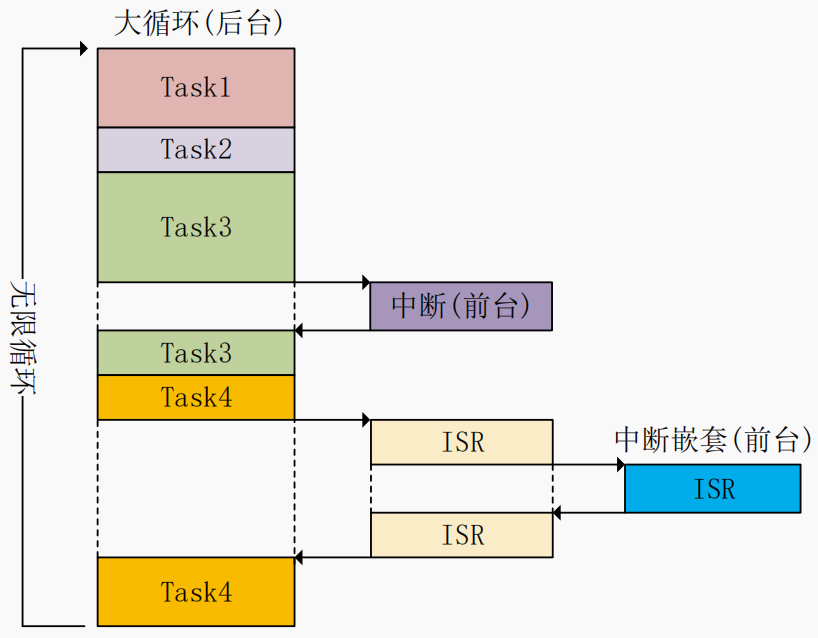

**前后台系统**

前后台系统的实时性差，前后台系统各个任务(应用程序)都是排队等着轮流执行，不管你这个程序现在有多紧急，没轮到你就只能等着！相当于所有任务(应用程序)的优先级都是一样的。但是前后台系统简单啊，资源消耗也少啊！在稍微大一点的嵌入式应用中前后台系统就明显力不从心了，此时就需要多任务系统出马了。

**多任务系统**

多任务系统会把一个大问题(应用)“分而治之”，把大问题划分成很多个小问题，逐步的把小问题解决掉，大问题也就随之解决了，这些小问题可以单独的作为一个小任务来处理，这些小任务是并发处理的。

> 注意，并不是说同一时刻一起执行很多个任务，而是由于每个任务执行的时间很短，导致看起来像是同一时刻执行了很多个任务一样。

多个任务带来了一个新的问题，究竟哪个任务先运行，哪个任务后运行呢？完成这个功能的东西在 RTOS 系统中叫做**任务调度器**。不同的系统其任务调度器的实现方法也不同，比如 **FreeRTOS 是一个抢占式的实时多任务系统，那么其任务调度器也是抢占式的**，运行过程如图所示：

高优先级的任务可以打断低优先级任务的运行而取得 CPU 的使用权，这样就保证了那些紧急任务的运行。这样我们就可以为那些对实时性要求高的任务设置一个很高的优先级，比如自动驾驶中的障碍物检测任务等。高优先级的任务执行完成以后重新把 CPU 的使用权归还给低优先级的任务，这个就是**抢占式多任务系统的基本原理**。

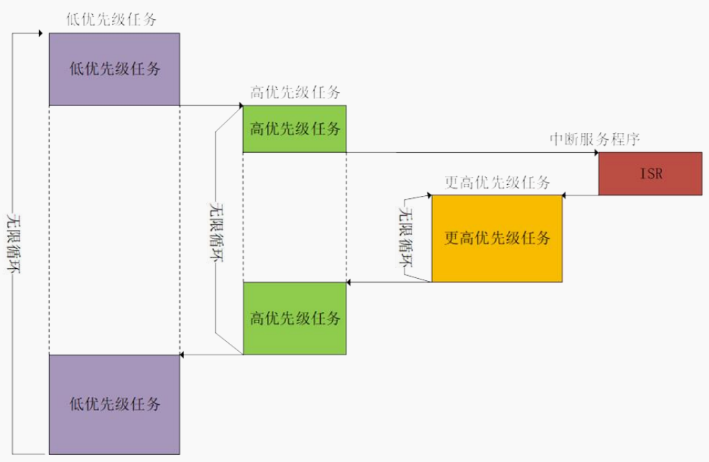

### 2、FreeRTOS 任务与协程

FreeRTOS 中应用既可以使用任务，也可以使用协程(Co-Routine)，或者两者混合使用。但是任务和协程使用不同的API函数，因此不能通过队列(或信号量)将数据从任务发送给协程，反之亦然。

协程是为那些资源很少的 MCU 准备的，其开销很小，但是 FreeRTOS 官方已经不打算再更新协程了。

**任务特性：**

1、简单。

2、没有使用限制。

3、支持抢占

4、支持优先级

5、**每个任务都拥有堆栈导致了 RAM 使用量增大。**

6、如果使用抢占的话的必须仔细的考虑重入的问题。

**协程(Co-routine)的特性**

协程是为那些资源很少的 MCU 而做的，但是随着 MCU 的飞速发展，性能越来越强大，现在协程几乎很少用到了！但是 FreeRTOS 目前还没有把协程移除的计划，但是 FreeRTOS 是绝对不会再更新和维护协程了，因此协程大家了解一下就行了。在概念上协程和任务是相似的，但是有如下根本上的不同：

1、堆栈使用：所有的协程使用同一个堆栈(如果是任务的话每个任务都有自己的堆栈)，这样就比使用任务消耗更少的 RAM。

2、调度器和优先级：协程使用合作式的调度器，但是可以在使用抢占式的调度器中使用协程。

3、宏实现：协程是通过宏定义来实现的。

4、使用限制：为了降低对 RAM 的消耗做了很多的限制。

### **3、任务状态**

FreeRTOS 中的任务永远处于下面几个状态中的某一个：

● 运行态

当一个任务正在运行时，那么就说这个任务处于运行态，处于运行态的任务就是当前正在使用处理器的任务。如果使用的是单核处理器的话那么不管在任何时刻永远都只有一个任务处于运行态。

● 就绪态

处于就绪态的任务是那些已经准备就绪(这些任务没有被阻塞或者挂起)，可以运行的任务，但是处于就绪态的任务还没有运行，因为有一个同优先级或者更高优先级的任务正在运行！

● 阻塞态

如果一个任务当前正在等待某个外部事件的话就说它处于阻塞态，比如说如果某个任务调用了函数 vTaskDelay()的话就会进入阻塞态，直到延时周期完成。==任务在等待队列、信号量、事件组、通知或互斥信号量的时候也会进入阻塞态。==任务进入阻塞态会有一个超时时间，当超过这个超时时间任务就会退出阻塞态，即使所等待的事件还没有来临！

● 挂起态

像阻塞态一样，任务进入挂起态以后也不能被调度器调用进入运行态，**但是进入挂起态的任务没有超时时间**。任务进入和退出挂起态通过调用函数 vTaskSuspend()和 xTaskResume()。任务状态之间的转换如图所示：

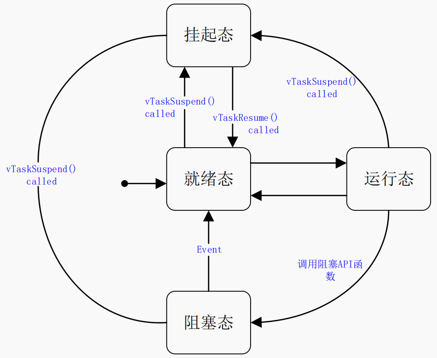

### 4、任务优先级

每 个 任 务 都 可 以 分 配 一 个 从 `0~(configMAX_PRIORITIES-1)` 的 优 先 级 ，configMAX_PRIORITIES 在文件 FreeRTOSConfig.h 中有定义，一般不超过 32。

==优先级数字越低表示任务的优先级越低，0 的优先级最低，configMAX_PRIORITIES-1 的优先级最高。==空闲任务的优先级最低，为 0。==（注意和中断的优先级区分，任务和中断不一样，中断一般是数字越小优先级越大）==

当宏 configUSE_TIME_SLICING 定义为 1 的时候多个任务可以共用一个优先级，数量不限。

### 5、任务实现

FreeRTOS 官方给出的任务函数模板如下：

```c
void vATaskFunction(void *pvParameters)
{
  for( ; ; )
  {
    --任务应用程序-- 
    vTaskDelay(); 
  }

  vTaskDelete(NULL); 
}
```

(1)、任务函数本质也是函数，所以肯定有任务名什么的，不过这里我们要注意：**任务函数 的返回类型一定要为 void 类型，也就是无返回值，而且任务的参数也是 void 指针类型的！**任务 函数名可以根据实际情况定义。

(2)、任务的具体执行过程是一个大循环，for(; ; )就代表一个循环，作用和 while(1)一样，博主习惯用 while(1)。

(3)、循环里面就是真正的任务代码了，此任务具体要干的活就在这里实现！

(4)、FreeRTOS 的延时函数，此处不一定要用延时函数，其他只要能让 FreeRTOS 发生任务 切换的 API 函数都可以，比如请求信号量、队列等，甚至直接调用任务调度器。只不过最常用 的就是 FreeRTOS 的延时函数。

(5)、**任务函数一般不允许跳出循环，如果一定要跳出循环的话在跳出循环以后一定要调用 函数 vTaskDelete(NULL)删除此任务！**

FreeRTOS 的任务函数和 UCOS 的任务函数模式基本相同的，不止 FreeRTOS，其他 RTOS 的任务函数基本也是这种方式的。

### 6、任务控制块

FreeRTOS 的每个任务都有一些属性需要存储，FreeRTOS 把这些属性集合到一起用一个结构体来表示，这个结构体叫做**任务控制块：TCB_t**，在使用函数 xTaskCreate()创建任务的时候就会自动的给每个任务分配一个任务控制块。

此结构体在文件 tasks.c 中有定义。类似于 Linux 的 task_struct 结构体，保存进程信息用的，每个进程有一个。

### 7、任务堆栈

FreeRTOS 之所以能正确的恢复一个任务的运行就是因为有**任务堆栈**在保驾护航，任务调度器在进行任务切换的时候会将当前任务的现场(CPU 寄存器值等)保存在此任务的任务堆栈中，等到此任务下次运行的时候就会先用堆栈中保存的值来恢复现场，恢复现场以后任务就会接着从上次中断的地方开始运行。

创建任务的时候需要给任务指定堆栈，如果使用的函数 xTaskCreate()创建任务(动态方法)的话那么任务堆栈就会由函数 xTaskCreate()自动创建。如果使用函数 xTaskCreateStatic()创建任务(静态方法)的话就需要程序员自行定义任务堆栈，然后堆栈首地址作为函数的参数 puxStackBuffer 传递给函数。


## FreeRTOS（七）：任务相关 API 函数

上一篇学习了 FreeRTOS 的任务基础知识，本文就正式学习如何使用 FreeRTOS 中有关任务的 API 函数。

先学习怎么用，先知其然，后面在知其所以然。使用过以后再学习原理、看源码就会轻松很多。这是一种很重要的学习方法。

### 1、任务创建和删除 API 函数

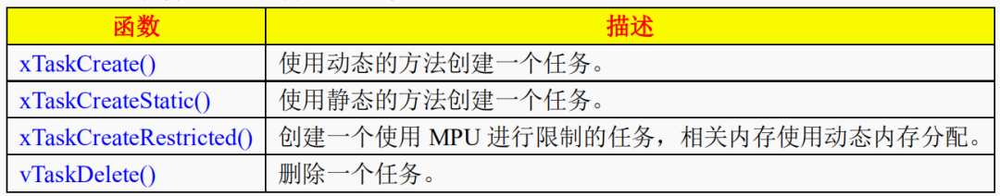

xTaxkCreate()：创建一个任务，任务需要 RAM 来保存与任务有关的状态信息(任务控制块)，任务也需要一定的 RAM 来作为任务堆栈。（**我们一般都用这种**）

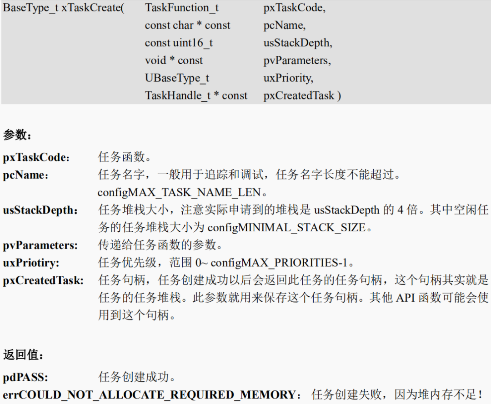

xTaskCreateStatic()：此函数和 xTaskCreate() 的功能相同，也是用来创建任务的，**但是使用此函数创建的任务所需 的 RAM 需 要 用 户 来 提 供 。**如 果 要 使 用 此 函 数 的 话 需 要 将 宏configSUPPORT_STATIC_ALLOCATION 定义为 1。

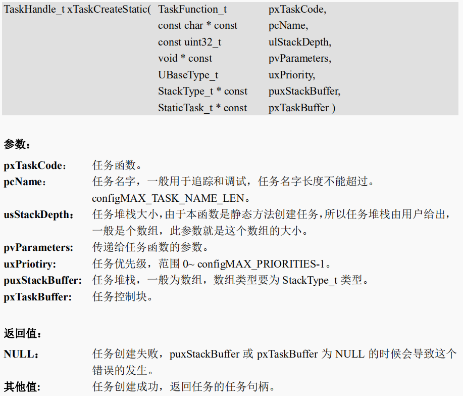

xTaskCreateRestricted()：此函数也是用来创建任务的，只不过此函数要求所使用的 MCU 有 MPU(内存保护单元)，用此函数创建的任务会受到 MPU 的保护。

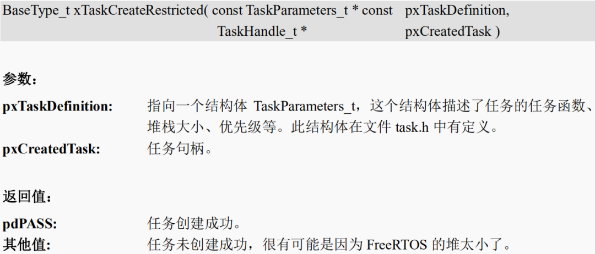

vTaskDelete()：删除一个用函数 xTaskCreate()或者 xTaskCreateStatic()创建的任务，被删除了的任务不再存在，也就是说再也不会进入运行态。任务被删除以后就不能再使用此任务的句柄！

如果此任务是使用动态方法创建的，也就是使用函数 xTaskCreate()创建的，那么在此任务被删除以后此任务之前申请的堆栈和控制块内存会在空闲任务中被释放掉，**因此当调用函数 vTaskDelete()删除任务以后必须给空闲任务一定的运行时间。**

**只有那些由内核分配给任务的内存才会在任务被删除以后自动的释放掉，用户分配给任务的内存需要用户自行释放掉，比如某个任务中用户调用函数 pvPortMalloc()分配了 500 字节的内存，那么在此任务被删除以后用户也必须调用函数 vPortFree()将这 500 字节的内存释放掉，否则会导致内存泄露。**此函数原型如下：

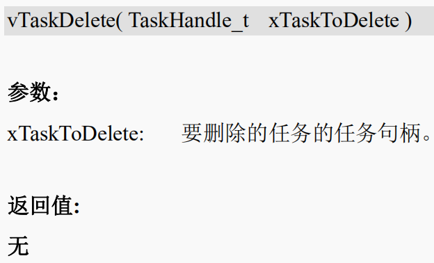

### 2、任务挂起和恢复 API 函数

有时候我们需要暂停某个任务的运行，过一段时间以后在重新运行。这个时候要是使用任务删除和重建的方法的话那么任务中变量保存的值肯定丢失了！

FreeRTOS 给我们提供了解决这种问题的方法，那就是任务挂起和恢复，当某个任务要停止运行一段时间的话就将这个任务挂起，当要重新运行这个任务的话就恢复这个任务的运行。FreeRTOS 的任务挂起和恢复 API 函数如表所示：

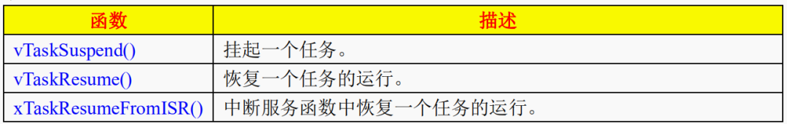

vTaskSuspend()：**此函数用于将某个任务设置为挂起态，进入挂起态的任务永远都不会进入运行态。退出挂起态的唯一方法就是调用任务恢复函数** vTaskResume()或 xTaskResumeFromISR()。

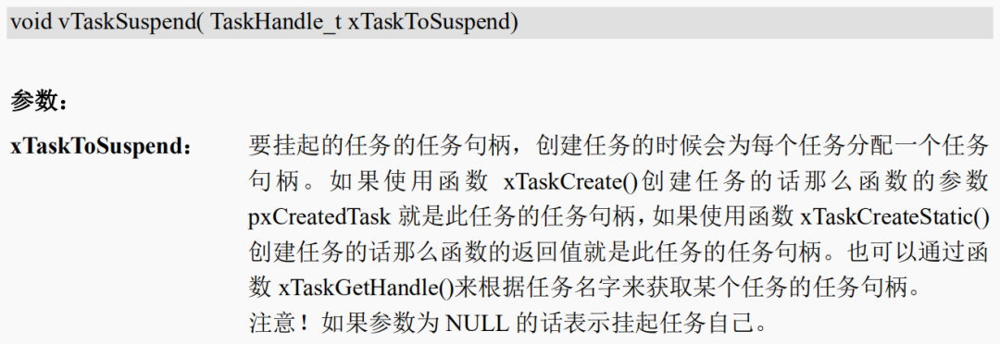

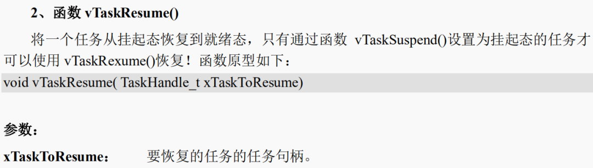

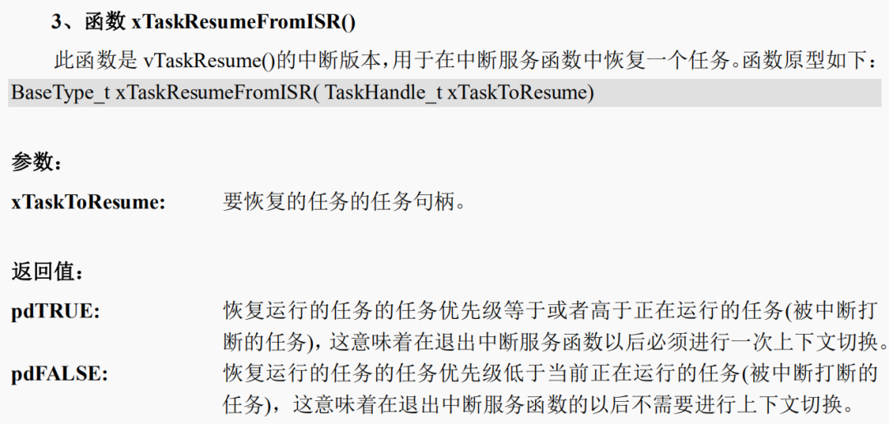

FreeRTOS 中任务相关的 API 当然不止有这几个，还有很多其他 API。但大部分情况下，我们要用的就只有这几个 API：创建、挂起、恢复、删除，就四个。


## FreeRTOS（八）：列表和列表项

要想看懂 FreeRTOS 源码并学习其原理，有一个东西绝对跑不了，那就是 FreeRTOS 的列表和列表项。**列表和列表项是 FreeRTOS 的一个数据结构，FreeRTOS 大量使用到了列表和列表项， 它是 FreeRTOS 的基石。**要想深入学习并理解 FreeRTOS，那么列表和列表项就必须首先掌握， 否则后面根本就没法进行。

列表 ---> 链表

### 1、列表

列表是 FreeRTOS 中的一个数据结构，概念上和【链表】有点类似，列表被用来跟踪 FreeRTOS 中的任务。与列表相关的全部东西都在文件 list.c 和 list.h 中。在 list.h 中定义了一个叫 List_t 的结构体，如下：

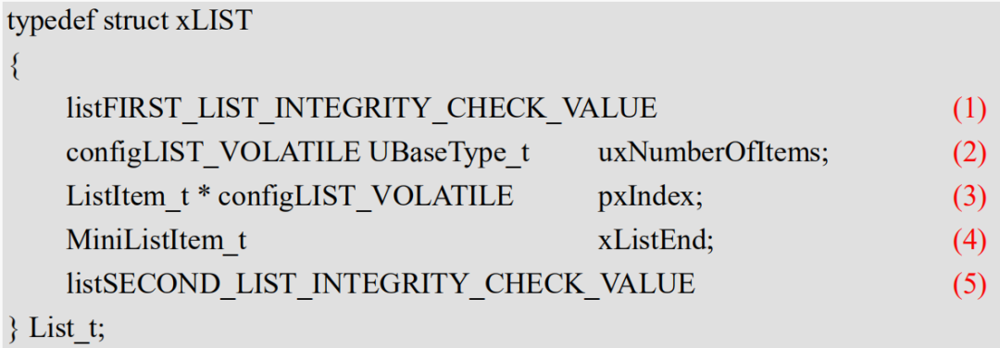

(1) 和 (5) 、 这 两 个 都 是 用 来 检 查 列 表 完 整 性 的 ， 需 要 将 宏 configUSE_LIST_DATA_INTEGRITY_CHECK_BYTES 设置为 1，开启以后会向这两个地方分别 添加一个变量 xListIntegrityValue1 和 xListIntegrityValue2，在初始化列表的时候会这两个变量中写入一个特殊的值，默认不开启这个功能。

(2)、uxNumberOfItems 用来记录列表中列表项的数量。

(3)、pxIndex 用来记录当前列表项索引号，用于遍历列表。

(4)、列表中最后一个列表项，用来表示列表结束，此变量类型为 MiniListItem_t，这是一个 迷你列表项。

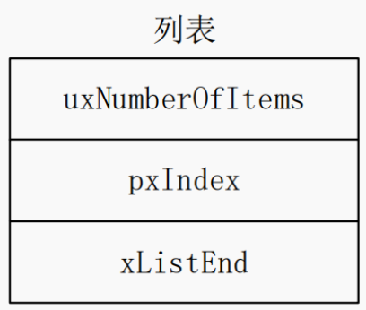

并未列出用于列表完整性检查的成员变量。

### 2、列表项

列表项就是存放在列表中的项目，FreeRTOS 提供了两种列表项：列表项和迷你列表项。这 两个都在文件 list.h 中有定义，先来看一下列表项，定义如下：

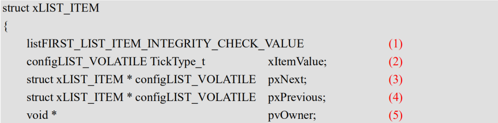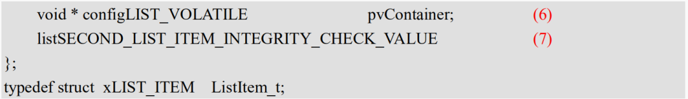

(1)和(7)、用法和列表一样，用来检查列表项完整性的。以后我们在学习列表项的时候不讨 论这个功能！

(2)、xItemValue 为列表项值。

(3)、pxNext 指向下一个列表项。

(4)、pxPrevious 指向前一个列表项，和 pxNext 配合起来实现类似双向链表的功能。

(5)、pvOwner 记录此链表项归谁拥有，通常是任务控制块。

(6)、pvContainer 用来记录此【列表项】归哪个【列表】。

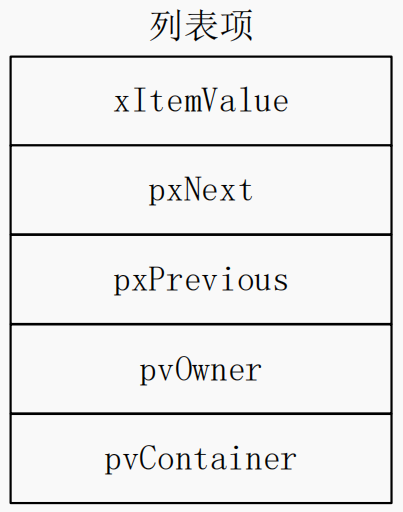

### 3、迷你列表项

迷你列表项在文件 list.h 中有定义。

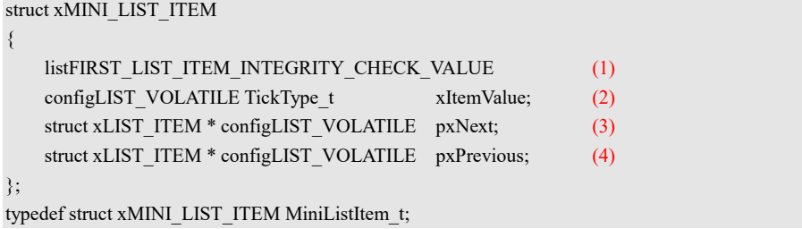

(1)、用于检查迷你列表项的完整性。

(2)、xItemValue 记录列表列表项值。

(3)、pxNext 指向下一个列表项。

(4)、pxPrevious 指向上一个列表项。

可以看出迷你列表项只是比列表项少了几个成员变量，迷你列表项有的成员变量列表项都有的，没感觉有什么本质区别啊？那为什么要弄个迷你列表项出来呢？

那是因为有些情况下我们不需要列表项这么全的功能，可能只需要其中的某几个成员变量，如果此时用列表项的话会造成内存浪费！比如上面列表结构体 List_t 中表示最后一个列表项的成员变量 xListEnd 就是MiniListItem_t 类型的。

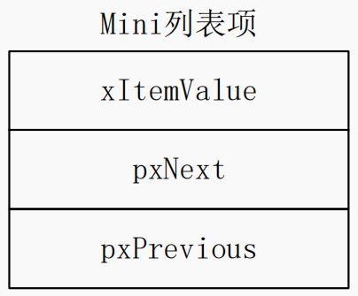

### 4、列表初始化

新创建或者定义的列表需要对其做初始化处理，列表的初始化其实就是初始化列表结构体List_t 中的各个成员变量，列表的初始化通过使函数 vListInitialise() 来完成，此函数在 list.c 中有定义。

### 5、列表项初始化

同列表一样，列表项在使用的时候也需要初始化，列表项初始化由函数 vListInitialiseItem() 来完成。

### 6、列表项插入

列表项的插入操作通过函数 vListInsert() 来完成，列表项是按照**升序**的方式插入的。

插入过程和数据结构中双向链表的插入类似，像 FreeRTOS 这种 RTOS 系统和一些协议栈都会大量用到数据结构的知识，所以建议大家没事的时候多看看数据结构方面的书籍，否则的话看源码会很吃力的。

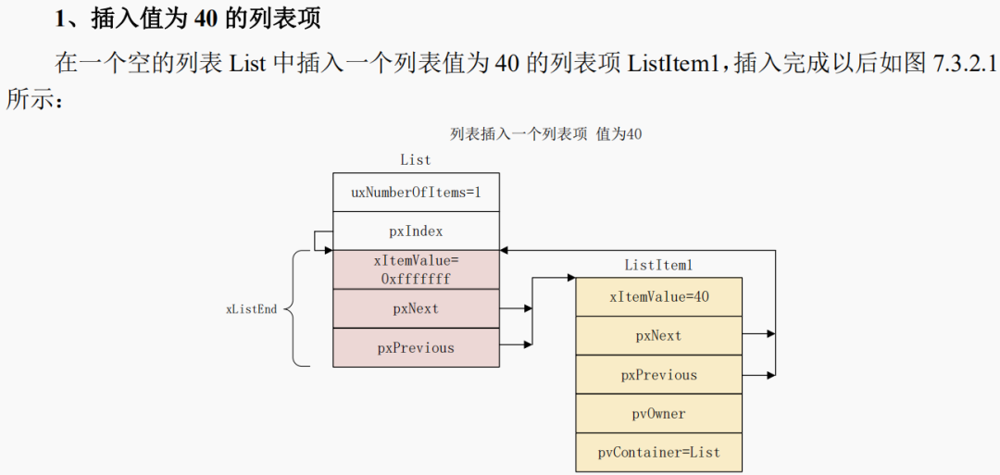

注意观察插入完成以后列表 List 和列表项 ListItem1 中各个成员变量之间的变化，比如列 表 List 中的 uxNumberOfItems 变为了 1，表示现在列表中有一个列表项。列表项 ListItem1 中的pvContainer 变成了 List，表示此列表项属于列表 List。通过图 7.3.2.1 可以看出，列表是一个环形的，即环形列表！


上面再讲解函数 vListInsert()的时候说过了列表项是按照升序的方式插入的，所以 ListItem2 肯定是插入到 ListItem1 的后面、xListEnd 的前面。同样的，列表 List 的 uxNumberOfItems 再次加一变为 2 了，说明此时列表中有两个列表项。


按照升序排列的方式，ListItem3 应该放到 ListItem1 和 ListItem2 中间，大家最好通过对照这三幅图片来阅读函数 vListInsert()的源码，这样就会对函数有一个直观的认识。

### 7、列表项末尾插入

列表末尾插入列表项的操作通过函数 vListInsertEnd ()来完成。

### 8、列表项的删除

有列表项的插入，那么必然有列表项的删除，列表项的删除通过函数 uxListRemove()来完成。----> 将要删除的列表项的前后两个列表项“连接”在一起。

### 9、列表的遍历

介绍列表结构体的时候说过列表 List_t 中的成员变量 pxIndex 是用来遍历列表的，FreeRTOS提供了一个函数来完成列表的遍历，这个函数是 listGET_OWNER_OF_NEXT_ENTRY()。每调用一次这个函数列表的 pxIndex 变量就会指向下一个列表项，并且返回这个列表项的 pxOwner变量值。这个函数本质上是一个宏，这个宏在文件 list.h 中定义。


## FreeRTOS（九）：软件定时器

定时器可以说是每个 MCU 都有的外设，有的 MCU 其定时器功能异常强大，比如提供 PWM、输入捕获等功能。但是最常用的还是定时器最基础的功能——定时，通过定时器来完成需要周期性处理的事务。

**MCU 自带的定时器属于硬件定时器**，不同的 MCU 其硬件定时器数量不同，因为要考虑成本的问题。**FreeRTOS 也提供了定时器功能，不过是软件定时器，软件定时器的精度肯定没有硬件定时器那么高**，但是对于普通的精度要求不高的周期性处理的任务来说够了。当 MCU 的硬件定时器不够的时候就可以考虑使用 FreeRTOS 的软件定时器。

### 软件定时器简介

软件定时器允许设置一段时间，当设置的时间到达之后就执行指定的功能函数，被定时器调用的这个功能函数叫做**定时器的回调函数**。**回调函数的两次执行间隔叫做定时器的定时周期**，简而言之，当定时器的定时周期到了以后就会执行回调函数。

软件定时器的回调函数是在定时器服务任务中执行的，所以一定不能在回调函数中调用任何会阻塞任务的 API 函数！比如，定时器回调函数中千万不能调用 vTaskDelay()、vTaskDelayUnti()，还有一些访问队列或者信号量的非零阻塞时间的 API 函数也不能调用。

### 定时器服务/Daemon 任务

定时器是一个可选的、不属于 FreeRTOS 内核的功能，它是由定时器服务(或 Daemon)任务来提供的。

FreeRTOS 提供了很多定时器有关的 API 函数，这些 API 函数大多都使用 FreeRTOS的队列发送命令给定时器服务任务。这个队列叫做定时器命令队列。定时器命令队列是提供给FreeRTOS 的软件定时器使用的，用户不能直接访问！

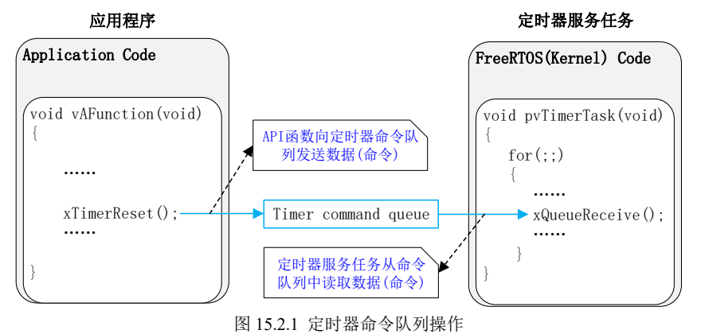

左侧部分属于用户应用程序的一部分，并且会在某个用户创建的用户任务中调用。图中右侧部分是定时器服务任务的任务函数，定时器命令队列将用户应用任务和定时器服务任务连接在一起。在这个例子中，应用程序调用了函数 xTimerReset()，结果就是复位命令会被发送到定时器命令队列中，定时器服务任务会处理这个命令。**应用程序是通过函数 xTimerReset()间接的向定时器命令队列发送了复位命令，并不是直接调用类似 xQueueSend()这样的队列操作函数发送的。**

### 定时器相关配置

配置在文件 FreeRTOSConfig.h 中。

1、configUSE_TIMERS

==如果要使用软件定时器的话宏 configUSE_TIMERS 一定要设置为 1==，当设置为 1 的话定时器服务任务就会在启动 FreeRTOS 调度器的时候自动创建。

2、configTIMER_TASK_PRIORITY

设置软件定时器服务任务的任务优先级，可以为 0~( configMAX_PRIORITIES-1)。优先级一定要根据实际的应用要求来设置。如果定时器服务任务的优先级设置的高的话，定时器命令队列中的命令和定时器回调函数就会及时的得到处理。

3、configTIMER_QUEUE_LENGTH

此宏用来设置定时器命令队列的队列长度。

4、configTIMER_TASK_STACK_DEPTH

此宏用来设置定时器服务任务的任务堆栈大小，单位为字，不是字节！，对于 STM32 来说一个字是 4 字节。由于定时器服务任务中会执行定时器的回调函数，因此任务堆栈的大小一定要根据定时器的回调函数来设置。

### 单次定时器和周期定时器

软件定时器分两种：单次定时器和周期定时器，单次定时器的话定时器回调函数就执行一次，比如定时 1s，当定时时间到了以后就会执行一次回调函数，然后定时器就会停止运行。对于单次定时器我们可以再次手动重新启动(调用相应的 API 函数即可)，但是单次定时器不能自动重启。相反的，周期定时器一旦启动以后就会在执行完回调函数以后自动的重新启动，这样回调函数就会周期性的执行。

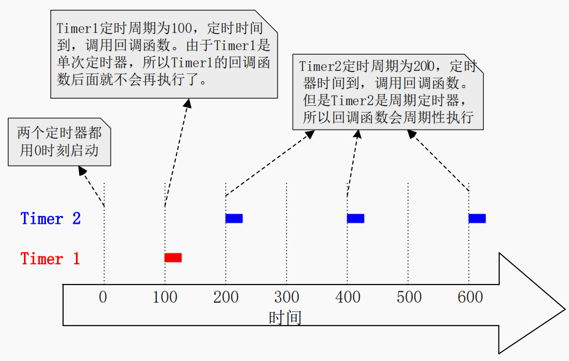

Timer1 为单次定时器，定时器周期为 100，Timer2 为周期定时器，定时器周期为 200。

### API

#### 1、复位软件定时器

有时候我们可能会在定时器正在运行的时候需要复位软件定时器，复位软件定时器的话会重新计算定时周期到达的时间点，这个新的时间点是相对于复位定时器的那个时刻计算的，并不是第一次启动软件定时器的那个时间点。下图演示了这个过程，Timer1 是单次定时器，定时周期是 5s：

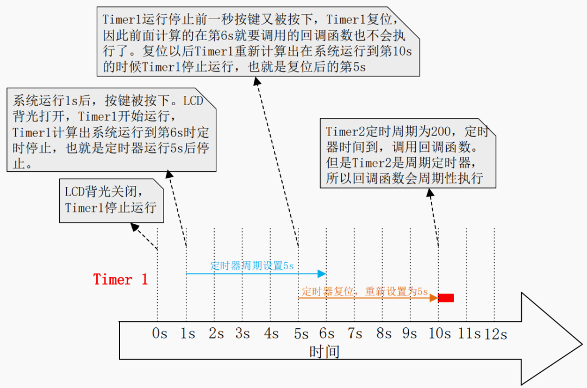

定时器复位过程，这是一个通过按键打开 LCD 背光的例子，我们假定当唤醒键被按下的时候应用程序打开 LCD 背光，当 LCD 背光点亮以后如果 5s 之内唤醒键没有再次按下就自动熄灭。如果在这 5s 之内唤醒键被按下了，LCD 背光就从按下的这个时刻起再亮 5s。

FreeRTOS 提供了两个 API 函数来完成软件定时器的复位：

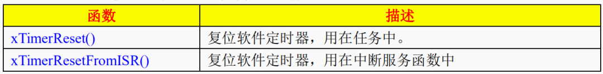

#### 2、创建软件定时器


#### 3、开启软件定时器

如果软件定时器停止运行的话可以使用 FreeRTOS 提供的两个开启函数来重新启动软件定时器。


#### 4、停止软件定时器


具体的函数使用大家可以在用到的时候搜索用法，看一遍其实也记不住的。


## FreeRTOS（十）：内核控制函数

FreeRTOS 中有一些函数只供系统内核使用，用户应用程序一般不允许使用，这些 API 函数就是系统内核控制函数。

FreeRTOS 官网可以找到这些函数，如图所示：

https://www.freertos.org/FreeRTOS-quick-start-guide.html

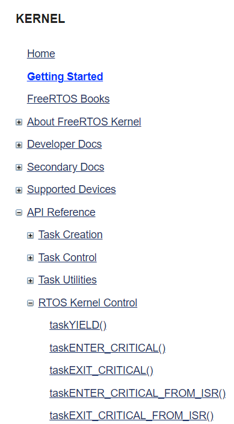

这些函数的含义如表所示：

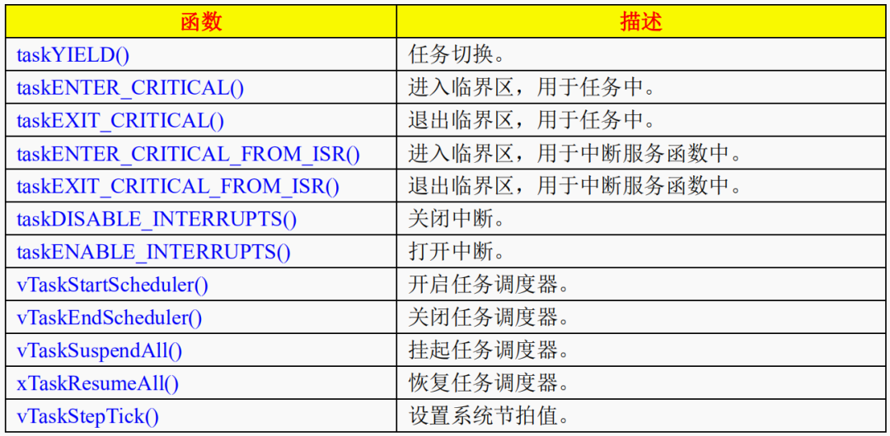

1、函数 taskYIELD()

此函数用于进行任务切换，此函数本质上是一个宏。

2、函数 taskENTER_CRITICAL()

进入临界区，用于任务函数中，本质上是一个宏。

3、函数 taskEXIT_CRITICAL()

退出临界区，用于任务函数中，本质上是一个宏。

4、函数 taskENTER_CRITICAL_FROM_ISR()

进入临界区，用于中断服务函数中，此函数本质上是一个宏。

5、函数 taskEXIT_CRITICAL_FROM_ISR()

退出临界区，用于中断服务函数中，此函数本质上是一个宏。

6、函数 taskDISABLE_INTERRUPTS()

关闭可屏蔽的中断，此函数本质上是一个宏。

7、函数 taskENABLE_INTERRUPTS()

打开可屏蔽的中断，此函数本质上是一个宏。

8、函数 vTaskStartScheduler()

启动任务调度器。

9、函数 vTaskEndScheduler()

关闭任务调度器。

此函数仅用于 X86 架构的处理器，调用此函数以后所有系统时钟就会停止运行，所有创建的任务都会自动的删除掉(FreeRTOS 对此函数的解释是会自动删除所有的任务，但是在 FreeRTOS 的源码中没有找到相关的处理过程，有可能要根据实际情况编写相关代码，亦或是 X86 的硬件会自动处理？笔者不了解 X86 架构)，多任务性能关闭。可以调用函数vTaskStartScheduler()来重新开启任务调度器。此函数在文件 tasks.c 中有如下定义：

```c
void vTaskEndScheduler( void )
{
    portDISABLE_INTERRUPTS(); 
    //关闭中断

    xSchedulerRunning = pdFALSE; 
    //标记任务调度器停止运行

    vPortEndScheduler(); 
    //调用硬件层关闭中断的处理函数
}
```

函数 vPortEndScheduler()在 port.c 中有定义，这个函数在移植 FreeRTOS 的时候要根据实际使用的处理器来编写，此处没有实现这个函数，只是简单的加了一行断言，函数如下：

```c
void vPortEndScheduler( void )
{
    configASSERT( uxCriticalNesting == 1000UL );
}
```

10、函数 vTaskSuspendAll()

挂起任务调度器，调用此函数不需要关闭可屏蔽中断即可挂起任务调度器，此函数在文件tasks.c 中定义。

11、函数 xTaskResumeAll()

此函数用于将任务调度器从挂起壮态恢复。

12、函数 vTaskStepTick()

此 函 数 在 使 用 FreeRTOS 的 低 功 耗 tickless 模 式 的 时 候 会 用 到 ， 即 宏 configUSE_TICKLESS_IDLE 为 1。当使能低功耗 tickless 模式以后在执行空闲任务的时候系统时钟节拍中断就会停止运行，系统时钟中断停止运行的这段时间必须得补上，这个工作就是由 函数 vTaskStepTick()来完成的，此函数在文件 tasks.c 中定义。


## FreeRTOS（十一）：其他任务 API 函数

学过了 FreeRTOS 的任务管理，但是真正涉及到的与任务相关的 API 函数只有那么几个：任务的创建、删除、挂起、恢复。

FreeRTOS 还有很多与任务相关的 API 函数，不过这些 API 函数大多都是辅助函数了，本文我们就来看一下这些与任务相关的其他的 API 函数。

这些函数不需要大家记住，只需要大家知道有这个功能可以使用，用到了再细查。**==知识框架的建立很重要==**，==很多时候不是需要你背出来，只需要你知道有这个东西，在设计的时候就不会有局限性。==

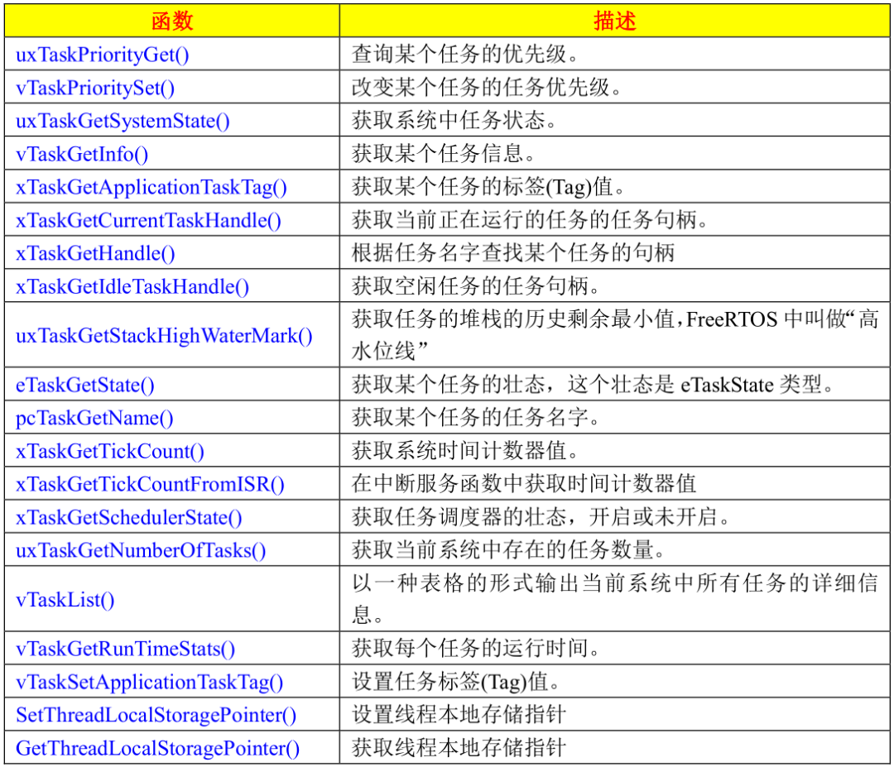

1、函数 uxTaskPriorityGet()

此函数用来获取指定任务的优先级，要使用此函数的话宏 INCLUDE_uxTaskPriorityGet 应 该定义为 1。

2、函数 vTaskPrioritySet()

此 函 数 用 于 改 变 某 一 个 任 务 的 任 务 优 先 级 ， 要 使 用 此 函 数 的 话 宏 INCLUDE_vTaskPrioritySet 应该定义为 1。

3、uxTaskGetSystemState()

此函数用于获取系统中所有任务的任务壮态，每个任务的壮态信息保存在一个 TaskStatus_t 类型的结构体里面，这个结构体里面包含了任务的任务句柄、任务名字、堆栈、优先级等信息， 要使用此函数的话宏 configUSE_TRACE_FACILITY 应该定义为 1。

4、函数 vTaskGetInfo()

此函数也是用来获取任务壮态的，但是是获取指定的单个任务的壮态的，任务的壮态信息 填充到参数 pxTaskStatus 中，这个参数也是 TaskStatus_t 类型的。要使用此函数的话宏 configUSE_TRACE_FACILITY 要定义为 1。

5、函数 xTaskGetApplicationTaskTag()

此函数用于获取任务的 Tag(标签)值，任务控制块中有个成员变量 pxTaskTag 来保存任务的 标签值。标签的功能由用户自行决定，此函数就是用来获取这个标签值的，FreeRTOS 系统内核 是不会使用到这个标签的。要使用此函数的话宏 configUSE_APPLICATION_TASK_TAG 必须为 1。

6、函数 xTaskGetCurrentTaskHandle()

此函数用于获取当前任务的任务句柄，其实获取到的就是任务控制块，在前面讲解任务创 建 函 数 的 时 候 说 过 任 务 句 柄 就 是 任 务 控制。如 果 要 使 用 此 函 数 的 话 宏INCLUDE_xTaskGetCurrentTaskHandle 应该为 1。

7、函数 xTaskGetHandle()

此函数根据任务名字获取任务的任务句柄，在使用函数 xTaskCreate()或 xTaskCreateStatic()创建任务的时候都会给任务分配一个任务名，函数 xTaskGetHandle()就是使用这个任务名字来 查询其对应的任务句柄的。要使用此函数的话宏 INCLUDE_xTaskGetHandle 应该设置为 1。

8、函数 xTaskGetIdleTaskHandle()

此 函 数 用 于 返 回 空 闲 任 务 的 任 务 句 柄 ， 要 使 用 此 函 数 的 话 宏 INCLUDE_xTaskGetIdleTaskHandle 必须为 1。

9、函数 uxTaskGetStackHighWaterMark()

每个任务都有自己的堆栈，堆栈的总大小在创建任务的时候就确定了，此函数用于检查任务从创建好到现在的历史剩余最小值，这个值越小说明任务堆栈溢出的可能性就越大！FreeRTOS 把这个历史剩余最小值叫做“高水位线”。此函数相对来说会多耗费一点时间，所以在代码调试阶段可以使用，产品发布的时候最好不要使用。要使用此函数的话宏INCLUDE_uxTaskGetStackHighWaterMark 必须为 1。

10、函数 eTaskGetState()

此函数用于查询某个任务的运行壮态，比如：运行态、阻塞态、挂起态、就绪态等，返回值是个枚举类型。要使用此函数的话宏 INCLUDE_eTaskGetState 必须为 1。

11、函数 pcTaskGetName()

根据某个任务的任务句柄来查询这个任务对应的任务名。

12、函数 xTaskGetTickCount()

此函数用于查询任务调度器从启动到现在时间计数器 xTickCount 的值。xTickCount 是系统 的时钟节拍值，并不是真实的时间值。每个滴答定时器中断 xTickCount 就会加 1，一秒钟滴答 定时器中断多少次取决于宏 configTICK_RATE_HZ。理论上 xTickCount 存在溢出的问题，但是 这个溢出对于 FreeRTOS 的内核没有影响，但是如果用户的应用程序有使用到的话就要考虑溢 出了。什么时候溢出取决于宏 configUSE_16_BIT_TICKS，当此宏为 1 的时候 xTixkCount 就是个 16 位的变量，当为 0 的时候就是个 32 位的变量。

13、函数 xTaskGetTickCountFromISR()

此函数是 xTaskGetTickCount()的中断级版本，用于在中断服务函数中获取时间计数器xTickCount 的值。

14、函数 xTaskGetSchedulerState()

此函数用于获取 FreeRTOS 的任务调度器运行情况：运行？关闭？还是挂起！要使用此函数的话宏 INCLUDE_xTaskGetSchedulerState 必须为 1。

15、函数 uxTaskGetNumberOfTasks()

此函数用于查询系统当前存在的任务数量。

16、函数 vTaskList()

此函数会创建一个表格来描述每个任务的详细信息。

17、函数 vTaskGetRunTimeStats()

FreeRTOS 可以通过相关的配置来统计任务的运行时间信息，任务的运行时间信息提供了每个任务获取到 CPU 使用权总的时间。函数 vTaskGetRunTimeStats()会将统计到的信息填充到一个表里面，表里面提供了每个任务的运行时间和其所占总时间的百分比。

18、函数 vTaskSetApplicationTaskTag()

此函数是为高级用户准备的，此函数用于设置某个任务的标签值 ，这个标签值的具体函数和用法由用户自行决定，FreeRTOS 内核不会使用这个标签值，如果要使用此函数的话宏configUSE_APPLICATION_TASK_TAG 必须为 1。

19、函数 SetThreadLocalStoragePointer()

此函数用于设置线程本地存储指针的值，每个任务都有它自己的指针数组来作为线程本地存储，使用这些线程本地存储可以用来在任务控制块中存储一些应用信息，这些信息只属于任务自己的。

20、函数 GetThreadLocalStoragePointer()

此函数用于获取线程本地存储指针的值， 如 果 要 使 用 此 函 数 的 话 宏configNUM_THREAD_LOCAL_STORAGE_POINTERS 不能为 0。


## FreeRTOS（十二）：消息队列

在实际的应用中，常常会遇到一个任务或者中断服务需要和另外一个任务进行“沟通交流”， 这个“沟通交流”的过程其实就是消息传递的过程。在没有操作系统的时候两个应用程序进行消息传递一般使用全局变量的方式，但是如果在使用操作系统的应用中用全局变量来传递消息就会涉及到“资源管理”的问题。**FreeRTOS 对此提供了一个叫做“队列”的机制来完成任务与任务、任务与中断之间的消息传递，由于队列用来传递消息的，所以也称为消息队列。**

#### 1、队列简介

队列是为了任务与任务、任务与中断之间的通信而准备的，可以在任务与任务、任务与中断之间传递消息，队列中可以存储**有限的、大小固定的**数据项目。任务与任务、任务与中断之间要交流的数据保存在队列中，叫做**队列项目**。队列所能保存的最大数据项目数量叫做**队列的长度**，创建队列的时候会指定数据项目的大小和队列的长度。

> 通常队列采用先进先出(FIFO)的存储缓冲机制，也就是往队列发送数据的时候(也叫入队)永远都是发送到队列的尾部，而从队列提取数据的时候(也叫出队)是从队列的头部提取的。但是也可以使用 LIFO 的存储缓冲，也就是后进先出，FreeRTOS 中的队列也提供了 LIFO 的存储缓冲机制。

数据发送到队列中会导致数据拷贝，也就是将要发送的数据拷贝到队列中，这就意味着在队列中存储的是数据的原始值，而不是原数据的引用(即只传递数据的指针)，这个也叫做**值传递**。UCOS 的消息队列采用的是**引用传递**，传递的是消息指针。采用引用传递的话消息内容就必须一直保持可见性，也就是消息内容必须有效，那么局部变量这种可能会随时被删掉的东西就不能用来传递消息，但是采用引用传递会节省时间啊！因为不用进行数据拷贝。

采用值传递的话虽然会导致数据拷贝，会浪费一点时间，但是一旦将消息发送到队列中原始的数据缓冲区就可以删除掉或者覆写，这样的话这些缓冲区就可以被重复的使用。==FreeRTOS中使用队列传递消息的话虽然使用的是数据拷贝，但是也可以使用引用来传递消息啊==，我直接往队列中发送指向这个消息的地址指针不就可以了！这样当我要发送的消息数据太大的时候就可以直接发送消息缓冲区的地址指针，比如在网络应用环境中，网络的数据量往往都很大的，采用数据拷贝的话就不现实。

**1、多任务访问**

**队列不是属于某个特别指定的任务的，任何任务都可以向队列中发送消息，或者从队列中提取消息。**

**2、出队阻塞**

当任务尝试从一个队列中读取消息的时候可以指定一个阻塞时间，这个阻塞时间就是当任务从队列中读取消息无效的时候任务阻塞的时间。出队就是就从队列中读取消息，出队阻塞是针对从队列中读取消息的任务而言的。

比如任务 A 用于处理串口接收到的数据，串口接收到数据以后就会放到队列 Q 中，任务 A 从队列 Q 中读取数据。但是如果此时队列 Q 是空的，说明还没有数据，任务 A 这时候来读取的话肯定是获取不到任何东西，那该怎么办呢？

> 任务 A 现在有三种选择，一：二话不说扭头就走，二：要不我在等等吧，等一会看看，说不定一会就有数据了，三：死等，死也要等到你有数据！选哪一个就是由这个阻塞时间决定的，这个阻塞时间单位是时钟节拍数。阻塞时间为 0 的话就是不阻塞，没有数据的话就马上返回任务继续执行接下来的代码，对应第一种选择。如果阻塞时间为 0~ portMAX_DELAY，当任务没有从队列中获取到消息的话就进入阻塞态，阻塞时间指定了任务进入阻塞态的时间，当阻塞时间到了以后还没有接收到数据的话就退出阻塞态，返回任务接着运行下面的代码，如果在阻塞时间内接收到了数据就立即返回，执行任务中下面的代码，这种情况对应第二种选择。当阻塞时间设置为portMAX_DELAY 的话，任务就会一直进入阻塞态等待，直到接收到数据为止！这个就是第三种选择。

**3、入队阻塞**

入队说的是向队列中发送消息，将消息加入到队列中。和出队阻塞一样，当一个任务向队列发送消息的话也可以设置阻塞时间。比如任务 B 向消息队列 Q 发送消息，但是此时队列 Q 是满的，那肯定是发送失败的。此时任务 B 就会遇到和上面任务 A 一样的问题，这两种情况的处理过程是类似的，只不过一个是向队列 Q 发送消息，一个是从队列 Q 读取消息而已。

**4、队列操作过程图示**

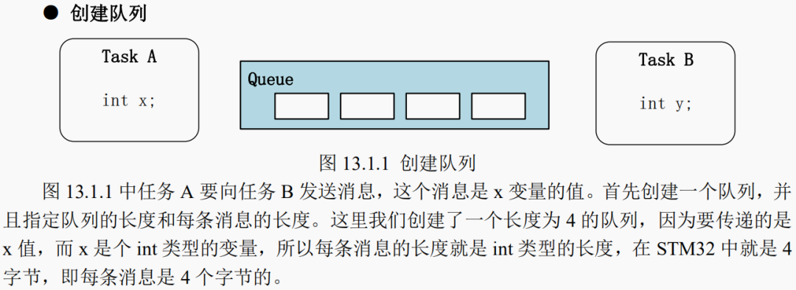

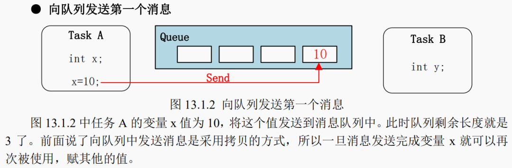

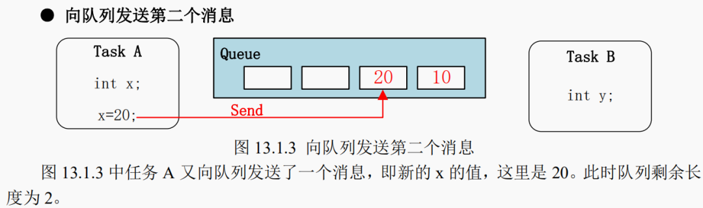

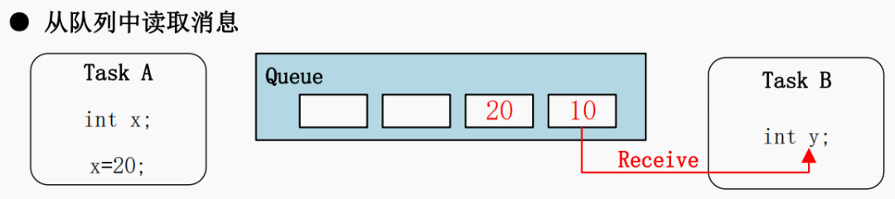


#### 2、队列结构体

有一个结构体用于描述队列，叫做 Queue_t，这个结构体在文件 queue.c 中定义。

#### 3、队列创建

在使用队列之前必须先创建队列，有两种创建队列的方法，一种是静态的，使用函数xQueueCreateStatic()；另一个是动态的，使用函数 xQueueCreate()。这两个函数本质上都是宏，真正完成队列创建的函数是 xQueueGenericCreate()和 xQueueGenericCreateStatic()，这两个函数在文件 queue.c 中定义。

函数 prvInitialiseNewQueue() 用于队列的初始化，此函数在文件 queue.c 中定义。

函数 prvInitialiseNewQueue()中调用了函数 xQueueGenericReset()来复位队列。

比如我们创建一个有 4 个队列项，每个队列项长度为 32 个字节的队列 TestQueue，创建成功的队列如图所示：

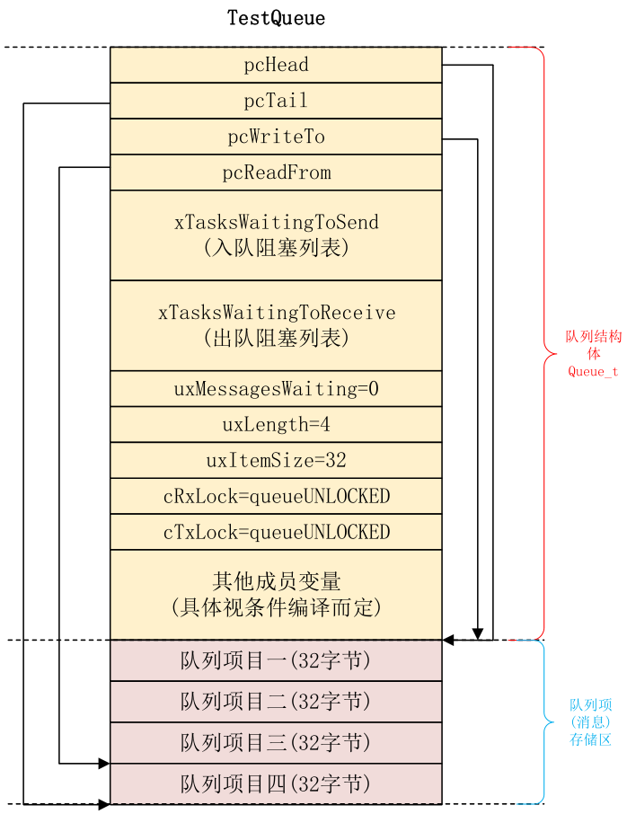

在创建的时候需要指定此队列的用途，也就是队列类型，一共有六种类型：

queueQUEUE_TYPE_BASE 普通的消息队列

queueQUEUE_TYPE_SET 队列集

queueQUEUE_TYPE_MUTEX 互斥信号量

queueQUEUE_TYPE_COUNTING_SEMAPHORE 计数型信号量

queueQUEUE_TYPE_BINARY_SEMAPHORE 二值信号量

queueQUEUE_TYPE_RECURSIVE_MUTEX 递归互斥信号量

#### 4、向队列发送消息

FreeRTOS 提供了 8 个向队列发送消息的 API 函数：

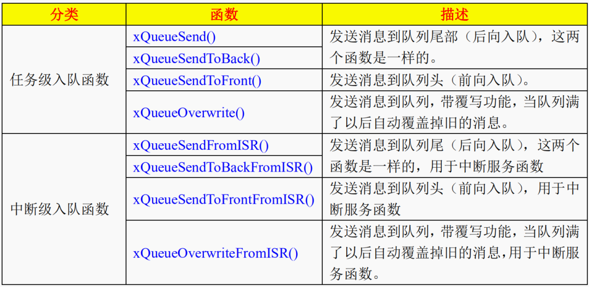

#### 5、队列上锁和解锁

队列的上锁和解锁是两个 API 函数：prvLockQueue()和 prvUnlockQueue()。

#### 6、从队列读取消息

有入队就有出队，出队就是从队列中获取队列项(消息)，FreeRTOS 中出队函数如表示：

具体的函数用法大家可以在用到的时候百度，这里就不详细介绍了，大家知道有这些东西就行。

其中最重要的是任务级和中断级不一样，在中断处理函数中是由一套自己的 API 用的。

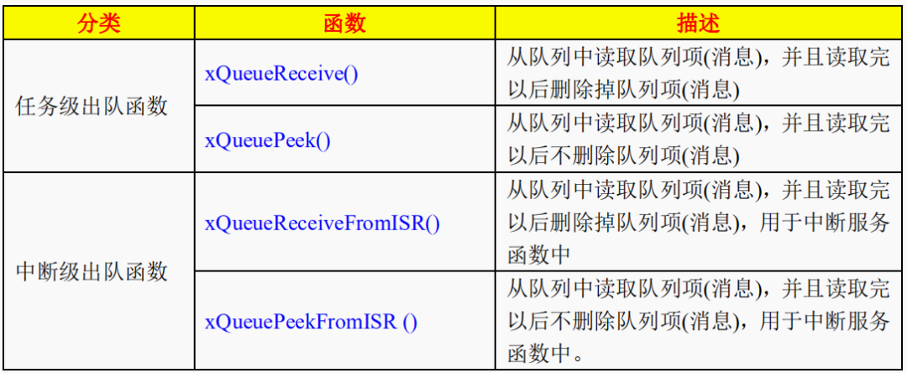


## FreeRTOS（十三）：信号量

信号量是操作系统中重要的一部分，==信号量一般用来进行资源管理和任务同步==，**FreeRTOS 中信号量又分为二值信号量、计数型信号量、互斥信号量和递归互斥信号量。**

#### 1、信号量用于控制对共享资源的访问

举一个很常见的例子，某个停车场有100个停车位，这 100 个停车位大家都可以用，对于大家来说这 100 个停车位就是共享资源。假设现在这个停车场正常运行，你要把车停到这个这个停车场肯定要先看一下现在停了多少车了？还有没有停车位？

当前停车数量就是一个信号量，具体的停车数量就是这个信号量值，当这个值到 100 的时候说明停车场满了。停车场满的时你可以等一会看看有没有其他的车开出停车场，当有车开出停车场的时候停车数量就会减一，也就是说信号量减一，此时你就可以把车停进去了，你把车停进去以后停车数量就会加一，也就是信号量加一。这就是一个典型的使用信号量进行共享资源管理的案例，在这个案例中使用的就是**计数型信号量**。

再看另外一个案例：使用公共电话，我们知道一次只能一个人使用电话，这个时候公共电话就只可能有两个状态：使用或未使用，如果用电话的这两个状态作为信号量的话，那么这个就是**二值信号量**。

信号量用于控制共享资源访问的场景相当于一个上锁机制，代码只有获得了这个锁的钥匙才能够执行。

#### 2、信号量的用于任务同步

**任务与任务或中断与任务之间的同步。**

在执行中断服务函数的时候可以通过向任务发送信号量来通知任务它所期待的事件发生了，当退出中断服务函数以后在任务调度器的调度下同步的任务就会执行。

在编写中断服务函数的时候我们都知道一定要快进快出，中断服务函数里面不能放太多的代码，否则的话会影响的中断的实时性。裸机编写中断服务函数的时候一般都只是在中断服务函数中打个标记，然后在其他的地方根据标记来做具体的处理过程。

**在使用 RTOS 系统的时候我们就可以借助信号量完成此功能，当中断发生的时候就释放信号量，中断服务函数不做具体的处理。具体的处理过程做成一个任务，这个任务会获取信号量，如果获取到信号量就说明中断发生了，那么就开始完成相应的处理，这样做的好处就是中断执行时间非常短。**

### 四种信号量详细介绍

#### 1、二值信号量

==二值信号量通常用于互斥访问或同步==，二值信号量和互斥信号量非常类似，但是还是有一些细微的差别，**互斥信号量拥有优先级继承机制，二值信号量没有优先级继承**。因此二值信号量更适合用于**同步**(任务与任务或任务与中断的同步)，而互斥信号量适合用于简单的**互斥访问**。

和队列一样，**信号量 API 函数允许设置一个阻塞时间，阻塞时间是当任务获取信号量的时候由于信号量无效从而导致任务进入阻塞态的最大时钟节拍数。**如果多个任务同时阻塞在同一个信号量上的话那么优先级最高的哪个任务优先获得信号量，这样当信号量有效的时候高优先级的任务就会解除阻塞状态。

二值信号量其实就是一个只有一个队列项的队列，这个特殊的队列要么是满的，要么是空的，这不正好就是二值的吗？任务和中断使用这个特殊队列不用在乎队列中存的是什么消息，只需要知道这个队列是满的还是空的。可以利用这个机制来完成任务与中断之间的同步。

在实际应用中通常会使用一个任务来处理 MCU 的某个外设，比如网络应用中，一般最简单的方法就是使用一个任务去轮询的查询 MCU 的 ETH 外设是否有数据，当有数据的时候就处理这个网络数据。这样使用轮询的方式是很浪费CPU 资源的，而且也阻止了其他任务的运行。最理想的方法就是当没有网络数据的时候网络任务就进入阻塞态，把 CPU 让给其他的任务，当有数据的时候网络任务才去执行。

> 现在使用二值信号量就可以实现这样的功能，任务通过获取信号量来判断是否有网络数据，没有的话就进入阻塞态，而网络中断服务函数通过释放信号量来通知任务以太网外设接收到了网络数据，网络任务可以去提取处理了。网络任务只是在一直的获取二值信号量，它不会释放信号量，而中断服务函数是一直在释放信号量，它不会获取信号量。在中断服务函数中发送信号量可以使用函数 xSemaphoreGiveFromISR()。

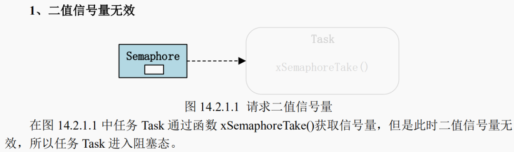

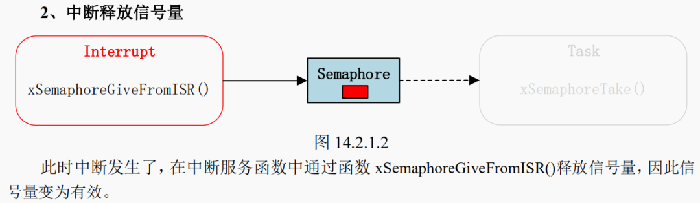


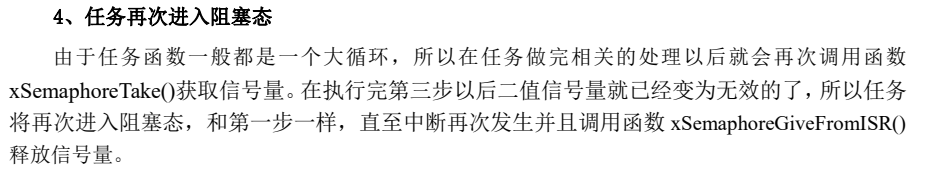

**创建二值信号量**


**释放信号量**


**获取信号量**

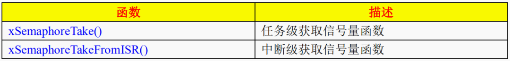

#### 2、计数型信号量

有些资料中也将计数型信号量叫做数值信号量，二值信号量相当于长度为 1 的队列，那么计数型信号量就是长度大于 1 的队列。同二值信号量一样，用户不需要关心队列中存储了什么数据，只需要关心队列是否为空即可。计数型信号量通常用于如下两个场合：

**1、事件计数**

在这个场合中，每次事件发生的时候就在事件处理函数中释放信号量(增加信号量的计数值)，其他任务会获取信号量(信号量计数值减一，信号量值就是队列结构体成员变量uxMessagesWaiting)来处理事件。在这种场合中创建的计数型信号量初始计数值为 0。

**2、资源管理**

在这个场合中，信号量值代表当前资源的可用数量，比如停车场当前剩余的停车位数量。一个任务要想获得资源的使用权，首先必须获取信号量，信号量获取成功以后信号量值就会减一。当信号量值为 0 的时候说明没有资源了。当一个任务使用完资源以后一定要释放信号量，释放信号量以后信号量值会加一。在这个场合中创建的计数型信号量初始值应该是资源的数量，比如停车场一共有 100 个停车位，那么创建信号量的时候信号量值就应该初始化为 100。

**创建计数型信号量**

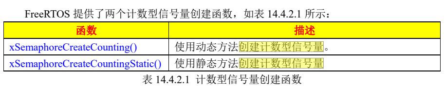

计数型信号量的**释放和获取**与二值信号量相同。

#### note：优先级翻转

在使用二值信号量的时候会遇到很常见的一个问题：优先级翻转，优先级翻转在可剥夺内核中是非常常见的，在实时系统中不允许出现这种现象，这样会破坏任务的预期顺序，可能会导致严重的后果，下图就是一个优先级翻转的例子：

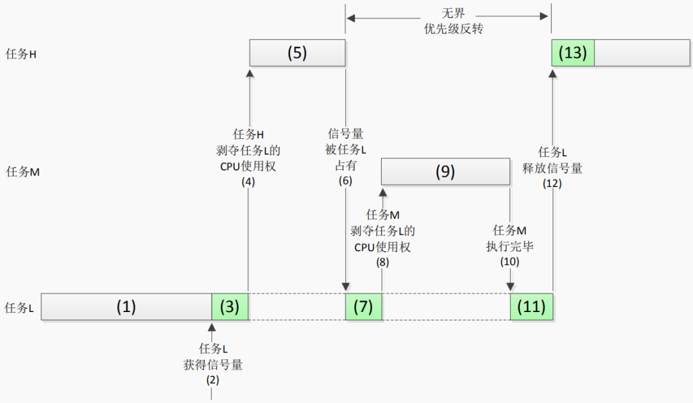

(1) 任务 H 和任务 M 处于挂起状态，等待某一事件的发生，任务 L 正在运行。

(2) 某一时刻任务 L 想要访问共享资源，在此之前它必须先获得对应该资源的信号量。

(3) 任务 L 获得信号量并开始使用该共享资源。

(4) 由于任务 H 优先级高，它等待的事件发生后便剥夺了任务 L 的 CPU 使用权。

(5) 任务 H 开始运行。

(6) 任务 H 运行过程中也要使用任务 L 正在使用着的资源，由于该资源的信号量还被任务L 占用着，任务 H 只能进入挂起状态，等待任务 L 释放该信号量。

(7) 任务 L 继续运行。

(8) 由于任务 M 的优先级高于任务 L，当任务 M 等待的事件发生后，任务 M 剥夺了任务L 的 CPU 使用权。

(9) 任务 M 处理该处理的事。

(10) 任务 M 执行完毕后，将 CPU 使用权归还给任务 L。

(11) 任务 L 继续运行。

(12) 最终任务 L 完成所有的工作并释放了信号量，到此为止，由于实时内核知道有个高优先级的任务在等待这个信号量，故内核做任务切换。

(13) 任务 H 得到该信号量并接着运行。

在这种情况下，任务 H 的优先级实际上降到了任务 L 的优先级水平。因为任务 H 要一直等待直到任务 L 释放其占用的那个共享资源。由于任务 M 剥夺了任务 L 的 CPU 使用权，使得任务 H 的情况更加恶化，这样就相当于任务 M 的优先级高于任务 H，导致优先级翻转。

**既然优先级翻转是个很严重的问题，那么有没有解决方法呢？有！这就要引出另外一种信号量——互斥信号量！**

#### 3、互斥信号量

==互斥信号量其实就是一个拥有优先级继承的二值信号量==，==在同步的应用中(任务与任务或中断与任务之间的同步)二值信号量最适合。==**互斥信号量适合用于那些需要互斥访问的应用中。**在互斥访问中互斥信号量相当于一个钥匙，当任务想要使用资源的时候就必须先获得这个钥匙，当使用完资源以后就必须归还这个钥匙，这样其他的任务就可以拿着这个钥匙去使用资源。

互斥信号量使用和二值信号量相同的 API 操作函数，所以互斥信号量也可以设置阻塞时间，不同于二值信号量的是互斥信号量具有优先级继承的特性。当一个互斥信号量正在被一个低优先级的任务使用，而此时有个高优先级的任务也尝试获取这个互斥信号量的话就会被阻塞。**不过这个高优先级的任务会将低优先级任务的优先级提升到与自己相同的优先级，这个过程就是优先级继承。优先级继承尽可能的降低了高优先级任务处于阻塞态的时间，并且将已经出现的“优先级翻转”的影响降到最低。**

优先级继承并不能完全的消除优先级翻转，它只是尽可能的降低优先级翻转带来的影响。硬实时应用应该在设计之初就要避免优先级翻转的发生。互斥信号量不能用于中断服务函数中，原因如下：

● ==互斥信号量有优先级继承的机制，所以只能用在任务中，不能用于中断服务函数。==

● 中断服务函数中不能因为要等待互斥信号量而设置阻塞时间进入阻塞态。

**创建互斥信号量**


**获取、释放**互斥信号量的函数同获取二值信号量和计数型信号量的函数相同。

#### 4、递归互斥信号量

递归互斥信号量可以看作是一个特殊的互斥信号量，已经获取了互斥信号量的任务就不能再次获取这个互斥信号量，但是递归互斥信号量不同，**已经获取了递归互斥信号量的任务可以再次获取这个递归互斥信号量，而且次数不限！**一个任务使用函数 xSemaphoreTakeRecursive()成功的获取了多少次递归互斥信号量就得使用函数 xSemaphoreGiveRecursive()释放多少次！比如某个任务成功的获取了 5 次递归信号量，那么这个任务也得同样的释放 5 次递归信号量。

**递归互斥信号量也有优先级继承的机制，所以当任务使用完递归互斥信号量以后一定要记得释放。同互斥信号量一样，递归互斥信号量不能用在中断服务函数中。**

● 由于优先级继承的存在，就限定了递归互斥信号量只能用在任务中，不能用在中断服务函数中！

● 中断服务函数不能设置阻塞时间。

要使用递归互斥信号量的话宏 configUSE_RECURSIVE_MUTEXES 必须为 1！

**创建互斥信号量**

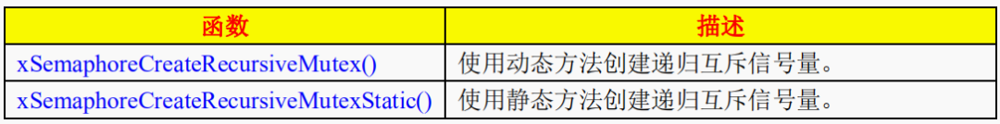

递归互斥信号量有专用的**释放**函数：xSemaphoreGiveRecursive()

递归互斥信号量的**获取**使用函数 xSemaphoreTakeRecursive()


## FreeRTOS（十四）：事件标志组

前面我们学习了使用信号量来完成同步，但是使用信号量来同步的话任务只能与单个的事件或任务进行同步。有时候==**某个任务可能会需要与多个事件或任务进行同步**==，此时信号量就无能为力了。

FreeRTOS 为此提供了一个可选的解决方法，那就是事件标志组。

#### 1、事件标志组简介

**1、事件位(事件标志)**

==事件位用来表明某个事件是否发生，事件位通常用作事件标志==，比如下面的几个例子：

● 当收到一条消息并且把这条消息处理掉以后就可以将某个位(标志)置 1，当队列中没有消息需要处理的时候就可以将这个位(标志)置 0。

● 当把队列中的消息通过网络发送输出以后就可以将某个位(标志)置 1，当没有数据需要从网络发送出去的话就将这个位(标志)置 0。

● 现在需要向网络中发送一个心跳信息，将某个位(标志)置 1。现在不需要向网络中发送心跳信息，这个位(标志)置 0。

**2、事件组**

==一个事件组就是一组的事件位，事件组中的事件位通过位编号来访问==，同样，以上面列出的三个例子为例：

● 事件标志组的 bit0 表示队列中的消息是否处理掉。

● 事件标志组的 bit1 表示是否有消息需要从网络中发送出去。

● 事件标志组的 bit2 表示现在是否需要向网络发送心跳信息。

**3、事件标志组和事件位的数据类型**

事件标志组的数据类型为 EventGroupHandle_t，当 configUSE_16_BIT_TICKS 为 1 的时候 事件标志组可以存储 8 个事件位，当 configUSE_16_BIT_TICKS 为 0 的时候事件标志组存储 24个事件位。

事件标志组中的所有事件位都存储在一个无符号的 EventBits_t 类型的变量中，EventBits_t 在 event_groups.h 中有如下定义：

```c
typedef TickType_t EventBits_t;
```

数据类型 TickType_t 在文件 portmacro.h 中有如下定义：

```c
#if( configUSE_16_BIT_TICKS == 1 )
  typedef uint16_t TickType_t;
  #define portMAX_DELAY ( TickType_t ) 0xffff
#else
  typedef uint32_t TickType_t;
  #define portMAX_DELAY ( TickType_t ) 0xffffffffUL
  #define portTICK_TYPE_IS_ATOMIC 1
#endif
```

可以看出当 configUSE_16_BIT_TICKS 为 0 的时候 TickType_t 是个 32 位的数据类型，因 此 EventBits_t 也是个 32 位的数据类型。EventBits_t 类型的变量可以存储 24 个事件位，另外的那高 8 位有其他用。事件位 0 存放在这个变量的 bit0 上，变量的 bit1 就是事件位 1，以此类推。对于 STM32 来说一个事件标志组最多可以存储 24 个事件位，如图所示：

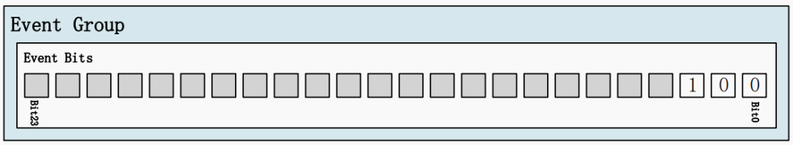

#### 2、创建事件标志组


#### 3、设置事件位


#### 4、获取事件标志组值

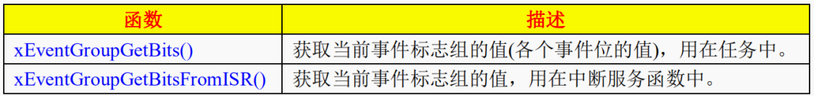

#### 5、等待指定的事件位

某个任务可能需要与多个事件进行同步，那么这个任务就需要等待并判断多个事件位(标 志)，使用函数 xEventGroupWaitBits()可以完成这个功能。调用函数以后如果任务要等待的事件位还没有准备好(置 1 或清零)的话任务就会进入阻塞态，直到阻塞时间到达或者所等待的事件位准备好。函数原型如下：

```c
EventBits_t xEventGroupWaitBits( EventGroupHandle_t xEventGroup,
  const EventBits_t uxBitsToWaitFor,
  const BaseType_t xClearOnExit,
  const BaseType_t xWaitForAllBits,
  const TickType_t xTicksToWait );
```

具体的用法大家用到的时候可以百度，这里就不详解了，只是大家在设计功能的时候，知道有这个东西。

==note：FreeRTOS 中几乎所有的 API 都分为在任务中还是在中断处理函数中，要注意区分。同时一些 API 还分为使用动态内存分配还是静态内存分配，一般是选择动态，因为使用方便、简单。==


## FreeRTOS（十五）：任务通知

从 v8.2.0 版本开始，FreeRTOS 新增了任务通知(Task Notifictions)这个功能，可以使用==任务通知来代替信号量、消息队列、事件标志组等这些东西。使用任务通知的话效率会更高==，我们来学习一下 FreeRTOS 的任务通知功能。

#### 1、任务通知简介

任务通知在 FreeRTOS 中是一个可选的功能，要使用任务通知的话就需要将宏configUSE_TASK_NOTIFICATIONS 定义为 1。

FreeRTOS 的每个任务都有一个 32 位的通知值，任务控制块中的成员变量 ulNotifiedValue 就是这个通知值。**任务通知是一个事件，假如某个任务通知的接收任务因为等待任务通知而阻塞的话，向这个接收任务发送任务通知以后就会解除这个任务的阻塞状态。**也可以更新接收任务的任务通知值，任务通知可以通过如下方法更新接收任务的通知值：

● 不覆盖接收任务的通知值(如果上次发送给接收任务的通知还没被处理)。

● 覆盖接收任务的通知值。

● 更新接收任务通知值的一个或多个 bit。

● 增加接收任务的通知值。

**合理、灵活的使用上面这些更改任务通知值的方法可以在一些场合中替代队列、二值信号量、计数型信号量和事件标志组。**使用任务通知来实现二值信号量功能的时候，解除任务阻塞的时间比直接使用二值信号量要快 45%》

>(FreeRTOS 官方测试结果，使用 v8.1.2 版本中的二值信号量，GCC 编译器，-O2 优化的条件下测试的，没有使能断言函数 configASSERT())，并且使用的 RAM 更少！

任务通知的发送使用函数 xTaskNotify()或者 xTaskNotifyGive()(还有此函数的中断版本)来 完 成 ， 这 个 通 知 值 会 一 直 被 保 存 着 ， 直 到 接 收 任 务 调 用 函 数 xTaskNotifyWait() 或 者ulTaskNotifyTake()来获取这个通知值。假如接收任务因为等待任务通知而阻塞的话那么在接收到任务通知以后就会解除阻塞态。

任务通知虽然可以提高速度，并且减少 RAM 的使用，但是任务通知也是有使用限制的：

● **FreeRTOS 的任务通知只能有一个接收任务**，其实大多数的应用都是这种情况。

● **接收任务可以因为接收任务通知而进入阻塞态，但是发送任务不会因为任务通知发送失败而阻塞。**

#### 2、发送任务通知

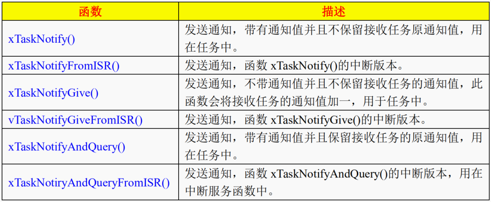

#### 3、任务通知通用发送函数

任务级任务通知发送函数：xTaskNotify()、xTaskNotifyGive()和 xTaskNotifyAndQuery()，这三个函数最终调用的都是函数 xTaskGenericNotify()！此函数在文件 tasks.c 中定义。

中 断 级 任 务 通 知 发 送 函 数 也 有 三 个 ， 分 别 为 ：xTaskNotifyFromISR() 、xTaskNotifyAndQueryFromISR()和 vTaskNotifyGiveFromISR()。其中函数 xTaskNotifyFromISR()和 xTaskNotifyAndQueryFromISR()最终调用的都是函数 xTaskGenericNotifyFromISR()。

#### 4、获取任务通知

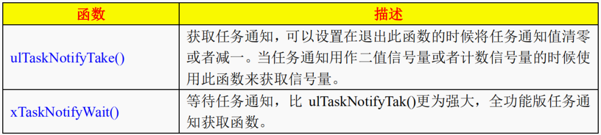

#### 5、任务通知用途

1、任务通知模拟二值信号量

2、任务通知模拟计数型信号量

3、任务通知模拟消息邮箱

4、任务通知模拟事件标志组


## FreeRTOS（十六）：低功耗 Tickless 模式

很多应用场合对于功耗的要求很严格，比如长期无人照看的数据采集仪器，可穿戴设备等。其实很多 MCU 都有相应的低功耗模式，以此来降低设备运行时的功耗，进行裸机开发的时候就可以使用这些低功耗模式。但是现在我们要使用操作系统，因此操作系统对于低功耗的支持也显得尤为重要，这样**硬件与软件相结合，可以进一步降低系统的功耗**。这样开发也会方便很多，毕竟系统已经原生支持低功耗了，我们只需要按照系统的要求来做编写相应的应用层代码即可。FreeRTOS 提供了一个叫做 Tickless 的低功耗模式。

#### 1、STM32F1 低功耗模式

STM32 本身就支持低功耗模式，共有三种低功耗模式：

● 睡眠(Sleep)模式。

● 停止(Stop)模式。

● 待机(Standby)模式。

这三种模式对比如表所示：

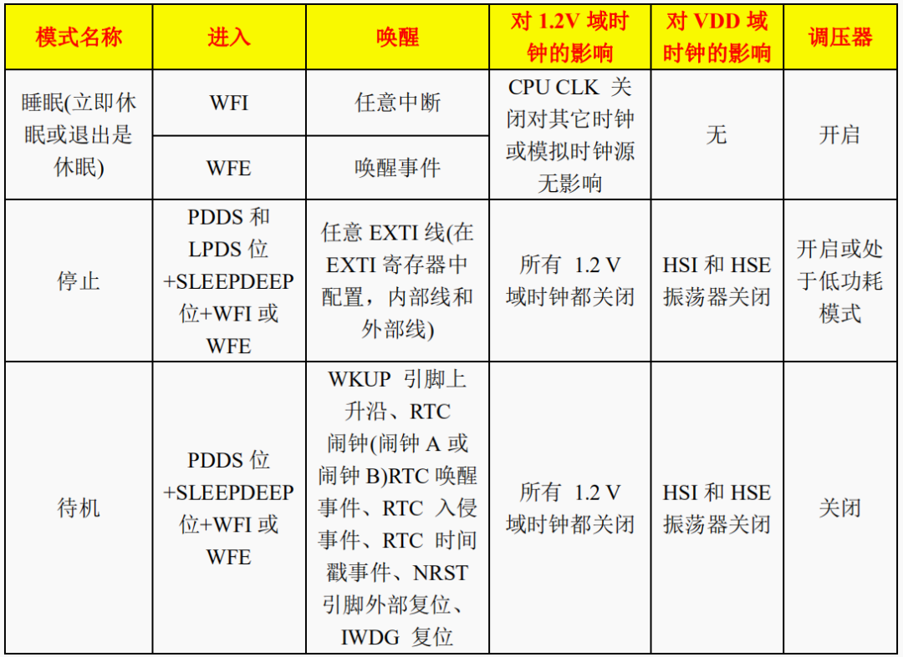

这三种低功耗模式对应三种不同的功耗水平，根据实际的应用环境选择相对应的低功耗模式。接下来我们就详细的看一下这三者有何区别。

**1、睡眠(Sleep)模式**

● 进入睡眠模式

进入睡眠模式有两种指令：WFI(等待中断)和WFE(等待事件)。根据Cortex-M 内核的SCR(系统控制)寄存器可以选择使用立即休眠还是退出时休眠，当 SCR 寄存器的 SLEEPONEXIT(bit1)位为 0 的时候使用立即休眠，当为 1 的时候使用退出时休眠。关于立即休眠和退出时休眠的详细内容请参考《权威指南》“第 9 章 低功耗和系统控制特性”章节。

CMSIS(Cortex 微控制器软件接口标准)提供了两个函数来操作指令 WFI 和 WFE，我们可以 直接使用这两个函数：`__WFI 和__WFE`。FreeRTOS 系统会使用 WFI 指令进入休眠模式。

● 退出休眠模式

如果使用 WFI 指令进入休眠模式的话那么任意一个中断都会将 MCU 从休眠模式中唤醒，如果使用 WFE 指令进入休眠模式的话那么当有事件发生的话就会退出休眠模式，比如配置一个 EXIT 线作为事件。

当 STM32F103 处于休眠模式的时候 Cortex-M3 内核停止运行，但是其他外设运行正常，比如 NVIC、SRAM 等。休眠模式的功耗比其他两个高，但是休眠模式没有唤醒延时，应用程序可以立即运行。

**2、停止(Stop)模式**

停止模式基于 Cortex-M3 的深度休眠模式与外设时钟门控，在此模式下 1.2V 域的所有时钟都会停止，PLL、HSI 和 HSE RC 振荡器会被禁止，但是内部 SRAM 的数据会被保留。调压器可以工作在正常模式，也可配置为低功耗模式。如果有必要的话可以通过将 PWR_CR 寄存器的FPDS 位置 1 来使 Flash 在停止模式的时候进入掉电状态，当 Flash 处于掉电状态的时候 MCU从停止模式唤醒以后需要更多的启动延时。停止模式的进入和退出如表所示：

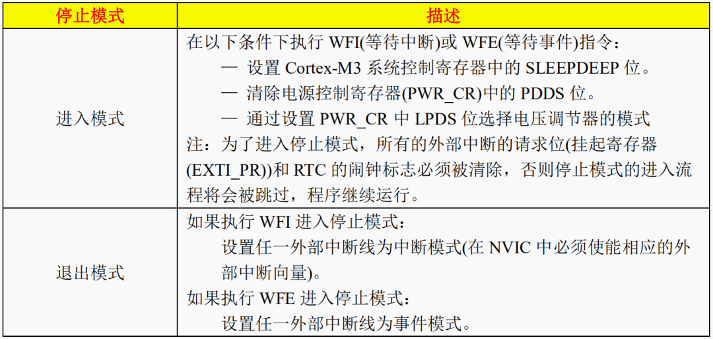

**3、待机(Standby)模式**

==相比于前面两种低功耗模式，待机模式的功耗最低。==待机模式是基于 Cortex-M3 的深度睡眠模式的，其中调压器被禁止。1.2V 域断电，PLL、HSI 振荡器和 HSE 振荡器也被关闭。除了备份区域和待机电路相关的寄存器外，SRAM 和其他寄存器的内容都将丢失。待机模式的进入和退出如表所示：

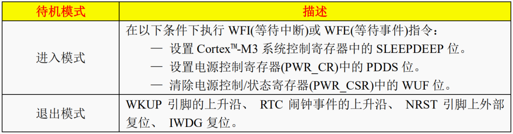

退出待机模式的话会导致 STM32F1 重启，所以待机模式的唤醒延时也是最大的。实际应用中要根据使用环境和要求选择合适的待机模式。关于 STM32 低功耗模式的详细介绍和使用请参考 ST 官方的参考手册。

#### 2、Tickless 模式详解

**1、如何降低功耗？**

一般的简单应用中处理器大量的时间都在处理空闲任务，**所以我们就可以考虑当处理器处理空闲任务的时候就进入低功耗模式，当需要处理应用层代码的时候就将处理器从低功耗模式唤醒。FreeRTOS 就是通过在处理器处理空闲任务的时候将处理器设置为低功耗模式来降低能耗。**一般会在空闲任务的钩子函数中执行低功耗相关处理，比如设置处理器进入低功耗模式、关闭其他外设时钟、降低系统主频等等。

我们知道 FreeRTOS 的系统时钟是由滴答定时器中断来提供的，系统时钟频率越高，那么滴答定时器中断频率也就越高。以前讲过，中断是可以将 STM32F103 从睡眠模式中唤醒，周期性的滴答定时器中断就会导致 STM32F103 周期性的进入和退出睡眠模式。因此，如果滴答定时器中断频率太高的话会导致大量的能量和时间消耗在进出睡眠模式中，这样导致的结果就是低功耗模式的作用被大大的削弱。

为此，FreeRTOS 特地提供了一个解决方法——Tickless 模式，当处理器进入空闲任务周期以后就关闭系统节拍中断(滴答定时器中断)，只有当其他中断发生或者其他任务需要处理的时候处理器才会被从低功耗模式中唤醒。为此我们将面临两个问题：

**问题一：关闭系统节拍中断会导致系统节拍计数器停止，系统时钟就会停止。**

FreeRTOS 的系统时钟是依赖于系统节拍中断(滴答定时器中断)的，如果关闭了系统节拍中断的话就会导致系统时钟停止运行，这是绝对不允许的！该如何解决这个问题呢？我们可以记录下系统节拍中断的关闭时间，当系统节拍中断再次开启运行的时候补上这段时间就行了。这时候我们就需要另外一个定时器来记录这段该补上的时间，如果使用专用的低功耗处理器的话基本上都会有一个低功耗定时器，比如 STM32L4 系列(L 系列是 ST 的低功耗处理器)就有一个叫做 LPTIM(低功耗定时器)的定时器。STM32F103 没有这种定时器那么就接着使用滴答定时器来完成这个功能，具体实现方法后面会讲解。

**问题二：如何保证下一个要运行的任务能被准确的唤醒？**

即使处理器进入了低功耗模式，但是我的中断和应用层任务也要保证及时的响应和处理。中断自然不用说，本身就可以将处理器从低功耗模式中唤醒。但是应用层任务就不行了，它无法将处理器从低功耗模式唤醒，无法唤醒就无法运行！这个问题看来很棘手，既然应用层任务无法将处理器从低功耗模式唤醒，那么我们就借助其他的力量来完成这个功能。如果处理器在进入低功耗模式之前能够获取到还有多长时间运行下一个任务那么问题就迎刃而解了，我们只需要开一个定时器，定时器的定时周期设置为这个时间值就行了，定时时间到了以后产生定时中断，处理器不就从低功耗模式唤醒了。这里似乎又引出了一个新的问题，那就是如何知道还有多长时间执行下一个任务？这个时间也就是低功耗模式的执行时间，值得庆辛的是 FreeRTOS已经帮我们完成了这个工作。

**2、Tickless 具体实现**

**1、宏 configUSE_TICKLESS_IDLE**

要想使用 Tickless 模式，首先必须将 FreeRTOSConfig.h 中的宏 configUSE_TICKLESS_IDLE设置为 1，代码如下：

```c
#define configUSE_TICKLESS_IDLE  1      //1 启用低功耗 tickless 模式
```

**2、宏 portSUPPRESS_TICKS_AND_SLEEP()**

使能 Tickless 模式以后当下面两种情况都出现的时候 FreeRTOS 内核就会调用宏portSUPPRESS_TICKS_AND_SLEEP()来处理低功耗相关的工作。

● 空闲任务是唯一可运行的任务，因为其他所有的任务都处于阻塞态或者挂起态。

● 系统处于低功耗模式的时间至少大于 configEXPECTED_IDLE_TIME_BEFORE_SLEEP个时钟节拍，宏 configEXPECTED_IDLE_TIME_BEFORE_SLEEP 默认在文件 FreeRTOS.h 中定义为 2，我们可以在 FreeRTOSConfig.h 中重新定义，此宏必须大于 2！

portSUPPRESS_TICKS_AND_SLEEP()有个参数，此参数用来指定还有多长时间将有任务进入就绪态，其实就是处理器进入低功耗模式的时长(单位为时钟节拍数)，因为一旦有其他任务 进 入 就 绪 态 处 理 器 就 必 须 退 出 低 功 耗 模 式 去 处 理 这 个 任 务 。portSUPPRESS_TICKS_AND_SLEEP()应该是由用户根据自己所选择的平台来编写的，此宏会被空闲任务调用来完成具体的低功耗工作。但是！如果使用 STM32 的话编写这个宏的工作就不用我们来完成了，因为 FreeRTOS 已经帮我们做好了，有没有瞬间觉得好幸福啊。当然了你也可以自己去重新编写，不使用 FreeRTOS 提供的 ，如果自己编写的话需要先将configUSE_TICKLESS_IDLE 设置为 2。宏 portSUPPRESS_TICKS_AND_SLEEP 在文件 portmacro.h 中定义。

**3、宏 configPRE_SLEEP_PROCESSING ()和 configPOST_SLEEP_PROCESSING()**

在真正的低功耗设计中不仅仅是将处理器设置到低功耗模式就行了，还需要做一些其他的处理，比如：

● 将处理器降低到合适的频率，因为频率越低功耗越小，甚至可以在进入低功耗模式以后关闭系统时钟。

● 修改时钟源，晶振的功耗肯定比处理器内部的时钟源高，进入低功耗模式以后可以切换到内部时钟源，比如 STM32 的内部 RC 振荡器。

● 关闭其他外设时钟，比如 IO 口的时钟。

● 关闭板子上其他功能模块电源，这个需要在产品硬件设计的时候就要处理好，比如可以通过 MOS 管来控制某个模块电源的开关，在处理器进入低功耗模式之前关闭这些模块的电源。

有关产品低功耗设计的方法还有很多，大家可以上网查找一下，上面列举出的这几点在处理器进入低功耗模式之前就要完成处理。FreeRTOS 为我们提供了一个宏来完成这些操作，它就是 configPRE_SLEEP_PROCESSING()，这个宏的具体实现内容需要用户去编写。如果在进入低功耗模式之前我们降低了处理器频率、关闭了某些外设时钟等的话，那在退出低功耗模式以后就 需 要 恢 复 处 理 器 频 率 、 重 新 打 开 外 设 时 钟 等 ， 这 个 操 作 在 宏configPOST_SLEEP_PROCESSING()中完成，同样的这个宏的具体内容也需要用户去编写。这两个宏会被函数 vPortSuppressTicksAndSleep()调用，我们可以在 FreeRTOSConfig.h 定义这两个宏，如下：

```c
/********************************************************************************/
/* FreeRTOS 与低功耗管理相关配置 */
/********************************************************************************/
extern void PreSleepProcessing(uint32_t ulExpectedIdleTime);
extern void PostSleepProcessing(uint32_t ulExpectedIdleTime);

//进入低功耗模式前要做的处理
#define configPRE_SLEEP_PROCESSING PreSleepProcessing
//退出低功耗模式后要做的处理
#define configPOST_SLEEP_PROCESSING PostSleepProcessing
```

函数 PreSleepProcessing()和 PostSleepProcessing()可以在任意一个 C 文件中编写，本章对应的例程是在 main.c 文件中，函数的具体内容在下一节详解。

**4、宏 configEXPECTED_IDLE_TIME_BEFORE_SLEEP**

处理器工作在低功耗模式的时间虽说没有任何限制，1 个时钟节拍也行，滴答定时器所能计时的最大值也行。但是时间太短的话意义也不大啊，就 1 个时钟节拍，我这刚进去就得出来！所 以 我 们 必 须 对 工 作 在 低 功 耗 模 式 的 时 间 做 个 限 制 ， 不 能 太 短 了 ， 宏configEXPECTED_IDLE_TIME_BEFORE_SLEEP 就是用来完成这个功能的。此宏默认在文件FreeRTOS 中有定义，如下：

```c
#ifndef configEXPECTED_IDLE_TIME_BEFORE_SLEEP
    #define configEXPECTED_IDLE_TIME_BEFORE_SLEEP 2
#endif

#if configEXPECTED_IDLE_TIME_BEFORE_SLEEP < 2
    #error configEXPECTED_IDLE_TIME_BEFORE_SLEEP must not be less than 2
#endif
```

默认情况下 configEXPECTED_IDLE_TIME_BEFORE_SLEEP 为 2 个时钟节拍，并且最小不能小于 2 个时钟节拍。如果要修改这个值的话可以在文件 FreeRTOSConfi.h 中对其重新定义。此宏会在空闲任务函数 prvIdleTask()中使用！

到此为止，FreeRTOS 中低功耗的基础大家都已经掌握了，可以在自己已经有的代码中加入此机制，看看功耗是否有降低。使能上面第一个宏定义，然后实现其他三个宏定义即可将低功耗机制加入自己的项目中。


## FreeRTOS（十七）：空闲任务

空闲任务是 FreeRTOS 必不可少的一个任务，其他 RTOS 类系统也有空闲任务，比如 uC/OS。看名字就知道，空闲任务是处理器空闲的时候去运行的一个任务，当系统中没有其他就绪任务的时候空闲任务就会开始运行，空闲任务最重要的作用就是让处理器在无事可做的时候找点事做，防止处理器无聊，因此，空闲任务的优先级肯定是最低的。当然了，实际上肯定不会这么浪费宝贵的处理器资源，FreeRTOS 空闲任务中也会执行一些其他的处理。

#### 1、空闲任务详解

**1、空闲任务简介**

当 FreeRTOS 的调度器启动以后就会自动的创建一个空闲任务，这样就可以确保至少有一任务可以运行。但是这个**空闲任务使用最低优先级**，如果应用中有其他高优先级任务处于就绪态的话这个空闲任务就不会跟高优先级的任务抢占 CPU 资源。空闲任务还有另外一个重要的职责，**如果某个任务要调用函数 vTaskDelete()删除自身，那么这个任务的任务控制块 TCB 和任务堆栈等这些由 FreeRTOS 系统自动分配的内存需要在空闲任务中释放掉，如果删除的是别的任务那么相应的内存就会被直接释放掉，不需要在空闲任务中释放。**因此，一定要给空闲任务执行的机会！除此以外空闲任务就没有什么特别重要的功能了，所以可以根据实际情况减少空闲任务使用 CPU 的时间(比如，当 CPU 运行空闲任务的时候使处理器进入低功耗模式)。

用户可以创建与空闲任务优先级相同的应用任务，当宏 configIDLE_SHOULD_YIELD 为 1的话应用任务就可以使用空闲任务的时间片，也就是说空闲任务会让出时间片给同优先级的应用任务。这种机制要求FreeRTOS 使用抢占式内核。

**2、空闲任务的创建**

当调用函数 vTaskStartScheduler()启动任务调度器的时候此函数就会自动创建空闲任务。

**3、空闲任务函数**

空闲任务的任务函数为 prvIdleTask()，但是实际上是找不到这个函数的，因为它是通过宏定义来实现的，在文件 portmacro.h 中有如下宏定义：

```c
#define portTASK_FUNCTION( vFunction, pvParameters ) void vFunction( void *pvParameters )
```

其中 portTASK_FUNCTION()在文件 tasks.c 中有定义，它就是空闲任务的任务函数。

#### 2、空闲任务钩子函数详解

**1、钩子函数**

**FreeRTOS 中有多个钩子函数，钩子函数类似回调函数**，当某个功能(函数)执行的时候就会调用钩子函数，至于钩子函数的具体内容那就由用户来编写。如果不需要使用钩子函数的话就什么也不用管，钩子函数是一个可选功能，可以通过宏定义来选择使用哪个钩子函数，可选的钩子函数如表所示：

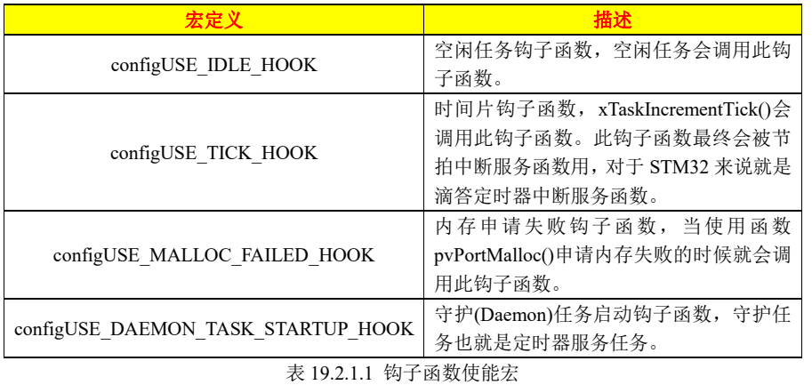

钩子函数的使用方法基本相同，用户使能相应的钩子函数，然后自行根据实际需求编写钩子函数的内容，下一节我们会以空闲任务钩子函数为例讲解如何使用钩子函数。

**2、空闲任务钩子函数**

在每个空闲任务运行周期都会调用空闲任务钩子函数，如果想在空闲任务优先级下处理某个任务有两种选择：

● 在空闲任务钩子函数中处理任务。

不管什么时候都要保证系统中至少有一个任务可以运行，因此绝对不能在空闲任务钩子函数中调用任何可以阻塞空闲任务的 API 函数，比如 vTaskDelay()，或者其他带有阻塞时间的信号量或队列操作函数。

● 创建一个与空闲任务优先级相同的任务。

创建一个任务是最好的解决方法，但是这种方法会消耗更多的 RAM。

要使用空闲任务钩子函数首先要在 FreeRTOSConfig.h 中将宏 configUSE_IDLE_HOOK 改为1，然后编写空闲任务钩子函数 vApplicationIdleHook()。通常在空闲任务钩子函数中将处理器设置为低功耗模式来节省电能，为了与 FreeRTOS 自带的 Tickless 模式做区分，这里我暂且将这种低功耗的实现方法称之为通用低功耗模式(因为几乎所有的 RTOS 系统都可以使用这种方法实现低功耗)。这种通用低功耗模式和 FreeRTOS 自带的 Tickless 模式的区别我们通过下图来对比分析一下。

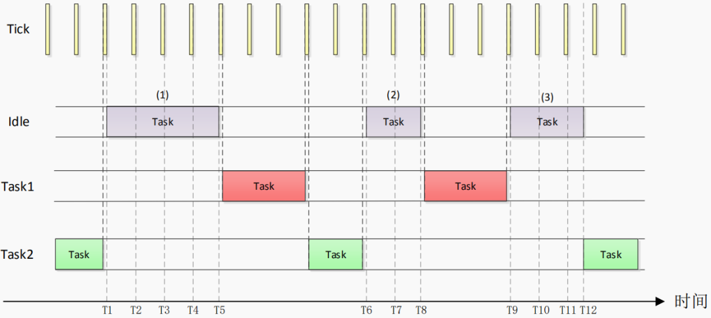

图中有三个任务，它们分别为一个空闲任务(Idle)，两个用户任务(Task1 和 Task2),其中空闲任务一共有运行了三次，分别为(1)、(2)、(3)，其中 T1 到 T12 是 12 个时刻，下面我们分别从这两种低功耗的实现方法去分析一下整个过程。

**1、通用低功耗模式**

如果使用通用低功耗模式的话每个滴答定时器中断都会将处理器从低功耗模式中唤醒，以(1)为例，再 T2 时刻处理器从低功耗模式中唤醒，但是接下来由于没有就绪的其他任务所以处理器又再一次进入低功耗模式。T2、T3 和 T4 这三个时刻都一样，反复的进入低功耗、退出低功耗，最理想的情况应该是从 T1 时刻就进入低功耗，然后在 T5 时刻退出。

在(2)中空闲任务只工作了两个时钟节拍，但是也执行了低功耗模式的进入和退出，显然这个意义不大，因为进出低功耗也是需要时间的。

(3)中空闲任务在 T12 时刻被某个外部中断唤醒，中断的具体处理过程在任务 2(使用信号量实现中断与任务之间的同步)。

**2、低功耗 Tickless 模式**

在(1)中的 T1 时刻处理器进入低功耗模式，在 T5 时刻退出低功耗模式。相比通用低功耗模式少了 3 次进出低功耗模式的操作。

在(2)中由于空闲任务只运行了两个时钟节拍，所以就没必要进入低功耗模式。说明在Tickless 模式中只有空闲任务要运行时间的超过某个最小阈值的时候才会进入低功耗模式，此阈值通过 configEXPECTED_IDLE_TIME_BEFORE_SLEEP 来设置。

(3)中的情况和通用低功耗模式一样。

可以看出相对与通用低功耗模式，FreeRTOS 自带的 Tickless 模式更加合理有效，所以如果有低功耗设计需求的话大家尽量使用 FreeRTOS 自带的 Tickless 模式。当然了，如果对于功耗要求不严格的话通用低功耗模式也可以使用。


## FreeRTOS（十八）：内存管理

内存管理是一个系统基本组成部分，FreeRTOS 中大量使用到了内存管理，比如创建任务、信号量、队列等会自动从堆中申请内存。用户应用层代码也可以 FreeRTOS 提供的内存管理函数来申请和释放内存，本文学习一下 FreeRTOS 自带的内存管理。

#### 1、FreeRTOS 内存管理简介

FreeRTOS 创建任务、队列、信号量等的时候有两种方法，一种是**动态的申请所需的 RAM**。一种是由用户自行定义所需的 RAM，这种方法也叫**静态方法**，使用静态方法的函数一般以“Static”结尾，比如任务创建函数 xTaskCreateStatic()，使用此函数创建任务的时候需要由用户定义任务堆栈，我们**不讨论这种静态方法。**

==使用动态内存管理的时候 FreeRTOS 内核在创建任务、队列、信号量的时候会动态的申请 RAM。==标准 C 库中的 malloc()和 free()也可以实现动态内存管理，但是如下原因**限制了其使用**：

● 在小型的嵌入式系统中效率不高。

● 会占用很多的代码空间。

● 它们不是线程安全的。

● 具有不确定性，每次执行的时间不同。

● 会导致内存碎片。

● 使链接器的配置变得复杂。

不同的嵌入式系统对于内存分配和时间要求不同，因此一个内存分配算法可以作为系统的可选选项。FreeRTOS 将内存分配作为移植层的一部分，这样 FreeRTOS 使用者就可以使用自己的合适的内存分配方法。

**当内核需要 RAM 的时候可以使用 pvPortMalloc()来替代 malloc()申请内存，不使用内存的时候可以使用 vPortFree()函数来替代 free()函数释放内存。函数 pvPortMalloc()、vPortFree()与函数 malloc()、free()的函数原型类似。**

**FreeRTOS 提供了 5 种内存分配方法**，FreeRTOS 使用者可以其中的某一个方法，**或者自己的内存分配方法**。这 5 种方法是 5 个文件，分别为:heap_1.c、heap_2.c、heap_3.c、heap_4.c 和heap_5.c。这 5 个文件再 FreeRTOS 源码中，路径：FreeRTOS->Source->portable->MemMang。

#### 2、内存碎片

在看 FreeRTOS 的内存分配方法之前我们先来看一下什么叫做内存碎片，看名字就知道是小块的、碎片化的内存。那么内存碎片是怎么来的呢？内存碎片是伴随着内存申请和释放而来的，如图所示。

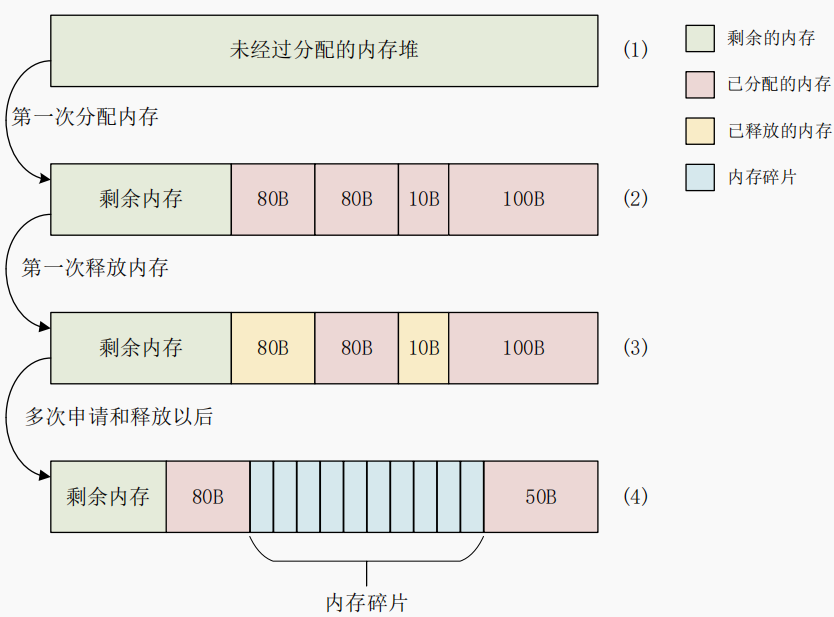

(1)、此时内存堆还没有经过任何操作，为全新的。

(2)、此时经过第一次内存分配，一共分出去了 4 块内存块，大小分别为 80B、80B、10B 和100B。

(3)、有些应用使用完内存，进行了释放，从左往右第一个 80B 和后面的 10B 这两个内存块就是释放的内存。如果此时有个应用需要 50B 的内存，那么它可以从两个地方来获取到，一个是最前面的还没被分配过的剩余内存块，另一个就是刚刚释放出来的 80B 的内存块。但是很明显，刚刚释放出来的这个 10B 的内存块就没法用了，除非此时有另外一个应用所需要的内存小于10B。

(4)、经过很多次的申请和释放以后，内存块被不断的分割、最终导致大量很小的内存块！也就是图中 80B 和 50B 这两个内存块之间的小内存块，这些内存块由于太小导致大多数应用无法使用，这些没法使用的内存块就沦为了内存碎片！

内存碎片是内存管理算法重点解决的一个问题，否则的话会导致实际可用的内存越来越少，最终应用程序因为分配不到合适的内存而奔溃！FreeRTOS 的 heap_4.c 就给我们提供了一个解决内存碎片的方法，那就是**将内存碎片进行合并**组成一个新的可用的大内存块。

#### heap_1 内存分配方法

动 态 内 存 分 配 需 要 一 个 内 存 堆 ， FreeRTOS 中 的 内 存 堆 为 ucHeap[] ， 大 小 为configTOTAL_HEAP_SIZE，这个前面讲 FreeRTOS 配置的时候就讲过了。不管是哪种内存分配方法，它们的内存堆都为 ucHeap[],而且大小都是 configTOTAL_HEAP_SIZE。内存堆在文件heap_x.c(x 为 1~5)中定义的，比如 heap_1.c 文件就有如下定义：

```c
#if( configAPPLICATION_ALLOCATED_HEAP == 1 )
  extern uint8_t ucHeap[ configTOTAL_HEAP_SIZE ]; //需要用户自行定义内存堆
#else
  static uint8_t ucHeap[ configTOTAL_HEAP_SIZE ]; //编译器决定
#endif 
```

当宏 configAPPLICATION_ALLOCATED_HEAP 为 1 的时候需要用户自行定义内存堆，否则的话由编译器来决定，默认都是由编译器来决定的。如果自己定义的话就可以将内存堆定义到外部 SRAM 或者 SDRAM 中。

heap_1 实现起来就是当需要 RAM 的时候就从一个大数组(内存堆)中分一小块出来，大数组(内存堆)的容量为 configTOTAL_HEAP_SIZE。使用函数 xPortGetFreeHeapSize() 可以获取内存堆中剩余内存大小。

**heap_1 特性如下：**

1、适用于那些一旦创建好任务、信号量和队列就再也不会删除的应用，实际上大多数的 FreeRTOS 应用都是这样的。

2、具有可确定性(执行所花费的时间大多数都是一样的)，而且不会导致内存碎片。

3、代码实现和内存分配过程都非常简单，内存是从一个静态数组中分配到的，也就是适合于那些不需要动态内存分配的应用。

**如果使用 heap_1，一旦申请内存成功就不允许释放！**但是 heap_1 的内存分配过程简单，如此看来 heap_1 似乎毫无任何使用价值啊。千万不能这么想，有很多小型的应用在系统一开始就创建好任务、信号量或队列等，在程序运行的整个过程这些任务和内核对象都不会删除，那么这个时候使用 heap_1 就很合适的。

#### heap_2 内存分配方法

heap_2 提供了一个更好的分配算法，不像 heap_1那样，heap_2 提供了内存释放函数。heap_2 不会把释放的内存块合并成一个大块，这样有一个缺点，随着你不断的申请内存，内存堆就会被分为很多个大小不一的内存(块)，也就是会导致内存碎片！

**heap_2 的特性如下：**

1、可以使用在那些可能会重复的删除任务、队列、信号量等的应用中，要注意有内存碎片产生！

2、如果分配和释放的内存 n 大小是随机的，那么就要慎重使用了，比如下面的示例：

● 如果一个应用动态的创建和删除任务，而且任务需要分配的**堆栈大小都是一样的**，那么 heap_2 就非常合适。如果任务所需的堆栈大小每次都是不同，那么 heap_2 就不适合了，因为这样会导致内存碎片产生，最终导致任务分配不到合适的堆栈！

● 如果一个应用中所使用的队列存储区域每次都不同，那么 heap_2 就不适合了，和上面一样。

● 应用需要调用 pvPortMalloc()和 vPortFree()来申请和释放内存，而不是通过其他 FreeRTOS 的其他 API 函数来间接的调用，这种情况下 heap_2 不适合。

3、如果应用中的任务、队列、信号量和互斥信号量具有不可预料性(如所需的内存大小不能确定，每次所需的内存都不相同，或者说大多数情况下所需的内存都是不同的)的话可能会导致内存碎片。

4、具有不可确定性，但是也远比标准 C 中的 mallo()和 free()效率高！heap_2 基本上可以适用于**大多数的需要动态分配内存的工程中**，而 heap_4 更是具有将内存碎片合并成一个大的空闲内存块(就是内存碎片回收)的功能。

#### heap_3 内存分配方法

这个分配方法是对标准 C 中的函数 malloc()和 free()的简单封装，FreeRTOS 对这两个函数做了线程保护。

**heap_3 的特性如下：**

1、需要编译器提供一个内存堆，编译器库要提供 malloc()和 free()函数。比如使用 STM32 的话可以通过修改启动文件中的 Heap_Size 来修改内存堆的大小，如图所示。

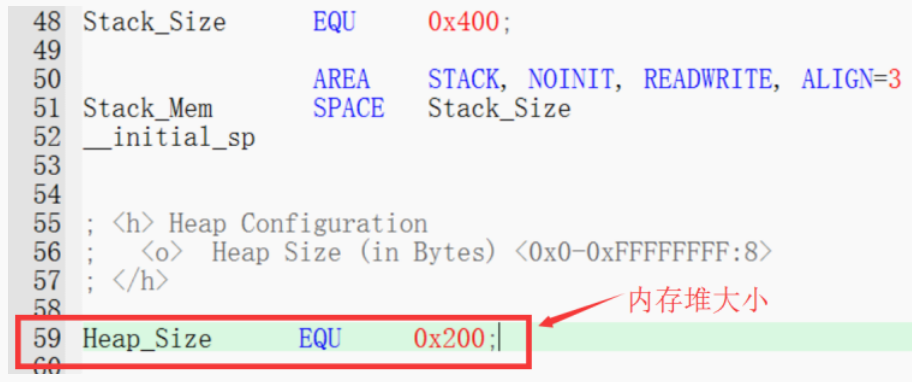

2、具有不确定性

3、可能会增加代码量。

注意，在 heap_3 中 configTOTAL_HEAP_SIZE 是没用的！

#### heap_4 内存分配方法

==heap_4 提供了一个最优的匹配算法，不像 heap_2，heap_4 会将内存碎片合并成一个大的可用内存块，它提供了内存块合并算法。==内存堆为 ucHeap[]，大小同样为 configTOTAL_HEAP_SIZE。可以通过函数 xPortGetFreeHeapSize()来获取剩余的内存大小。

**heap_4 特性如下：**

1、可以用在那些需要重复创建和删除任务、队列、信号量和互斥信号量等的应用中。

2、不会像 heap_2 那样产生严重的内存碎片，即使分配的内存大小是随机的。

3、具有不确定性，但是远比 C 标准库中的 malloc()和 free()效率高。

heap_4 非常适合于那些需要直接调用函数 pvPortMalloc()和 vPortFree()来申请和释放内存 的应用。

heap_4 **也使用链表结构来管理空闲内存块**，链表结构体与 heap_2 一样。heap_4 也定义了两个局部静态变量 xStart 和 pxEnd 来表示链表头和尾，其中 pxEnd 是指向 BlockLink_t 的指针。

#### heap_5 内存分配方法

heap_5 使用了和 heap_4 相同的合并算法，内存管理实现起来基本相同，但是 heap_5 允许内存堆跨越多个不连续的内存段。比如 STM32 的内部 RAM 可以作为内存堆，但是 STM32 内部 RAM 比较小，遇到那些需要大容量 RAM 的应用就不行了，如音视频处理。不过 **STM32 可以外接 SRAM 甚至大容量的 SDRAM**，如果使用 heap_4 的话你就只能在内部 RAM 和外部SRAM 或 SDRAM 之间二选一了，**使用 heap_5 的话就不存在这个问题，两个都可以一起作为内存堆来用。**

如果使用 heap_5 的话，在调用 API 函数之前需要先调用函数 vPortDefineHeapRegions ()来对内存堆做初始化处理，在 vPortDefineHeapRegions()未执行完之前禁止调用任何可能会调用pvPortMalloc()的 API 函数！比如创建任务、信号量、队列等函数。函数 vPortDefineHeapRegions()只有一个参数，参数是一个 HeapRegion_t 类型的数组，HeapRegion 为一个结构体，此结构体在portable.h 中有定义，定义如下：

```c
typedef struct HeapRegion
{
    uint8_t *pucStartAddress; //内存块的起始地址
    size_t xSizeInBytes; //内存段大小
} HeapRegion_t;
```

使用 heap_5 的时候在一开始就应该先调用函数 vPortDefineHeapRegions()完成内存堆的初始化！然后才能创建任务、信号量这些东西。

**总结**

FreeRTOS 官方的 5 种内存分配方法：

1. heap_1 最简单，但是只能申请内存，不能释放。
2. heap_2 提供了内存释放函数，用户代码也可以直接调用函数 pvPortMalloc()和vPortFree()来申请和释放内存，但是 heap_2 会导致内存碎片的产生！
3. heap_3 是对标准 C 库中的函数 malloc()和 free()的简单封装，并且提供了线程保护。
4. heap_4 相对与 heap_2 提供了内存合并功能，可以降低内存碎片的产生。
5. heap_5 基本上和 heap_4 一样，只是 heap_5 支持内存堆使用不连续的内存块。


