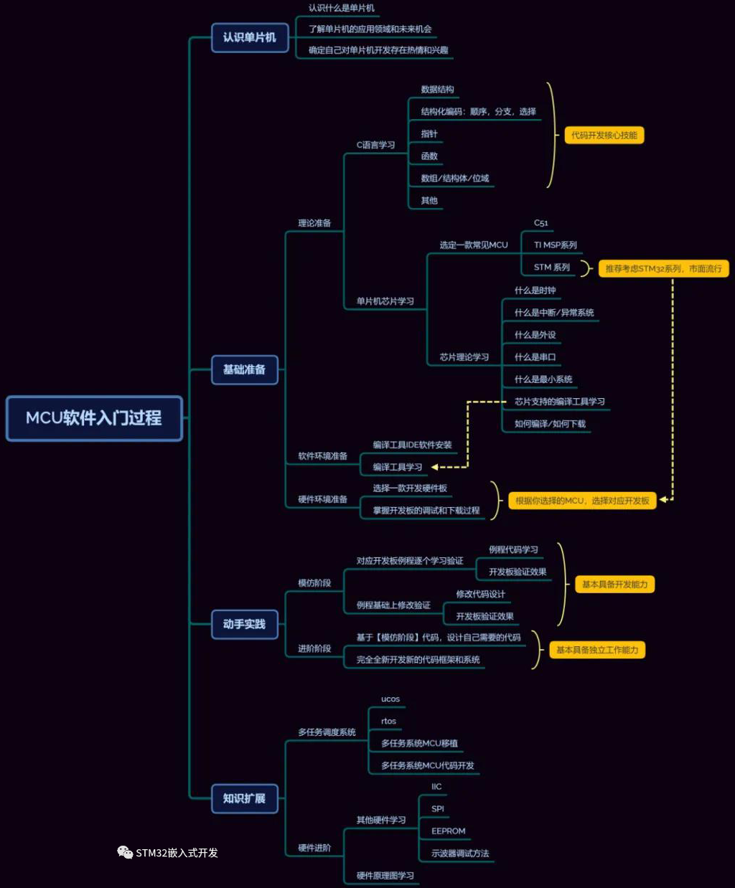

## STM32基础知识

[TOC]

------

#### 注意

- 

------

## STM32学习路线与推荐文章

https://mp.weixin.qq.com/s/bUF9goso0xDaP9WvGf0xZA

### 单片机基础知识点

对STM32 MCU理论知识的学习和理解很重要，以下是入门一款单片机的学习路线仅供参考。

> 

> 相关文章👉[EEPROM和Flash这样讲，我早就懂了](http://mp.weixin.qq.com/s?__biz=MzI1MDg4OTMwMw==&mid=2247494447&idx=5&sn=855645729363e7a5b7f6c156b9c2f66c&chksm=e9f9fe17de8e7701153b45228e800e38ba4c59b84fd794bc6291ab8cf35e9062d41d8ab10ccb&scene=21#wechat_redirect) 👉[单片机中的RAM vs ROM](http://mp.weixin.qq.com/s?__biz=MzI1MDg4OTMwMw==&mid=2247495821&idx=4&sn=77f0959fe12123d38e9bf2f9e382bd10&chksm=e9f9e5b5de8e6ca31043b6862fea1d54621e3e25988ad73dc91e48a898549838182de1d056ed&scene=21#wechat_redirect) 👉[STM32CubeMX教程-GPIO输入之外部中断](http://mp.weixin.qq.com/s?__biz=MzI1MDg4OTMwMw==&mid=2247485664&idx=1&sn=49af2b0311d8086b919be632c525eb92&chksm=e9fa1dd8de8d94ce94e28dcf07cbfe3ffaf03b3bd8afe9a0894e19ef8e1a9afaf512f6e5bdd2&scene=21#wechat_redirect) 👉[C语言操作寄存器的常见手法](http://mp.weixin.qq.com/s?__biz=MzI1MDg4OTMwMw==&mid=2247494867&idx=5&sn=502feda6c3dcf4386652f10d88633314&chksm=e9f9f9ebde8e70fd1735f73102800d2c53e8a0155f3a18dfcd99187095994dfd17a74256fa3b&scene=21#wechat_redirect) 👉[学习STM32单片机，绕不开的串口](http://mp.weixin.qq.com/s?__biz=MzI1MDg4OTMwMw==&mid=2247493921&idx=1&sn=e6450e2242bb5e087094dd2f52c52381&chksm=e9f9fc19de8e750fc303b80a700db5455c3b45eff0a76eb517df89d2f33fa0430b9003976d95&scene=21#wechat_redirect) 👉[详解CAN总线](http://mp.weixin.qq.com/s?__biz=MzI1MDg4OTMwMw==&mid=2247493488&idx=2&sn=5806032054fcd3e2e35af2addc231073&chksm=e9f9f248de8e7b5ea5846d56c019e8cd19c2e0017ded0622788e600987208b32e5165cbb4404&scene=21#wechat_redirect) 👉[详解STM32的时钟系统，收藏了](http://mp.weixin.qq.com/s?__biz=MzI1MDg4OTMwMw==&mid=2247490715&idx=1&sn=901b5a31465d89831d1155bee3632954&chksm=e9fa09a3de8d80b580e8eee62a7b107dea5d14005c1507f5b4fdce03bb7ee5df1507251f8ec9&scene=21#wechat_redirect)

### STM32工作流程

专业术语并不会多难，记住基本不会忘，就算忘了回顾下也简单，在迈过这个坎后，下一步就是理解芯片执行流程和我们要做什么才能让芯片工作起来。

- 在上电后，芯片复位启动。
- MCU从FLASH通过指令/数据总线分别读取指令和数据，配合解析执行，其中在通过RAM和通用寄存器(也就是R0~R12的内部寄存器)处理可变数据。
- 根据执行的指令，配置和操作外设的的寄存器，从而驱动对应外设实现具体的功能。
- 配合上层组合逻辑，结合外设功能，执行具体应用的全部需求。

  上述就是芯片工作的流程，而作为单片机开发者，实现的代码就是放在FLASH中的程序，由官方提供的SDK包和用户裁剪实现定义的外设驱动组成，按照上述流程就包含:

- 芯片的启动过程中对堆栈的初始化
- 系统相关外设的处理(如时钟) => 这部分由厂商提供，我们把文件放入项目即可，以STM32为例就是启动文件startup_xxx.s和系统初始化的SystemInit函数
- 配置应用需要的外设模块，如果你看网上的教学视频，都是从这一步直接开始的，特别是STM32基于STM32CubeMx的实现，会告诉你这么写是满足要求的

如果你不是愿意深究的人倒也无所谓，当你深究这东西的时候，就会发现没有人告诉为什么要这么写，迷惑自然就来了，其实这部分就是嵌入式所谓的经验成分。

>   相关文章👉[STM32代码的启动过程](http://mp.weixin.qq.com/s?__biz=MzI1MDg4OTMwMw==&mid=2247493548&idx=2&sn=f23366851334e82a4003eea56ab4e67c&chksm=e9f9f294de8e7b821a56ea0557349b41eaf8881cfe923a24542845a254d4479032ad5518b0c4&scene=21#wechat_redirect) 👉[详解STM32启动文件](http://mp.weixin.qq.com/s?__biz=MzI1MDg4OTMwMw==&mid=2247494889&idx=3&sn=1aca7d45a873c84fd58d362c41c4649e&chksm=e9f9f9d1de8e70c76a8aadb4eb84a595bcfefa662f07789c00c1b15d3657d94e0c47516c26b6&scene=21#wechat_redirect) 👉[STM32CubeMX介绍](http://mp.weixin.qq.com/s?__biz=MzI1MDg4OTMwMw==&mid=2247485809&idx=1&sn=4a43f461d1a4582b8cca04feb7df15dc&chksm=e9fa1c49de8d955fe3c5009f50bd69b16d7aa1ae2d985b69d06b78ad0becbfb33e79799a6e1f&scene=21#wechat_redirect) 👉[STM32实例-用按键控制串口发送数据，文末附代码](http://mp.weixin.qq.com/s?__biz=MzI1MDg4OTMwMw==&mid=2247495643&idx=1&sn=d48c4d6dba9aaa909d47ae8e74521851&chksm=e9f9fae3de8e73f565824ff3a5d3377094e8e8fee51281a20a2910caf78121f3b93645af874f&scene=21#wechat_redirect) 👉[详解STM32单片机的堆栈](http://mp.weixin.qq.com/s?__biz=MzI1MDg4OTMwMw==&mid=2247495515&idx=4&sn=7c874d7ec0aabbdc06e31e08e7a4397c&chksm=e9f9fa63de8e7375392343385985c4646d2ad77684c1fbe5476d197c024a8f2cea0c34a832da&scene=21#wechat_redirect)

如大部分外设模块都要进行时钟使能，GPIO就要配置引脚的上拉/下拉，推挽/开漏，USART配置模式，波特率，奇偶校验，停止位，数据位，还要考虑对应GPIO的端口复用，I2C就要考虑主从模式，根据需要的传输速率确定模块时钟，SDRAM除了考虑引脚复用，时序，还要计算刷新时间来保证数据的稳定，这些知识理论上都是长期在工作中积累出来的。

在项目需求确定后，根据芯片和器件选型，就能够确定硬件PCB的绘图和布置，功能需求也能确定，如访问外部EPPROM，那么I2C就确定为主模式，并根据EPPROM的读写时序和芯片的性能，考虑到效率和稳定的平衡，就可以确定I2C的速率，考虑布局和其它需求，I2C对应的复用引脚也能确定。

事实上，==对于真实项目，都是从需求=>项目计划书=>软硬件框架=>软件驱动==

### 上层应用逻辑实现

配合外设的应用逻辑实现其实才是项目中最复杂的部分，包含中断前后台系统的交互，可能存在RTOS应用和协议移植，GUI的管理操作，和其它模块如wifi模块，蓝牙模块的交互，不过这部分属于进阶内容，当你对外设模块有一定认知后，这部分应该也会有自己的学习方法，这里我就不在赘述。

> 推荐下相关参考文章👉[一种STM32框架，实现RTOS的部分功能](http://mp.weixin.qq.com/s?__biz=MzI1MDg4OTMwMw==&mid=2247495911&idx=1&sn=d0c445082285adde149fd4352939dd77&chksm=e9f9e5dfde8e6cc94e9860682ba93f7b292fc8864612dca296f687e558e1a13a53b238aca72d&scene=21#wechat_redirect) 👉[STM32平衡小车，文末附代码、电路图等资源获取方式](http://mp.weixin.qq.com/s?__biz=MzI1MDg4OTMwMw==&mid=2247495644&idx=2&sn=d7cc88c7df2b4584a50331ffea454167&chksm=e9f9fae4de8e73f21a45a2841aa8bdc48f4a5a99534770f6b4ed88483069e22c33943c793cfb&scene=21#wechat_redirect) 👉[使用STM32CubeMx工具，写FreeRTOS的demo程序](http://mp.weixin.qq.com/s?__biz=MzI1MDg4OTMwMw==&mid=2247494831&idx=2&sn=8af69cd96873b48eed51a0e95b975d32&chksm=e9f9f997de8e7081439bbd58970601a35c111ea7415a19f2b012836b38f2caba040abcd2e661&scene=21#wechat_redirect)

这只是我对单片机问题关于自己理解的总结，单片机虽然并不需要创新研发未知的技术，但却涉及从芯片底层到软件接口的全部实现，包含对现代计算机技术中向微处理器方向的全部精华技术，也是需要不断学习才能不被时代抛弃。

先从STM32理论知识入手，拿实例代码在实验板验证，来加深对外设、协议等理论知识的理解。过程可能很慢，但是基础知识肯定会打的很扎实，相信对后面开发会有很大的帮助。

## STM32芯片的内部架构

 STM32芯片主要由内核和片上外设组成，STM32F103采用的是Cortex-M3内核，内核由ARM公司设计。STM32的芯片生产厂商ST，负责在内核之外设计部件并生产整个芯片。这些内核之外的部件被称为核外外设或片上外设，如 GPIO、USART（串口）、I2C、SPI 等。

芯片内部架构示意图

  芯片内核与外设之间通过各种总线连接，其中驱动单元有 4 个，被动单元也有 4 个，具体如上图所示。可以把驱动单元理解成是内核部分，被动单元都理解成外设。

**ICode 总线**

  ICode总线是专门用来取指令的，其中的I表示Instruction（指令），指令的意思。写好的程序编译之后都是一条条指令，存放在 FLASH中，内核通过ICode总线读取这些指令来执行程序。

**DCode总线**

  DCode这条总线是用来取数的，其中的D表示Data（数据）。在写程序的时候，数据有常量和变量两种。常量就是固定不变的，用C语言中的const关键字修饰，放到内部FLASH当中。变量是可变的，不管是全局变量还是局部变量都放在内部的SRAM。

**系统System总线**

  我们通常说的寄存器编程，即读写寄存器都是通过系统总线来完成的，系统总线主要是用来访问外设的寄存器。

**DMA总线**

  DMA总线也主要是用来传输数据，这个数据可以是在某个外设的数据寄存器，可以在SRAM，可以在内部FLASH。

  因为数据可以被Dcode总线，也可以被DMA总线访问，为了避免访问冲突，在取数的时候需要经过一个总线矩阵来仲裁，决定哪个总线在取数。

**内部的闪存存储器Flash**

  内部的闪存存储器即FLASH，编写好的程序就放在这个地方。内核通过ICode总线来取里面的指令。

**内部的SRAM**

  内部的SRAM，是通常所说的内存，程序中的变量、堆栈等的开销都是基于内部SRAM，内核通过DCode总线来访问它。

**FSMC**

  FSMC的英文全称是Flexible static memory controller（灵活的静态的存储器控制器）。通过FSMC可以扩展内存，如外部的SRAM、NAND-FLASH和NORFLASH。但FSMC只能扩展静态的内存，不能是动态的内存，比如就不能用来扩展SDRAM。

**AHB**

  从AHB总线延伸出来的两条APB2和APB1总线是最常见的总线，GPIO、串口、I2C、SPI 这些外设就挂载在这两条总线上。这个是学习STM32的重点，要学会对这些外设编程，去驱动外部的各种设备。

