## CAN总线 - HQ

[TOC]

------

#### 注意

- 

------

## 一文带你了解 CAN 总线

https://mp.weixin.qq.com/s/l3K3SmV-28MX9aDrfFjibg

### 一、CAN 简介

CAN：Controller Area Network，控制局域网络，最早由德国 BOSCH(博世)开发，，目前已经是国际标准(ISO 11898)，是当前应用最广泛的现场总线之一。

BOSCH 主要是做汽车电子的，因此 CAN 一开始主要是为汽车电子准备的，事实也是如此，CAN 协议目前已经是汽车网络的标准协议。当然了，CAN 不仅仅应用于汽车电子，经过几十年的发展，CAN 协议的高性能和高可靠性已经得到了业界的认可，目前除了汽车电子以外也广泛应用于工业自动化、医疗、工业和船舶等领域。

以汽车电子为例，汽车上有空调、车门、发动机、大量传感器等，这些部件都是通过 CAN总线连在一起形成一个网络，车载网络结构如图：

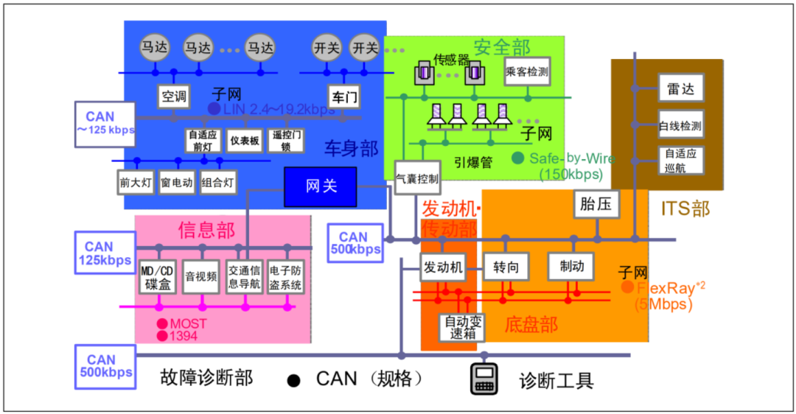

图中各个单元通过 CAN 总线连接在一起，每个单元都是独立的 CAN 节点。同一个 CAN 网络中所有单元的通信速度必须一致，不同的网络之间通信速度可以不同。比如图中 125Kbps 的 CAN 网络下所有的节点速度都是 125Kbps 的，整个网络由一个网关与其他的网络连接。

**CAN 协议具有一下特点：**

**1） 多主控制**。在总线空闲时，所有单元都可以发送消息（多主控制），而两个以上的单元同时开始发送消息时，根据标识符（Identifier 以下称为 ID）决定优先级。ID 并不是表示发送的目的地址，而是表示访问总线的消息的优先级。两个以上的单元同时开始发送消息时，对各消息 ID 的每个位进行逐个仲裁比较。仲裁获胜（被判定为优先级最高）的单元可继续发送消息，仲裁失利的单元则立刻停止发送而进行接收工作。

**2） 系统的柔软性**。与总线相连的单元没有类似于“地址”的信息。因此在总线上增加单元时，连接在总线上的其它单元的软硬件及应用层都不需要改变。

**3） 通信速度较快，通信距离远**。最高 1Mbps（距离小于 40M），最远可达 10KM（速率低于 5Kbps）。

**4） 具有错误检测、错误通知和错误恢复功能**。所有单元都可以检测错误（错误检测功能），检测出错误的单元会立即同时通知其他所有单元（错误通知功能），正在发送消息的单元一旦检测出错误，会强制结束当前的发送。强制结束发送的单元会不断反复地重新发送此消息直到成功发送为止（错误恢复功能）。

**5） 故障封闭功能**。CAN 可以判断出错误的类型是总线上暂时的数据错误（如外部噪声等）还是持续的数据错误（如单元内部故障、驱动器故障、断线等）。由此功能，当总线上发生持续数据错误时，可将引起此故障的单元从总线上隔离出去。

**6） 连接节点多**。CAN 总线是可同时连接多个单元的总线。可连接的单元总数理论上是没有限制的。但实际上可连接的单元数受总线上的时间延迟及电气负载的限制。降低通信速度，可连接的单元数增加；提高通信速度，则可连接的单元数减少。

#### 二、CAN 电气属性

CAN 总线使用两根线来连接各个单元：CAN_H 和 CAN_L，CAN 控制器通过判断这两根线上的电位差来得到总线电平，CAN 总线电平分为显性电平和隐性电平两种。显性电平表示逻辑“0”，此时 CAN_H 电平比 CAN_L 高，分别为 3.5V 和 1.5V，电位差为 2V。隐形电平表示逻辑“1”，此时 CAN_H 和 CAN_L 电压都为 2.5V 左右，电位差为 0V。CAN 总线就通过显性和隐形电平的变化来将具体的数据发送出去，如图所示：

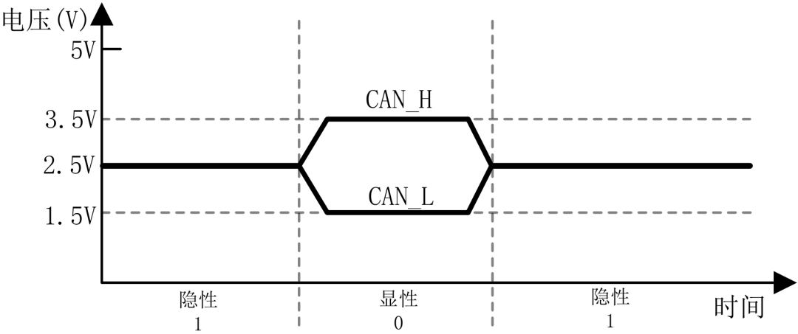

CAN 总线上没有节点传输数据的时候一直处于隐性状态，也就是说总线空闲状态的时候一直处于隐性。CAN 网络中的所有单元都通过 CAN_H 和 CAN_L 这两根线连接在一起，如图所示：

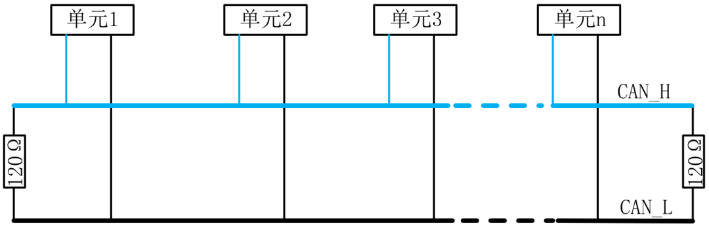

途中所有的 CAN 节点单元都采用 CAN_H 和 CAN_L 这两根线连接在一起，CAN_H 接CAN_H、CAN_L 接 CAN_L，CAN 总线两端要各接一个 120Ω的端接电阻，用于匹配总线阻抗，吸收信号反射及回拨，提高数据通信的抗干扰能力以及可靠性。

CAN 总线传输速度可达 1Mbps/S，最新的 CAN-FD 最高速度可达 5Mbps/S，甚至更高，感兴趣的可以自行查阅相关资料。CAN 传输速度和总线距离有关，总线距离越短，传输速度越快。

### 三、CAN 协议

通过 CAN 总线传输数据是需要按照一定协议进行的，CAN 协议提供了 5 种帧格式来传输数据：数据帧、遥控帧、错误帧、过载帧和帧间隔。其中数据帧和遥控帧有标准格式和扩展格式两种，标准格式有 11 位标识符(ID)，扩展格式有 29 个标识符(ID)。这 5 中帧的用途见表：

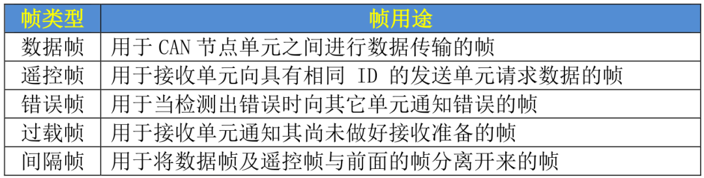

#### 1、数据帧

数据帧由 7 段组成：

①、帧起始，表示数据帧开始的段。②、仲裁段，表示该帧优先级的段。③、控制段，表示数据的字节数及保留位的段。④、数据段，数据的内容，一帧可发送 0~8 个字节的数据。⑤、CRC 段，检查帧的传输错误的段。⑥、ACK 段，表示确认正常接收的段。⑦、帧结束，表示数据帧结束的段。

数据帧结构如图所示：

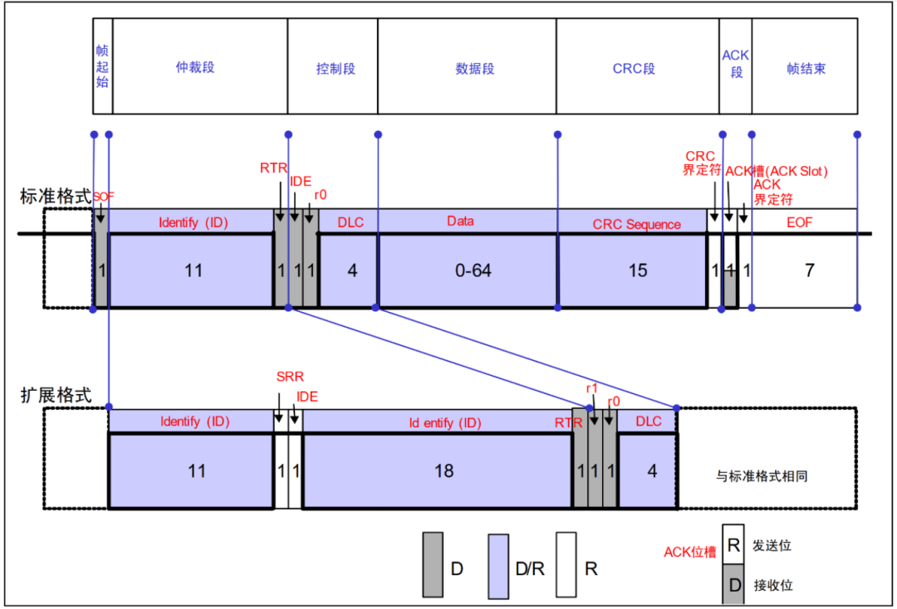

图给出了数据帧标准格式和扩展格式两种帧结构，图中 D 表示显性电平 0、R 表示隐性电平 1，D/R 表示显性或隐性，也就是 0 或 1，我们来简单分析一下数据帧的这 7 个段。

①、帧起始

帧起始很简单，标准格式和扩展格式都是由一个位的显性电平 0 来表示帧起始。

②、仲裁段

仲裁段表示帧优先级，仲裁段结构如图所示：

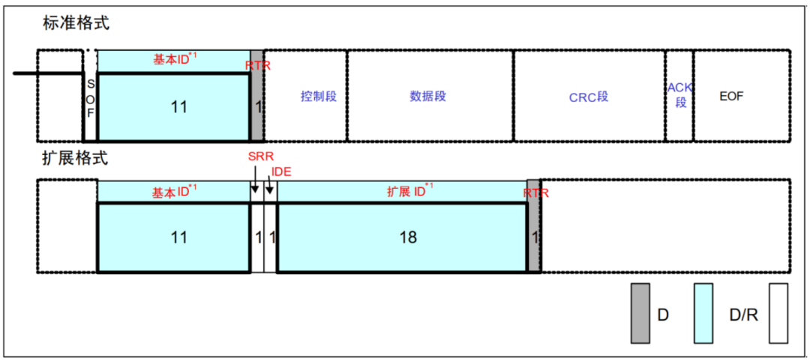

标准格式和扩展格式的仲裁段不同，从图可以看出，标准格式的 ID 为 11 位，发送顺序是从 ID10 到 ID0，最高 7 位 ID10~ID4 不能全为隐性(1)，也就是禁止 0X1111111XXXXX这样的 ID。扩展格式的 ID 为 29 位，基本 ID 从 ID28 到 ID18，扩展 ID 由 ID17 到 ID0，基本ID 与标准格式一样，禁止最高 7 位都为隐性。

③、控制段

控制段由 6 个位构成，表示数据段的字节数，标准格式和扩展格式的控制段略有不同，如图所示：

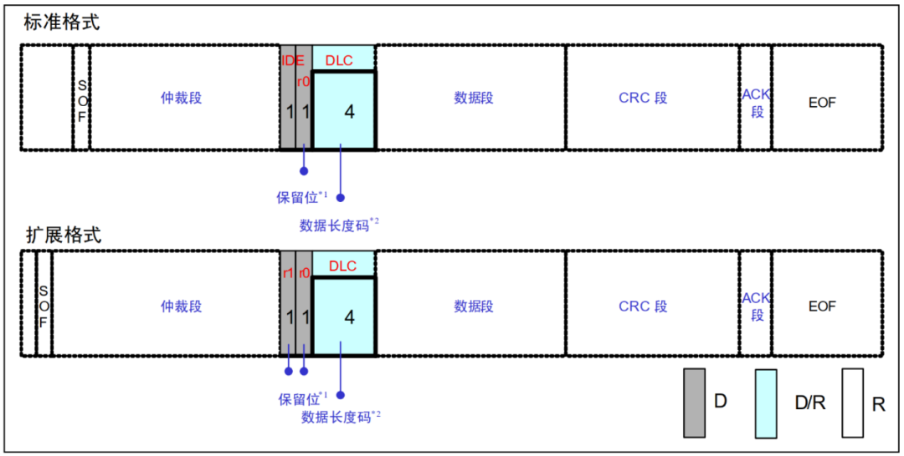

图中 r1 和 r0 为保留位，保留位必须以显性电平发送。DLC 为数据长度，高位在前，DLC 段有效值范围为 0~8。

④、数据段

数据段也就是帧的有效数据，标准格式和扩展格式相同，可以包含 0~8 个字节的数据，从最高位(MSB)开始发送，结构如图所示：

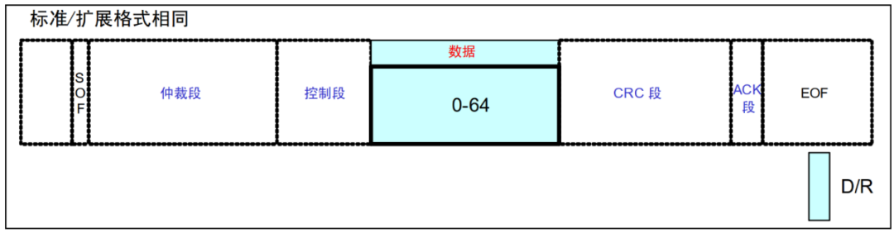

注意，图中数据段的 0~64 为 bit，对应到字节就是 0~8 字节。

⑤、CRC 段

CRC 段保存 CRC 校准值，用于检查帧传输错误，标准格式和扩展格式相同，CRC 段结构如图所示：

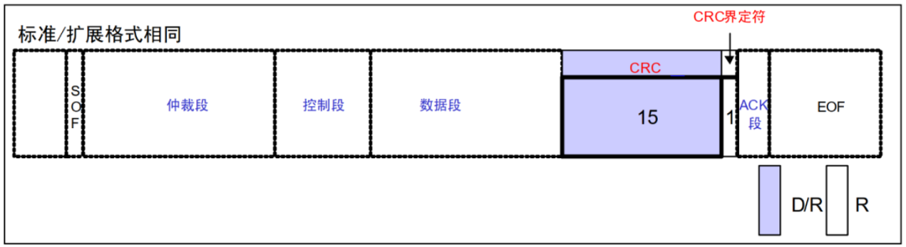

从图可以看出，CRC 段由 15 位的 CRC 值与 1 位的 CRC 界定符组成。CRC 值的计算范围包括：帧起始、仲裁段、控制段、数据段，接收方以同样的算法进行计算，然后用计算得到的 CRC 值与此 CRC 段进行比较，如果不一致的话就会报错。

⑥、ACK 段

ACK 段用来确认接收是否正常，标准格式和扩展格式相同，ACK 段结构如图所示：

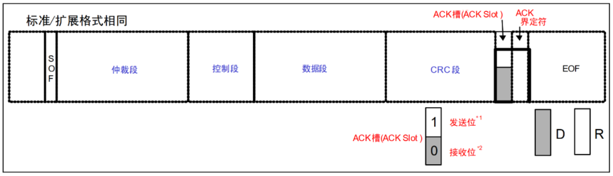

从图可以看出，ACK 段由 ACK 槽(ACK Slot)和 ACK 界定符两部分组成。发送单元的 ACK，发送 2 个隐性位，而接收到正确消息的单元在 ACK 槽（ACK Slot）发送显性位，通知发送单元正常接收结束，这个过程叫发送 ACK/返回 ACK。发送 ACK 的是所有接收单元中接收到正常消息的单元，所谓正常消息是指不含填充错误、格式错误、CRC 错误的消息，这些接收单元既不处于总线关闭态也不处于休眠态的所有接收单元中。

⑦、帧结束

最后就是帧结束段，标准格式和扩展格式相同，帧结束段结构如图所示：

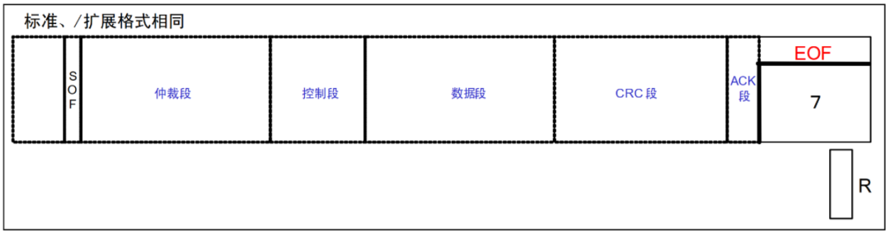

从图可以看出，帧结束段很简单，由 7 位隐性位构成。

#### 2、遥控帧

接收单元向发送单元请求数据的时候就用遥控帧，遥控帧由 6 个段组成：

①、帧起始，表示数据帧开始的段。②、仲裁段，表示该帧优先级的段。③、控制段，表示数据的字节数及保留位的段。④、CRC 段，检查帧的传输错误的段。⑤、ACK 段，表示确认正常接收的段。⑥、帧结束，表示数据帧结束的段。

遥控帧结构如图所示：

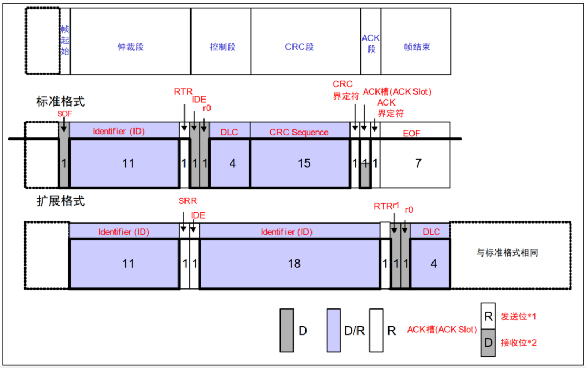

从图可以看出，遥控帧结构基本和数据帧一样，最主要的区别就是遥控帧没有数据段。遥控帧的 RTR 位为隐性的，数据帧的 RTR 位为显性，因此可以通过 RTR 位来区分遥控帧和没有数据的数据帧。遥控帧没有数据，因此 DLC 表示的是所请求的数据帧数据长度，遥控帧的其他段参考数据帧的描述即可。

#### 3、错误帧

当接收或发送消息出错的时候使用错误帧来通知，错误帧由错误标志和错误界定符两部分组成，错误帧结构如图所示：

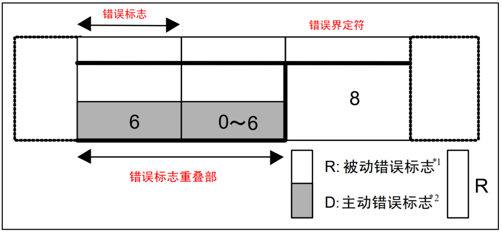

错误标志有主动错误标志和被动错误标志两种，主动错误标志是 6 个显性位，被动错误标志是 6 个隐性位，错误界定符由 8 个隐性位组成。

#### 4、过载帧

接收单元尚未完成接收准备的话就会发送过载帧，过载帧由过载标志和过载界定符构成，过载帧结构如图所示：

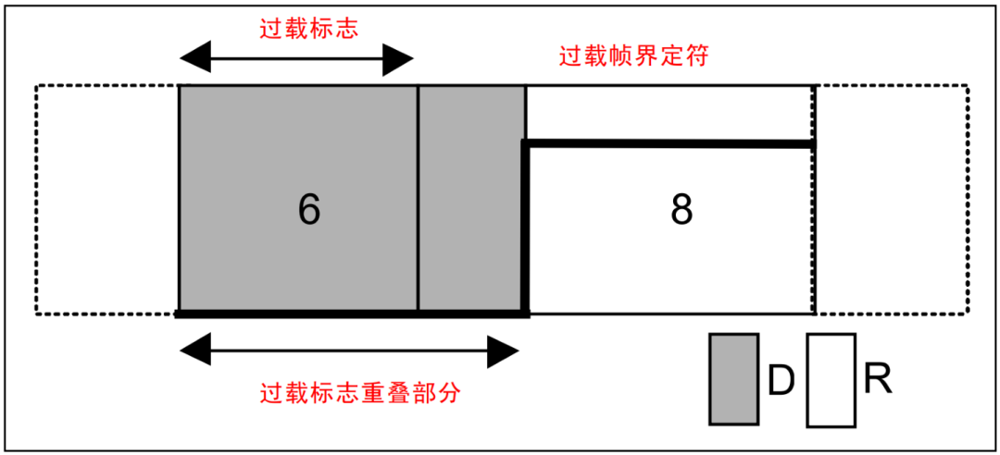

过载标志由 6 个显性位组成，与主动错误标志相同，过载界定符由 8 个隐性位组成，与错误帧中的错误界定符构成相同。

#### 5、帧间隔

帧间隔用于分隔数据帧和遥控帧，数据帧和遥控帧可以通过插入帧间隔来将本帧与前面的任何帧隔开，过载帧和错误帧前不能插入帧间隔，帧间隔结构如图所示：

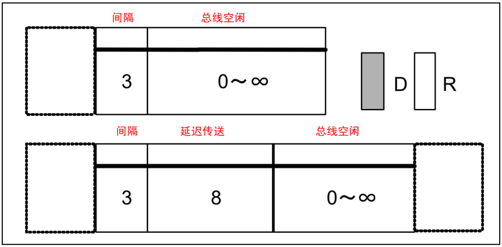

图中间隔由 3 个隐性位构成，总线空闲为隐性电平，长度没有限制，本状态下表示总线空闲，发送单元可以访问总线。延迟发送由 8 个隐性位构成，处于被动错误状态的单元发送一个消息后的帧间隔中才会有延迟发送。

### 四、CAN 速率

CAN 总线以帧的形式发送数据，但是最终到总线上的就是“0”和“1”这样的二进制数据，这里就涉及到了通信速率，也就是每秒钟发送多少位数据，前面说了 CAN2.0 最高速度为 1Mbps/S。对于 CAN 总线，一个位分为 4 段：

①、同步段(SS)

②、传播时间段(PTS)

③、相位缓冲段 1(PBS1)

④、相位缓冲段 2(PBS2)

这些段由 Tq(Time Quantum)组成，Tq 是 CAN 总线的最小时间单位。帧由位构成，一个位由 4 个段构成，每个段又由若干个 Tq 组成，这个就是位时序。1 位由多少个 Tq 构成、每个段又由多少个 Tq 构成等，可以任意设定位时序。通过设定位时序，多个单元可同时采样，也可任意设定采样点。各段的作用和 Tq 数如图所示：

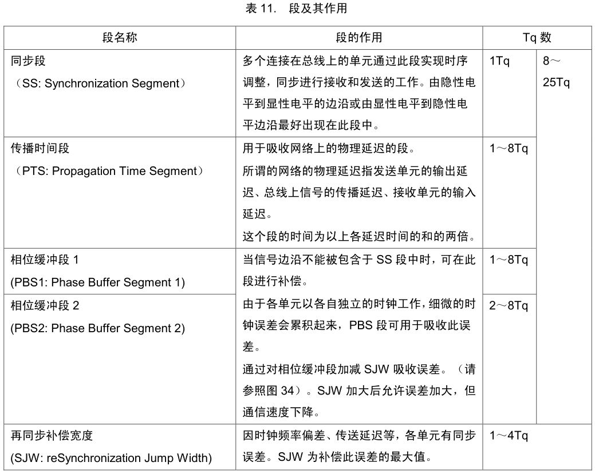

1 个位的构成如图所示：

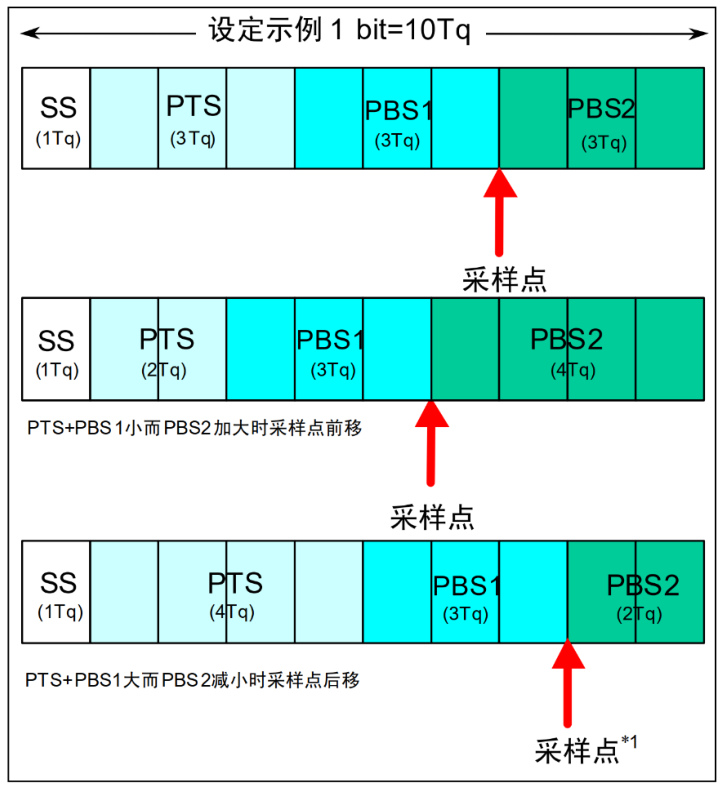

图中的采样点是指读取总线电平，并将读到的电平作为位值的点。位置在 PBS1结束处。根据这个位时序，我们就可以计算 CAN 通信的波特率了。具体计算方法，我们等下再介绍，前面提到的 CAN 协议具有仲裁功能，下面我们来看看是如何实现的。

在总线空闲态，最先开始发送消息的单元获得发送权。

当多个单元同时开始发送时，各发送单元从仲裁段的第一位开始进行仲裁。连续输出显性电平最多的单元可继续发送。实现过程，如图所示：

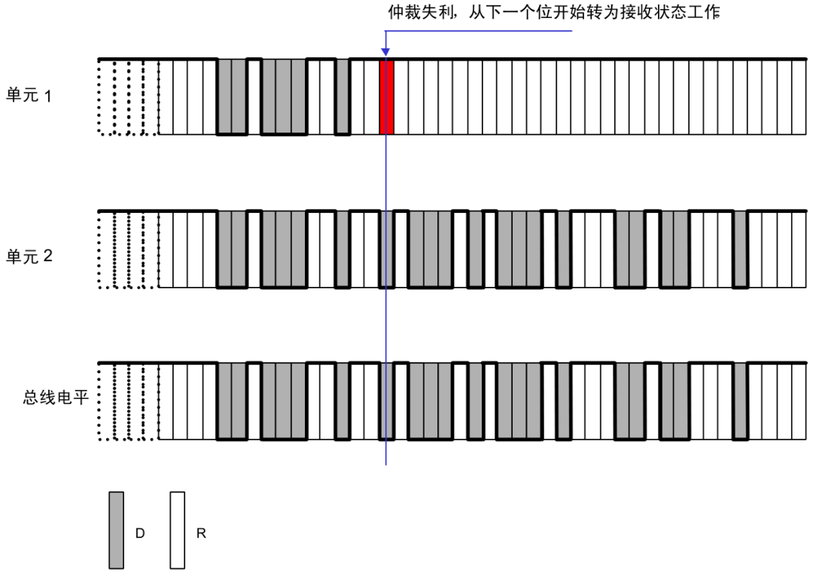

图中，单元 1 和单元 2 同时开始向总线发送数据，开始部分他们的数据格式是一样的，故无法区分优先级，直到 T 时刻，单元 1 输出隐性电平，而单元 2 输出显性电平，此时单元 1 仲裁失利，立刻转入接收状态工作，不再与单元 2 竞争，而单元 2 则顺利获得总线使用权，继续发送自己的数据。这就实现了仲裁，让连续发送显性电平多的单元获得总线使用权。

