## I2C总线 - HQ

[TOC]

------

#### 注意

- I2C 系列文章分为两部分：I2C spec 、 I2C driverI2C spec 已写完，分为六篇文章：
  - http://www.linuxer.vip/i2c-bus-spec/
  - http://www.linuxer.vip/i2c-bus-spec2/
  - http://www.linuxer.vip/i2c-bus-spec3/
  - http://www.linuxer.vip/i2c-bus-spec4/
  - http://www.linuxer.vip/i2c-bus-spec5/
  - http://www.linuxer.vip/i3c/

- 想要深入探讨 I2C 协议，必须深刻理解各种时间的定义，有的时候即便你i2c设备驱动没问题，但是调了i2c_transfer后发现还是传输失败，就是因为这些时间参数不符合从设备要求，需要在i2c控制器驱动中修改这些参数。

------

## I2C(一)：I2C bus spec

I2C 系列文章主要分为两个部分来写：

1、I2C bus spec：专注于 I2C 协议本身，研究它的传输机制，硬件。

2、I2C driver：研究 Linux I2C 的软件驱动，包括总线驱动和设备驱动两部分。

目录如下

**I2C spec**

I2C Introduction
I2C Architecture
I2C Transfer
I2C Synchronization And Arbitration
I2C Hs-mode
I3C Introduction
I3C Protocol

**I2C driver**

I2C SW Architecture
I2C Data Structure
12C Register Flow
12C Data Transfer

**I2C Introduction**

**I2C 历史**

1、I2C：Inter-Integrated Circuit，集成电路总线。
2、I2C 是 Philips 公司在 1982 年为主机板、嵌入式系统开发的一种简单、双向二线制同步串行总线。
3、Philips 半导体事业部就是现在的 NXP。
4、I2C 的专利在 2006 年 11 月 1 日起已经到期，大家可以免费使用
5、Intel 1995 年推出的 I2C 兼容总线（System Managerment Bus），即 SMBus 或 SMB
6、最新版本 I2C v.6 于 2014.04.04 推出

**I2C 的未来**

1、MIPI 协会在 2014 年左右定稿了 I3C (improved Inter Integrated Circuit)规范，I3C 在 I2C 的规格上建立了功能超集，支持高传输速率模式 12.5MHz
2、当前不论是 Soc 厂商，还是 device 厂商，都已经开始或正在向 I3C 过度

I2C 是一种低速、串行总线，有 SDA(串行数据线) 和 SCL(串行时钟线) 两条信号线，半双工通信。通信速度如下：

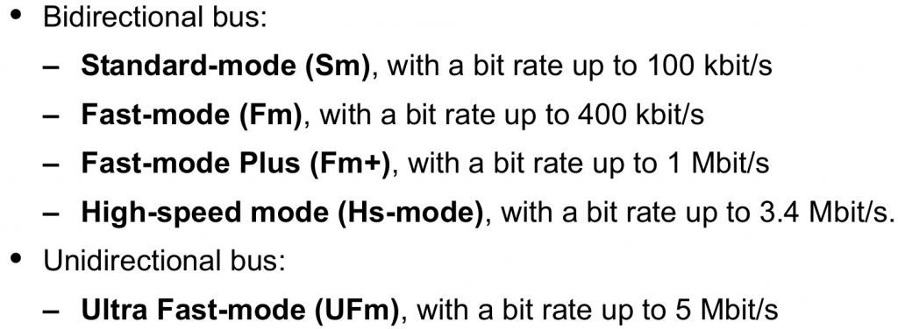

速度由 SCL 决定，不同模式对上升沿的要求不一样，上升沿由上拉电阻和等效电容决定（RC）

I2C 是一种多主从架构总线
1、I2C 的读写均有 master 端发起。
2、I2C 通信的每一个 byte（8bits）都需要 slaver 端的回应 ACK/NACK 作为回应
3、多 master 端需要引入仲裁机制
4、slaver 端通过设备地址区分，有 7bits 和 10 bits 等地址，还有一种 8bits 地址，实际上是 7bits + 读写位。【7位地址 = 种类型号（4bit）+ 寻址码（3bit）】

**I2C 总线能挂多少设备？**

理论上：
7-bit address ：2 的 7 次方，能挂 128 个设备。
10-bit address ：2 的 10 次方，能挂 1024 个设备。

但是I2C协议规定，总线上的电容不可以超过 400pF。管脚都是有输入电容的，PCB上也会有寄生电容，所以会有一个限制。

实际设计中经验值大概是不超过**8个器件**。

总线之所以规定电容大小是因为，I2C 使用的GPIO为开漏结构，要求外部有电阻上拉，电阻和总线电容产生了一个 RC 延时效应，**电容越大信号的边沿就越缓**，有可能带来信号质量风险。传输速度越快，信号的窗口就越小，上升沿下降沿时间要求更短更陡峭，所以 RC 乘积必须更小。

note：要把预留设备地址去除，保留地址如下：

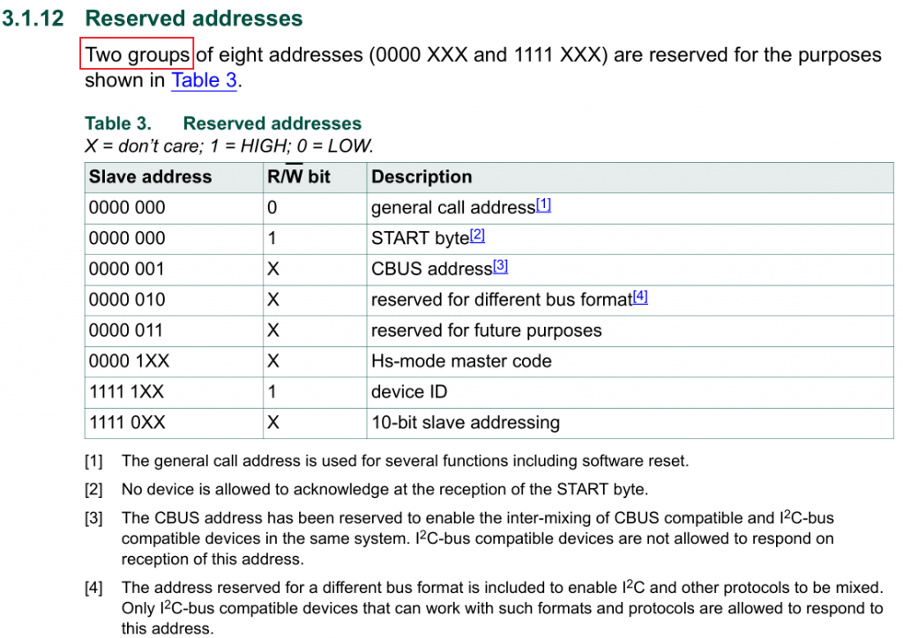

**参考：**

《I2C 总线规范.pdf》周立功

《I2C-bus specification and user manual.pdf》NXP

《I.MX6U嵌入式驱动开发指南.pdf》正点原子

https://www.cnblogs.com/gcws/p/8995542.html

https://blog.csdn.net/u010027547/article/details/47779975

https://blog.csdn.net/weixin_43555423/article/details/90739753


## I2C(二)：I2C bus spec

**I2C Architecture**

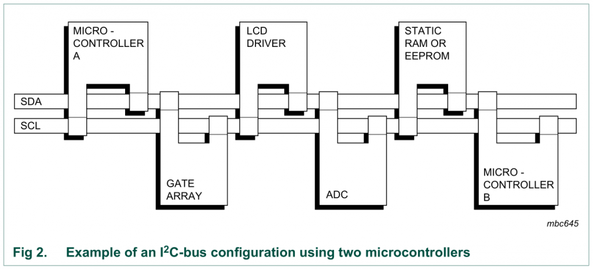


I2C 采用的 GPIO 一般为开漏模式，支持线与功能，但是开漏模式无法输出高电平，所以外部上拉。Vdd 可以采用 5V、3.3V、1.8V 等，电源电压不同，上拉电阻阻值也不同。

一般总线上认为，低于0.3Vdd为低电平，高于0.7Vdd为高电平。

**推挽结构和开漏结构**

**推挽结构**：使用两个三极管或 MOSFET，以推挽方式存在于电路中。电路工作时，两只对称的开关管每次只有一个导通，所以导通损耗小、效率高。输出既可以向负载灌电流，也可以从负载抽取电流。推拉式输出级既提高电路的负载能力，又提高开关速度。


上面是 NPN 型三极管，下面是 PNP 型三极管。分别有以下两种情况：

控制端输出高电平：向负载灌电流。


输出低电平：从负载拉电流。


推挽结构中，采用三极管和采用MOS管，效果类似，不赘述。

**开漏结构**（OD）：对比推挽结构，开漏结构只有一个三极管或者MOS管。

之所以叫开漏，是因为MOS管分为三极：源极、栅极、漏极。漏极开路输出，所以叫开漏结构；如果是三极管：基极、集电极、发射极，集电极开路，所以叫开集输出（OC）。

开集输出，NPN 管：

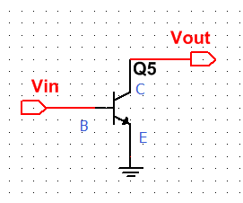

这个结构很好分析：Vin输出高电平，三极管导通，对外输出低电平，外部被直接拉到低。Vin输出低电平，集电极（C）开路，输出电平状态由外部决定。（这是硬件逻辑，软件写0是输出低电平，写1输出高阻态）


以上分析均采用三极管，MOS管类似。

因此，推挽结构可以输出高低电平。开漏输出只能输出低电平，高电平由外部电路决定。

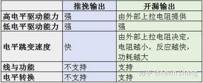

上图可知，前两行已经解释过。

电平跳变速度，推挽输出由CPU控制，高低电平跳变速度快（0->1），开漏输出由外部上拉电阻决定，上拉电阻小，反应速度快，从低电平到高电平跳变速度就快，但电阻小电流就大，够好就高，反之亦然。所以开漏输出的外部上拉电阻要兼顾速度和功耗。

线与功能：

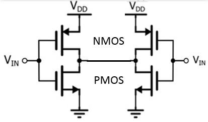

假如推挽结构，两个GPIO口连接到一根线上，假如左边的PMOS导通，右边的NMOS导通，Vdd就会通过两个MOS管直接接地，由于MOS管导通电阻不大，会导致电流很大，直接损坏这两个GPIO口，因此，推挽输出不支持线与。


线与：所有 GPIO 输出高就是高，只要有一个输出低，整条线上面的都是低，这就是“与”的意思。

推挽结构在这种情况下会损坏GPIO口。

开漏：假如很多GPIO是开漏结构，接到了一根线。开漏结构输出的高电平靠外部上拉，假如有一个GPIO接地，那么电流会通过上拉电阻流进GPIO口接地，因为有上拉电阻的存在，所以不会损坏GPIO口。

电平转换：推挽输出输出的高低电平只有0和Vdd，开漏输出的高电平由外部上拉电阻决定，多少V都可以，只要不超过MOS管击穿电压。

线与，是 I2C 协议的基础！线与：当总线上只要有一个设备输出低电平，整条总线便处于低电平状态，这时候总线被称为占用状态。


**上拉电阻计算**

1、上拉电阻过小，电流增大，端口输出低电平增大。

2、上拉电阻过大，上升沿时间增大，方波可能会变成三角波。

因此计算出一个精确的上拉电阻阻值是非常重要的。

计算上拉电阻的阻值，是有明确计算公式的：


最大电阻和上升沿时间 tr 、总线电容 Cb 、标准上升沿时间 0.8473 有关。

最小电阻和电源Vdd电压、GPIO口自己最大输出电压 Vol、 GPIO口自己最大电流 Vol 有关。

查《I2C-bus specification and user manual.pdf》7.1节：

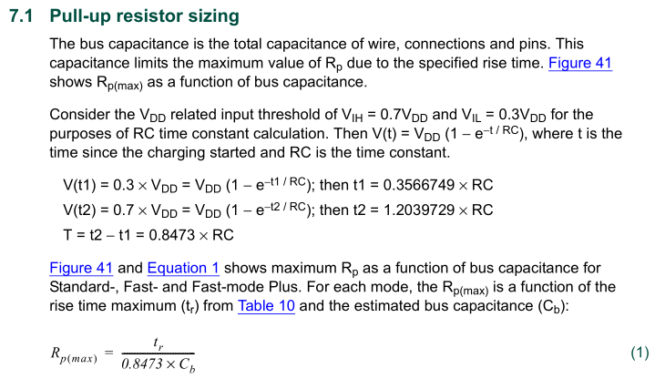


查《I2C-bus specification and user manual.pdf》表10：


1、标准模式：0~100KHz，上升沿时间 tr = 1us

2、快速模式：100~400KHz，上升沿时间 tr = 0.3us

3、高速模式：up to 3.4MHz，上升沿时间 tr = 0.12us

由此公式，假设 Vdd 是 1.8V 供电，Cb总线电容是200pF（虽然协议规定负载电容最大400pF，实际上超过200pF波形就很不好，我们以200pF来计算）

标准模式 ：


快速模式：


高速模式：


最小电阻（Vdd越大，上拉电阻就要越大）：


注意，高速模式下，电源电压一般采用 1.8 V，不会采用 3.3V，因为如果用 3.3V 计算你会发现最小电阻比最大电阻大。

采用**合适的电源电压和合适的上拉电阻**，才会让你的 I2C 传输信号最优。上拉电阻选小了，会使得总线电流大，端口输出的低电平会变大（一般低电平不允许超过0.4V）。上拉电阻选大了（RC），上升时间增大，方波变三角波。

大家在不同速率采用的电阻一般有以下几种：1.5K、2.2K、4.7K。

**上拉电阻关系图**

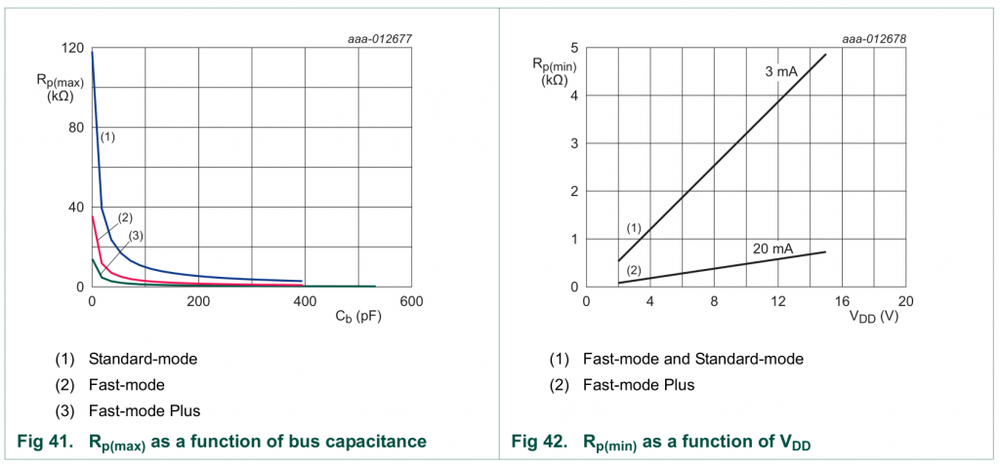

一般较少会用到 高速模式（HS），因为这种模式协议比较复杂，不过 HS 模式依旧向下兼容。


## I2C(三)：I2C bus spec

**Definition of timing**

想要深入探讨 I2C 协议，必须深刻理解各种时间的定义（F/S-mode）

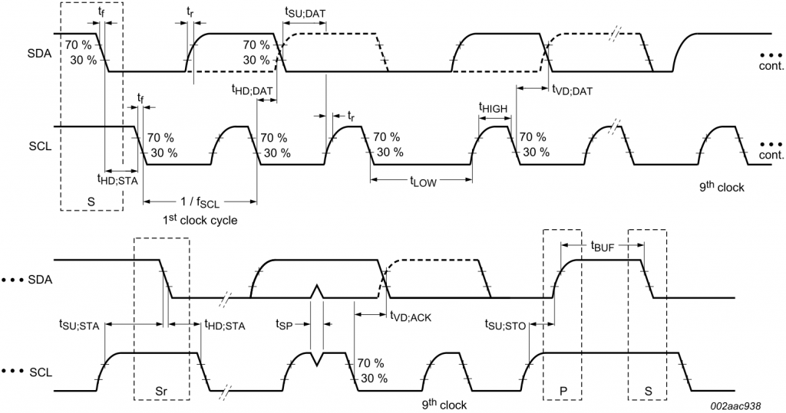

note：低电平 0.3Vdd 以下，高电平 0.7Vdd 以上。

tf：信号下降时间。

tr：信号上升时间。

tLOW：信号低电平时间。

tHIGH：信号高电平时间。

tHD;DAT：数据保持时间

tSU;DAT：数据建立时间

tSP：输入滤波器必须抑制的毛刺脉宽

tBUF：启动和停止条件的空闲时间

tHD;STA：重复起始条件的保持时间

tSU;STA：重复起始条件的建立时间

tSU;STO：停止条件建立时间

Sr 重新启动，S 启动，P 停止。

note：SCL 高电平的时候，SDA 是高就是 1，是低就是 0。SCL 低电平期间，SDA 变换数据。

note：**起始条件**很容易理解，**重复起始条件**就是没有STOP，再来了一个 START，然后发送另外一个从设备 ID，访问其他从设备。

**I2C transfer**

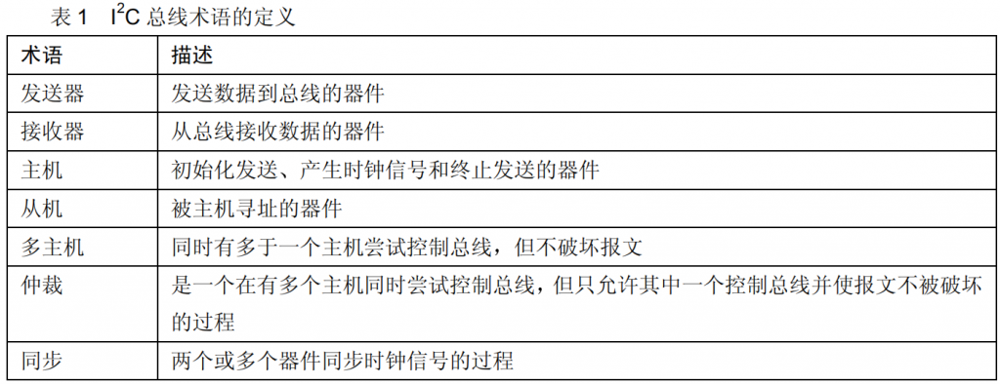

**1、数据有效性**

在 SCL 高电平期间，SDA 必须稳定，所以一般情况下，SCL 高电平宽度小，SDA 高电平宽度大，用示波器看也是这样的。

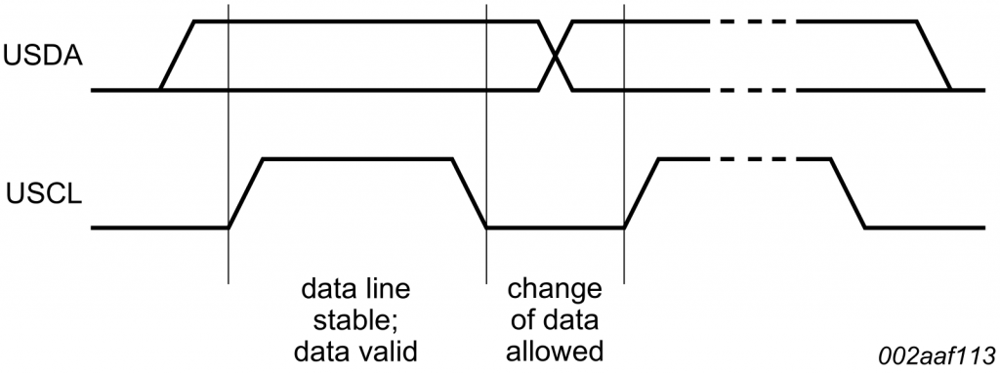

**2、起始条件和停止条件**

起始条件：SCL 高电平时，SDA 由高变低。

停止条件： SCL 高电平时，SDA 由低变高。

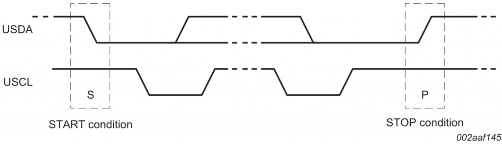

一般每传输一个字节（8 bit），就会重新开始。SDA 在 SCL 是低电平期间变换数据，不可以在 SCL 高电平期间变换数据，否则会认为是 起始和停止条件。

1）传输长度必须是一个字节（8 bit）
2）每次传输的字节不受限制
3）数据必须以 MSB 开头进行传输，也就是先传输最高位
4）从机可以将时钟线 SCL 保持在低位，迫使主机进入等待状态。

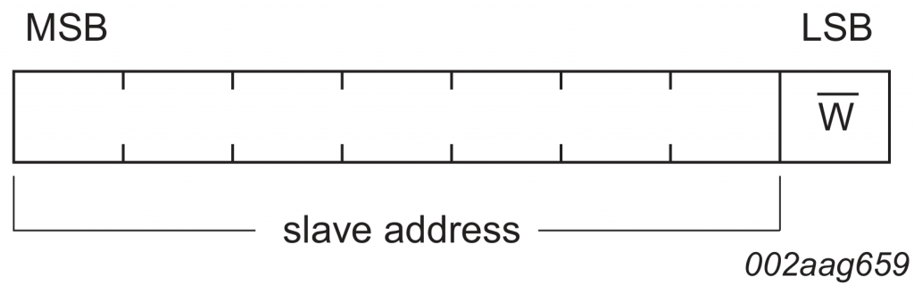

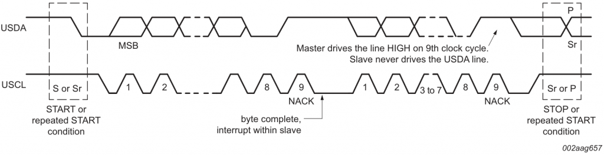

**3、ACK or NACK**

每次传输完**一个字节**以后，从设备要进行一个回应，回应 ACK 或者 NACK。

ACK ：在传输 8 bit 以后，在第九个 bit ，SCL 高电平，如果 SDA 是低电平，说明回应了 ACK。

NACK： 在传输 8 bit 以后，在第九个 bit ，SCL 高电平，如果 SDA 是高电平，说明回应了 NACK。

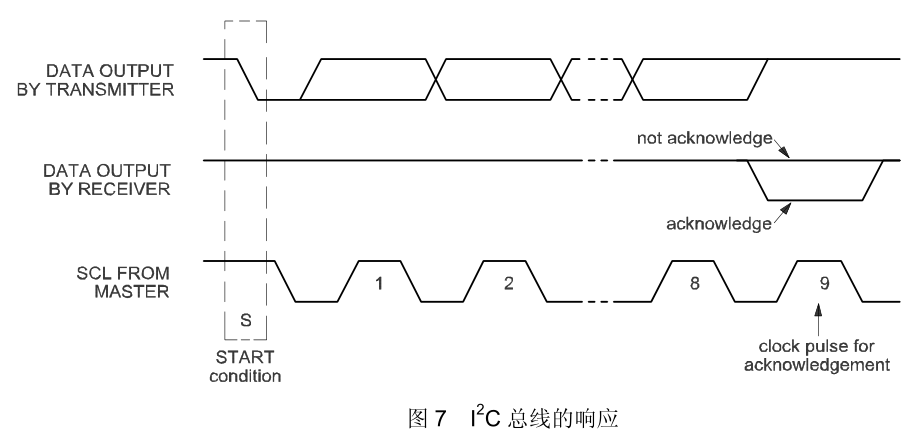

**4、write data**

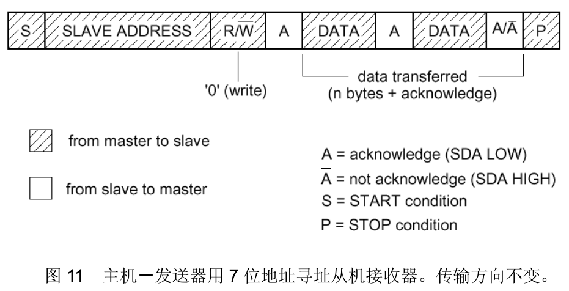

**5、read data**

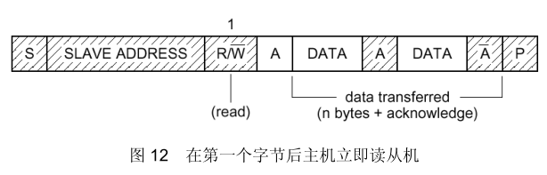

**6、复合格式**

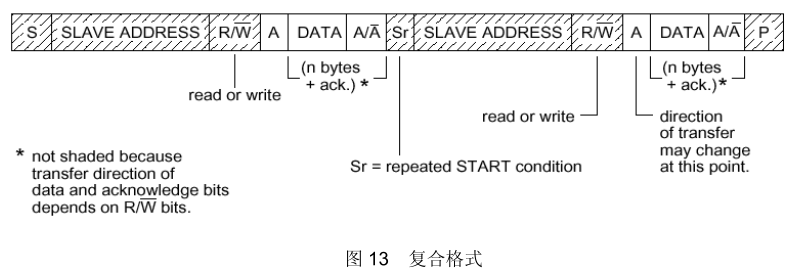

**7、I2C Transfer Regulation**

1）以 START 条件开始
2）以 STOP 条件结束
3）传输的第一个字节为 7bit 从机地址 + 1bit 读写位
4）每个总线上的设备都会比较 STRAT 信号后面的 7bit 地址与自己的地址是否匹配
5）每个 byte(8 bits) 后面都会有 ACK 或者 NACK
6）在 START 信号或者 repeated START 信号后，从机必须重置自己的总线逻辑
7）一个 START 后面紧跟着一个 STOP 信号，是非法格式
8）主机 master 可以不产生 STOP 信号，而是直接产生一个 repeated START 信号+另外一个设备地址，直接开始访问另外一个设备

**8、10-bit addressing**

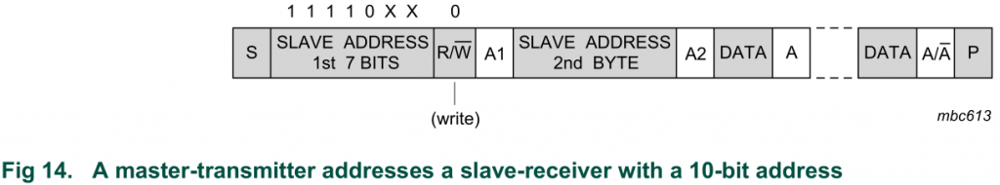

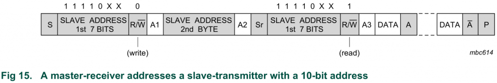

解析如下：


A9-A0 表示 10bits 地址

**9、示波器波形图：**


**10、补充**

I2C 不支持从设备在 SCL 和 SDA 总线上发起一个中断，通知主设备来读数据。有中断需求的从设备需要**额外接一根中断线**，通知主控数据已经准备好，让主控发起读数据的操作。

这无疑增加了系统复杂性，多占用了 pin 脚。I3C 则不存在这种问题，I3C 允许从设备在 SCL 和SDA 上发起中断，叫“带内中断”，I3C 后面会讲。


## I2C(四)：I2C bus spec

**1、Data and ACK/NACK**

**Normal case**

A master-receiver must signal the end of the transfer to the slave transmitter.

**Error case**

1）No receiver is present on the bus with the transmitted address
2）The receiver is busy.
3）During the transfer, the receiver gets data or commands that it does not understand.
4）During the transfer, the receiver cannot receive any more data bytes.

The master can then generate either a STOP condition to abort the transfer, or a repeated START condition to start a new transfer.

原稿如下：

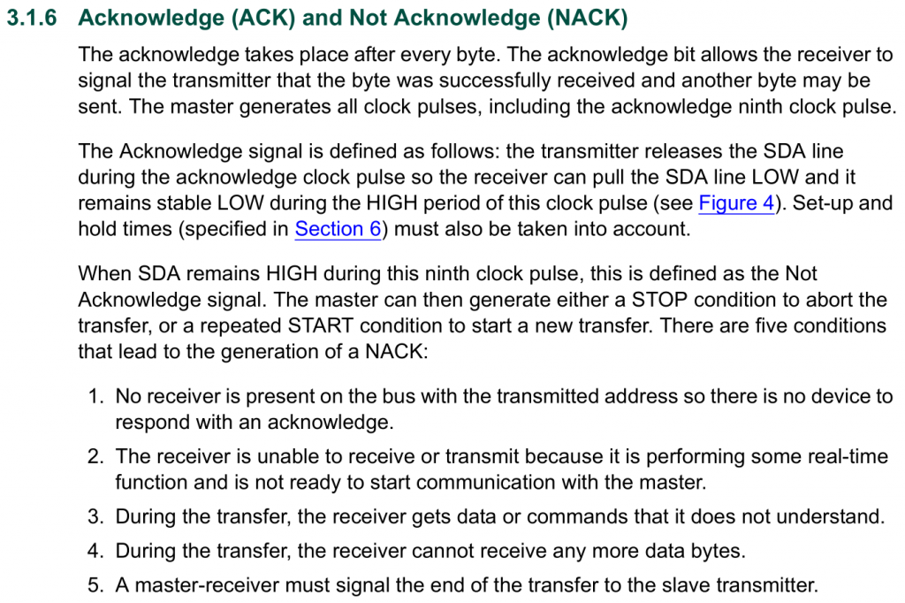

**2、Clock stretching**

1）Clock stretching pauses a transaction by holding the SCL line LOW. The transaction cannot continue until the line is released HIGH again.
2）force the master into a wait state by holding the SCL line LOW.
3）Clock stretching is optional
4）needs more time to store a received byte or prepare another byte to be transmitted
5）slow down the bus clock by extending each clock LOW period. The speed of any master is adapted to the internal operating rate of this device.
6）In Hs-mode, this handshake feature can only be used on byte level

原稿如下

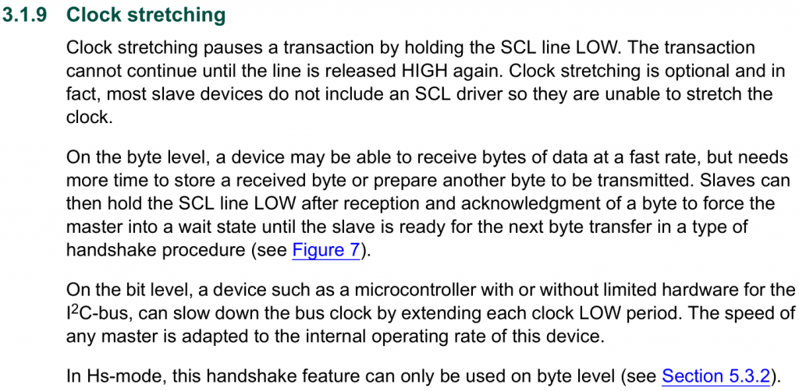

I2C主设备始终控制着时钟线SCL，不论是往设备写还是从设备读。一般情况下，如果操作对象是EEPROM或者其其他简单设备而言，无所谓，但是，如果从设备是处理器，在接到主机命令后要去处理一些运算然后得出结果返回给主机。这个时候可能造成来不及处理。怎么办？这时，从设备会主动控制时钟线把它拉低！直到数据准备好之后再释放时钟线，把控制权交还给MASTER。这也是I2C通信系统中，从机唯一能控制总线到时候！

关键是很多I2C主机不支持clock stretching功能，所以，无法和带有clock stretching功能的从机通信！！！！！所以，各位在选择主机器件之前，必须要注意这一点，不然整个设计方案可能报废，影响很大。

**3、Synchronization And Arbitration**

在多主的通信系统中。总线上有多个节点，它们都有自己的寻址地址，可以作为从节点被别的节点访问，同时它们都可以作为主节点向其他的节点发送控制字节和传送数据。但是如果有两个或两个以上的节点都向总线上发送启动信号并开始传送数据，这样就形成了冲突。要解决这种冲突，就要进行仲裁的判决，这就是I2C总线上的仲裁。

I2C总线上的仲裁分两部分：**SCL 线的同步**和 **SDA 线的仲裁**，这两部分没有先后关系，同时进行。

**SCL Synchronization**

SCL同步是由于总线具有线“与”的逻辑功能，即只要有一个节点发送低电平时，总线上就表现为低电平。当所有的节点都发送高电平时，总线才能表现为高电平。正是由于线“与”逻辑功能的原理，当多个节点同时发送时钟信号时，在总线上表现的是统一的时钟信号。这就是SCL的同步原理。

1）All masters generate their own clock on the SCL line，therefore a defined clock is needed for the arbitration procedure.
2）using the wired-AND connection of I2C interfaces to the SCL line.
3）a HIGH to LOW transition on the SCL line causes the devices to start counting off their LOW period
4）devices with shorter LOW periods enter a HIGH wait-state

查《I2C-bus specification and user manual.pdf》图 7：

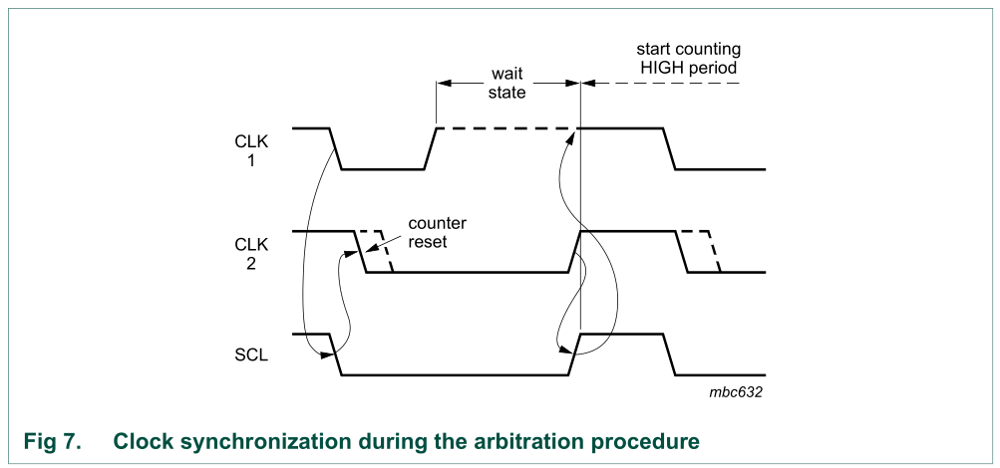

**SDA Arbitration**

SDA线的仲裁也是建立在总线具有线“与”逻辑功能的原理上的。节点在发送1位数据后，比较总线上所呈现的数据与自己发送的是否一致。是，继续发送；否则，退出竞争。

SDA 线的仲裁可以保证 I2C 总线系统在多个主节点同时企图控制总线时通信正常进行并且数据不丢失。总线系统通过仲裁只允许一个主节点可以继续占据总线。

1）Arbitration takes place on the SDA line, while the SCL line is HIGH.
2）The master which transmits a HIGH level while another master is transmitting a LOW level will lose the arbitration.
3）A master that loses the arbitration will generate clock pulses until the end of the byte in which it loses the arbitration.

仲裁过程：

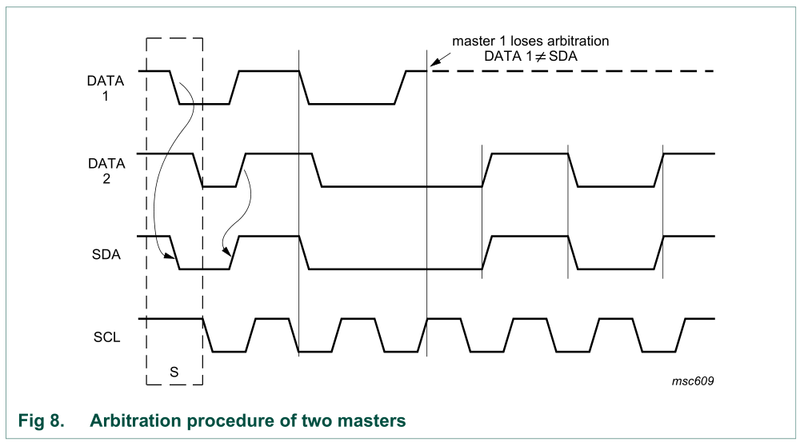

上图是以两个节点为例的仲裁过程。DATA1和DATA2分别是主节点向总线所发送的数据信号，SDA为总线上所呈现的数据信号，SCL是总线上所呈现的时钟信号。当主节点1、2同时发送起始信号时，两个主节点都发送了高电平信号。这时总线上呈现的信号为高电平，两个主节点都检测到总线上的信号与自己发送的信号相同，继续发送数据。第2个时钟周期，2个主节点都发送低电平信号，在总线上呈现的信号为低电平，仍继续发送数据。在第3个时钟周期，主节点1发送高电平信号，而主节点2发送低电平信号。根据总线的线“与”的逻辑功能，总线上的信号为低电平，这时主节点1检测到总线上的数据和自己所发送的数据不一样，就断开数据的输出级，转为从机接收状态。这样主节点2就赢得了总线，而且数据没有丢失，即总线的数据与主节点2所发送的数据一样，而主节点1在转为从节点后继续接收数据，同样也没有丢掉SDA线上的数据。因此**在仲裁过程中数据没有丢失**。

note：SDA仲裁和SCL时钟同步处理过程没有先后关系，而是同时进行的。

参考：https://blog.csdn.net/u010027547/article/details/47779975


## I2C(五)：I2C bus spec

**1、Fast-mode**

1）最大位速率增加到 400kbit/s
2）调整了串行数据SDA和串行时钟SCL信号的时序。没有必要与其他总线系统例如：CBUS 兼容，它们不能在增加的位速率下工作。
3）快速模式器件的输入有抑制毛刺的功能 ，SDA 和 SCL 输入有 Schmitt 触发器。
4）快速模式器件的输出缓冲器对 SDA 和 SCL 信号的下降沿有斜率控制功能。
5）如果快速模式器件的电源电压被关断，SDA 和 SCL 的 I/O 管脚必须悬空，不能阻塞总线。
6）连接到总线的外部上拉器件必须调整以适应快速模式 I2C 总线更短的最大允许上升时间。对于负载最大是 200pF 的总线，每条总线的上拉器件可以是一个电阻；对于负载在 200pF~400pF 之间的总线，上拉器件可以是一个电流源（最大值 3mA）或者是一个开关电阻电路，如下图：

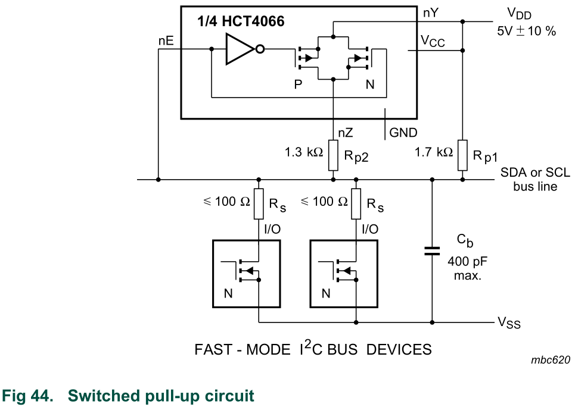

**2、HS mode**

HS mode 为什么单独讲解？因为高速模式和其他模式有很多不一样的地方。特性如下

0）速度高达 3.4MHz。
1）Hs 模式主机器件有一个 **SDAH 信号**的开漏输出缓冲器和一个在 **SCLH** 输出的开漏极下拉和电流源上拉电路，这个电流源电路缩短了 SCLH 信号的上升时间。任何时侯在 Hs 模式只有一个主机的电流源有效。
2）在多主机系统的 Hs 模式中，不执行仲裁和时钟同步，以加速位处理能力。仲裁过程一般在前面用 F/S 模式传输主机码后结束。
3）Hs 模式主机器件以高电平和低电平是 1:2 的比率产生一个串行时钟信号。解除了建立和保持时间的时序要求。
4）还可以选择 Hs 模式器件有内建的电桥。在 Hs 模式传输中，Hs 模式器件的高速数据 SDAH 和高速串行时钟 SCLH 线通过这个电桥与 F/S 模式器件的 SDA 和 SCL 线分隔开来。减轻了SDAH 和 SCLH 线的电容负载，使上升和下降时间更快。
4）Hs 模式从机器件与 F/S 从机器件的唯一差别是它们工作的速度。Hs 模式从机在 SCLH 和 SDAH输出有开漏输出的缓冲器。SCLH 管脚可选的下拉晶体管可以用于拉长 SCLH 信号的低电平，但只允许在 Hs 模式传输的响应位后进行。
5）Hs 模式器件的输出可以抑制毛刺，而且 SDAH 和 SCLH 输出有一个 Schmitt 触发器
6）Hs 模式器件的输出缓冲器对 SDAH 和 SCLH 信号的下降沿有斜率控制功能

**只有 Hs 模式器件的系统的物理 I2C 总线配置**

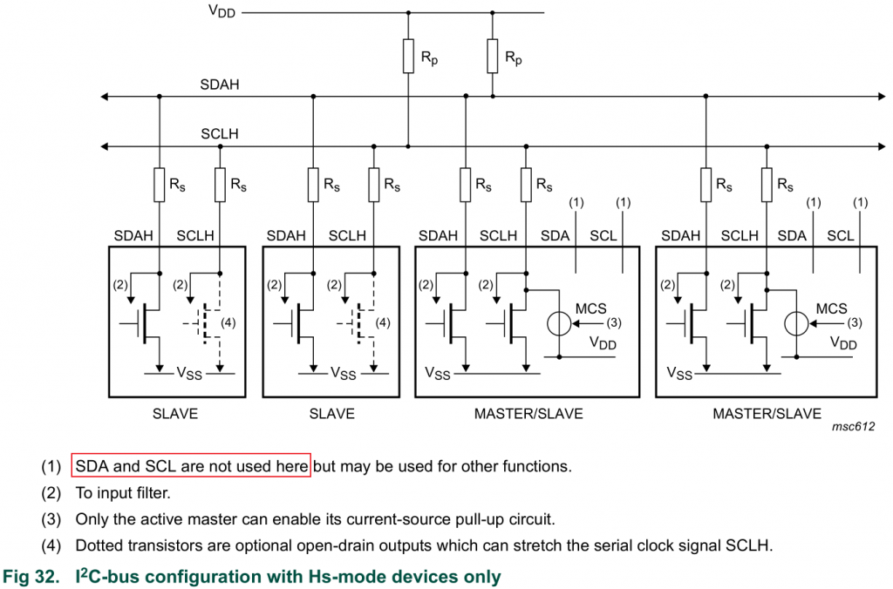

（可选）串联电阻器 Rs 保护 I2C 总线设备的 I/O 免受总线上的高压尖峰影响，并将振铃和干扰降至最低。

右下角两个设备，不光是从设备，也可以当主设备。这种期间有一个 MCS 电流源。如果总线上器件较多，会导致总线电容较大，拉升总线电压相当于给电容充电，这需要时间，这会导致波形上升沿过缓，所以加了电流源可以使上升沿很快。

**1、data transfer format in Hs-mode**

1）START condition (S)
2）8-bit master code (0000 1XXX)
3）Not-acknowledge bit (A)

**2、Enable current-source pull-up circuit in Hs-mode（在Hs模式下启用电流源上拉电路）**

**3、Continues in Hs-mode after the next repeated START condition**

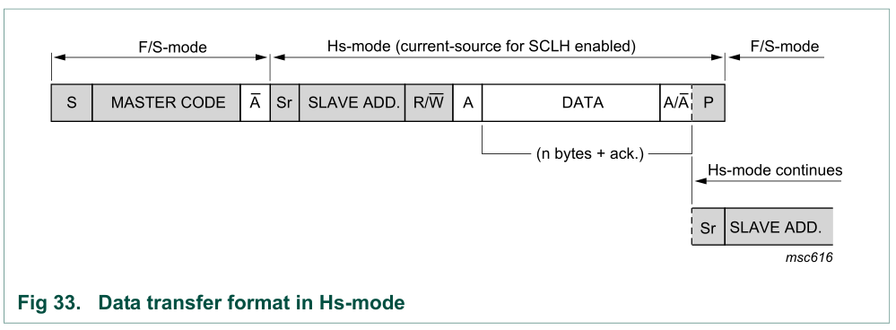

由上图可以看出，在快速模式（FS mode）下发送一个 Master code，然后切换到高速模式（HS mode），发送从设备地址。

在第一阶段 FS mode 时候，发送主设备的编码，这时候会进行仲裁，因此 **高速模式阶段没有时钟同步和仲裁**。

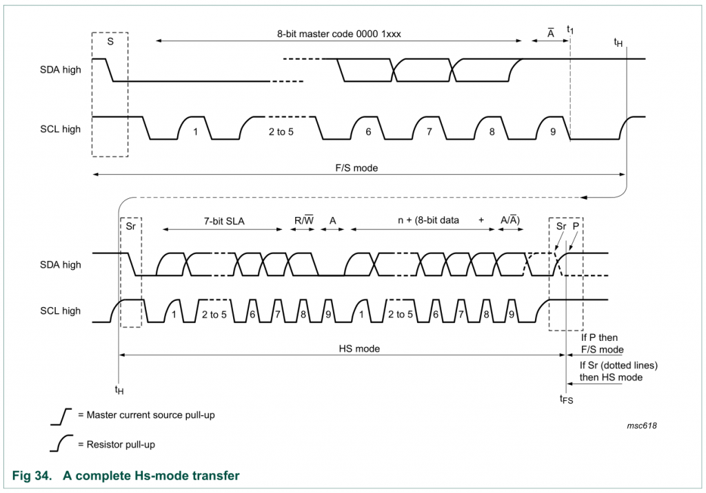

上图为完整通信波形示意图。先在快速模式下发送主机地址，不需要从机回复。然后切换到高速模式，会发送一个 reSTART，然后再发送自己想要操作，读或者写。


## I2C(六)：I3C

**1、Introduction**

I3C ：Improved Inter Integrated Circuit ，是 MIPI（Mobile Industry Processor Interface）移动产业处理器接口联盟推出的**改进型 i2c 总线接口**。

传感器在手机等移动产品中的快速发展，带来了新的设计挑战。因为没有统一的方法来连接物理传感器、设备和平台，设计师面临的数字接口碎片包括 I2C、SPI 和 UART 等。

除了主接口，还可能需要其他信号，例如专用中断、芯片选择信号，启用和睡眠信号。这会增加所需的主机 GPIO 数量，从而提高硬盘容量，更多主机封装引脚和更多 PCB 层的系统成本。

随着时间的推移和传感器数量的增加，这种情况变得越来越难以控制支持和管理。

MIPI I3C 接口的开发旨在简化移动无线传感器系统的设计架构该产品通过为传感器提供**快速、低成本、低功耗**的二线数字接口。

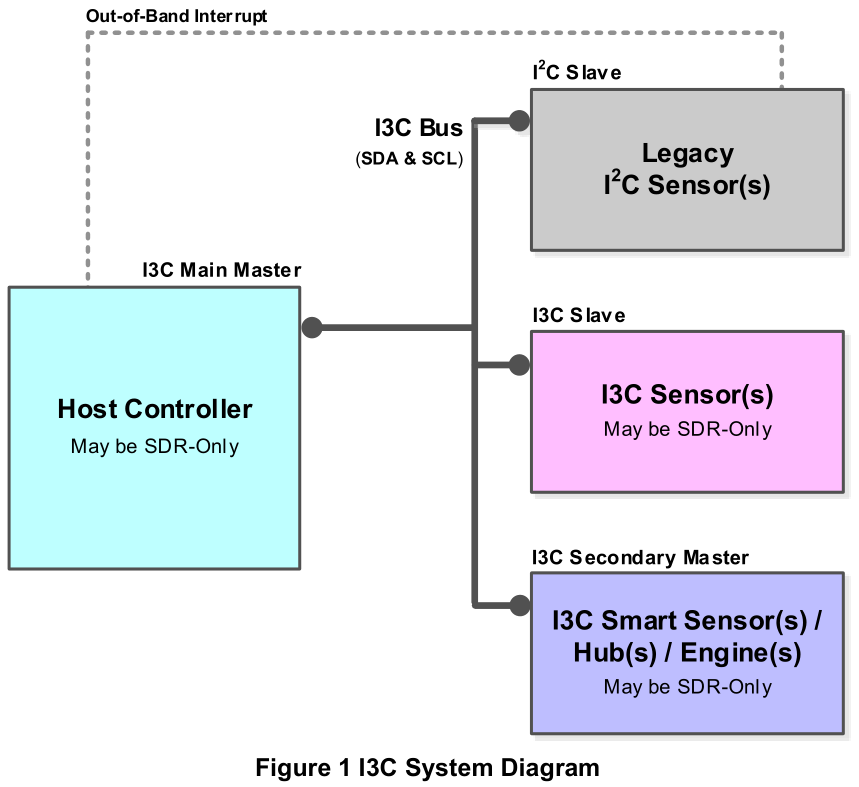

Example classes of sensor addressed by I3C are listed in Table 1.

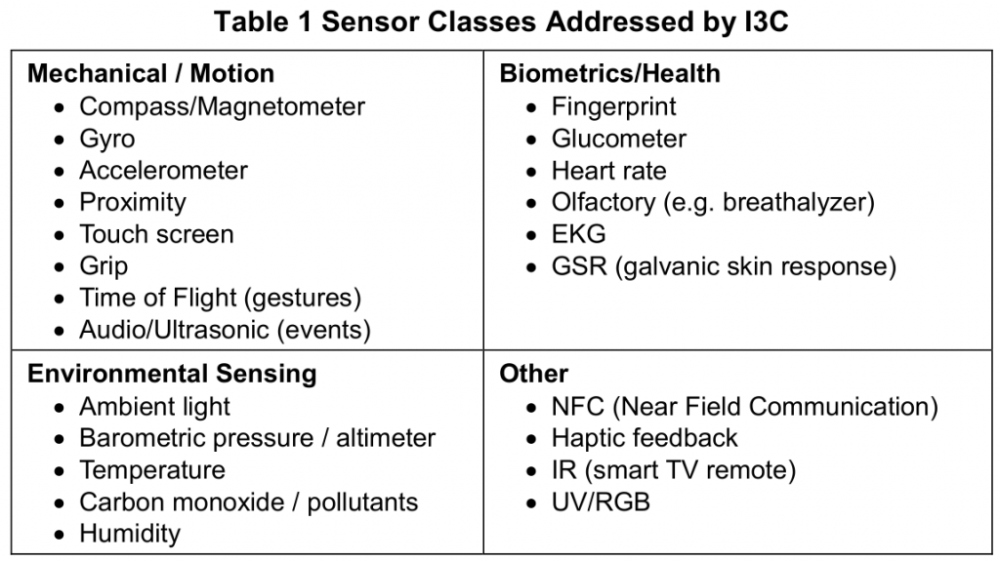

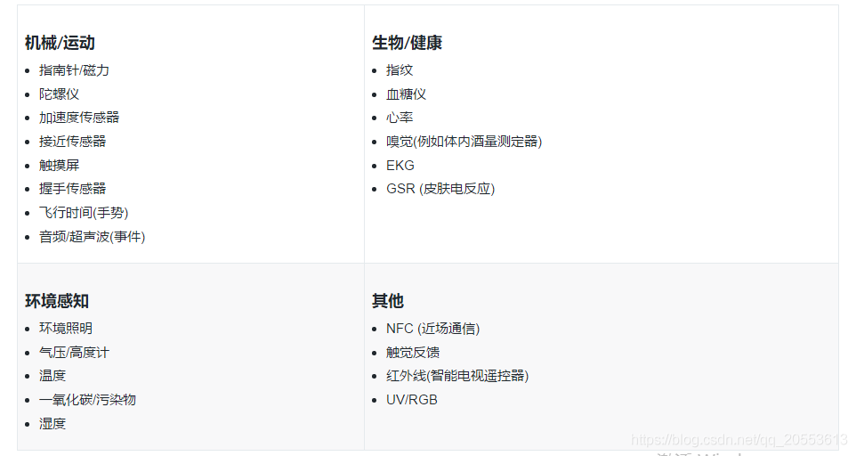

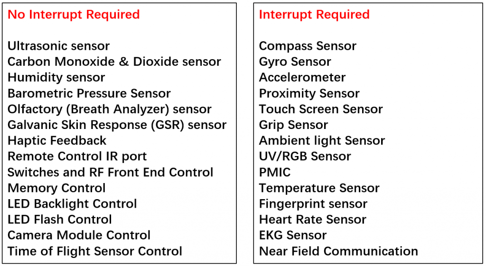

**I2C 和 I3C 主要区别如下：**

1、I2C 虽然也是两条线，但是很多时候传感器需要一条额外的中断线，来告诉主控数据已经准备好，但是 I3C 允许从设备直接在总线上产生中断，不再需要一条额外的中断线。

2、I2C 传输速度最高 3.4MHz，I3C 可以12.5MHz。

3、I3C 向下兼容 I2C，但不兼容 10bit 的 I2C 扩展地址。

4、I2C 的从设备是静态地址，I3C 是动态地址，由主设备给从设备分配动态地址。

5、由于支持带内中断，所以就涉及到从设备的优先级，一般动态设备号较低的，优先级较高，中断就优先响应。（也是靠线与的特性）

6、I3C 支持使用 推挽输出 的GPIO，增强驱动能力，只不过需要特殊设置。

**如果所有 sensor 器件都采用 I3C 通信接口，连接将变的很简单，如下图：**

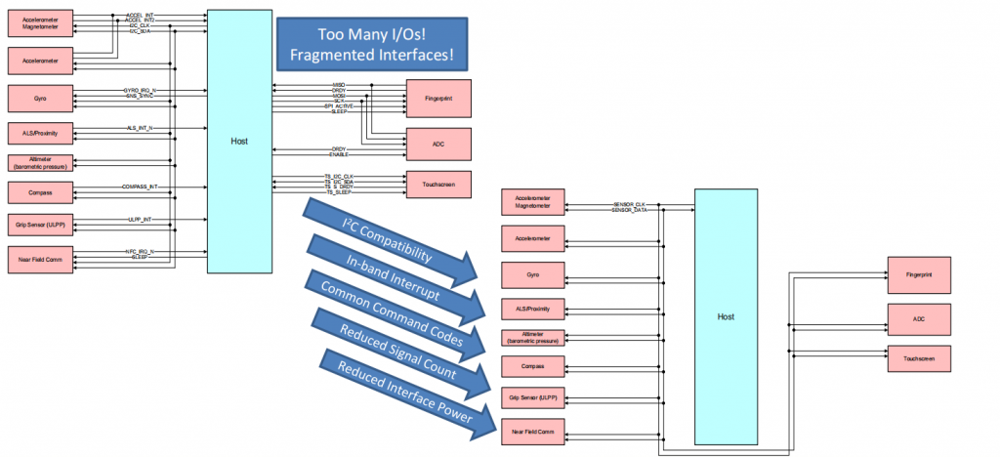

**2、I3C key features**

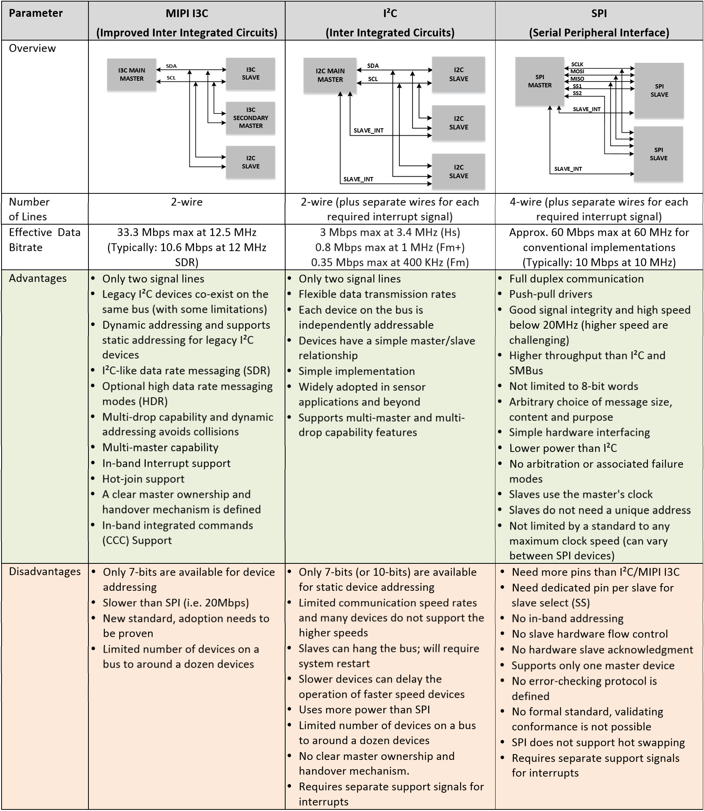

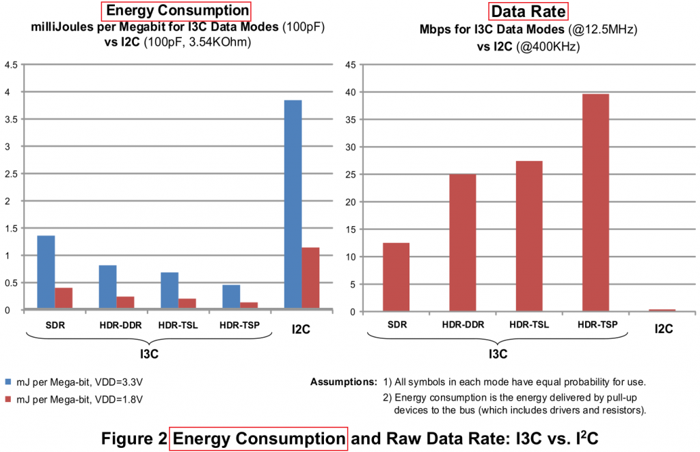

1）使用推挽功能的双线串行接口，最高可达12.5 MHz
2）同一总线上共存的传统 I2C 设备（有一些限制）
3）动态寻址，同时支持传统I2C设备的静态寻址
4）传统I2C通讯
5）类似I2C的单数据速率消息传输（SDR）
6）I3C BASIC 不支持：可选的高数据速率消息模式（HDR）
7）多点功能
8）多主功能
9）带内中断支持
10）热连接支持
11）I3C BASIC 中不支持：同步计时支持和异步计时冲压
12）secondary master support

1）不支持 I2C master
2）不支持从机 clock stretching
3）每个 I2C 从机设备需要有 50ns spile filter on SCL
4）现在还没有太多的 I3C 设备出现在市场中

**3、I3C Mode**

**Support for many Legacy I2C Slave Devices and messages**

**I3C Single Data Rate (SDR) Mode**
1）transfers data on only one edge of the clock.
2）Private/Typical messages: send message to slave with dynamic address
3）**Broadcast messages**: which are sent to all Slaves on the Bus (ex: ENTDAA)
4）**Direct messages**: which are addressed to specific Slaves (ex: SETDASA)

**I3C High Data Rate (HDR) Modes**
1）Dual Data Rate (HDR-DDR) Mode: Uses same signaling as SDR Mode (i.e. is not significantlydifferent from the 12C protocol), but runs at about 2x the speed of SDR
2）achieve higher speed by transferring data on both clock edges
3）Ternary Symbol Legacy (HDR-TSL) Mode: Higher data rates plus Ternary coding, for Buses witha mix of I2C and I3C Devices. Significantly different from the I2C protocol
4）Ternary Symbol Pure-bus (HDR-TSP) Mode: Higher data rates plus Ternary coding, for Buseswith only I3C Devices. Significantly different from the 12C protocol
5）Ternary Symbol has three state, the SCL line changes state, the SDA line changes state, or bothlines change state

**SDR Mode**

1）SDR Mode is the default Mode of the I3C Bus
2）used for private messaging from the Current Master Device to Slave Devices.
3）used to enter other Modes, sub-Modes, and states
4）for built-in features such as Common Commands (CCCs), In-Band Interrupts, and transition from I2C to I3C by assignment of a Dynamic Address.
5）significantly similar to the I2C protocol [NXP01] in terms of procedures and conditions，and as a result I3C Devices and many Legacy I2C Slave Devices (but not I2C Master Devices) can coexist on the same I3C Bus.
6）For the procedures and conditions that I3C shares with I2C, SDR Mode closely follows the definitions in the I2C Specification.
7）I2C traffic from an I3C Master to an I2C Slave will be properly ignored by all I3C Slaves，because the I3C protocol is designed to allow I2C traffic.
8）I3C traffic from an I3C Master to an I3C Slave will not be seen by most Legacy I2C Slave Devices, because the I2C Spike Filter is opaque to I3C’s higher clock speed.

**I3C Communication Flow**

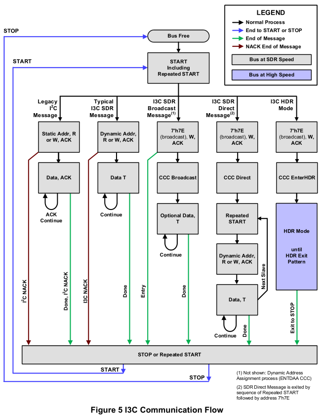

**I3C Master Device**

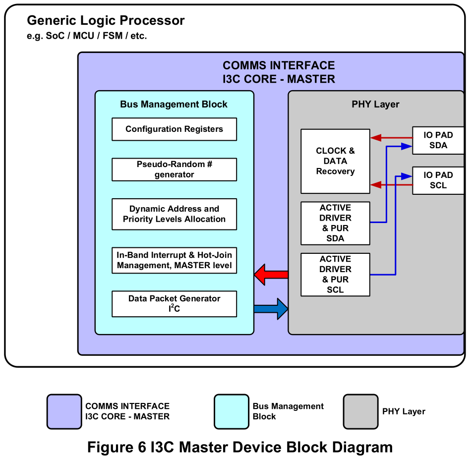

**I3C Slave Device**

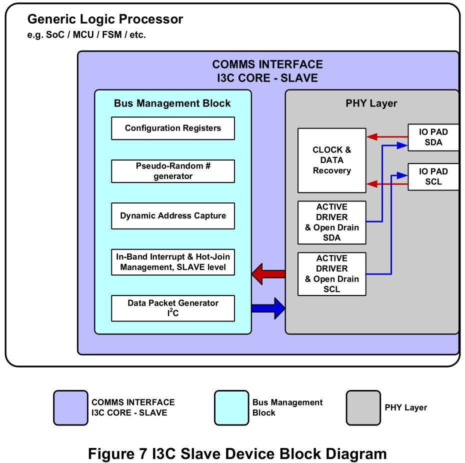

**4、I3C Protocol**

**Bus configuration**

I3C 不仅支持多个从设备，还支持多个主设备。I3C 总线上可以支持的设备有：

1、Main Master(当前主设备)
2、Secondary master（辅助主设备）
3、i3c Slave（i3c从设备）
4、i2c Slave（i2c从设备）

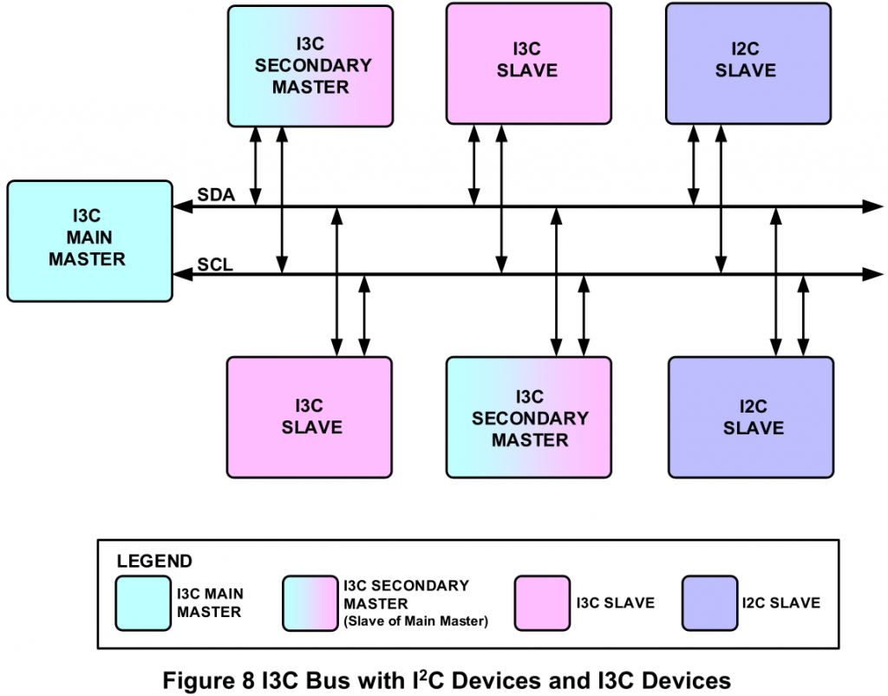

I3C Characteristics Registers describe and define an I3C compatible Device’s capabilities and functions on the I3C Bus, as the Device services a given system. **Devices without I3C Characteristics Registers shall not be connected to a common I3C Bus.**
There are three Characteristics Register types:
• Bus Characteristics Register (BCR)
• Device Characteristics Register (DCR)
• Legacy Virtual Register (LVR)

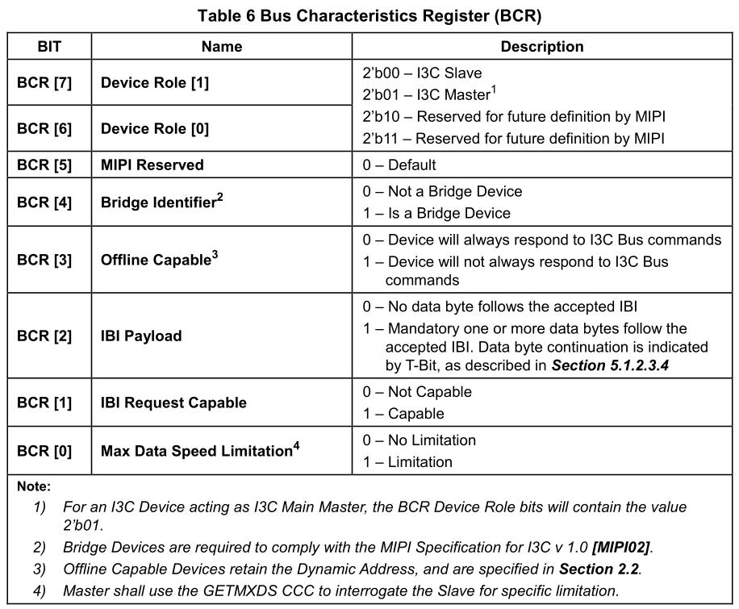

**Bus Communicaton**

The SDR protocol is based on the I2C standard protocol, with a few notablevariations:

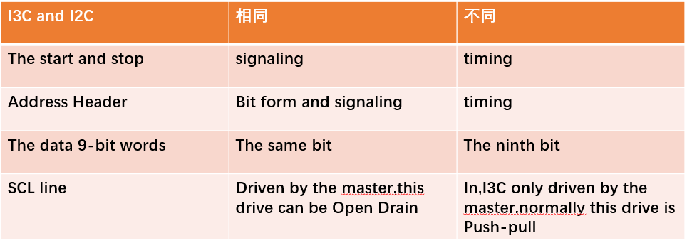

**SDR Message**

1）The Address in the Address Header is 7’h7E (the I3C Broadcast Address). All I3C Slaves shall match Address value 7’h7E.
2）The Address in the Address Header matches the Slave’s Dynamic Address. All I3C Slaves shall match their own Dynamic Address.

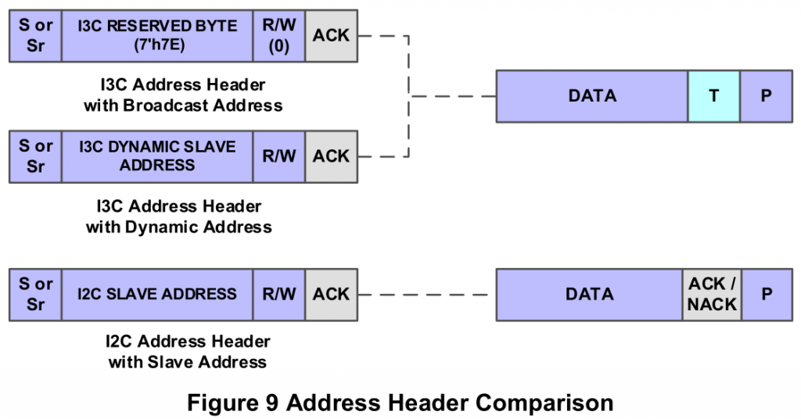

**Role of I3C Slave**

1）Before being assigned a Dynamic Address the I3C Slave shall operate as an I2C Device
2）The I3C START and STOP are identical to the I2C START and STOP in their signaling, but they may vary from 12C in their timing.

**I3C Address Header**

1）In-Band Interrupt
2）Secondary Master request
3）Hot-Join request （热插拔特性可以让i3c从设备在不工作时处理睡眠或者关闭状态，需使用时才挂载到总线上使用，进一步达到降低功耗的目的）

**I3C Address Arbitration**

1）both the Master and one or more Slaves
2）following a START (but not a Repeated START)
3）Open Drain(whether Master or Slave)
4）lower Addresses having higher Priority

**Hot-Join Mechanism**

1）After a START, 7’b0000_010 + RnW(1’b0)
2）allow Slaves to join the I3C Bus after it is already configured
3）Hot-Joining Slaves may be any valid Slave type, including Secondary Master

**In-Band Interrupt**

1）After a START (but not a Repeated START) + Dynamic Address + RnW(1’b1)
2）I3C Main Master providing ack bits

**Secondary Master Functions**

1）After a START (but not a Repeated START)+Dynamic Address +RnW(1’b0)
2）Secondary Master maintains control until another Master is granted Bus control.
3）defer some actions to a more capable Master(GETACCMST)

**I3C Bus conditions**

Three distinct conditions in which the I3C Bus shall be considered inactive:
1）Bus Free Condition
2）Bus Available Condition(tAVAL)
3）Bus Idle Condition(tIDLE)

I3C provides a mechanism for the Master to inform Slaves about expected upcoming levels of activity on the I3C Bus:

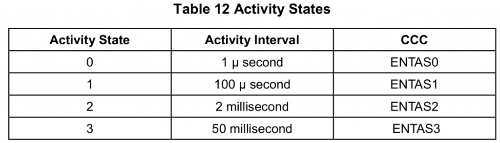

**Bus initialization and dynamic address assigned mode**

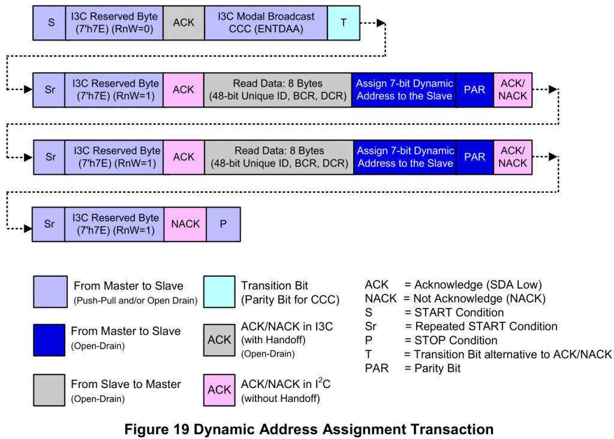

头地址是 7h7E（I3C 广播地址），所有的 I3C 从机将匹配 7h7E，任何的 I2C 从机设备将不会匹配此地址，因为这个地址在 I2C 中是保留的并且未使用。

**Common Command Codes (CCC)**

Common Command Codes (CCCs) are globally supported commands that can be transmitted either directly to a specific I3C Slave Device, or to all I3C Slave Devices simultaneously.

There are four categories of CCC Command:
1）Broadcast Write
2）Direct Read/Write
3）Direct Write
4）Direct Read

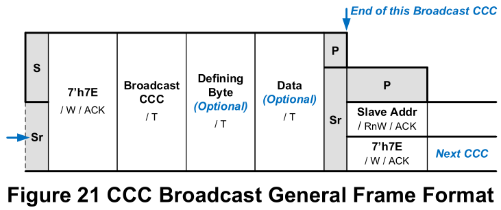

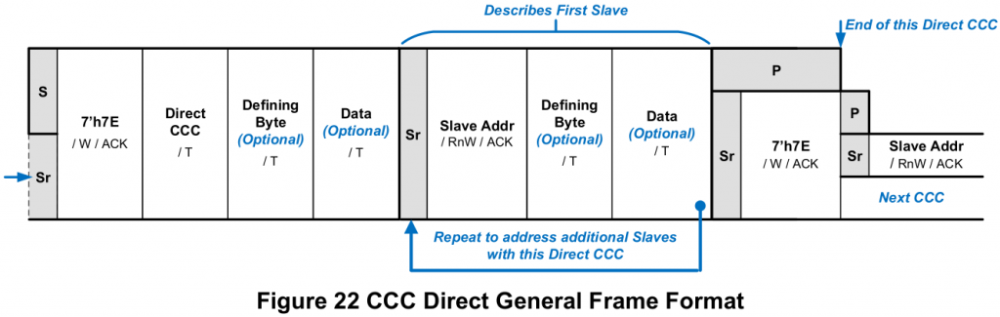

**支持动态地址**

i3c支持动态地址，同时可以分配7bit静态地址以适配传统i2c 从设备。i3c从设备地址由主设备仲裁，但并不是所有设备地址都可用，部分地址是i3c标准所保留的，用于后期拓展或者错误仲裁。

**支持多种通信模式**

i3c支持4种通信模式，分别是SDR、HDR-DDR、HDR-TSL、HDR-TSP，不同模式通信速率有差异。

SDR 很多 I3C 主控和设备支持，HDR 很多设备不支持，所以最常用的是 12.5MHz。

SDR 模式：12.5Mbit/s
HDR-DDR模式： 25Mbit/s
HDR-TSL模式：30 Mbit/s
HDR-TSP模式：37.5 Mbit/s

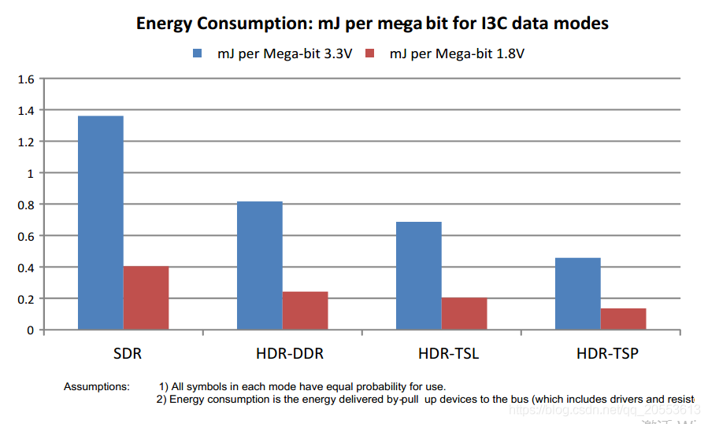

**i3c应用场景**

1）多传感器领域，节约总线 IO。
2）物联网领域，功耗低。
3）传统 i2c、spi、uart 设备接口中。
4）camera、touch panel。
5）i3c 向下兼容 i2c，可与传统 i2c 接口器件一起使用。

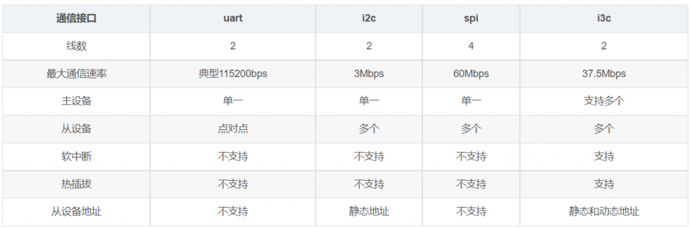

参考：

《 MIPI Alliance Specification for I3C Basic,Version1.0.pdf》

https://acuity.blog.csdn.net/article/details/105896530

https://blog.csdn.net/yinuoheqian123/article/details/105843719

https://www.cnblogs.com/gcws/p/8995542.html


## I2C 子系统（一）

https://mp.weixin.qq.com/s/WMSxuwcRmK6zO6M1hi7Q2A

I2C 系列文章主要分为两个部分来写：

1、I2C spec：研究 I2C 协议本身，研究它的协议规范、传输机制。

2、I2C driver：研究 Linux I2C 驱动。

I2C 系列文章目录如下：

#### I2C spec

```
I2C Introduction
I2C Architecture
I2C Transfer
I2C Synchronization And Arbitration
I2C Hs-mode
I3C Introduction
I3C Protocol
```

#### I2C driver

```
I2C SW Architecture
I2C Data Structure
I2C Register Flow
I2C Data Transfer
```

### 1、I2C Introduction

#### I2C 历史

1. I2C：Inter-Integrated Circuit，集成电路总线。
2. I2C 是 Philips 公司在 1982 年开发的一种简单、双向二线制同步串行总线。
3. Philips 半导体事业部就是现在的 NXP。
4. I2C 的专利在 2006 年 11 月 1 日已到期，大家可以免费使用。
5. Intel 1995 年推出的 I2C 兼容总线（System Managerment Bus），即 SMBus 或 SMB
6. 最新版本 I2C v.6 于 2014.04.04 推出。

#### I2C 的未来

1. MIPI 协会在 2014 年左右定稿了 I3C (improved Inter Integrated Circuit)规范，I3C 在 I2C 的规格上建立了功能超集，支持高传输速率模式。
2. 当前不论是 Soc 厂商，还是 device 厂商，都已经开始或正在向 I3C 过度。

#### I2C 的速度

I2C 是一种低速、串行总线，有 SDA(串行数据线) 和 SCL(串行时钟线) 两条信号线，半双工通信。通信速度如下：

• Bidirectional bus:

1. Standard-mode (Sm), 100 kbit/s
2. Fast-mode (Fm), 400 kbit/s
3. Fast-mode Plus (Fm+),1 Mbit/s
4. High-speed mode (Hs-mode),3.4 Mbit/s.

• Unidirectional bus:

1. Ultra Fast-mode (UFm),5 Mbit/s

速度由 SCL 决定，不同模式对上升沿的要求不一样，上升沿由上拉电阻和等效电容决定（RC）。

#### I2C 是一种多主从架构总线

1. I2C 的读写均由 master 端发起。
2. I2C 通信的每一个 byte（8bits）都需要 slaver 端的回应 ACK/NACK 作为回应。
3. 多 master 端需要引入仲裁机制。
4. slaver 端通过设备地址区分，有 7bits 和 10 bits 等地址，还有一种 8bits 地址，实际上是 7bits + 读写位。【其中7位地址 = 种类型号（4bit）+ 寻址码（3bit）】

#### I2C 总线能挂多少设备？

7-bit address ：2 的 7 次方，能挂 128 个设备。

10-bit address ：2 的 10 次方，能挂 1024 个设备。

但是 I2C 协议规定，总线上的电容不可以超过 400pF。管脚都是有输入电容的，PCB上也会有寄生电容，所以会有一个限制。

实际设计中经验值大概是不超过 8 个器件。

总线之所以规定电容大小，是因为 I2C 使用的 GPIO 为开漏结构，要求外部有电阻上拉，电阻和总线电容产生了一个 RC 延时效应，电容越大信号的边沿就越缓，有可能带来信号质量风险（方波变三角波）。

传输速度越快，信号的窗口就越小，上升沿下降沿时间要求更短更陡峭，所以 RC 乘积必须更小。

note：要把预留设备地址去除，保留地址如下：

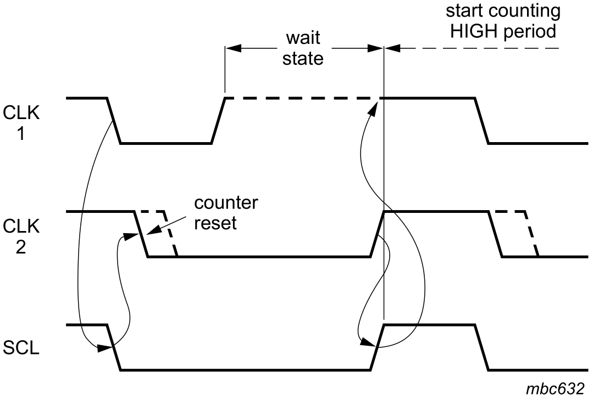

note：写的是 two groups，而不仅仅是八个，0000 XXX 和 1111 XXX 系列地址都是保留的。


## I2C 子系统（二）

https://mp.weixin.qq.com/s/z5SRXMppcXxWIkaSEmwxBA

### 2、I2C Architecture


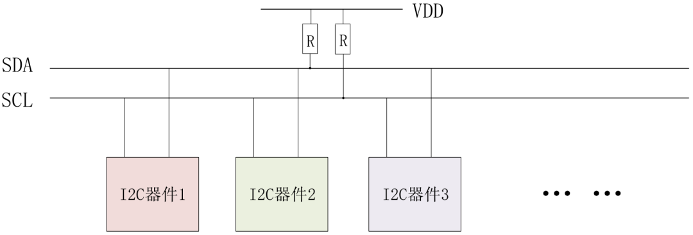

I2C 采用的 GPIO 一般为开漏模式，支持线与功能，但是开漏模式无法输出高电平，所以需要外部上拉。Vdd 可以采用 5V、3.3V、1.8V 等，电源电压不同，上拉电阻阻值也不同。

一般总线上认为，低于0.3Vdd为低电平，高于0.7Vdd为高电平。

#### 推挽结构和开漏结构

推挽结构：使用两个三极管或 MOSFET，以推挽方式存在于电路中。电路工作时，两只对称的开关管每次只有一个导通，所以导通损耗小、效率高。既可以向负载灌电流，也可以从负载抽取电流。推拉式输出级既提高电路的负载能力，又提高开关速度。

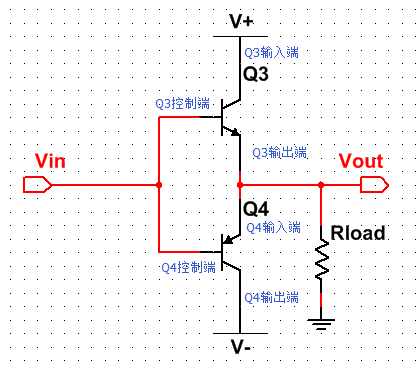

图中上面是 NPN 型三极管，下面是 PNP 型三极管。分别有以下两种情况：

**输出高电平：向负载灌电流。**

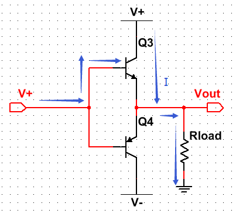

**输出低电平：从负载拉电流。**


三极管和 MOS 管效果类似，不赘述。

**开漏结构（OD）**：对比推挽结构，开漏结构只有一个三极管或者MOS管。

之所以叫开漏，是因为MOS管分为三极：源极、栅极、漏极。漏极开路输出，所以叫开漏；如果是三极管：基极、集电极、发射极，集电极开路，所以叫开集输出（OC）。

**开集输出（OC）**，NPN 三极管：


这个结构很好分析：Vin 高电平，三极管导通，对外输出低电平，外部被直接拉到低。Vin 低电平，集电极（C）开路，输出电平状态由外部决定。

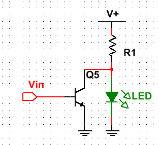

以上分析均采用三极管，MOS管类似。

因此，推挽结构可以输出高低电平。开漏输出只能输出低电平，高电平由外部电路决定。

**对比总结如下：**


电平跳变速度，推挽输出由CPU控制，高低电平跳变速度快（0->1），开漏输出由外部上拉电阻决定，上拉电阻小，反应速度快，从低电平到高电平跳变速度就快，但电阻小电流就大，功耗就高，反之亦然。

所以开漏输出的外部上拉电阻要兼顾速度和功耗。上拉电阻小，信号边沿陡峭，信号好，但是功耗高。

电平转换：推挽输出输出的高低电平只有0和Vdd，开漏输出的高电平由外部上拉电阻决定，多少V都可以，只要不超过MOS管击穿电压。

#### 线与功能

线与：所有 GPIO 输出高就是高，只要有一个输出低，整条线上面的都是低，这就是“与”的意思。

**推挽结构下**，两个GPIO口连接到一根线上，假如左边的PMOS导通，右边的NMOS导通，Vdd就会通过两个MOS管直接接地，由于MOS管导通电阻不大，会导致电流很大，直接损坏这两个GPIO口，因此，推挽输出不支持线与。

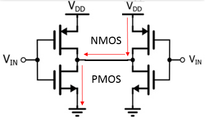

推挽结构在这种情况下会损坏GPIO口。

**开漏：**假如很多GPIO是开漏结构，接到了一根线。开漏结构输出的高电平靠外部上拉，假如有一个GPIO接地，那么电流会通过上拉电阻流进GPIO口接地，因为有上拉电阻的存在，所以不会损坏GPIO口。

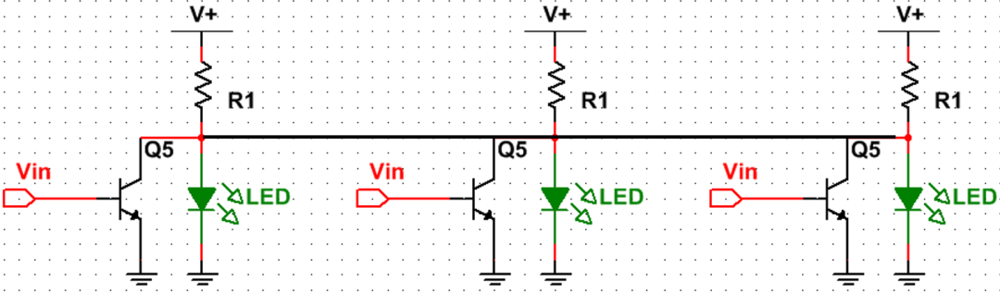

线与，是 I2C 协议的基础！线与：当总线上只要有一个设备输出低电平，整条总线便处于低电平状态，这时候总线被称为占用状态。

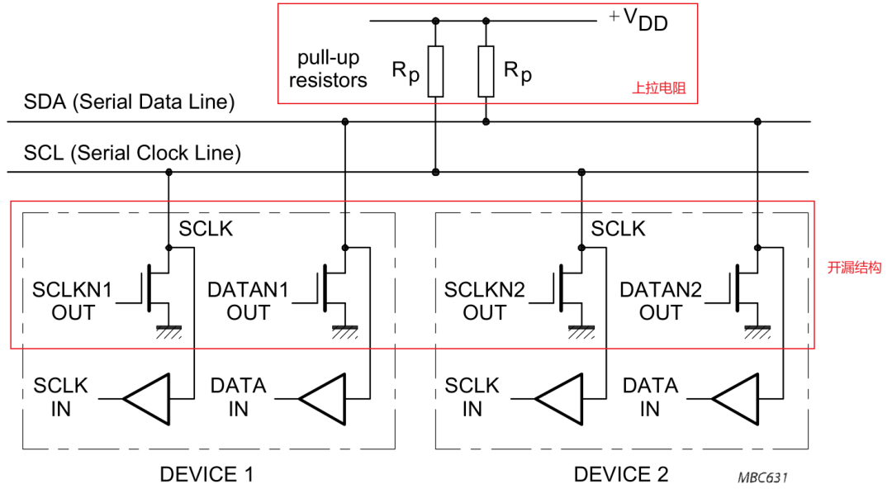

#### 上拉电阻计算

1、上拉电阻过小，电流大，端口低电平 level 增大。

2、上拉电阻过大，上升沿时间增大，方波可能会变成三角波。

因此计算出一个精确的上拉电阻阻值是非常重要的。计算上拉电阻的阻值，有明确计算公式：

最大电阻和上升沿时间 tr 、总线电容 Cb 、标准上升沿时间 0.8473 有关。

最小电阻和电源Vdd电压、GPIO口自己最大输出电压 Vol、 GPIO口自己最大电流 Vol 有关。


查《I2C-bus specification and user manual.pdf》7.1节：

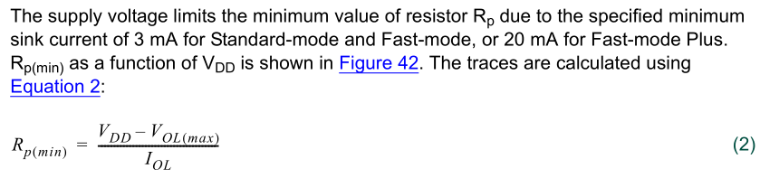

查《I2C-bus specification and user manual.pdf》表10：

1、标准模式：0~100KHz，上升沿时间 tr = 1us

2、快速模式：100~400KHz，上升沿时间 tr = 0.3us

3、高速模式：up to 3.4MHz，上升沿时间 tr = 0.12us

由此公式，假设 Vdd 是 1.8V 供电，Cb总线电容是200pF（虽然协议规定负载电容最大400pF，实际上超过200pF波形就很不好，我们以200pF来计算）

标准模式 ：


快速模式：


高速模式：


最小电阻（Vdd越大，上拉电阻就要越大）：


注意，高速模式下，电源电压一般采用 1.8 V，不会采用 3.3V，因为如果用 3.3V 计算你会发现最小电阻比最大电阻大。

采用合适的电源电压和合适的上拉电阻，才会让你的 I2C 传输信号最优。上拉电阻选小了，会使得总线电流大，端口输出的低电平会变大（一般低电平不允许超过0.4V）。上拉电阻选大了（RC），上升时间增大，方波变三角波。

大家在不同速率采用的电阻一般有以下几种：1.5K、2.2K、4.7K。

上拉电阻关系图

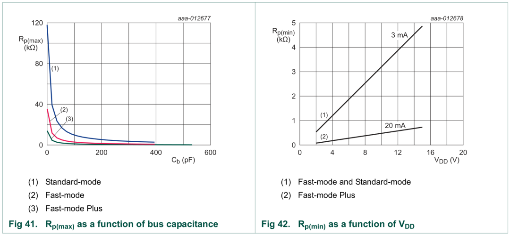


## I2C 子系统（三）

https://mp.weixin.qq.com/s/VZ_LS7pLvuNlm7WYS-3oMQ

### 3、I2C Transfer

#### Definition of timing

想要深入探讨 I2C 协议，必须深刻理解各种时间的定义（F/S-mode）


| 标识符  |             定义             |
| :------ | :--------------------------: |
| tf      |         信号下降时间         |
| tr      |         信号上升时间         |
| tLOW    |        信号低电平时间        |
| tHIGH   |        信号高电平时间        |
| tHD;DAT |         数据保持时间         |
| tSU;DAT |         数据建立时间         |
| tSP     | 输入滤波器必须抑制的毛刺脉宽 |
| tBUF    |   启动和停止条件的空闲时间   |
| tHD;STA |    重复起始条件的保持时间    |
| tSU;STA |    重复起始条件的建立时间    |
| tSU;STO |       停止条件建立时间       |

Sr 重新启动，S 启动，P 停止。

note：SCL 高电平的时候，SDA 是高就是 1，是低就是 0。SCL 低电平期间，SDA 变换数据。

note：起始条件很容易理解，重复起始条件就是没有STOP，再来了一个 START，然后发送另外一个从设备 ID，访问其他从设备。

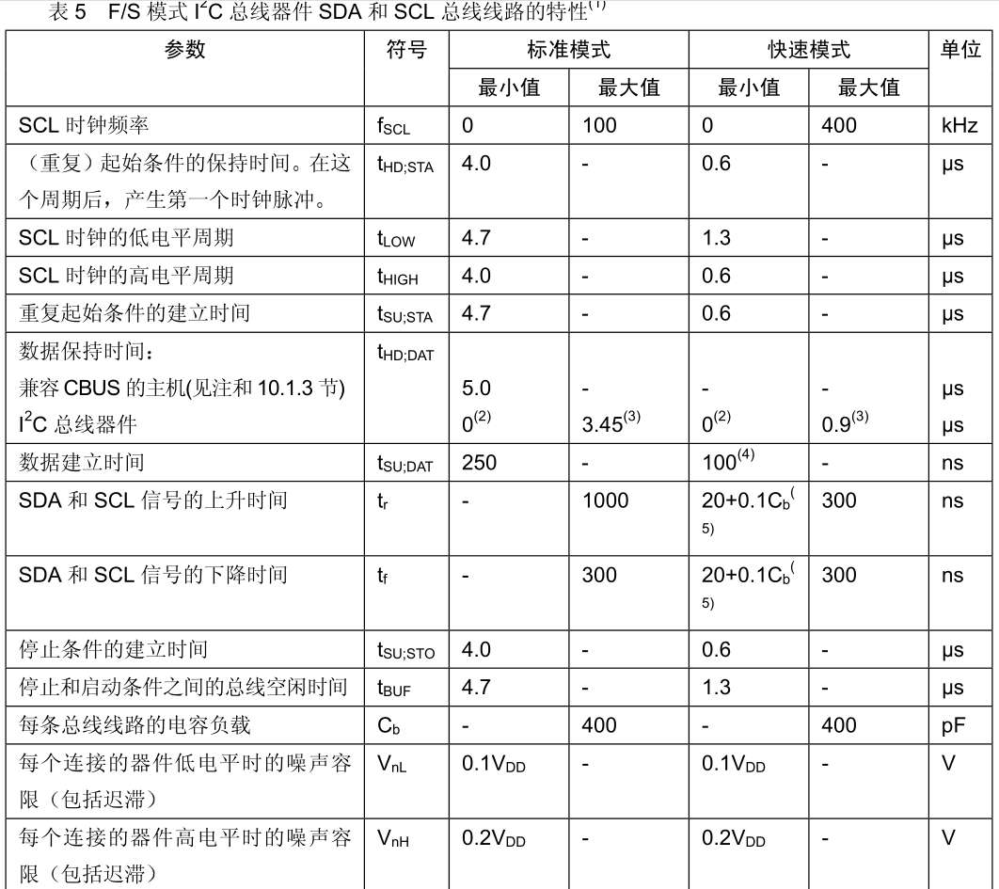

**
**

**定义术语**


**1、数据有效性**

在 SCL 高电平期间，SDA 必须稳定，所以一般情况下，SCL 高电平宽度小，SDA 高电平宽度大，用示波器看也是这样的。

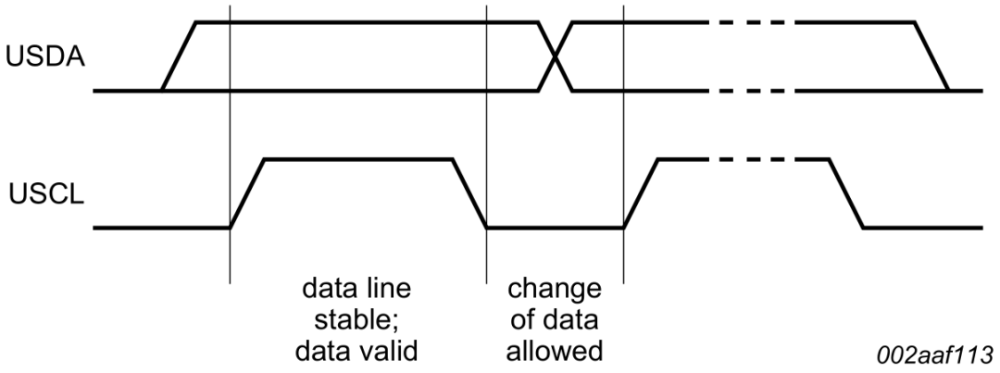

**2、起始条件和停止条件**

起始条件：SCL 高电平时，SDA 由高变低。

停止条件：SCL 高电平时，SDA 由低变高。


一般每传输一个字节（8 bit），就会重新开始。SDA 在 SCL 是低电平期间变换数据，不可以在 SCL 高电平期间变换数据，否则会认为是 起始和停止条件。

1. 传输长度必须是一个字节（8 bit）
2. 每次传输的字节不受限制
3. 数据必须以 MSB 开头进行传输，也就是先传输最高位
4. 从机可以将时钟线 SCL 保持在低位，迫使主机进入等待状态。

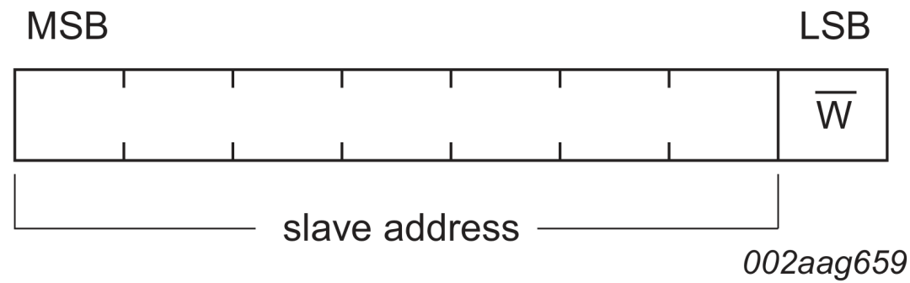

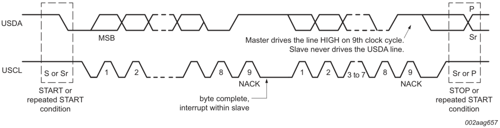

**3、ACK or NACK**

每次传输完一个字节以后，从设备要进行一个回应，回应 ACK 或者 NACK。

ACK ：在传输 8 bit 以后，在第九个 bit ，SCL 高电平，如果 SDA 是低电平，说明回应了 ACK。

NACK：在传输 8 bit 以后，在第九个 bit ，SCL 高电平，如果 SDA 是高电平，说明回应了 NACK。

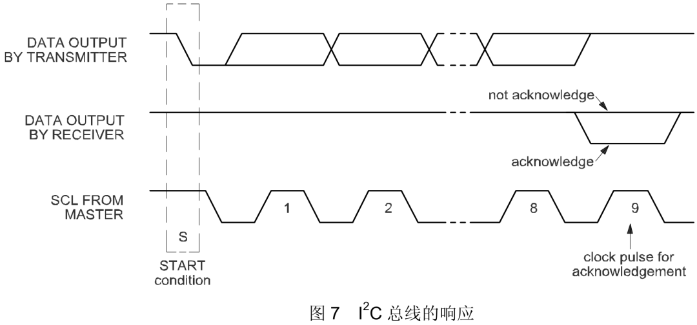

**4、write data**

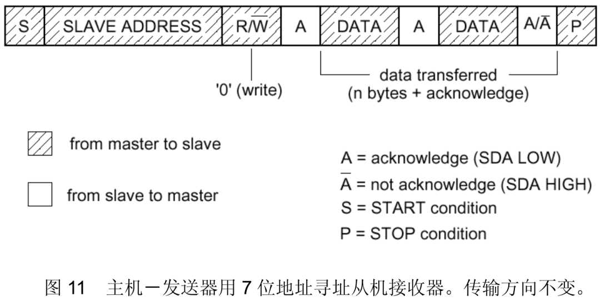

**5、read data**

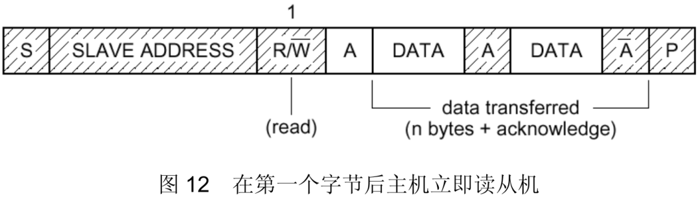

**6、复合格式**

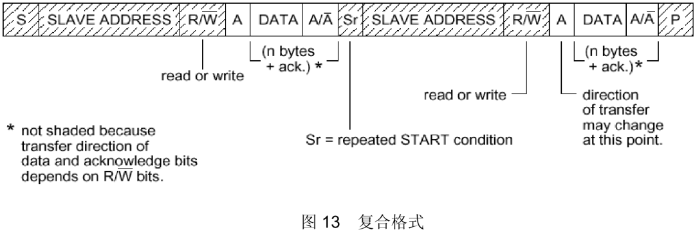

**7、I2C Transfer Regulation**

1. 以 START 条件开始
2. 以 STOP 条件结束
3. 传输的第一个字节为 7bit 从机地址 + 1bit 读写位
4. 每个总线上的设备都会比较 STRAT 信号后面的 7bit 地址与自己的地址是否匹配
5. 每个 byte(8 bits) 后面都会有 ACK 或者 NACK
6. 在 START 信号或者 repeated START 信号后，从机必须重置自己的总线逻辑
7. 一个 START 后面紧跟着一个 STOP 信号，是非法格式
8. 主机 master 可以不产生 STOP 信号，而是直接产生一个 repeated START 信号+另外一个设备地址，直接开始访问另外一个设备

**8、10-bit addressing**

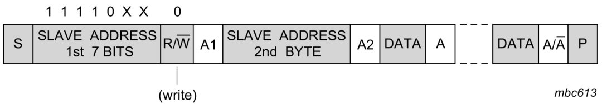

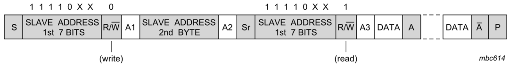

解析如下：

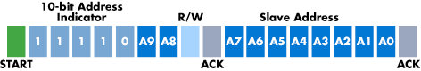

A9-A0 表示 10bits 地址

**9、示波器波形图**

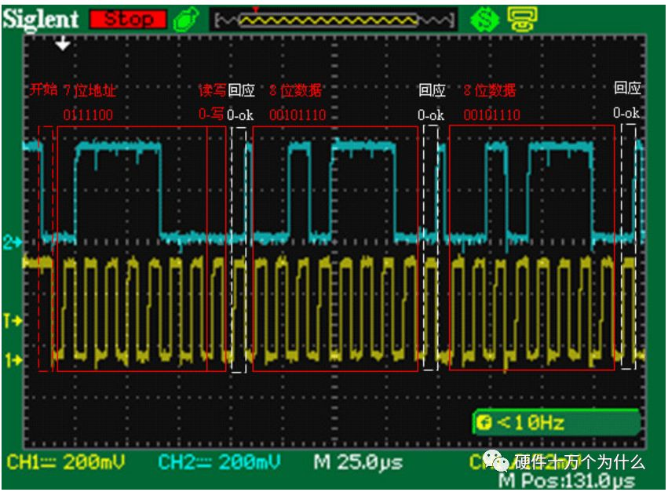

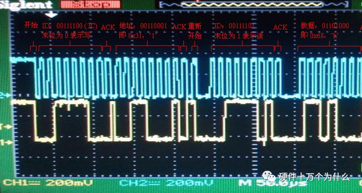

**10、补充**

I2C 不支持从设备在 SCL 和 SDA 总线上发起一个中断，通知主设备来读数据。有中断需求的从设备需要额外接一根中断线，通知主控数据已经准备好，让主控发起读数据的操作。

这无疑增加了系统复杂性，多占用了 pin 脚。I3C 则不存在这种问题，I3C 允许从设备在 SCL 和SDA 上发起中断，叫“带内中断”，I3C 后面会讲。


## I2C 子系统（四）

https://mp.weixin.qq.com/s/wXBlvM1Dc_nVKrzqBI4stA

### 4、I2C Synchronization And Arbitration

本文讲解三个重要的 I2C 概念：时钟延展、同步、仲裁

### Data and ACK/NACK

**正常情况**

主接收机必须向从机发送传输结束的信号。

**异常情况**

1. 发送到总线上的地址，却没有匹配的从机
2. 从机处于 busy 状态。
3. 在传输过程中，从机获取其不理解的数据或命令。
4. 在传输过程中，从机无法再接收任何数据字节。

主机可以生成停止条件以中止传输，或生成重复启动条件以启动新传输。

### Clock stretching 时钟延展

1. 时钟延展：通过将 SCL 线保持在低电平来暂停传输。在 SCL 再次拉高之前，传输无法进行。
2. 从机通过将 SCL 线拉低，强制主机进入等待状态。
3. 时钟延展功能是可选的，不是必选的
4. 时钟延展导致需要更多时间来存储接收到的字节或准备另一个要传输的字节
5. 通过延长每个时钟低电平周期来降低总线时钟。任何主机的速度都与该设备的内部运行速度相适应。
6. 在 Hs 模式下，此握手功能只能在字节级别使用

I2C 主设备始终控制着时钟线 SCL，不论是往设备写还是从设备读。一般情况下，如果操作对象是 EEPROM 或者其他简单设备而言，无所谓，但是，如果从设备是处理器，在接到主机命令后要去处理一些运算然后得出结果返回给主机。这个时候可能造成来不及处理。怎么办？这时，从设备会主动控制时钟线把它拉低！直到数据准备好之后再释放时钟线，把控制权交还给 MASTER。这也是 I2C 通信系统中，从机唯一能控制总线的时候！

关键是很多 I2C 主机不支持 clock stretching 功能，所以，无法和带有 clock stretching 功能的从机通信！所以，各位在选择主机器件之前，必须要注意这一点，不然整个设计方案可能报废，影响很大。

### Synchronization And Arbitration

在多主的通信系统中。总线上有多个节点，它们都有自己的寻址地址，可以作为从节点被别的节点访问，同时它们都可以作为主节点向其他的节点发送控制字节和传送数据。

但是如果有两个或两个以上的节点都向总线上发送启动信号并开始传送数据，这样就形成了冲突。要解决这种冲突，就要进行仲裁的判决，这就是 I2C 总线上的仲裁。

I2C 总线上的仲裁分两部分：SCL 线的同步和 SDA 线的仲裁，这两部分没有先后关系，同时进行。

#### SCL Synchronization

SCL 同步是由于总线具有线“与”的逻辑功能，即只要有一个节点发送低电平时，总线上就表现为低电平。当所有的节点都发送高电平时，总线才能表现为高电平。正是由于线“与”逻辑功能的原理，当多个节点同时发送时钟信号时，在总线上表现的是统一的时钟信号。这就是 SCL 的同步原理。

同步过程如下图：


#### SDA Arbitration

SDA线的仲裁也是建立在总线具有线“与”逻辑功能的原理上的。节点在发送1位数据后，比较总线上所呈现的数据与自己发送的是否一致。是，继续发送；否则，退出竞争。

SDA 线的仲裁可以保证 I2C 总线系统在多个主节点同时企图控制总线时通信正常进行并且数据不丢失。总线系统通过仲裁只允许一个主节点可以继续占据总线。

1. 仲裁在 SDA 上进行，此时 SCL 为高电平。
2. A 主机传输高电平,B 主机传输低电平，A 失去仲裁。
3. 丢失仲裁的主机将生成时钟脉冲，直到丢失仲裁的字节结束。

##### 仲裁过程：

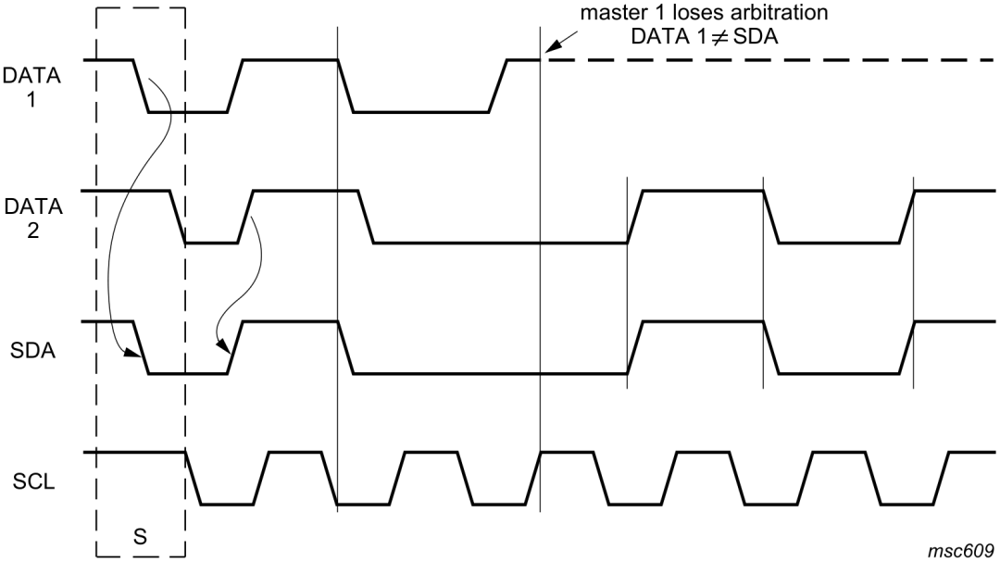

DATA1 和 DATA2 分别是主节点向总线所发送的数据信号，SDA 为总线上所呈现的数据信号，SCL 是总线上所呈现的时钟信号。

当主节点 1、2 同时发送起始信号时，两个主节点都发送了高电平信号。这时总线上呈现的信号为高电平，两个主节点都检测到总线上的信号与自己发送的信号相同，继续发送数据。

第2个时钟周期，2个主节点都发送低电平信号，在总线上呈现的信号为低电平，仍继续发送数据。

在第3个时钟周期，主节点1发送高电平信号，而主节点2发送低电平信号。根据总线的线“与”的逻辑功能，总线上的信号为低电平，这时主节点1检测到总线上的数据和自己所发送的数据不一样，就断开数据的输出级，转为从机接收状态。这样主节点2就赢得了总线，而且数据没有丢失，即总线的数据与主节点2所发送的数据一样，而主节点1在转为从节点后继续接收数据，同样也没有丢掉 SDA 线上的数据。因此在仲裁过程中数据没有丢失。

再次提醒：SDA仲裁和SCL时钟同步处理过程没有先后关系，而是同时进行的。


