## SPI子系统 - HQ

[TOC]

------

#### 注意

- https://mp.weixin.qq.com/s/1fuPAzyY9NUvy6eiIS3yJQ


------

## SPI 子系统（一）：SPI spec

### 1、SPI  hardware

SPI：Serial Perripheral Interface，串行外围设备接口，由 Motorola 公司提出，是一种高速、全双工、同步通信总线。SPI 以主从方式工作，通常是有一个主设备和一个或多个从设备，无应答机制。

本文我们讲解标准的 4 线 SPI，四根线如下：

①、CS/SS，Slave Select/Chip Select，片选信号线，用于选择需要进行通信的从设备。

②、SCK，Serial Clock，串行时钟，和 I2C 的 SCL 一样，为 SPI 通信提供时钟。

③、MOSI/SDO，Master Out Slave In/Serial Data Output，主输出从输入。

④、MISO/SDI，Master In Slave Out/Serial Data Input，主输入从输出。

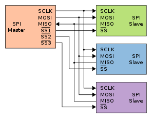

### 2、SPI 四种工作模式

SPI 有四种工作模式，通过时钟极性(CPOL)和时钟相位(CPHA)的搭配来得到四种工作模式：

```
①、CPOL=0，串行时钟空闲状态为低电平。
②、CPOL=1，串行时钟空闲状态为高电平。
③、CPHA=0，串行时钟的第一个跳变沿(上升沿或下降沿)采集数据。
④、CPHA=1，串行时钟的第二个跳变沿(上升沿或下降沿)采集数据。
```


示例波形图如下：


SPI 是全双工的，所以读写时序可以一起完成。

### 3、SPI 传输机制

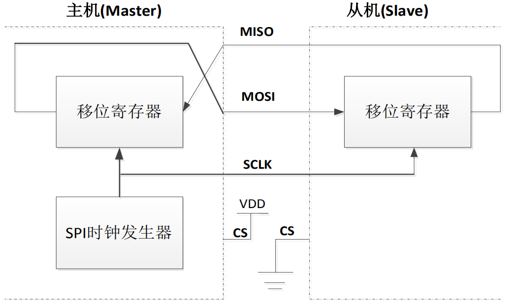

从图可以看出，主机和从机都有一个串行移位寄存器，主机通过向它的 SPI 串行寄存器写入一个字节来发起一次传输。寄存器通过 MOSI 信号线将字节传送给从机，从机也将自己的移位寄存器中的内容通过 MISO 信号线返回给主机。这样，两个移位寄存器中的内容就被交换。

外设的写操作和读操作是同步完成的。如果只进行写操作，主机只需忽略接收到的字节；反之，若主机要读取从机的一个字节，就必须发送一个空字节来引发从机的传输。

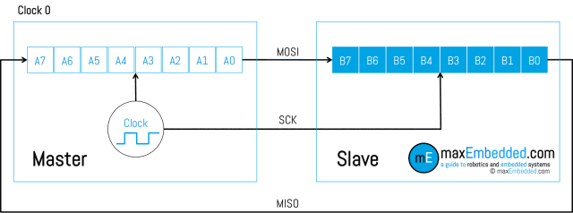


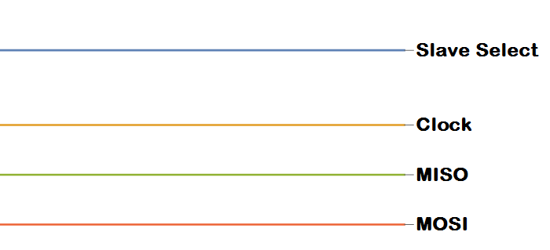

虽然 SPI 四线制支持读写同时进行，但实际上我们很多时候并不需要又读又写，见以下两种情况（参考 BMA223 数据手册）：

注意：如下三幅图示均为 CPOL=1，CPHA=1

**1、主机向从机写数据**


主机发送先发送 8 bits，第一个 bit 为 0 代表这次主机是想写数据到从机，AD6~AD0 表示要写的寄存器地址。然后，主机就会一直写下去。在这期间 SDO 一直没用，一直是高阻态，算是一直读到1。

**2、主机从从机读数据**


这种情况下，主机先发送 8 bits，第一位为 1 代表这次是读，然后 AD6 ~ AD0 是想要读的寄存器地址，然后 SDO 开始返回数据。

### 4、SPI timing diagram


```
Tcsb_setup：建立时间
Tcsb_hold：保持时间
tsckl：低电平时间
tsckh：高电平时间
SCK period ：Tsckl + tsckh
一般情况下 Tsckl = tsckh
```

注意：真实的波形图如上，高低电平并不是到达最高点才算，0.3Vdd 以下为低电平，0.7Vdd 以上为高电平，计算信号时间长度的时候需要注意这个微小的时间，硬件设计必须注意信号质量风险，软件开发人员也要会看波形图。

这里的参数，一般 spi 驱动不需要设置，但是半导体厂商提供的 spi 控制器驱动中，可以修改这些参数。我们写 SPI 驱动时候，可以根据从设备的要求来修改这些参数。

### 5、DMA 与 FIFO

不同平台对于 SPI FIFO 和 DMA 的 buffer size 设置不同：

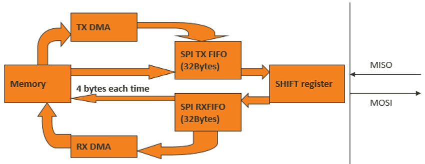

传输 32bytes 以下使用 FIFO，传输 32bytes 以上使用 DMA。

DMA 可以自动发起多次传输，一次最大 256K 。

### 6、I2C 与 SPI 对比

| 功能     |    I2C     |                  SPI |
| :------- | :--------: | -------------------: |
| 线数     | 2(SDA,SCL) | 4(MOSI,MISO,SCLK,CS) |
| 主机数量 |    >=1     |                  ==1 |
| 类型     |   半双工   |               全双工 |
| 回应机制 |    yes     |                   no |
| 速度     | <=3.4Mbps  |                 high |
| 应用     |  重要数据  |             大量数据 |
| 流控     |    yes     |                   no |
| 设备地址 |    yes     |                   no |
| 常规用途 |    命令    |                 数据 |

I2C 和 SPI 的速率如下：

| I2C模式 |  速度  |
| :------ | :----: |
| 标准    | 100KHz |
| 快速    | 400KHz |
| 快速+   |  1MHz  |
| 高速    | 3.4MHz |

SPI 速率：几十 MHz 甚至上百 MHz，速度取决于 CPU 的 SPI 控制器和时钟 clock

STM32F103 的 SPI 最高支持 18MHz，imx6ull 的 SPI 最高支持 52MHz，其他芯片一般用不到更高的，因为速度越快波形质量越不好，越容易出问题。

具体采用多大速率还和外设有关，比如 EEPROM 的 W25Q128 的 SPI 最高支持 80MHz，ICM20608 传感器的 SPI 最高支持8MHz。一般用在 flash 上的速度会较快。

### 7、扩展

SPI 协议其实是包括：Standard SPI、Dual SPI 和 Queued SPI 三种协议接口。

Dual SPI 还是四线制，只是传输线可以变为同方向，速度是 Standard SPI 的两倍。

Queued SPI 是六线制，多了两根数据线，传输速度是 Standard SPI 的四倍。


## SPI 子系统（二）：SPI driver

https://mp.weixin.qq.com/s/ZTMFIltanYFQzey4FbVcsw

### 1、SPI 驱动源文件目录

Linux common spi driver

```
kernel-4.14/drivers/spi/spi.c  Linux 提供的通用接口封装层驱动
kernel-4.14/drivers/spi/spidev.c  linux 提供的 SPI 通用设备驱动程序
kernel-4.14/include/linux/spi/spi.h  linux 提供的包含 SPI 的主要数据结构和函数
```

spi 控制器驱动，IC 厂商提供，不同厂商命名不同

```
kernel-4.14/drivers/spi/spi-mt65xx.c  MTK SPI 控制器驱动
kernel-4.14/drivers/spi/spi-mt65xx-dev.c
kernel-4.14/include/linux/platform_data/spi-mt65xx.h
```

dts

```
kernel-4.14/arch/arm/boot/dts/...
kernel-4.14/arch/arm64/boot/dts/...
```

以上文件对应如下 SPI 驱动软件架构：


##### SPI 控制器驱动程序

SPI 控制器不用关心设备的具体功能，它只负责把上层协议驱动准备好的数据按 SPI 总线的时序要求发送给 SPI 设备，同时把从设备收到的数据返回给上层的协议驱动，因此，内核把 SPI 控制器的驱动程序独立出来。

SPI 控制器驱动负责控制具体的控制器硬件，诸如 DMA 和中断操作等等，因为多个上层的协议驱动可能会通过控制器请求数据传输操作，所以，SPI 控制器驱动同时也要负责对这些请求进行队列管理，保证先进先出的原则。

##### SPI 通用接口封装层

为了简化 SPI 驱动程序的编程工作，同时也为了降低【协议驱动程序】和【控制器驱动程序】的耦合程度，内核把控制器驱动和协议驱动的一些通用操作封装成标准的接口，加上一些通用的逻辑处理操作，组成了 SPI 通用接口封装层。

这样的好处是，对于控制器驱动程序，只要实现标准的接口回调 API，并把它注册到通用接口层即可，无需直接和协议层驱动程序进行交互。而对于协议层驱动来说，只需通过通用接口层提供的 API 即可完成设备和驱动的注册，并通过通用接口层的 API 完成数据的传输，无需关注 SPI 控制器驱动的实现细节。

##### SPI 协议驱动程序

SPI 设备的具体功能是由 SPI 协议驱动程序完成的，SPI 协议驱动程序了解设备的功能和通信数据的协议格式。向下，协议驱动通过通用接口层和控制器交换数据，向上，协议驱动通常会根据设备具体的功能和内核的其它子系统进行交互。

例如，和 MTD 层交互以便把 SPI 接口的存储设备实现为某个文件系统，和 TTY 子系统交互把 SPI 设备实现为一个 TTY 设备，和网络子系统交互以便把一个 SPI 设备实现为一个网络设备。如果是一个专有的 SPI 设备，我们也可以按设备的协议要求，实现自己的专有协议驱动。

##### SPI 通用设备驱动程序

考虑到连接在 SPI 控制器上的设备的可变性，在内核没有配备相应的协议驱动程序，对于这种情况，内核为我们准备了通用的 SPI 设备驱动程序，该通用设备驱动程序向用户空间提供了控制 SPI 控制的控制接口，具体的协议控制和数据传输工作交由用户空间根据具体的设备来完成，在这种方式中，只能采用同步的方式和 SPI 设备进行通信，所以通常用于一些数据量较少的简单 SPI 设备。

### 2、SPI 通用接口层

1. SPI 通用接口层把具体的 SPI 设备的协议驱动和 SPI 控制器驱动连接在一起。
2. 负责 SPI 系统与 Linux 设备模型相关的初始化工作。
3. 为协议驱动和控制器驱动提供一系列的标准接口 API 及其数据结构。
4. SPI 设备、SPI 协议驱动、SPI 控制器的数据抽象
5. 协助数据传输而定义的数据结构

kernel-4.14/drivers/spi/spi.c

```
static int __init spi_init(void)
{
 int status;

 buf = kmalloc(SPI_BUFSIZ, GFP_KERNEL);
 if (!buf) {
  status = -ENOMEM;
  goto err0;
 }
        
  // 创建 /sys/bus/spi 节点
 status = bus_register(&spi_bus_type);
 if (status < 0)
  goto err1;

  //创建 /sys/class/spi_master 节点
 status = class_register(&spi_master_class);
 if (status < 0)
  goto err2;

 if (IS_ENABLED(CONFIG_SPI_SLAVE)) {
  status = class_register(&spi_slave_class);
  if (status < 0)
   goto err3;
 }
        ......
}
```

在这里创建了 SPI 总线，创建 /sys/bus/spi 节点和 /sys/class/spi_master 节点。

**重要数据结构：**

```
spi_device
spi_driver
spi_board_info
spi_controller/spi_master
spi_transfer
spi_message
```

**重要 API**

```
spi_message_init
spi_message_add_tail
spi_sync
spi_async
spi_write
spi_read
```

接下来详细解析结构体和API，只讲解重点部分，完整解析请参考官方文档

```
https://www.kernel.org/doc/html/v4.14//driver-api/spi.html
```

只有熟悉每个结构体存储的是什么东西，才能真正搞懂 SPI 模块。

spi_master/spi_controller：描述一个 spi 主机设备

```
struct spi_master {
  //Linux 驱动模型中的设备
 struct device dev;

  //此 spi_master 设备在全局 spi_master 链表中的节点
 struct list_head list;

  //此 spi_master 编号
 s16   bus_num;

  //此 spi_master 支持的片选信号数量
 u16   num_chipselect;

  //dma 地址对齐
 u16   dma_alignment;

  //此 spi_master 支持传输的 mode
 u16   mode_bits;
 u32   bits_per_word_mask;
 /* limits on transfer speed */
 u32   min_speed_hz;
 u32   max_speed_hz;

 /* other constraints relevant to this driver */
 u16   flags;

 /* lock and mutex for SPI bus locking */
 spinlock_t  bus_lock_spinlock;//总线自旋锁
 struct mutex  bus_lock_mutex;//总线互斥锁

  //总线是否处于 lock 状态
 bool   bus_lock_flag;

  //准备传输，设置传输的参数
 int   (*setup)(struct spi_device *spi);

  //传输数据
 int   (*transfer)(struct spi_device *spi,
     struct spi_message *mesg);
  // 设备 release 时的清除工作
 void   (*cleanup)(struct spi_device *spi);

 bool   (*can_dma)(struct spi_master *master,
        struct spi_device *spi,
        struct spi_transfer *xfer);

 bool   queued;//是否采用系统的序列化传输
 struct kthread_worker kworker;//序列化传输时的线程 worker
 struct task_struct *kworker_task;//序列化传输的线程
 struct kthread_work pump_messages;//序列化传输时的处理函数
 spinlock_t  queue_lock;//序列化传输时的queue_lock
 struct list_head queue;//序列化传输时的 msg 队列头
 struct spi_message *cur_msg;//序列化传输时当前的 msg
 bool   idling;
 bool   busy;//序列化传输时线程是否处于busy状态
 bool   running;//序列化传输时线程是否在运行
 bool   rt;//是否实时传输
  ......

 int (*prepare_transfer_hardware)(struct spi_master *master);

  //一个 msg 的传输实现
 int (*transfer_one_message)(struct spi_master *master,
        struct spi_message *mesg);
  ......

 /* gpio chip select */
 int   *cs_gpios;
  ......
};
```

spi_device：描述一个 spi 从机设备

```
struct spi_device {
  //Linux驱动模型中的设备
 struct device  dev;
 struct spi_master *master;//设备所连接的 spi 主机设备
 u32   max_speed_hz;//该设备最大传输速率
 u8   chip_select;//CS片选信号编号
 u8   bits_per_word;//每次传输长度
 u16   mode;//传输模式
 ......
 int   irq;//软件中断号
 void   *controller_state;//控制器状态
 void   *controller_data;//控制参数
 char   modalias[SPI_NAME_SIZE];//设备名称
  //CS 片选信号对应的 GPIO number
 int   cs_gpio;  /* chip select gpio */

 /* the statistics */
 struct spi_statistics statistics;
};
```

spi_driver：描述一个 spi 设备驱动

```
struct spi_driver {
  //此driver所支持的 spi 设备 list
 const struct spi_device_id *id_table;
 int   (*probe)(struct spi_device *spi);
 int   (*remove)(struct spi_device *spi);
  //系统 shutdown 时的回调函数
 void   (*shutdown)(struct spi_device *spi);
 struct device_driver driver;
};
```

spi_board_info：描述一个 spi 从机设备板级信息，无设备树时使用

```
struct spi_board_info {
  //设备名称
 char  modalias[SPI_NAME_SIZE];
 const void *platform_data;//设备的平台数据
 void  *controller_data;//设备的控制器数据
 int  irq;//设备的中断号
 u32  max_speed_hz;//设备支持的最大速率
 u16  bus_num;//设备连接的 spi 总线编号
 u16  chip_select;//设备连接的 CS 信号编号
 u16  mode;//设备使用的传输 mode
};
```

spi_transfer：描述 spi 传输的具体数据

```
struct spi_transfer {

 const void *tx_buf;//spi_transfer 的发送 buf
 void  *rx_buf;//spi_transfer 的接收 buf
 unsigned len;//spi_transfer 发送和接收的长度

 dma_addr_t tx_dma;//tx_buf 对应的 dma 地址
 dma_addr_t rx_dma;//rx_buf 对应的 dma 地址
 struct sg_table tx_sg;
 struct sg_table rx_sg;

  //spi_transfer传输完成后是否要改变 CS 片选信号
 unsigned cs_change:1;
 unsigned tx_nbits:3;
 unsigned rx_nbits:3;
  ......
 u8  bits_per_word;//spi_transfer 中一个 word 占的bits
 u16  delay_usecs;//两个 spi_transfer 直接的等待延迟
 u32  speed_hz;//spi_transfer 的传输速率

 struct list_head transfer_list;//spi_transfer挂载到的 message 节点
};
```

spi_message：描述一次 spi 传输的信息

```
struct spi_message {
  //挂载在此 msg 上的 transfer 链表头
 struct list_head transfers;
  //此 msg 需要通信的 spi 从机设备
 struct spi_device *spi;
  //所使用的地址是否是 dma 地址
 unsigned  is_dma_mapped:1;

 //msg 发送完成后的处理函数
 void   (*complete)(void *context);
 void   *context;//complete函数的参数
 unsigned  frame_length;
 unsigned  actual_length;//此 msg 实际成功发送的字节数
 int   status;//此 msg 的发送状态，0：成功，负数，失败

 struct list_head queue;//此 msg 在所有 msg 中的链表节点
 void   *state;//此 msg 的私有数据
};
```

### 队列化

SPI 数据传输可以有两种方式：同步方式和异步方式。

同步方式：数据传输的发起者必须等待本次传输的结束，期间不能做其它事情，用代码来解释就是，调用传输的函数后，直到数据传输完成，函数才会返回。

异步方式：数据传输的发起者无需等待传输的结束，数据传输期间还可以做其它事情，用代码来解释就是，调用传输的函数后，函数会立刻返回而不用等待数据传输完成，我们只需设置一个回调函数，传输完成后，该回调函数会被调用以通知发起者数据传送已经完成。

同步方式简单易用，很适合处理那些少量数据的单次传输。但是对于数据量大、次数多的传输来说，异步方式就显得更加合适。

对于 SPI 控制器来说，要支持异步方式必须要考虑以下两种状况：

1. 对于同一个数据传输的发起者，既然异步方式无需等待数据传输完成即可返回，返回后，该发起者可以立刻又发起一个 message，而这时上一个message还没有处理完。
2. 对于另外一个不同的发起者来说，也有可能同时发起一次message传输请求。

队列化正是为了为了解决以上的问题，所谓队列化，是指把等待传输的 message 放入一个等待队列中，发起一个传输操作，其实就是把对应的 message 按先后顺序放入一个等待队列中，系统会在不断检测队列中是否有等待传输的 message，如果有就不停地调度数据传输内核线程，逐个取出队列中的 message 进行处理，直到队列变空为止。SPI 通用接口层为我们实现了队列化的基本框架。


spi_message 就是一次 SPI 数据交换的原子操作，不可打断。

### 3、SPI 控制器驱动层

SPI 控制器驱动层负责最底层的数据收发，主要有以下功能：

1. 申请必要的硬件资源，比如中断、DMA 通道、DMA 内存缓冲区等等
2. 配置 SPI 控制器的工作模式和参数，使之可以和相应的设备进行正确的数据交换
3. 向通用接口层提供接口，使得上层的协议驱动可以通过通用接口层访问控制器驱动
4. 配合通用接口层，完成数据消息队列的排队和处理，直到消息队列变空为止

SPI 主机驱动就是 SOC 的 SPI 控制器驱动。Linux 内核使用 spi_master/spi_controller 表示 SPI 主机驱动，spi_master 是个结构体，定义在 include/linux/spi/spi.h 文件中。

SPI 主机驱动的核心就是申请 spi_master，然后初始化 spi_master，最后向 Linux 内核注册 spi_master。

**API 如下：**

```
spi_alloc_master 函数：申请 spi_master。
spi_master_put 函数：释放 spi_master。

spi_register_master函数：注册 spi_master。
spi_unregister_master 函数：注销 spi_master。

spi_bitbang_start函数：注册 spi_master。
spi_bitbang_stop 函数：注销 spi_master。
```

#### SPI 主机驱动的加载

以 MTK 为例，源码来自于小米开源项目

```
https://github.com/MiCode/Xiaomi_Kernel_OpenSource
```

小米每做一个项目，都会把 kernel 部分开源，因为需要遵循 Linux GPL 开源协议。

【设备】声明在设备树中

```
kernel-4.14/arch/arm64/boot/dts/mediatek/mt6885.dts
```

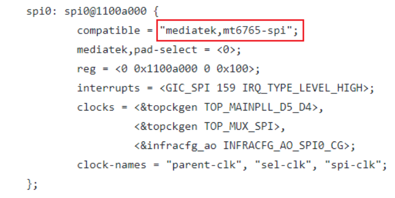

【驱动】

kernel-4.14/drivers/spi/spi-mt65xx.c

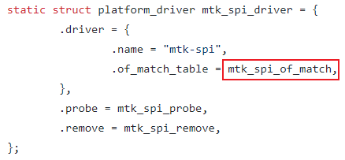

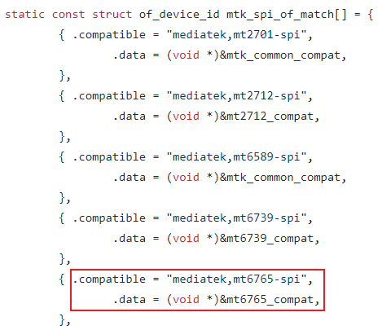

匹配以后，probe 函数执行，申请 spi_master，初始化 spi_master，最后向 Linux 内核注册 spi_master。

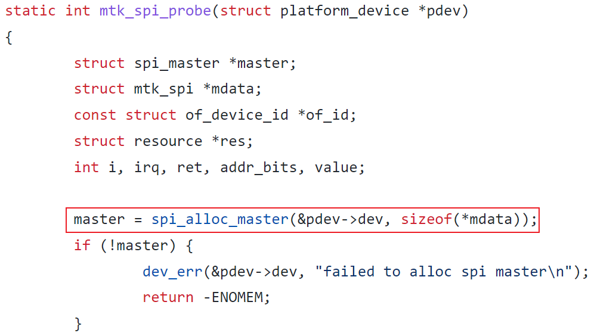

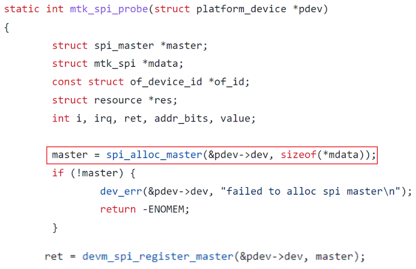

### 4、软件流程

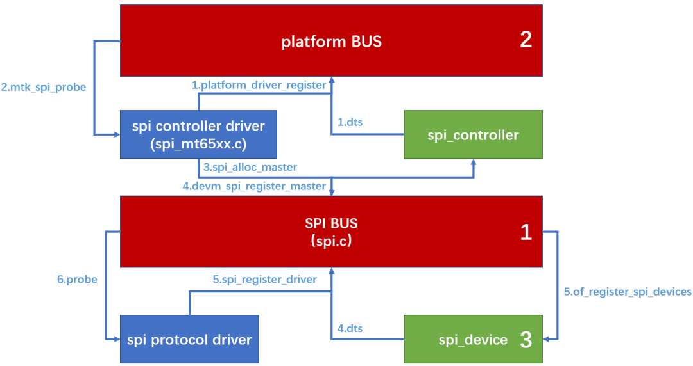

看懂该图，对 SPI 驱动框架就有完整的了解了。

1、2、3 按顺执行，首先有 spi 总线的注册，然后是 spi 控制器驱动加载，然后是设备驱动加载。

区别在于，spi 控制器驱动加载时，是靠 platform 总线匹配设备（控制器）与驱动。spi 设备驱动加载时，是靠 spi 总线匹配设备（外设IC）与驱动。

#### init flow


**spi_register_master 的调用序列图**

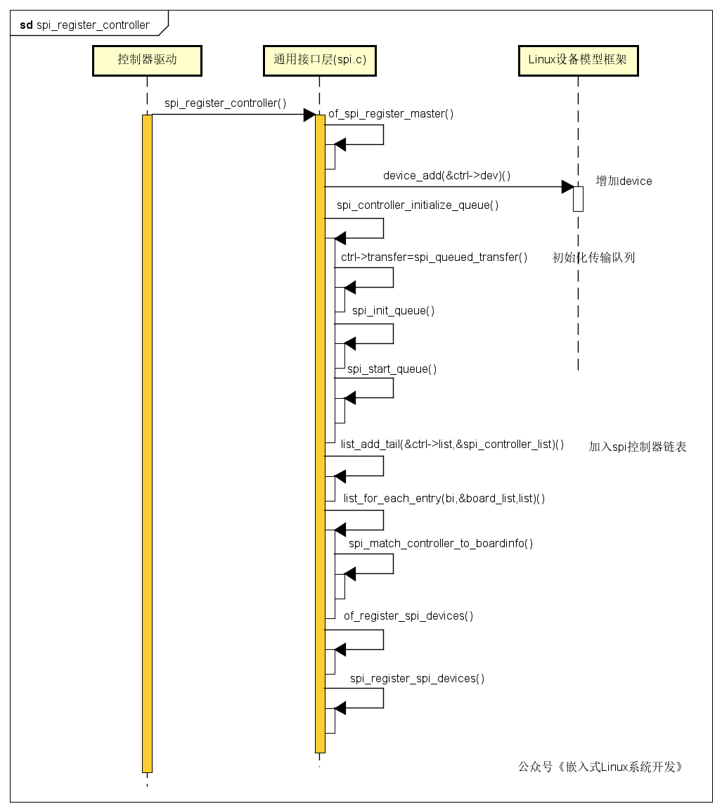

**队列化的工作机制及过程**

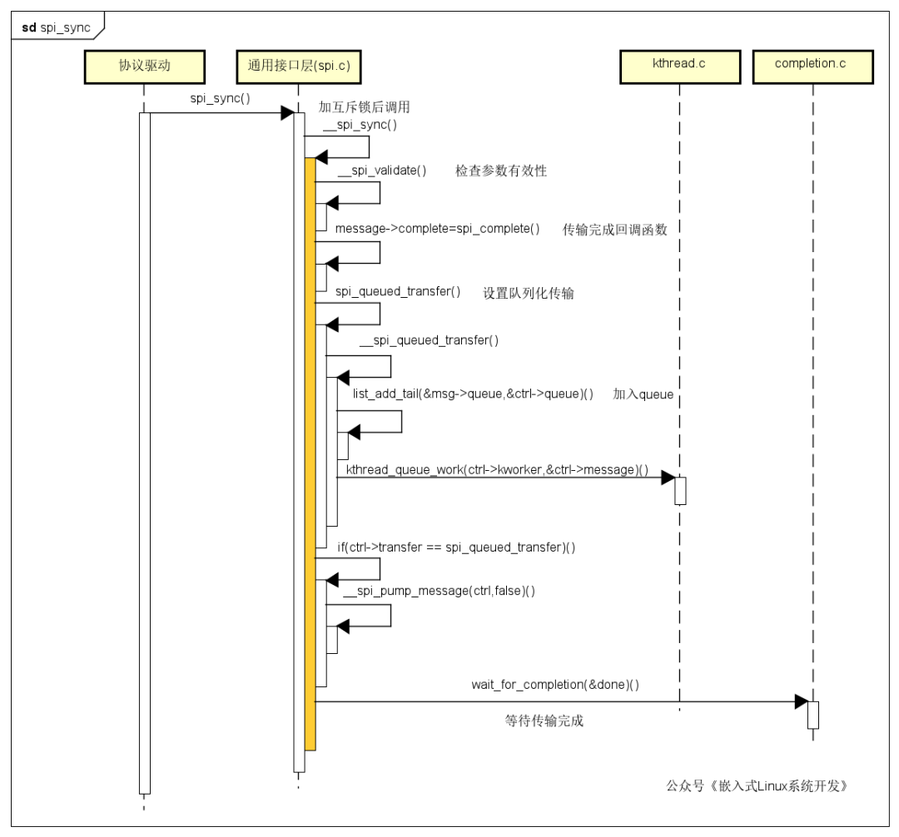


当协议驱动程序通过 spi_async 发起一个 message 请求时，队列化和工作线程被激活，触发一些列的操作，最终完成 message 的传输操作。

spi_sync 与 spi_async 类似，只是有一个等待过程。

### 5、SPI 设备驱动

【设备】声明在设备树中

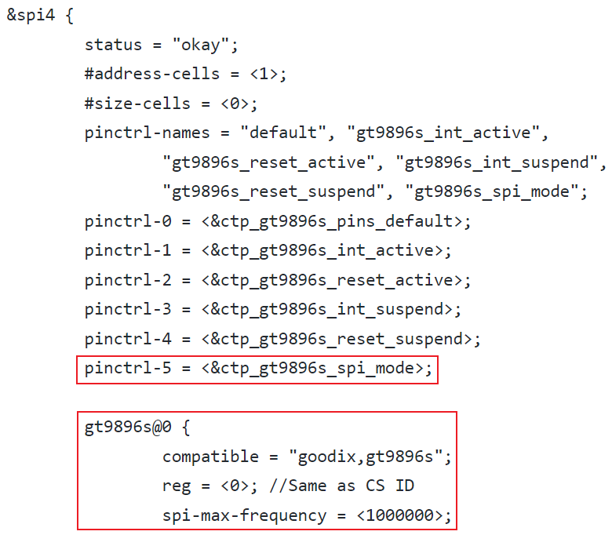

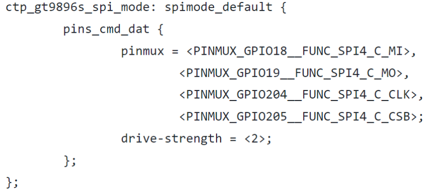

注意：设备的声明，slave device node 应该包含在你所要挂载的 &spi node 下，将 device 绑定在 master 上。然后通过 pinctrl 方式指定 GPIO，并在驱动中操作 pinctrl 句柄。

【驱动】demo

Linux 内核使用 spi_driver 结构体来表示 spi 设备驱动，我们在编写 SPI 设备驱动的时候需要实现 spi_driver。spi_driver 结构体定义在 include/linux/spi/spi.h 文件中。

```
spi_register_driver：注册 spi_driver
spi_unregister_driver：销掉 spi_driver
/* probe 函数 */
static int xxx_probe(struct spi_device *spi)
{

 /* 具体函数内容 */
 return 0;
}

/* remove 函数 */
static int xxx_remove(struct spi_device *spi)
{

 /* 具体函数内容 */
 return 0;
}

/* 传统匹配方式 ID 列表 */
static const struct spi_device_id xxx_id[] = {

 {"xxx", 0},
 {}
};

/* 设备树匹配列表 */
static const struct of_device_id xxx_of_match[] = {

 { .compatible = "xxx" },
 { /* Sentinel */ }
};

/* SPI 驱动结构体 */
static struct spi_driver xxx_driver = {

 .probe = xxx_probe,
 .remove = xxx_remove,
 .driver = {
  .owner = THIS_MODULE,
  .name = "xxx",
  .of_match_table = xxx_of_match,
  },
 .id_table = xxx_id,
};

/* 驱动入口函数 */
static int __init xxx_init(void)
{

 return spi_register_driver(&xxx_driver);
}

/* 驱动出口函数 */
static void __exit xxx_exit(void)
{

 spi_unregister_driver(&xxx_driver);
}

module_init(xxx_init);
module_exit(xxx_exit);
```

在驱动入口函数中调用 spi_register_driver 来注册 spi_driver。

在驱动出口函数中调用 spi_unregister_driver 来注销 spi_driver。

spi 读写数据demo

```
/* SPI 多字节发送 */
static int spi_send(struct spi_device *spi, u8 *buf, int len)
{
 int ret;
 struct spi_message m;
 
 struct spi_transfer t = {
  .tx_buf = buf,
  .len = len,
 };
 
 spi_message_init(&m); /* 初始化 spi_message */
 spi_message_add_tail(t, &m);/* 将 spi_transfer 添加到 spi_message 队列 */
 ret = spi_sync(spi, &m); /* 同步传输 */
 return ret;
}
/* SPI 多字节接收 */
static int spi_receive(struct spi_device *spi, u8 *buf, int len)
{
 int ret;
 struct spi_message m;
 
 struct spi_transfer t = {
  .rx_buf = buf,
  .len = len,
 };
 
 spi_message_init(&m); /* 初始化 spi_message */
 spi_message_add_tail(t, &m);/* 将 spi_transfer 添加到 spi_message 队列 */
 ret = spi_sync(spi, &m); /* 同步传输 */
 return ret;
}
```

除了 init、exit、probe、remove、read、write 函数外，其他的函数看需求实现，这几个是最基本的。

### 6、总结

Linux 是 总线、设备、驱动 的框架，理解了这个框架，就能理解所有的模块驱动框架。

SPI 驱动比 I2C 驱动还是简单很多的。


