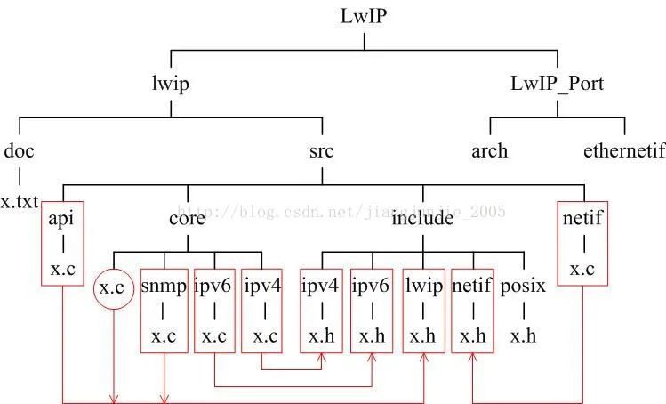

## 嵌入式工程文件架构 - HQ

[TOC]

------

#### 注意

- [嵌入式工程文件怎么安排比较合理 - 摘录文章](https://mp.weixin.qq.com/s/HbNHSUUUN3nfQwuNRbtamA)

------

## 嵌入式工程文件安排

嵌入式系统一般用C语言来实现，当代码规模增大后经常出现各种问题：如何将众多的源文件放置在不同的目录中？头文件.h和源文件.c如何组织？说明文档和源文件如何存放？还要考虑移植。

下面以LwIP为分析案例，学习一个经典的文件组织架构。

> 

从图可以看到，设计者一开始就考虑了**主代码与移植代码分离**：**lwip是主代码，LwIP_Port是移植代码**，当需要移植LwIP时可以让用户只关心LwIP_Port目录下的文件，减少工作量。

LwIP_Port下有两大目录，arch目录保存LwIP移植到不同OS下时该修改的文件，ethernetif保存LwIP移植到不同的网络适配器时该修改的文件。

> 

主代码目录下，首先是**doc目录，它保存LwIP的说明文档**，其次是**src目录，它保存LwIP的主文件**。

主文件按不同的功能又分成4部分：**api是用户调用接口，core是核心文件，include是整个系统的头文件存放区，netif处理底层网络接口。**

> 

接下来再来看看.h头文件是如何组织的，从图可以看出，**所有的头文件都存放在LwIP\lwip\src\include下**，**头文件与.C源文件还具有良好的对应关系**，这种统一存放方便查找和维护。

> 

**把头文件集中存放的另一个好处是便于代码编译**，当代码放置于编译环境（常见为IED环境）中可以设置预编译路径，告诉编译器头文件在什么地方。

设当前编译环境为IAR，以图为例可以设置预编译宏指令，在工程的Option下，选择C/C++ Compiler下的Preprocessor，添加

```
$PROJ_DIR$ \Lwip\lwip\src\include
```

这样一来，.C源文件的如下语句就能让编译器找到对应的头文件。

```
#include "lwip/def.h"
```

因为编译器会将上述语句的包括路径解释成：（是工程当前目录）

```
#include $PROJ_DIR$ \Lwip\lwip\src\include\lwip\def.h
```


