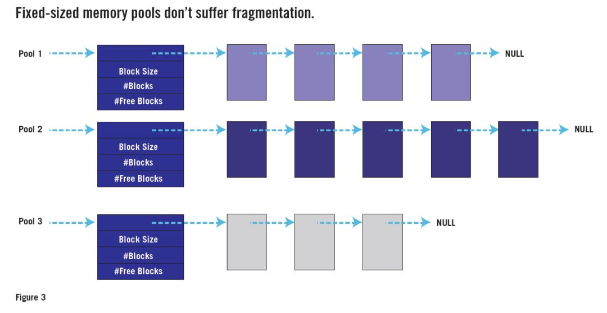

## 嵌入式开发常见错误 - HQ

[TOC]

------

#### 注意

- 

------

## 嵌入式开发出现BUG的常见原因 - 华清远见博主

**错误1：竞争条件**

竞争条件是指两个或多个执行线程（可以是RTOS任务或main（） 和中断处理程序）的组合结果根据交织指令的精确顺序而变化的任何情况。每个都在处理器上执行。

例如，假设您有两个执行线程，其中一个规则地递增一个全局变量（g_counter + = 1; ），而另一个偶然将其归零（g_counter = 0; ）。如果不能始终以原子方式（即，在单个指令周期内）执行增量，则存在竞争条件。

如图1所示，将任务视为汽车接近同一十字路口。计数器变量的两次更新之间的冲突可能永远不会发生，或者很少会发生。但是，这样做的时候，计数器实际上不会在内存中清零。其值至少在下一个清零之前是损坏的。这种影响可能会对系统造成严重后果，尽管可能要等到实际碰撞后很长一段时间才会出现。

> 

**最佳实践：**可以通过必须以适当的抢先限制行为对原子地执行代码的关键部分，来避免竞争条件。为防止涉及ISR的争用情况，必须在另一个代码的关键部分持续时间内至少禁止一个中断信号。

对于RTOS任务之间的争用，最佳实践是创建特定于该共享库的互斥体，每个互斥体在进入关键部分之前必须获取该互斥体。请注意，依靠特定CPU的功能来确保原子性不是一个好主意，因为这只能防止争用情况发生，直到更换编译器或CPU。

共享数据和抢占的随机时间是造成竞争状况的元凶。但是错误可能并不总是会发生，这使得从观察到的症状到根本原因的种族状况跟踪变得异常困难。因此，保持警惕以保护所有共享对象非常重要。每个共享对象都是一个等待发生的事故。

**最佳实践：**命名所有潜在共享的对象（包括全局变量，堆对象或外围寄存器和指向该对象的指针），以使风险对于所有将来的代码阅读者而言都是显而易见的；在Netrino嵌入式C编码标准提倡使用“的G_ 为此，”前缀。查找所有可能共享的对象将是争用条件代码审核的第一步。

**错误2：不可重入功能**

从技术上讲，不可重入功能的问题是争用状况问题的特例。而且，由于相关原因，由不可重入函数引起的运行时错误通常不会以可重现的方式发生-使它们同样难以调试。

不幸的是，非重入功能也比其他类型的竞争条件更难在代码审查中发现。

图2 显示了一个典型的场景。在这里，要抢占的软件实体也是RTOS任务。但是，它们不是通过直接调用共享对象而是通过函数调用间接操作。

例如，假设任务A调用套接字层协议功能，该套接字功能调用TCP层协议功能，调用IP层协议功能，该功能调用以太网驱动程序。为了使系统可靠地运行，所有这些功能都必须是可重入的。

但是，以太网驱动程序的所有功能都以以太网控制器芯片的寄存器形式操作相同的全局对象。如果在这些寄存器操作期间允许抢占，则任务B可以在将数据包A排队之后但在发送开始之前抢占任务A。

然后，任务B调用套接字层功能，该套接字层功能调用TCP层功能，再调用IP层功能，该功能调用以太网驱动程序，该队列将数据包B排队并传输。当CPU的控制权返回到任务A时，它将请求传输。根据以太网控制器芯片的设计，这可能会重传数据包B或产生错误。数据包A丢失，并且不会发送到网络上。

为了可以同时从多个RTOS任务中调用此以太网驱动程序的功能，必须使它们可重入。如果它们每个仅使用堆栈变量，则无事可做。

**因此，C函数最常见的样式固有地是可重入的。**但是，除非精心设计，否则驱动程序和某些其他功能将是不可重入的。

使函数可重入的关键是暂停对外围设备寄存器，包括静态局部变量，持久堆对象和共享内存区域在内的全局变量的所有访问的抢占。这可以通过禁用一个或多个中断或获取并释放互斥锁来完成。问题的细节决定了最佳解决方案。

**最佳实践：**在每个库或驱动程序模块中创建和隐藏一个互斥量，这些互斥量不是本质上可重入的。使获取此互斥锁成为操作整个模块中使用的任何持久数据或共享寄存器的前提。

例如，相同的互斥锁可用于防止涉及以太网控制器寄存器和全局或静态本地数据包计数器的竞争情况。在访问这些数据之前，模块中访问此数据的所有功能必须遵循协议以获取互斥量。

注意非重入功能可能会作为第三方中间件，旧版代码或设备驱动程序的一部分进入您的代码库。

令人不安的是，不可重入函数甚至可能是编译器随附的标准C或C ++库的一部分。如果您使用GNU编译器来构建基于RTOS的应用程序，请注意您应该使用可重入的“ newlib”标准C库，而不是默认库。

**错误3：缺少volatile关键字**

如果未使用C的volatile 关键字标记某些类型的变量，则可能导致仅在将编译器的优化器设置为低级或禁用编译器才能正常工作的系统中出现许多意外行为。该挥发性预选赛期间变量声明，其中它的目的是为了防止优化的读取和变量的写入使用。

例如，如果您编写清单1所示的代码，则优化器可能会通过消除第一行来尝试使程序更快速，更小，从而损害患者的健康。但是，如果将g_alarm 声明为volatile ，那么将不允许这种优化。

**最佳实践：**将挥发 的关键字应该用于声明每个：

由ISR和代码的任何其他部分访问的全局变量，

由两个或多个RTOS任务访问的全局变量（即使已阻止了这些访问中的竞争条件），

指向内存映射外设寄存器（或一组或一组寄存器）的指针，以及

延迟循环计数器。

**请注意，**除了确保所有读写操作都针对给定变量之外，使用volatile 还通过添加其他“序列点”来限制编译器。除易失性变量的读取或写入之外的其他易失性访问必须在该访问之前执行。

**错误4：堆栈溢出**

每个程序员都知道堆栈溢出是很不好的事情。但是，每次堆栈溢出的影响都各不相同。损坏的性质和不当行为的时机完全取决于破坏哪些数据或指令以及如何使用它们。重要的是，从堆栈溢出到它对系统的负面影响之间的时间长短取决于使用阻塞位之前的时间。

**不幸的是，**堆栈溢出比台式计算机更容易遭受嵌入式系统的困扰。这有几个原因，其中包括：

（1）嵌入式系统通常只能占用较少的RAM；

（2）通常没有虚拟内存可回退（因为没有磁盘）；

（3）基于RTOS任务的固件设计利用了多个堆栈（每个任务一个），每个堆栈的大小都必须足够大，以确保不会出现唯一的最坏情况的堆栈深度；

（4）中断处理程序可能会尝试使用这些相同的堆栈。

使该问题进一步复杂化的是，没有大量的测试可以确保特定的堆栈足够大。您可以在各种加载条件下测试系统，但是只能测试很长时间。仅在“半个蓝月亮”中运行的测试可能不会见证仅在“一次蓝月亮”中发生的堆栈溢出。在算法限制（例如无递归）下，可以通过对代码的控制流进行自上而下的分析来证明不会发生堆栈溢出。但是，每次更改代码时，都需要重做自上而下的分析。

**最佳实践：**启动时，在整个堆栈上绘制不太可能的内存模式。（我喜欢使用十六进制23 3D 3D 23，它看起来像ASCII内存转储中的篱笆' ＃==＃ '。）在运行时，让管理员任务定期检查是否没有任何涂料在预先设定的高水位上方标记已更改。

如果发现某个堆栈有问题，请在非易失性内存中记录特定的错误（例如哪个堆栈以及洪水的高度），并为产品的用户做一些安全的事情（例如，受控关闭或重置）可能会发生真正的溢出。这是添加到看门狗任务中的一项不错的附加安全功能。

**错误5：堆碎片化**

嵌入式开发工程师并没有很好地利用动态内存分配。其中之一是堆碎片的问题。

通过C的malloc（） 标准库例程或C ++的new 关键字创建的所有数据结构都驻留在堆中。堆是RAM中具有预定最大大小的特定区域。最初，堆中的每个分配都会减少相同字节数的剩余“可用”空间。

例如，特定系统中的堆可能从地址0x20200000开始跨越10 KB。一对4 KB数据结构的分配将留下2 KB的可用空间。

可以通过调用free（） 或使用delete 关键字将不再需要的数据结构的存储返回到堆中。从理论上讲，这使该存储空间可用于后续分配期间的重用。但是分配和删除的顺序通常至少是伪随机的，这导致堆变成一堆更小的碎片。

若要查看碎片可能是一个问题，请考虑如果上述4 KB数据结构中的第一个空闲时会发生什么情况。现在，堆由一个4 KB的空闲块和另一个2 KB的空闲块组成。它们不相邻，无法合并。所以我们的堆已经被分割了。尽管总可用空间为6 KB，但超过4 KB的分配将失败。

**碎片类似于熵：**两者都随时间增加。在长时间运行的系统（换句话说，曾经创建的大多数嵌入式系统）中，碎片最终可能会导致某些分配请求失败。然后呢？您的固件应如何处理堆分配请求失败的情况？

**最佳实践：**避免完全使用堆是防止此错误的肯定方法。但是，如果动态内存分配在您的系统中是必需的或方便的，则可以使用另一种结构化堆的方法来防止碎片。

关键观察是问题是由大小可变的请求引起的。如果所有请求的大小都相同，则任何空闲块都将与其他任何块一样好，即使它恰巧不与任何其他空闲块相邻。图3 显示了如何将多个“堆”（每个用于特定大小的分配请求）的使用实现为“内存池”数据结构。

许多实时操作系统都具有固定大小的内存池API。如果您可以访问其中之一，请使用它代替malloc（） 和free（） 。或编写自己的固定大小的内存池API。您只需要三个函数：一个用于创建新的池（大小为M 块N 字节）；另一个分配一个块（来自指定的池）；三分之一代替free（） 。

**代码审查仍然是最佳实践，**

可以通过首先确保系统中不存在这些错误来避免许多调试麻烦。**最好的方法是让公司内部或外部的人员进行全面的代码审查。**强制使用我在这里描述的最佳实践的标准规则编码也应该会有所帮助。如果您怀疑现有代码中存在这些讨厌的错误之一，那么执行代码审查可能比尝试从观察到的故障追溯到根本原因要快。

