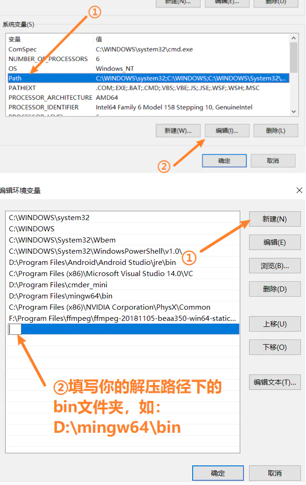
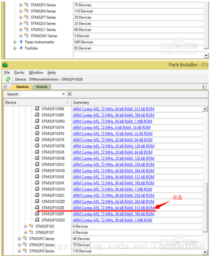
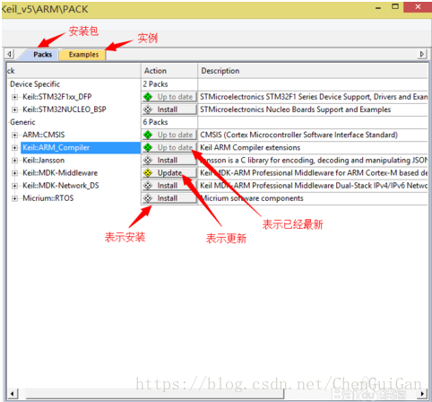
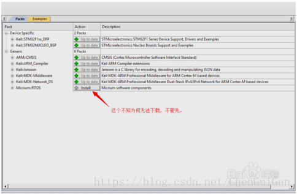
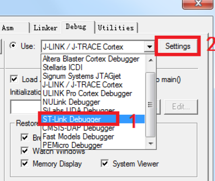
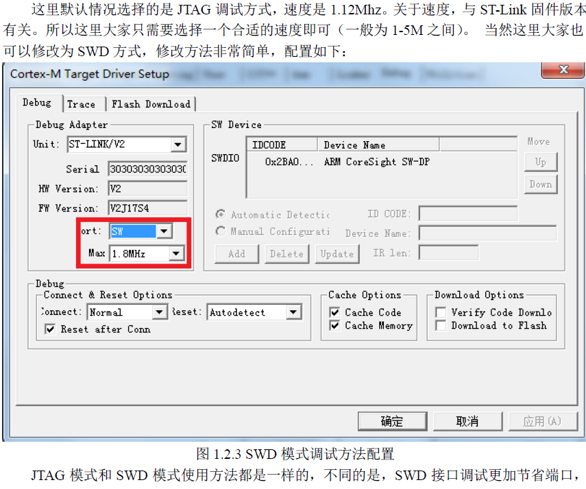
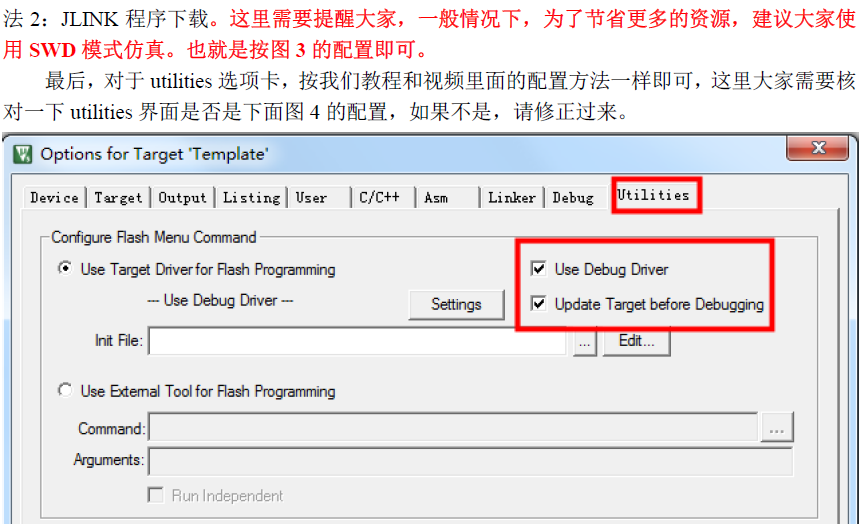
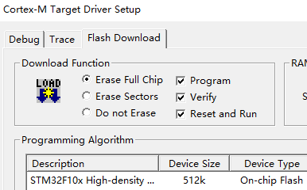

## 嵌入式开发环境搭建 - HQ

[TOC]

------

#### 注意

- 

------

## Linux项目开发常用环境

### Linux VS Code

直接在ubuntu中使用VS Code开发

### Windows VS Code + Linux VS Code 

windows vscode开远程连接到Ubuntu你项目的文件夹，更方便

集成了终端，改完直接编译，还有版本管理功能

### Windows Source Insight + tftp / 直接拖拽

- Source Insight中写完程序，然后通过FileZilla软件传输文件到ubuntu中的对应文件夹下。
- Source Insight中写完程序，通过VMware tool工具直接拖拽文件到ubuntu中的对应文件夹下。

> 我主要喜欢这个配色，还有就是他函数的跳转功能，Ctrl+鼠标，编译下工程之后，阅读代码贼方便，但是写代码没有vscode香，vscode真的香。

### Windows Source Insight + git

首先在远程Gitee中建好仓库，然后分别配置好ubuntu中的git，以及windows中项目文件夹的git，

无论在哪里进行了改动，都可以先push，另一处pull同步改动。

## Windows下C / C++编译环境搭建

配置 VS Code 的编译环境   [嵌入式开发-小智课程](https://www.bilibili.com/video/BV1EB4y1N7iD?p=4) 

1. 安装 - > 汉化 - > 登录

2. 安装MinGW，解压安装包到C盘，配置环境变量

   > 

3. VS Code终端中输入 `gcc -v` 如果有输出，则证明配置成功

   >PS F:\VS Code\Test_code> gcc .\test_1.c -o hello
   >PS F:\VS Code\Test_code> ./hello
   >hello world
   >PS F:\VS Code\Test_code> .\hello
   >hello world

## STM32开发环境搭建

1. 安装keil(MDK521A.exe)，破解(破解时注意keil和破解软件都要以管理员身份运行),  安装Keil.STM32F1xx_DFP.2.2.0.pack 

   >回到keil界面，点击如图所示按钮
   >
   >
   >
   >将弹出我们之前关闭的窗口，我们将图分成左右两边然后说明一下。先说左边，左侧窗口主要选择你所使用的芯片或开发板，开发板我们没有就不管了。这里我们选择的STM32F103ZE芯片。后边蓝色区域是芯片简要说明与库文件下载链接。点击蓝色区域即可下载STM32F103ZE的库文件。
   >
   >
   >
   >这是我们刚下载库文件，双击安装。然后一路Next>>完成即可，如果之前路径改变了，那么此时库文件也应改变。（这里只是说明手动安装库文件的过程，实际不需要点链接下载安装，我们接着往下看）
   >
   >
   >
   >我们看右边，右边的packs显示了该芯片可以安装的相关支持。Examples是实例代码。
   >
   >
   >
   >根据图中的序号分别翻译过来就是(这里仅供参考）
   >
   >1.STMicrcoelectronice STM32F1系列支持的驱动程序和实例（有没有发现和之前下载的文件是一样的名字“STM32F1xx_DFP”实际上刚才是手动下载，在这可以直接点击lntall可以自动下载并自动安装）。
   >
   >2.STMicrcoelectronice内核主板支持和实例（应该是ARM开发板的实例支持，但是我们没板子）
   >
   >3.CMSIS（当然是ARM的内核喽）
   >
   >4.Keil ARM 编译器扩展
   >
   >5.jansson 是C库的编码、解码和用来处理JSON数据
   >
   >6.基于ARM Cortex-M设备的 Keil MDK ARM 专业中介软件
   >
   >7.基于ARM Cortex-M设备的双堆栈IPv4/IPV6网络专业中介软件
   >
   >8.Micrium软件组件
   >
   >
   >
   >可以看到这里是针对于所选芯片可以安装的库文件和插件等，因水瓶有限本人也并不清除全部的用途，不过全部安装是没有坏处的。在这里我们将所有插件以及库文件全部安装到最新。过程稍慢请耐心等待。。。
   >
   >

2. 安装STM32CubeMX软件和库 【https://blog.csdn.net/wofreeo/article/details/88990192】

## ST-LINK v2 使用

参考正点原子ST - LINK V2 的使用教程PDF

1. 首先电脑安装ST-LINK的驱动，软件在正点原子 - 模块文件夹中

2. 然后配置keil中设置

   - > 
     >
     > 
     >
     > 

3. 如果想知道是否配置成功，可以看一下上面这个设置里setting框内是否显示连接，如果没有连接会提示，not found等，或者下载试试，看看是否提示未连接。

4. 这里如果选择中间选项会提示错误 “Cortex - M3”, 如果选择上面的选项则下载成功。

   > 

