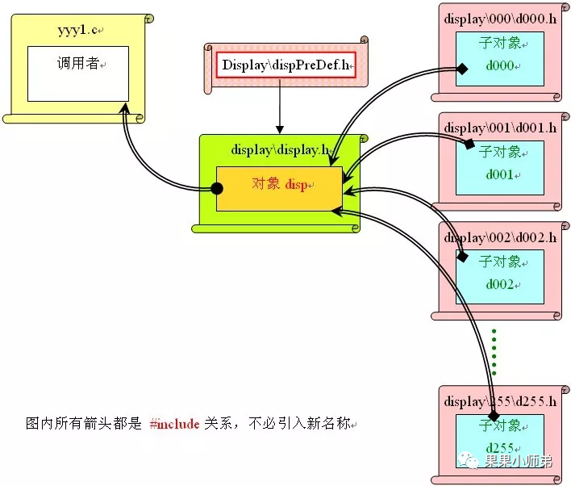

## 嵌入式开发编程思想 - HQ

[TOC]

------

#### 注意

- 

------

## 裸机的面向对象编程思想 - 摘录

[参考文章](https://mp.weixin.qq.com/s/hZoyaoiDHebj1G6KTRvjAg)

### 一、引入

面向对象的思想是**首先把显示器当作一个对象，该对象具有一些功能和一些变量属性，不同的显示器在对象中使用相同的代码标识，如函数指针（C语言中），这样对于任何一个不同的显示器，在调用时都使用同样的代码**。

> 也许有人说，传统的做法这样也可以做呀，为什么要弄得罗里吧唆的呢？其实不然，使用了正确的思想的好处在前头已经说了好多了，如果还模糊就上去再看一次。

说了那么多理论，现在就说些具体的做法吧。以KeilC为编译环境来说说一个对象具体组织的一些做法。

- 首先是找出对象，如显示器，这就是一个典型的对象。

- 其次是分析一个活对象所应具有的基本特征，即属性与动作。显示器的属性如：类型代号、亮度、对比度、显存等，动作如：初始化、内容刷新和显示、开启和关闭、内容闪烁等花样显示等。

这样分也比较容易理解，下面是对于代码的组织上，要注意对象的独立性与完整性，首先把显示器对象单独放在一个文档上，**属于对象特有的变量与对象的定义放在一起，要区分公有变量与私有变量的定义方式，对于私有变量要考虑临时变量与永久变量的安排**，这些安排都是对变量生命期的严格确定，这样可以节省内存，避免混乱。

> 如某一个函数要使用一个变量，函数在调用完了就退出了，而有一个变量只有它使用，却要保存每一次调用函数所产生的结果，这样的变量怎么定义呢？
>
> 很多人会直接定义一个全局变量，但是一个好的做法是**把这个变量定义成该函数的局部变量，但是定义成静态的，那么这样这个变量对其他代码就是透明的，完全不可能会被误修改，而且代码分类性好，便于将来的维护。**

**用函数指针来统一不同类型的显示器不同的处理方式**，也是一个很好的处理办法，那样可以让具体处理方式千差万别的显示器都能用一个统一的对象，但是函数指针要慎重使用。

### 二、准备工作

我们首先需要构造一个相对独立的代码段，也就是显示器对象，以下都以KeilC作为裸程序的编译环境。

> 正如很多人说的，KeilC并不是OOP语言，那怎么做？正是因为我们认为KeilC不能做，所以我才把这种思想拿出来与大家探讨，让我们的程序变得更精彩，更有技术含量。

**形成一个独立代码段，最好的办法就是在主工程目录下建立一个子目录**，如DISPLAY，然后再在DISPLAY目录下建立一个文档，如DISPLAY.H，然后把DISPLAYDISPLAY.H文档#include到一个恰当的位置上，这样，一个独立的面向对象的代码段就初步形成了，以后维护代码的时候，你永远不要考虑调用者是什么感受，只要维护这个文档，就可以保证你对显示器的不断更新了。

> 很多人也许会说，这算什么OOP？大家先别着急，这才是个开始，下面才是组织代码的具体过程。

对于一个显示器，我们必须要有显示要求，我们才会去定制它，如果连使用要求都提不出来，就不要去让人为你做显示器。所以我们**首先要明确我们要的显示器必须要做什么**。由于是单片机控制的显示器，我们不能想象成微机显示器那样，一个大的显存，可以显示多少页，显示多少色，满屏满屏的传递数据，如果这样想了，就是犯了盲目例比的错误，说明对问题没研究透。**对于单片机控制的显示器，我们考虑能显示单个字符、单行显示，就基本足够了**。

所以我们可以定义下列两个对象功能：

```
dispShowAChar（）;//显示一个字符
dispShowALine（）;//显示一行字符
```

由于是单片机的裸系统，所以我们作为一个软件设计者，我们一定要清楚，我们所面对的显示器，经常是没有CPU的，所以我们一定要明白，**我们这两个函数，实质上都做些什么。很显然，这两个函数是不能长期占有CPU的**，否则我们的程序将什么都不能做，专去显示了，成了显示器的一个处理芯片，**所以这两个函数运行完后是肯定要退出来的，而显示不能中断呀，所以必须要有一个代码段一直存在于活动代码中而且不能影响其他的功能。**做过上位机程序的人应该能看出来，==这段代码就是线程。裸编程中我们也用这个概念。==

**我们的显示器对象正需要一个一直活动的线程，来完成单片机系统对显示功能的解释和执行**，因此`dispShowAChar()`和`dispShowALine()`**实质上是不能直接去做显示工作的，它俩最合适的工作，就是去按指定的格式去设置显示内容**，这样我们在使用的时候就不必在这两个函数里设置复杂的代码和嵌套调用关系，因为那样一定会浪费很多的代码，调用多了也会让单片机运行效率降低，硬件资源消耗增加，严重的可能会造成堆栈溢出最后还不晓得为什么。

让我们也为这个活动线程也先命个名吧：

```
dispMainThread（）;//按指定的要求执行显示功能
//指定的要求包括颜色信息、闪烁、游动等等
```

> 程序分析下去，引出的概念也就会越来越多，这里所说的多线程概念以后有机会再说，单片机里的多线程也是一个复杂罗嗦的处理问题，现在介绍还为时过早。只是我感觉一不小心又说长了，具体下文继续展开。

### 三、展开思想

**对于对象能力的定义，我们一般可以从重要的入手，然后慢慢地展开，把所需要的其他能力逐渐归纳为函数，从而把面向对象的思想发展下去。**

> 上文我们提到了三个函数是怎么来的，还没有涉及到函数的任何实质，那么本帖就探讨一下这三个函数的实质性规划与设计。

有了功能要求，我们就要实现它，在裸程序中，实现它的一个首要任务，**就是要进行数据传递方式的设计**。很显然我们必须要有一个显示区域，来存放我们所要显示的内容，以及显示内容的显示属性，我们还要规划这个显示区域到底要显示多少多少字符或者是点阵。但是由于我们事先并不知道我们的显示设备一次会提供多少显示量，**所以我们可以把显示区域的内存，也就是显存，定义得大一点，以至任何一款符合设计要求的显示器都能得到满足**，这样的做法在裸编程中其实还是比较实用的，**因为裸编程中我们很少去申请动态的空间，程序设计完，所有的变量位置皆已确定，行就行，不行编译就过不去**，所以我们可以通常选择一些内存资源比较丰富的新款单片机。

**但是这样的做法也有一个弊端，比如当我们预先估计不足而导致数据空间不够的时候，我们就得从头来改这个显存的大小，从而导致整个显示程序都要相应的产生一些变动，这还不是最糟糕的，最糟糕的是当一款新的显示器因为新的功能需求而导致数据结构需要发生变化的时候，我们就崩溃了**，前期的工作可能改动就非常大，甚至于都要重新过一遍，也就是重写重调，这么痛苦的事情，我是最讨厌的了。

所以我们要尽量避免这类事情发生，**这里对面向对象的思想，就颇为需求了**。这个时候，我们就要引入一个新的概念，那就是对象的儿子，子对象。前面讨论的，其实都只是一个抽象的对象，没有任何具体的样子，而只是笼统的规划了所有的显示器必须具有什么能力，而对于每一个具体的显示器来说，还没有任何具体的设计，**在这里，每一个具体的显示器，就是显示器对象的子对象，他们形态各异，但是都必须能完成规定的功能。**

> 以传统的OOP语言理论来说，这里就产生了一个继承的关系，但是在裸程序思想里，我并不赞成引入这个概念，因为传统的OOP语言里的继承，纯粹是一个语法上的逻辑关系，继承关系明确，而裸程序中的这个思想，并没有任何语法支持，继承关系就非常微弱了，还不如说是归类与概括。但无论是什么关系，我还是不想就这种一目了然的关系弄个新名词来，让看的人费解。

既然引入了子对象，我们能看出这种做法有什么实际意义吗？也许有经验的资深程序员能看出来。我们在做父对象数据设计的时候，我们并不规定具体的数据格式和显存大小，而是一股脑儿地全推给子对象自己去搞，父对象什么都不管。

> 哈哈！这样做事情真是很简单吧？不是我的事情我不管，不要说我偷懒，因为站在父对象的角度讲，这是最明智的做法，因为管不了，所以不管。

到这里也许就会产生更多的疑问了，一个对象什么都不管，那作为调用者怎么使用这个对象呢？你想用它，它什么都不管，这怎么行呀？别着急，父对象不管的，是那些具体的事情，抽象的事情，还是管的，要不然它就没有理由存在了。你抱怨了，说明你在思考，既然思考了，就把思考的问题提出来，提出来的，就是我们设计父对象的依据。提问题，我想这比搞程序要简单得多，比如：显示器能显示多少乘多少的字符？颜色是多色还是单色？显示模式是否支持预定的方式（如移动、闪烁等）？工作模式是图像还是字符？等等，这里附加说明一下，对于显示模式，我们这里都以字符显示为例，既然是面向对象的思想，相信扩充出图像显示模式，还是很容易的事情。

有问题出来了，我们就继续为它添加代码好了。

```
dispGetMaxCol();//取一行最多有多少列
dispGetMaxRow();//取显示器一共有多少行
dispGetMaxColors();//取显示器最多有多少色
dispSetShowMode();//设置显示的方式，对于不支持的显示方式就自动转为正常显示
dispSetWorkMode();//设置工作模式，如果没有的模式就返回0，支持的就返回1 
```

对于这些函数的定义，各人可以根据自己的习惯来设置，我只是临时弄了这个例子，未必就是最好的，我的目的是重在说明思想。我也害怕把程序弄得庞大了，出本书都嫌厚。

似乎加了这些函数之后，我们根本就没看到显示数据的具体形式，和前面的函数一起，都并没有什么明确的说法。这种感觉很正确，我们确实没有对显存做任何定义，但是似乎功能却都已经定义了，其实也确实是定义了，而且将来我们就这样用，而且也不用怕，程序一定会写完的。

### 四、数据传递与程序逻辑同等重要

继续上面讨论的问题。前面我们提到，为了使用`dispShowAChar()`、`dispShowALine()`、`dispMainThread()`这三个函数，我们又引出五个新的函数来，**这些新的函数最主要的目标，就是要实现调用者与被调用者之间数据的传递。**

对于程序设计来讲，数据传递与程序逻辑有着同样重要的地位，前者经常在最后会形成一种协议，后者则经常表现为各种算法。

在裸程序中，我们的思想应该主要是表现为一种灵魂，而不能如C++那样，去追求语法的完美，所以对于参数的传递，我们不能去追求语法上的完美，而是不拘一格用传递。除了函数可以传递数据外，直接调用值也是一种很快捷的方式，但是调用不能随便说调就调，而是也要学习C++上语法的习惯，**尽量不能让一些专用的变量名称，出现在与专用变量无关的程序体中。**

例如，我们的设计中规定，我们这套裸系统对显示器最多支持65536色，那么我们就会用一个16位的无符号整数来保存这个指标。为了简化以后的说明，我们先定义两个数据类型：

```
typedef unsigned int UINT;
typedef unsigned char UCH;
```

如果我们用函数来传递这项数据，我们可以用如下的方式：

```
#define Monitor01_MaxColors 0xFFFF
```

对于颜色调用函数则定义如下：

```
UINTdispGetMaxColors()
{
	return Monitor01_MaxColors;
}
```

很显然，如果另一个显示器是个单色显示器，则颜色调用函数只需要改为下列形式就可以了：

```
#define Monitor02_MaxColors 0x0001
UINTdispGetMaxColors()
{
	return Monitor02_MaxColors;
}
```

之前有人提到过，用数组，这可以解决很多问题。说得一点没错！上面的例子我们忽略了一个问题，那就是同一个函数名要去做很多不同函数所做的事情，而我们却没有在函数体内使用`switch()`，这显然是不对的。

**要真正实现不同显示器的共同属性`MaxColors`的传递，我们必须要添加switch()以区分不同的显示器类型。**

那么这里我们就需要引入一个新的父对象属性以指代它的第几号儿子：

```
UCHMonitorType = 0;//显示器类型，最多支持256种显示器
```

**并在初始化的时候，为该属性初始化为0，以作为缺省类型显示器的代号。**

==以下命名我们就说一个约定，以让代码更具有规范的模样：父对象的接口函数用小写的disp打头，变量用Monitor打头，宏数据用Monitor开头并且内部至少有一个下划线，宏函数则用全大写字母组成。==

那么不用数组的情况下，上面的代码将会变成如下形式：

```
#define Monitor_00 0
#define Monitor_01 1
#define Monitor_02 2
UINTdispGetMaxColors（）
{
//以下用多出口，但这并不会破坏什么，为节约代码，完全可以使用
	switch（MonitorType）
	{
 		caseMonitor_01:returnMonitor01_MaxColors;
	 	caseMonitor_02:returnMonitor02_MaxColors;
	}
	return Monitor00_MaxColors;//缺省则返回默认显示器
}
```

这样的形式很显然是太冗长了，尽管非常结构化，但是一般在优化程序的时候我们还是可能会废弃它的，所以这里就提到了数组的使用。

既然是数组，那么它自然不能属于某一个子对象，而是应该在父对象中定义的，尽管这样做我们每次在添加新显示器的时候我们比如在父对象中添加难以理解的新的数据，但是为了节省代码，我们还是能忍受这样的痛苦。

如果改用数组，则上面的代码将改变为如下形式：

```
#define Max_Monitor_Types 3
***
#define Monitor00_MaxColors 1
UINTcodeMonitorMaxColorsArray［Max_Monitor_Types］=
{
   	Monitor00_MaxColors，//缺省为单色
	Monitor01_MaxColors，
	Monitor02_MaxColors，
};
***
```

打***的语句将是未来扩充时不断需要修改的句子。那么上面的函数就简单了

```
UINTdispGetMaxColors（）
{
	return MonitorMaxColorsArray［MonitorType］;
}
```

甚至有人还可以用宏函数来节省运行时间，只要修改一下调用规则就可以了：

```
#define DISPGETMAXCOLORS (c) c = MonitorMaxColorsArray［MonitorType］;
```

也许当我们写成如上代码的时候，我们的每一次改进，都会让我们欣喜，我们的代码又优化了。

但是可惜的是，这种没有思想的优化会在不远的将来，给我们带来麻烦。我觉得我的记忆力很不好，也许一分钟前的事情我都会想不起来，这种在将来扩充中的上窜下跳地修改会让我觉得晕眩！

**所以，在工程化的工作中，我们需要把父对象与子对象尽量隔离开来，减少关联性的修改量，这也是面向对象思想的重要意义之所在，对于这一改动，我将在下帖中阐述**。

### 五、父子对象接口函数功能剥离

上文我们说到 dispGetMaxColors() 的一些设计思路，我们有很多很好的办法来实现它，但是我们有没有更好的管理办法来实现它，这才是我们要站在更高层次看问题的焦点，是更重要的。这也就是一个从传统思维到面向对象思维的一个重要的转折。

要想把这个函数转变为面向对象的逻辑结构，我们也要先做些准备工作。

**第一说参数传递的思想。尽量减少参数传递**

> 这是尊重C51系列8位单片机硬件现状的一项重要措施，记着，不要抱怨C51档次低，资源少，而是要在尊重和热爱C51的前提下，我们才有热情来发展我们的裸程序面向对象思想的，也就是说，无论我们面临的系统有多简陋，我们都有策略，来实现复杂的功能，而且从发展的眼光来看，产品的升级，并不是盲目的升级我的CPU，因为那样只会让产品设计者智商下降，所以我觉得C51的特色就是应该在简洁，越来越简洁，而不是越来越复杂。所以我希望我们把思想升级作为升级产品的一个发展方向。

**传递参数要减少指针、浮点等类型的数据传递，尽量以`UCH`与`UINT`为主，而且参数的数量不要太多**，==最理想的上限是2个，如果实在多了，就使用共享缓冲区，或者全局变量。最好是不要传递参数。==

本函数就利用了`MonitorType`省略了一个参数传递。

**第二是我们要让父对象的接口函数与具体的子对象的多种可能性的功能实现剥离**，这里我们就需要使用函数指针。函数指针也许我们一般用得少，但是其实并不是很复杂。先看我们函数的形式：

```
UINTdispGetMaxColors(void);
```

为该函数定义一个指针类型，只需做如下定义，就可以了：

```
typedefUINT( *dGMC)(void);
```

那么对于父对象中的`dispGetMaxColors()`函数，我们就只需要转换定义一个函数指针，在创建父对象的时候为它提供一个子对象对应功能调用的入口地址，就足够了。

所以对于这个函数的实体将只在子对象中出现，而在父对象中只会出现一个变量的定义：

```
dGMCdispGetMaxColors;
```

为了给它赋初值，我们也可以定义一个空指针，作为一个未使用的判断标志：

```
# define NIL 0
```

那么初始化`dispGetMaxColors`的时候只需要写条如下语句就可以了：

```
dispGetMaxColors=NIL;
```

而且功能调用也很简单，与实质的函数是一样的：

```
if(dispGetMaxColors！=NIL) vMaxColors=dispGetMaxColors();
```

如果再加上约定，连前面的判断语句完全可以省略。因为我们的裸程序的程序空间实际上也是运行空间，不存在代码调入内存和移出内存的事情发生，所以我们不需要考虑程序内存的优化问题，只要我们规定对象一定是先创建后使用，判断语句就会变得没有意义，而且我们创建后即使不再使用，函数体我们也不会释放，因为它被放在程序空间内是固定死的，你想移出去，还不能实现呢。

**第三，尽量让程序所使用的语法简单化，以减少编译器可能带来的差别而产生的理解上的误区**。

> 有人说C51是C的子集，这说法我认为不科学，只能说二者继承了C的基本精神，而在实质上它们针对的是不同的对象，所以也出现了一些不同的结果，所以我看到有些高手或者一些面试题弄出一些题目来让我望而生畏，也许我做一辈子的裸程序也做不出他们的题目，但是我并不觉得我不如他们。他们只不过是在编译器上花了很多时间研究他们的一些约定，而我并不想花时间去研究那些将来可能发生变化的东西，我希望我能用一个更简单的途径把我的事情做出色，我只关心我的项目的速度、代码的大小、运行的效率、维护的复杂度，所以我也建议和我交流的人能用一种通俗的方法来实现我们的功能，也不必过多的考虑我的程序在8位单片机上可以用16位单片机上也可以用，我们的系统要经常升级，但不要轻易去增加硬件成本。当然如果你有精力去研究那些约定，也没什么，只要你乐意。

好了，上面三条，只有第二条是我要说的关键，其他两条，个人可以根据自己的具体情况来寻找一些快捷实用的方法。**其实说来我们把父对象用函数指针来代替实体函数，这完全是一种思想，我们并没有使用复杂的语法，而是从管理上把对象分离开来，让不同的人做不同的事情，比较容易。**

> 但是同时我们又不能让这种中间环节影响我们程序的效率，所以我们完全可以自己寻求一些方法，而不必去循规蹈矩。我这样说也许会遭到一些非议，但是我可以告诉大家，计算机语言这门学科，本身就是一门人造科学，没有最好只有更好，我们没必要完全按照别人的思路去发展设计思想，所以也不要拿着人家的一些约定来引以为荣，那些东西，只有先学后学的问题，没有水平的差异；我们应该更注意的是，人家创造了工具，我们就用工具再来创造世界！如果你停留在欣赏工具的层次上，那就是无所鸟事了！

本帖实质上只说了一个转换，两条建议，这都不是具体的程序，而是思想。我想强调的，也不是格式，而是思想。下帖将再回到对象上，和大家探讨一下对象本身的组织问题，比如对象的层次关系、对象的创建、对象的书写等等，我也希望有人能有一些更好的方法回到帖子里，我们互相学习，共同提高。

### 六、面向对象思想的层次关系

前面的思想衍变过程已经说了很久了，面向对象的思想也就到了瓜熟蒂落呼之欲出的境界了。下面我就先图示一下裸程序设计中面向对象思想的层次关系：

> 

相信这张图已经足够说清楚我们在KeilC中如何用语言来组织我们的显示器对象disp了。**disp是一个抽象的对象，它只是一种联系，完成对所有子对象d000、d001、d002到最多d255的归纳概括并提供一组被调用者所使用的功能接口。**==这些功能接口正是上贴所提到的函数指针。==而具体的功能实现及不同显示对象对数据结构的要求，我们都可以交给子对象设计工程师自己去决定。

很显然，大家在这套方案具体的程序设计过程中，最主要的精力还是要放在自己做自己的问题上，多思考如何把事情做得更漂亮，而不必在代码编写时黏糊不清。父对象设计者必须要完成总体方案的设计，抽象思维多而具体工作量少，子对象的设计者则恰恰相反，只需要多考虑考虑具体的设计，而不必去担心别人是怎么用自己的东西。

很显然，作为总体设计者，必须要严格考虑这中间的数据交换关系，**因为我们没有操作系统，所以对于可用的内存资源的使用法则，直接关系到我们整个系统的成败，混乱使用常常会导致系统崩溃**，相对独立的代码则在编译过程中由KeilC直接安排好了，我们不需要去考虑它们对程序的影响。

例子中的显存大小及显存的位置都是我们方案成败的关键。**我们都知道KeilC对单片机内存划分了四种，即data、idata、pdata、xdata四种**，各种存储器的大小与特点都决定着我们代码的运行效果，我们既要考虑信息所需要的空间，又要考虑单片机处理时足够达到我们的视觉要求。在这个例子中，我觉得我们可以选择xdata来作为显存。为什么呢？

因为我觉得只要我们处理得当，我们的单片机完全可以克服处理速度上的缺陷，所以我们可以优先满足信息量的要求，提供足够多的空间来实现我们想要的功能。

提速的方式有很多，比如：选择一些性能优越的新型单片机，传统的是12T的，现在有6T的，也有1T的，这让很多指令都会有更高的效率；适当的提高晶振频率；选择更科学的算法；等等。

到目前为止，基本上可以去构造我们的对象了，如果你有兴趣，你可以使用`#define`进行一些伪码定义，把我们的对象定义得更美观一点，更接近C++一些，不过我要说的是：我们这里没有严格的类定义，所以定义时类与对象经常是没有界限的。


