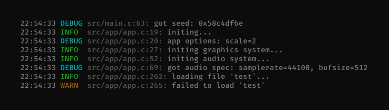
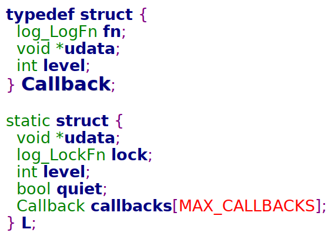
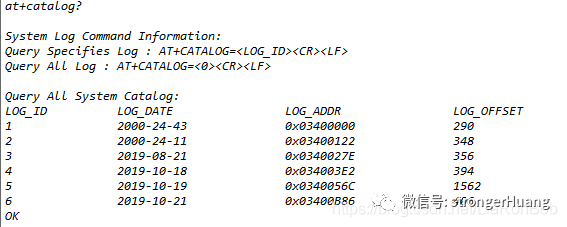
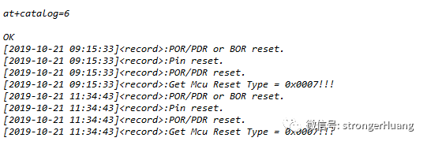

## 嵌入式日志 - HQ

[TOC]

------

#### 注意

- 

------

## 简单到傻瓜都会用的日志库：log.c

https://mp.weixin.qq.com/s/CQI7c9SUZOeBT1MVfIWCZw

对于嵌入式底层应用开发，基本离不开日志功能，这种轮子有很多，log.c 最简单，达到了开箱即用的级别。

### log.c 是什么？

```
https://github.com/rxi/log.c
```

简单地说，log.c 就是一个 C 语言的日志功能模块。



**log.c 的几个特点：**

代码简洁，就一个 .c 和 .h 文件，一共 200 行。

设计优雅，打印日志的 API 只有 1 个。

提供了将 log 输入到不同目标的接口，例如输入到文件。

提供了实现线程安全的接口。

### log.c 怎么用？

**打印日志的 API：**

```
log_trace(const char *fmt, ...);
log_debug(const char *fmt, ...);
log_info(const char *fmt, ...);
log_warn(const char *fmt, ...);
log_error(const char *fmt, ...);
log_fatal(const char *fmt, ...);
```

它们都是对 log_log() 的简单封装，用法和 printf() 一样。

**示例：**

下面的例子会将日志同时输出到标准输出和文件中。

```
#include "log.h"

int main(int argc, char *argv[])
{
    log_set_level(0);
    log_set_quiet(0);

    FILE *fp1, *fp2;
    fp1 = fopen("./log_info.txt", "ab");
    if(fp1 == NULL)
        return -1;

    fp2 = fopen("./log_debug.txt", "ab");
    if(fp2 == NULL)
        return -1;

    log_add_fp(fp1, LOG_INFO);
    log_add_fp(fp2, LOG_DEBUG);

    log_debug("debug");
    log_info("info");
    log_warn("warn");

    fclose(fp2);
    fclose(fp1);
    return 0;
}
```

**运行：**

```
$ ./example1 
23:31:05 DEBUG example1.c:20: debug
23:31:05 INFO  example1.c:21: info
23:31:05 WARN  example1.c:22: warn

$ cat log_debug.txt 
2022-05-08 23:31:05 DEBUG example1.c:20: debug
2022-05-08 23:31:05 INFO  example1.c:21: info
2022-05-08 23:31:05 WARN  example1.c:22: warn

$ cat log_info.txt 
2022-05-08 23:31:05 INFO  example1.c:21: info
2022-05-08 23:31:05 WARN  example1.c:22: warn
```

**关于线程安全：**

log.c 代码虽然少，但是仍然考虑了线程安全，下面是用法示例。

```
#include "log.h"

pthread_mutex_t MUTEX_LOG;
void log_lock(bool lock, void *udata);

int main()
{
    log_set_level(0);
    log_set_quiet(0);

    pthread_mutex_init(&MUTEX_LOG, NULL);
    log_set_lock(log_lock, &MUTEX_LOG);

    /* Insert threaded application code here... */
    log_info("I'm threadsafe");

    pthread_mutex_destroy(&MUTEX_LOG);

    return 0;
}

void log_lock(bool lock, void* udata)
{
    pthread_mutex_t *LOCK = (pthread_mutex_t*)(udata);
    if (lock)
        pthread_mutex_lock(LOCK);
    else
        pthread_mutex_unlock(LOCK);
}
```

###  log.c 的内部实现？

**私有数据结构：**



全局变量 L 维护了 log.c 所需要的所有信息。

void *udata 用于保存用户数据，用户可以将其用作任意用途。

lock 是一个函数指针：

```
typedef void (*log_LockFn)(bool lock, void *udata);
```

用户可以用它来指定自己想用的锁机制，例如 Pthread 的互斥量。

int level 用于保存当前的 log 等级，等级大于 level 的 log 才会被输出到标准输出。

bool quiet 用于打开、关闭 log 输出。

数组 callbacks 用于保存多种输出方式，目前仅支持输出到标准输出和文件，有需要的话我们还可以将其扩展成输出到 syslog、网络等，每增加一种输出方式就是构造一个 Callback，成员回调函数 log_LogFn 负责真正地 log 输出功能：

```
typedef void (*log_LogFn)(log_Event *ev);
```

**公共数据结构：**


点击查看大图

一条 log 信息对应一个 log_Event。暴露这个数据结构是为了用户可以编写自己的 log 打印函数 log_LogFn 以输出 log。

**公共的 API：**

整个 log.c 其实只提供了一个打印相关的 API：log_log()。log_trace() 等宏只是对 log_log() 的简单封装，这种简洁地设计无论是对库的用户还是对库的开发者而言，都是最幸福的事情。

剩下的几个 API 用于控制和功能扩展。

**log_log() 的实现思路**：

1> 根据用于提供的 log 信息构造 1个 log_Event。

2> 将 log 信息输出到标准输出。

3> 遍历所有 log Callback，逐一调用它们的打印函数 log_LogFn。

### 总结

log.c 代码优雅、设计简洁、功能实用，这对库的用户和库的开发者而言，都是一种幸福。

如果你的项目需要一个简单好用的日志功能，可以考虑集成开箱即用的 log.c。

**其他日志相关的开源项目：**

https://github.com/armink/EasyLogger

https://github.com/HardySimpson/zlog

https://github.com/0xmalloc/c-log


## 嵌入式系统日志记录的简易方法 - 摘录

> https://mp.weixin.qq.com/s/xx_TY9jNujxqY7mRBINX3A
>
> 实际来源地址：
>
> https://blog.csdn.net/LiaRonBob/article/details/102766871

很多场景都需要记录日志，在嵌入式系统中，特别是单片机这种存储资源有限的环境下，就需要一种轻量级的存储方法。

### 系统日志

在嵌入式设备应用场景中，系统日志时常可以监控设备软件的运行状态，及时记录问题点以及关键信息，方便开发人员后期定位以及解决问题。

本文将讲述一种简易的系统日志记录方法，用于保存设备的系统日志，视具体嵌入式设备情况而定，可存储在MCU内部Flash、外部Flash、EEPROM等，本文采用外部Flash作为示例展开介绍。

### 思路分析

对于系统日志可以当成文件系统，可以划分为三个重要部分：目录区、参数区、日志区。

- 目录区：根据日期进行归类，记录当天的日志的存储地址、日志索引、日志大小，通过目录可以获取整个日志文件的概况；
- 参数区：存储记录日志写位置、目录项个数、写状态等参数；
- 日志区：这是我们主要的存储区，记录系统的日志，支持环写。这三个区域都需要占用部分内存，可以自行分配大小。

实现的效果如下图所示，设置通过指令可查询到整个日志目录区的概况。

查询系统日志目录：AT+CATALOG?

LOG_ID:存储日志按日期分类，该ID用于查询对应日期日志,从1开始计数；

LOG_DATE:系统日志存储日期；

LOG_ADDR:系统日志存储外部FLASH地址；

LOG_OFFSET:系统日志存储偏移量（各日期日志大小，单位：字节）。

> 

查询指定日期系统日志：AT+CATALOG=<LOG_ID>

LOG_ID:在查询系统日志目录时获取，当LOG_ID为0时，为查询整个系统日志。

> 

另外提供移除系统日志（清除日志目录）指令：AT+RMLOG，后面将讲述具体实现。

### FLASH内存划分

FLASH内存需要看具体设备进行合理划分，目录区、参数区与日志区实现环形存储，延长擦写寿命。

```

#define FLASH_SECTOR_SIZE      ((uint32_t)0x001000)
#define FLASH_BLOCK_32K_SIZE    ((uint32_t)0x008000)
#define FLASH_BLOCK_64K_SIZE    ((uint32_t)0x010000)
#define SECTOR_MASK               (FLASH_SECTOR_SIZE - 1)         /*扇区掩码 ------*/
#define SECTOR_BASE(addr)         (addr & (~SECTOR_MASK))        /*扇区的基地址 --*/
#define SECTOR_OFFSET(addr)       (addr & SECTOR_MASK)           /*扇区内的偏移 --*/

#define BLOCK_32K_BASE(addr)    (addr & (~(FLASH_BLOCK_32K_SIZE)))
#define BLOCK_64K_BASE(addr)    (addr & (~(FLASH_BLOCK_64K_SIZE)))

typedef enum {
    FLASH_BLOCK_4K  = 0,          /**< flash erase block size 4k */
    FLASH_BLOCK_32K = 1,          /**< flash erase block size 32k */
    FLASH_BLOCK_64K = 2           /**< flash erase block size 64k */
}flash_block_t;

/* flash 空间索引 */
typedef enum{
    FLASH_CATALOG_ZONE = 0,
    FLASH_SYSLOG_PARA_ZONE,
    FLASH_SYSLOG_ZONE,
    FLASH_ZONEX,
}flash_zone_e;

typedef struct{
    flash_zone_e zone;
    uint32_t start_address;
    uint32_t end_address;
}flash_table_t;

/* 地址划分 */
static const flash_table_t flash_table[] = {
  { .zone = FLASH_CATALOG_ZONE,       .start_address = 0x03200000, .end_address = 0x032FFFFF},  
  { .zone = FLASH_SYSLOG_PARA_ZONE,   .start_address = 0x03300000, .end_address = 0x033FFFFF},  
  { .zone = FLASH_SYSLOG_ZONE,        .start_address = 0x03400000, .end_address = 0x03FFFFFF},  
};
```

Flash底层实现擦除、读写操作接口，由读者自行实现。

```


flash_table_t *get_flash_table(flash_zone_e zone)
{
  int i = 0;
  for (i = 0; i < flash_zone_count; i++) {
    if (zone == flash_table[i].zone) 
      return (flash_table_t *)&flash_table[i];
  }

  return NULL;  
}

int flash_erase(flash_zone_e zone, uint32_t address, flash_block_t block_type)
{
  flash_table_t *flash_table_tmp = get_flash_table(zone);

  if (flash_table_tmp == NULL)
    return -1;

  if (address < flash_table_tmp->start_address ||address > flash_table_tmp->end_address) 
    return -1;

  return bsp_spi_flash_erase(address, block_type);
}

int flash_write(flash_zone_e zone, uint32_t address, const uint8_t*data, uint32_t length)
{
  flash_table_t *flash_table_tmp = get_flash_table(zone);

  if (flash_table_tmp == NULL)
     return -1;

  if ((address < flash_table_tmp->start_address) ||((address + length) > flash_table_tmp->end_address))
     return -1;

  return bsp_spi_flash_buffer_write(address, (uint8_t *)data, length);
}

int flash_read(flash_zone_e zone, uint32_t address, uint8_t*buffer, uint32_t length)
{
  flash_table_t *flash_table_tmp = get_flash_table(zone);

  if (flash_table_tmp == NULL)
    return -1;

  if ((address < flash_table_tmp->start_address) ||((address + length) > flash_table_tmp->end_address))
    return -1;

  bsp_spi_flash_buffer_read(buffer, address, length);
  return 0;
}
```

参数与结构体定义

日志数据存储时间戳，便于问题定位，需要实现RTC接口调用。

```

typedef struct {
  uint16_t   Year;    /* 年份:YYYY */
  uint8_t    Month;    /* 月份:MM */
  uint8_t    Day;    /* 日:DD */
  uint8_t     Hour;    /* 小时:HH */
  uint8_t     Minute;    /* 分钟:MM */
  uint8_t   Second;    /* 秒:SS */
}time_t;   

int bsp_rtc_get_time(time_t *date);
```

参数区应当保证数据的正确性，应加入参数校验存储，定义校验结构体。

```

#define SYSTEM_LOG_MAGIC_PARAM    0x87654321  /* 日志参数标识符 */
typedef struct {
  uint32_t magic;    /* 参数标识符 */
  uint16_t crc;    /* 校验值 */
  uint16_t len;    /* 参数长度 */
} single_sav_t;
```

参数区需记录当前日志记录的写位置，以及目录项个数，还有日志区和目录区环写状态，并且存储最新时间等等。

```

/* 日志区参数 */
typedef struct {
  uint32_t   write_pos;             /* 写位置 */
  uint32_t   catalog_num;            /* 目录项个数 */
  uint8_t    log_cyclic_status;    /* 系统日志环形写状态 */   
  uint8_t    catalog_cyclic_status; /* 日志目录环形写状态 */
  time_t     log_latest_time;     /* 存储最新时间 */
}system_log_t;

/* 目录区参数 */
typedef struct {
  uint32_t log_id;     /* 日志索引 */  
  uint32_t log_addr;    /* 日志地址 */
  uint32_t log_offset;  /* 日志偏移大小，单位：字节 */
  time_t   log_time;    /* 日志存储时间 */
}system_catalog_t;

/* 系统日志参数 */
typedef struct {
  single_sav_t crc_val;
  system_log_t system_log;
  system_catalog_t system_catalog;
}sys_log_param_t;

typedef struct {
  uint8_t system_log_print_enable; /* 系统日志打印使能 */
  uint16_t system_log_print_id;    /* 打印指定id系统日志 */
  uint32_t system_log_param_addr;  /* 当前日志写地址 */
} sys_ram_t;

sys_ram_t  SysRam;
sys_log_param_t SysLogParam;

sys_ram_t  *gp_sys_ram = &SysRam;
sys_log_param_t *gp_sys_log = &SysLogParam;
```

### 实现接口说明

CRC校验接口，可以自定义实现。

```

/* 16位CRC校验高位表 */
static const uint8_t auchCRCHi[]={
0x00,0xc1,0x81,0x40,0x01,0xc0,0x80,0x41,0x01,0xc0,0x80,0x41,0x00,0xc1,0x81,0x40,
0x01,0xc0,0x80,0x41,0x00,0xc1,0x81,0x40,0x00,0xc1,0x81,0x40,0x01,0xc0,0x80,0x41,
0x01,0xc0,0x80,0x41,0x00,0xc1,0x81,0x40,0x00,0xc1,0x81,0x40,0x01,0xc0,0x80,0x41,
0x00,0xc1,0x81,0x40,0x01,0xc0,0x80,0x41,0x01,0xc0,0x80,0x41,0x00,0xc1,0x81,0x40,
0x01,0xc0,0x80,0x41,0x00,0xc1,0x81,0x40,0x00,0xc1,0x81,0x40,0x01,0xc0,0x80,0x41,
0x00,0xc1,0x81,0x40,0x01,0xc0,0x80,0x41,0x01,0xc0,0x80,0x41,0x00,0xc1,0x81,0x40,
0x00,0xc1,0x81,0x40,0x01,0xc0,0x80,0x41,0x01,0xc0,0x80,0x41,0x00,0xc1,0x81,0x40,
0x01,0xc0,0x80,0x41,0x00,0xc1,0x81,0x40,0x00,0xc1,0x81,0x40,0x01,0xc0,0x80,0x41,

0x01,0xc0,0x80,0x41,0x00,0xc1,0x81,0x40,0x00,0xc1,0x81,0x40,0x01,0xc0,0x80,0x41,
0x00,0xc1,0x81,0x40,0x01,0xc0,0x80,0x41,0x01,0xc0,0x80,0x41,0x00,0xc1,0x81,0x40,
0x00,0xc1,0x81,0x40,0x01,0xc0,0x80,0x41,0x01,0xc0,0x80,0x41,0x00,0xc1,0x81,0x40,
0x01,0xc0,0x80,0x41,0x00,0xc1,0x81,0x40,0x00,0xc1,0x81,0x40,0x01,0xc0,0x80,0x41,
0x00,0xc1,0x81,0x40,0x01,0xc0,0x80,0x41,0x01,0xc0,0x80,0x41,0x00,0xc1,0x81,0x40,
0x01,0xc0,0x80,0x41,0x00,0xc1,0x81,0x40,0x00,0xc1,0x81,0x40,0x01,0xc0,0x80,0x41,
0x01,0xc0,0x80,0x41,0x00,0xc1,0x81,0x40,0x00,0xc1,0x81,0x40,0x01,0xc0,0x80,0x41,
0x00,0xc1,0x81,0x40,0x01,0xc0,0x80,0x41,0x01,0xc0,0x80,0x41,0x00,0xc1,0x81,0x40
};

/* 16位CRC校验低位表 */
static const uint8_t auchCRCLo[]={
0x00,0xc0,0xc1,0x01,0xc3,0x03,0x02,0xc2,0xc6,0x06,0x07,0xc7,0x05,0xc5,0xc4,0x04,
0xcc,0x0c,0x0d,0xcd,0x0f,0xcf,0xce,0x0e,0x0a,0xca,0xcb,0x0b,0xc9,0x09,0x08,0xc8,
0xd8,0x18,0x19,0xd9,0x1b,0xdb,0xda,0x1a,0x1e,0xde,0xdf,0x1f,0xdd,0x1d,0x1c,0xdc,
0x14,0xd4,0xd5,0x15,0xd7,0x17,0x16,0xd6,0xd2,0x12,0x13,0xd3,0x11,0xd1,0xd0,0x10,
0xf0,0x30,0x31,0xf1,0x33,0xf3,0xf2,0x32,0x36,0xf6,0xf7,0x37,0xf5,0x35,0x34,0xf4,
0x3c,0xfc,0xfd,0x3d,0xff,0x3f,0x3e,0xfe,0xfa,0x3a,0x3b,0xfb,0x39,0xf9,0xf8,0x38,
0x28,0xe8,0xe9,0x29,0xeb,0x2b,0x2a,0xea,0xee,0x2e,0x2f,0xef,0x2d,0xed,0xec,0x2c,
0xe4,0x24,0x25,0xe5,0x27,0xe7,0xe6,0x26,0x22,0xe2,0xe3,0x23,0xe1,0x21,0x20,0xe0,

0xa0,0x60,0x61,0xa1,0x63,0xa3,0xa2,0x62,0x66,0xa6,0xa7,0x67,0xa5,0x65,0x64,0xa4,
0x6c,0xac,0xad,0x6d,0xaf,0x6f,0x6e,0xae,0xaa,0x6a,0x6b,0xab,0x69,0xa9,0xa8,0x68,
0x78,0xb8,0xb9,0x79,0xbb,0x7b,0x7a,0xba,0xbe,0x7e,0x7f,0xbf,0x7d,0xbd,0xbc,0x7c,
0xb4,0x74,0x75,0xb5,0x77,0xb7,0xb6,0x76,0x72,0xb2,0xb3,0x73,0xb1,0x71,0x70,0xb0,
0x50,0x90,0x91,0x51,0x93,0x53,0x52,0x92,0x96,0x56,0x57,0x97,0x55,0x95,0x94,0x54,
0x9c,0x5c,0x5d,0x9d,0x5f,0x9f,0x9e,0x5e,0x5a,0x9a,0x9b,0x5b,0x99,0x59,0x58,0x98,
0x88,0x48,0x49,0x89,0x4b,0x8b,0x8a,0x4a,0x4e,0x8e,0x8f,0x4f,0x8d,0x4d,0x4c,0x8c,
0x44,0x84,0x85,0x45,0x87,0x47,0x46,0x86,0x82,0x42,0x43,0x83,0x41,0x81,0x80,0x40
};

/* 实现crc功能函数 */
static uint16_t CRC16(uint8_t* puchMsg, uint16_t usDataLen)
{
  uint8_t uchCRCHi=0xff;
  uint8_t uchCRCLo=0xff;
  uint16_t uIndex;

  while(usDataLen--) {
    uIndex=uchCRCHi^*(puchMsg++);
    uchCRCHi=uchCRCLo^auchCRCHi[uIndex];
    uchCRCLo=auchCRCLo[uIndex];
  }

  return uchCRCHi<<8|uchCRCLo;
}
```

保存系统日志参数，每实现写日志操作后都需要保存当前的参数值，防止意外丢失。

```

void save_system_log_param(void)
{
  uint32_t i = 0;
  uint32_t addr = 0;
  uint32_t remainbyte = 0;
  uint32_t start_addr;
  int len = sizeof(sys_log_param_t);
  uint8_t *pdata = (uint8_t *)&SysLogParam;
  flash_table_t *flash_tmp = get_flash_table(FLASH_SYSLOG_PARA_ZONE);

  /* 校验参数 */
  gp_sys_log->crc_val.magic = SYSTEM_LOG_MAGIC_PARAM;
  gp_sys_log->crc_val.len = sizeof(sys_log_param_t) - sizeof(single_sav_t);
  gp_sys_log->crc_val.crc = CRC16(&pdata[sizeof(single_sav_t)], gp_sys_log->crc_val.len);

  start_addr = gp_sys_ram->system_log_param_addr;
  /* 剩余内存不够写，则重新从起始地址开始写，实现环形存储功能  */
  if ((start_addr + len) > flash_tmp->end_address) { 
    start_addr = flash_tmp->start_address;
  }
  gp_sys_ram->system_log_param_addr = start_addr + len;
  /* 首地址存储，擦除整个系统日志参数存储区，如果划分的内存较大，可能出现第一次擦写等待时间较长，
     但实际应用嵌入式设备应该不会占用太多的内存存储系统日志，只当为辅助使用，有额外应用可自行实现 */
  if (flash_tmp->start_address == start_addr) {
    /*for (i = flash_tmp->start_address; i < flash_tmp->end_address; i+= FLASH_SECTOR_SIZE) 
      flash_erase(FLASH_SYSLOG_PARA_ZONE, SECTOR_BASE(i), FLASH_BLOCK_4K);
    */
    addr = flash_tmp->start_address;
    do {
      if ((addr + FLASH_BLOCK_64K_SIZE) <= flash_tmp->end_address) {
        flash_erase(FLASH_SYSLOG_PARA_ZONE, BLOCK_64K_BASE(i), FLASH_BLOCK_64K);
        addr += FLASH_BLOCK_64K_SIZE;
      } else if ((addr + FLASH_BLOCK_32K_SIZE) <= flash_tmp->end_address) {
        flash_erase(FLASH_SYSLOG_PARA_ZONE, BLOCK_32K_BASE(i), FLASH_BLOCK_32K);
        addr += FLASH_BLOCK_32K_SIZE;
      } else if ((addr + FLASH_SECTOR_SIZE) <= flash_tmp->end_address) {
        flash_erase(FLASH_SYSLOG_PARA_ZONE, SECTOR_BASE(i), FLASH_BLOCK_4K);
        addr += FLASH_SECTOR_SIZE;
      } else {
        break;
      }
    } while (addr < flash_tmp->end_address);  
  }

  remainbyte = FLASH_SECTOR_SIZE - (start_addr % FLASH_SECTOR_SIZE);
  if (remainbyte > len) {
    remainbyte = len;
  }
  while (1) {
    flash_write(FLASH_SYSLOG_PARA_ZONE, start_addr, pdata, remainbyte);
    if (remainbyte == len) {
      break;
    } else {
      pdata += remainbyte;
      start_addr += remainbyte;
      len -= remainbyte;
      remainbyte = (len > FLASH_SECTOR_SIZE) ? FLASH_SECTOR_SIZE : len;
    }
  }
}
```

导入系统日志默认参数接口，初始化默认参数或者移除日志。

```

void load_system_log_default_param(void)
{
  /* 系统日志默认参数 */
  /* 目录环写状态标志 */
  gp_sys_log->system_log.catalog_cyclic_status = 0x00;
  /* 目录项个数 */
  gp_sys_log->system_log.catalog_num = 0;
  /* 日志环写标志 , 1:环写状态 */
  gp_sys_log->system_log.log_cyclic_status = 0;
  /* 设置默认值，实际会重新从RTC获取最新时间 */
  gp_sys_log->system_log.log_latest_time.Year = 2019;
  gp_sys_log->system_log.log_latest_time.Month = 5;
  gp_sys_log->system_log.log_latest_time.Day = 8;
  gp_sys_log->system_log.log_latest_time.Hour = 13;
  gp_sys_log->system_log.log_latest_time.Minute = 14;
  gp_sys_log->system_log.log_latest_time.Second = 10;
  /* 日志写位置从0开始 */
  gp_sys_log->system_log.write_pos = 0;

  gp_sys_log->system_catalog.log_addr = 0;
  gp_sys_log->system_catalog.log_id = 0;
  gp_sys_log->system_catalog.log_offset = 0;
  gp_sys_log->system_catalog.log_time.Year = 2019;
  gp_sys_log->system_catalog.log_time.Month = 5;
  gp_sys_log->system_catalog.log_time.Day = 8;
  gp_sys_log->system_catalog.log_time.Hour = 12;
  gp_sys_log->system_catalog.log_time.Minute = 12;
  gp_sys_log->system_catalog.log_time.Second = 14;

  gp_sys_log->crc_val.magic = SYSTEM_LOG_MAGIC_PARAM;

  /* 导入默认参数后进行保存 */
  save_system_log_param();
}
```

设备开机或者复位都会进行导入系统日志参数操作，恢复日志读写参数，参数区为频繁读写操作区域，每一次写操作都会进行一次偏移，有效的导入参数方法是从参数区结束地址到起始地址进行扫描，扫描不到合法的参数则会导入默认日志参数。

```

/* 参数初始化，在终端启动时调用 */
int load_system_log_param(void)
{
  uint32_t i = 0;
  single_sav_t psav;
  uint32_t end_addr;
  uint32_t interal = sizeof(sys_log_param_t);
  int data_len = sizeof(sys_log_param_t) - sizeof(single_sav_t);
  uint8_t *pram = (uint8_t *)&SysLogParam;
  flash_table_t *flash_tmp = get_flash_table(FLASH_SYSLOG_PARA_ZONE);

  end_addr =flash_tmp->end_address - (flash_tmp->end_address - flash_tmp->start_address) % interal;
  for (i = end_addr - interal; i > flash_tmp->start_address; i -= interal) {
    flash_read(FLASH_SYSLOG_PARA_ZONE, i, (uint8_t *)&psav, sizeof(single_sav_t));
    if ((psav.magic == SYSTEM_LOG_MAGIC_PARAM) && (psav.len ==data_len)) {      
      flash_read(FLASH_SYSLOG_PARA_ZONE, i + sizeof(single_sav_t), &pram[sizeof(single_sav_t)], data_len);
      if (psav.crc != CRC16(&pram[sizeof(single_sav_t)], data_len)) 
        continue;
      gp_sys_ram->system_log_param_addr = i;
      log_info("Load System Log Param Addr[0x%08x]!", gp_sys_ram->system_log_param_addr);
      return 0;
    }
  }

  /* 扫描不到合法的参数，导入默认系统日志参数 */
  load_system_log_default_param();
  /* 获取日志写地址 */
  gp_sys_ram->system_log_param_addr = flash_tmp->start_address;
  log_info("Load System Log Param Addr(Default)[0x%08x]!", gp_sys_ram->system_log_param_addr);
  return 1;
}
```

读写系统日志目录接口，读写指定日志索引目录信息。实际实现会定义最新的目录信息存储在日志参数区，当日期发生改变，则表示当前目录信息已经完结，将最新的目录信息录入日志目录区保存，最多每天写入一次目录区。

```

/* 读取日志目录区指定日志索引目录信息 */
int system_catalog_read(system_catalog_t *catalog, uint32_t id)
{
  uint32_t addr;
  int rlen = sizeof(system_catalog_t);
  uint8_t *pbuf = (uint8_t *)catalog;
  flash_table_t *flash_tmp = get_flash_table(FLASH_CATALOG_ZONE);

  if (0 == id) 
    return -1;
  addr = flash_tmp->start_address + (rlen * (id - 1));
  if (addr > flash_tmp->end_address) 
    return -1;

  return flash_read(FLASH_CATALOG_ZONE, addr, pbuf, rlen);
}

/* 写日志目录区目录信息 */
int system_catalog_write(system_catalog_t *catalog, uint32_t id)
{
  uint32_t start_offset;
  uint32_t start_addr;
  uint32_t start_base;
  uint32_t remainbyte;
  int wlen = sizeof(system_catalog_t);
  uint8_t *pdata = (uint8_t *)catalog;
  flash_table_t *flash_tmp = get_flash_table(FLASH_CATALOG_ZONE);

  if (0 == id) return -1;
  start_addr = flash_tmp->start_address + wlen * (id - 1);
  if ((start_addr + wlen) > flash_tmp->end_address) {
    start_addr = flash_tmp->start_address;
  }

  /* 本扇区剩余空间大小 */
  remainbyte = FLASH_SECTOR_SIZE - (start_addr % FLASH_SECTOR_SIZE);
  /* 写入数据长度小于本扇区剩余长度，直接写入 */
  if (remainbyte > wlen) {
    remainbyte = wlen;
  }
  /* 写目录次数不会太频繁，视具体情况改写操作实现 */
  while (1) {
    start_base = SECTOR_BASE(start_addr);
      start_offset = SECTOR_OFFSET(start_addr);
    flash_read(FLASH_CATALOG_ZONE, start_base, sector_buf, FLASH_SECTOR_SIZE);
    flash_erase(FLASH_CATALOG_ZONE, start_base, FLASH_BLOCK_4K);
    memcpy((char *)&sector_buf[start_offset], pdata, remainbyte);
    flash_write(FLASH_CATALOG_ZONE, start_base, sector_buf, FLASH_SECTOR_SIZE);
    if (remainbyte == wlen) {
      break;
    } else {
      pdata += remainbyte;
      start_addr += remainbyte;
      wlen -= remainbyte;
      remainbyte = (wlen > FLASH_SECTOR_SIZE) ? FLASH_SECTOR_SIZE : wlen;
    }
  }

  return 0;
  
  }
```

打印系统日志目录区信息，可实现通过指令查询到目录区信息。

```

int system_catalog_all_print(void)
{
  int i = 0;
  system_catalog_t catalog;

  printf("System Log Command Information:\r\n");
  printf("Query Specifies Log : AT+CATALOG=<LOG_ID><CR><LF>\r\n");
  printf("Query All Log : AT+CATALOG=<0><CR><LF>\r\n\r\n");
  printf("Query All System Catalog:\r\n");
  printf("LOG_ID    LOG_DATE    LOG_ADDR    LOG_OFFSET  \r\n");
  for (i = 0; i < gp_sys_log->system_log.catalog_num; i++) {
    /* 当前最新目录信息 */    
    if (i == (gp_sys_log->system_catalog.log_id - 1)) {
      catalog = gp_sys_log->system_catalog; /* 获取当前最新目录信息 */
    } else {
      system_catalog_read(&catalog, i + 1);
    }
    printf("%d    %04d-%02d-%02d    0x%08X    %d  \r\n", 
      catalog.log_id, catalog.log_time.Year, catalog.log_time.Month, catalog.log_time.Day, 
      catalog.log_addr, catalog.log_offset);
    memset((char *)&catalog, 0, sizeof(system_catalog_t));
  }
  return 0;
}
```

读取指定日志目录索引信息接口，可指定日志索引或者读取全部日志数据。

```

int system_log_task(int argc)
{
  int rlen = 0;
  uint32_t offset, start_addr, end_addr;
  system_catalog_t catalog;
  flash_table_t *flash_tmp =get_flash_table(FLASH_SYSLOG_ZONE);

  if (0 == gp_sys_ram->system_log_print_enable) 
    return 1;

  gp_sys_ram->system_log_print_enable = 0x00;
  if (gp_sys_ram->system_log_print_id == ALL_LOG_PRINT) {
    /* log回环写标志,打印整个LOG存储区 */
    if (0x01 == gp_sys_log->system_log.log_cyclic_status) { 
      start_addr = flash_tmp->start_address;
      end_addr = flash_tmp->end_address;
      offset = end_addr - start_addr;
    } else {
      start_addr = flash_tmp->start_address;
      end_addr = start_addr + gp_sys_log->system_log.write_pos;
      offset = gp_sys_log->system_log.write_pos;
    }
  } else { /* 读取指定ID日志 */
    if (gp_sys_ram->system_log_print_id == gp_sys_log->system_catalog.log_id) {
      catalog = gp_sys_log->system_catalog;
    } else {
      system_catalog_read(&catalog, gp_sys_ram->system_log_print_id);
    }
    start_addr = catalog.log_addr;
    offset = catalog.log_offset;
  }  

  if (0 == offset)
    return 1;

  while (1) {
    rlen = (offset > 512) ? 512 : offset;
    system_log_read(sector_buf, start_addr, rlen);
    HAL_Delay(80);
    /* 目录信息通过调式串口打印 */
    bsp_debug_send(sector_buf, rlen);
    start_addr += rlen;
    offset -= rlen;
    if (0 == offset) 
      break;
  }
  return 0;
}
```

存储系统日志接口，实现更新存储日期，当写位置为扇区地址，则擦除一个扇区作为存储日志，这样避免每写一次就擦除一次。

```
int system_log_write(uint8_t *wbuf, int wlen)
{
  uint32_t start_addr;
  uint8_t *pdata = wbuf;
  uint32_t remainbyte;
  int system_catalog_max_id;
  flash_table_t *flash_tmp =get_flash_table(FLASH_SYSLOG_ZONE);

  /* 计算目录区的最大存储目录项个数 */
  system_catalog_max_id = ((flash_tmp->end_address - flash_tmp->start_address) / sizeof(system_catalog_t));
  start_addr = flash_tmp->start_address + gp_sys_log->system_log.write_pos;
  /* 存储数据地址大于规划内存地址范围处理 */
  if ((start_addr + wlen) > flash_tmp->end_address) { 
    start_addr = flash_tmp->start_address;
    /* 写位置偏移量重置 */
    gp_sys_log->system_log.write_pos = 0;
    /* LOG回环存储标志置位 */
    gp_sys_log->system_log.log_cyclic_status = 0x01; 
  }
  /* 写位置偏移 */
  gp_sys_log->system_log.write_pos += wlen; 

  if ((gp_sys_log->system_log.log_latest_time.Year != gp_sys_log->system_catalog.log_time.Year) ||
    (gp_sys_log->system_log.log_latest_time.Month != gp_sys_log->system_catalog.log_time.Month) ||
    (gp_sys_log->system_log.log_latest_time.Day != gp_sys_log->system_catalog.log_time.Day)) {

    /* 日期改变，记录目录信息，当log_id为0，则不写入 */
    system_catalog_write(&gp_sys_log->system_catalog, gp_sys_log->system_catalog.log_id);
    /* 记录存储日期 */
    gp_sys_log->system_catalog.log_time = gp_sys_log->system_log.log_latest_time;

    if ((gp_sys_log->system_catalog.log_id + 1) >= system_catalog_max_id) {
      gp_sys_log->system_log.catalog_num = system_catalog_max_id; /* 目录循环写，目录数应为最大 */
      gp_sys_log->system_log.catalog_cyclic_status = 1; /* 目录回环写标志 */
    } else {
      if (0 == gp_sys_log->system_log.catalog_cyclic_status) {
        /* 获取目录数 */
        gp_sys_log->system_log.catalog_num = gp_sys_log->system_catalog.log_id + 1; 
      }
    }

    /* 存储最新目录项信息 */
    gp_sys_log->system_catalog.log_id = (gp_sys_log->system_catalog.log_id + 1) % system_catalog_max_id;
    gp_sys_log->system_catalog.log_addr = start_addr;
    gp_sys_log->system_catalog.log_offset = wlen; 
  } else {
    gp_sys_log->system_catalog.log_offset += wlen; 
  }

  /* 写位置为存储起始地址并且不为扇区首地址 */
  if ((flash_tmp->start_address == start_addr) && (SECTOR_OFFSET(flash_tmp->start_address))){
    flash_read(FLASH_SYSLOG_ZONE, SECTOR_BASE(start_addr), sector_buf, FLASH_SECTOR_SIZE);
    flash_erase(FLASH_SYSLOG_ZONE, SECTOR_BASE(start_addr), FLASH_BLOCK_4K);
    /* 将扇区头部至起始地址区间的数据回写 */
    flash_write(FLASH_SYSLOG_ZONE, SECTOR_BASE(start_addr), &sector_buf[0], SECTOR_OFFSET(start_addr)); 
  }
  /* 写位置为扇区首地址，则擦除一个扇区的存储区    */
  if (0 == SECTOR_OFFSET(start_addr)) {
    flash_erase(FLASH_SYSLOG_ZONE, SECTOR_BASE(start_addr), FLASH_BLOCK_4K);
  }

  /* 本扇区剩余空间大小 */
  remainbyte = FLASH_SECTOR_SIZE - (start_addr % FLASH_SECTOR_SIZE);
  /* 写入数据长度小于本扇区剩余长度，直接写入 */
  if (remainbyte > wlen) {
    remainbyte = wlen;
  }
  while (1) {
    flash_write(FLASH_SYSLOG_ZONE, start_addr, pdata, remainbyte);
    if (remainbyte == wlen) {
      break;
    } else {
      pdata += remainbyte;
      start_addr += remainbyte;
      wlen -= remainbyte;
      remainbyte = (wlen > FLASH_SECTOR_SIZE) ? FLASH_SECTOR_SIZE : wlen;
      /* 扇区首地址则擦除整个扇区，该扇区数据不保存 */
      if (0 == SECTOR_OFFSET(start_addr)) {
        flash_erase(FLASH_SYSLOG_ZONE, SECTOR_BASE(start_addr), FLASH_BLOCK_4K);
      }
    }
  }

  /* 环形存储参数 */
  save_system_log_param();
  return 0;
}
```

### 系统调试对接

为了更好记录系统日志，将应用调试等级结合一块，实现记录错误调试信息以及需要保存的关键信息。定义的调试等级有：关闭调试等级、错误调试等级、警告调试等级、关键调试等级、debug调试等级，而LOG_RECORD_LEVEL将主动保存日志并输出信息，LOG_ERROR_LEVEL会存储对应的日志信息，但需要根据应用调试等级输出信息。设置与读取应用调试等级由读者自行定义。

```

#define LOG_CLOSE_LEVEL        0x00 /* 关闭调试信息 */
#define LOG_ERROR_LEVEL        0x01 /* 错误调试信息 */
#define LOG_WARN_LEVEL        0x02 /* 警告调试信息 */
#define LOG_INFO_LEVEL        0x03 /* 关键调试信息 */
#define LOG_DEBUG_LEVEL        0x04 /* debug调试信息 */
#define LOG_RECORD_LEVEL      0x10 /* 保存日志并输出信息 */  
#define LOG_PRINT_LEVEL        0xff

#define SET_LOG_LEVEL(LEVEL)    (gp_sys_param->system_print_level = LEVEL)
#define GET_LOG_LEVEL()        (gp_sys_param->system_print_level)

#define log_debug(fmt, args...)    log_format(LOG_DEBUG_LEVEL, fmt, ##args)
#define log_info(fmt, args...)    log_format(LOG_INFO_LEVEL, fmt, ##args)
#define log_warn(fmt, args...)    log_format(LOG_WARN_LEVEL, fmt, ##args)
#define log_error(fmt, args...)    log_format(LOG_ERROR_LEVEL, fmt, ##args)
#define log_record(fmt, args...)  log_format(LOG_RECORD_LEVEL, fmt, ##args)
#define printf(fmt, args...)    log_format(LOG_PRINT_LEVEL, fmt, ##args)

typedef struct {
  int level;
  char *fmt_str;
}system_print_fmt_t;

system_print_fmt_t system_print_fmt_list[] = {
  { .level = LOG_ERROR_LEVEL,   .fmt_str = "<error>:"},
  { .level = LOG_WARN_LEVEL,    .fmt_str = "<warn>:"},
  { .level = LOG_INFO_LEVEL,    .fmt_str = "<info>:"},
  { .level = LOG_DEBUG_LEVEL,   .fmt_str = "<debug>:"},
  { .level = LOG_RECORD_LEVEL,  .fmt_str = "<record>:"},
};

int log_format(uint8_t level, const char *fmt, ...)
{
  #define TIME_PREFIX_SIZE  (21)
  #define PRINT_MAX_SIZE    (1024 + TIME_PREFIX_SIZE)

    va_list args;
    int num = 0, i = 0, fmt_index = 0;
    int fmt_str_len = 0, ret = -1;
    int file_str_len = 0, line_str_len = 0;
    char line_buf[20] = {0};
    static char buf[PRINT_MAX_SIZE];
  static QueueHandle_t sem = NULL;
  time_t time = {0};

  /* 针对os系统 */
  if (NULL == sem) {
        sem = xSemaphoreCreateCounting(1, 1); /* always think of success */
  }

  xSemaphoreTake(sem, portMAX_DELAY);

  ret = -1;
  fmt_str_len = 0;
  if (level != LOG_PRINT_LEVEL) {
    if ((GET_LOG_LEVEL() < level) && (level != LOG_RECORD_LEVEL) && (level != LOG_ERROR_LEVEL))
      goto exit_end;

    for (i = 0; i < SYSTEM_PRINT_FMT_LIST_MAX; i++) {
      if (level == system_print_fmt_list[i].level) {
        fmt_index = i;
        break;
      }
    }
    if (i > SYSTEM_PRINT_FMT_LIST_MAX) {
      goto exit_end;
    }

    fmt_str_len = strlen(system_print_fmt_list[fmt_index].fmt_str);
    strncpy((char *)&buf[TIME_PREFIX_SIZE], system_print_fmt_list[fmt_index].fmt_str, fmt_str_len);
  }

    va_start(args, fmt);
    num = vsnprintf((char *)&buf[fmt_str_len + TIME_PREFIX_SIZE], PRINT_MAX_SIZE - fmt_str_len - TIME_PREFIX_SIZE - 2, fmt, args);
    va_end(args);

    if (num <= 0) {
    goto exit_end;
    }

  if (level != LOG_PRINT_LEVEL) {
    num += fmt_str_len;
    buf[num + TIME_PREFIX_SIZE] = '\r';
    buf[num + TIME_PREFIX_SIZE + 1] = '\n';
    num += 2;
  }

  if ((GET_LOG_LEVEL() < level) && (level == LOG_ERROR_LEVEL)) {
    //do nothing
  } else {
    ret = bsp_debug_send((uint8_t*)&buf[TIME_PREFIX_SIZE], num);  
  }

  if ((LOG_ERROR_LEVEL == level) || (LOG_RECORD_LEVEL == level)) {
    bsp_rtc_get_time(&time);
    sprintf(&buf[0], "[%04d-%02d-%02d %02d:%02d:%02d",
      time.Year, time.Month, time.Day,time.Hour, time.Minute, time.Second);
    buf[TIME_PREFIX_SIZE - 1] = ']';
    gp_sys_log->system_log.log_latest_time = time;
    system_log_write((uint8_t *)buf, num + TIME_PREFIX_SIZE);
  }  

exit_end:
  xSemaphoreGive(sem);
  return ret;
}
```

### 结语

本文提供的一种简易嵌入式设备系统日志记录方法，代码量不多，实现简单，针对不同的设备需要合理规划内存使用。

根据软件运行状态，合适加入调试信息并保存对应的日志信息，方便开发人员了解系统或软件运行状况，协助开发分析数据资源从而更好完善系统，提高定位以及解决问题的效果。


