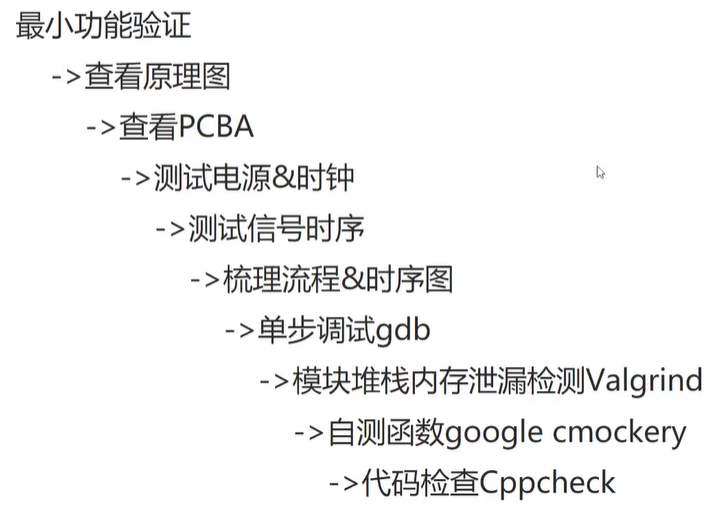
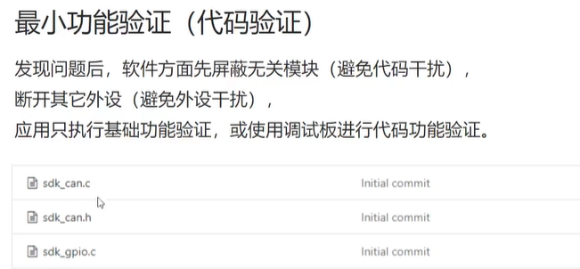
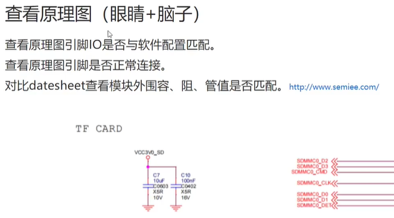
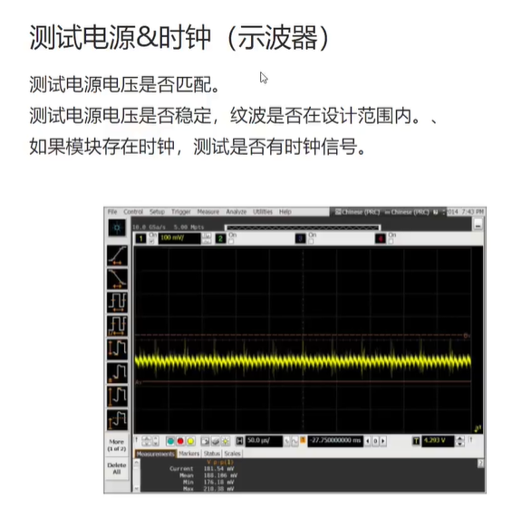
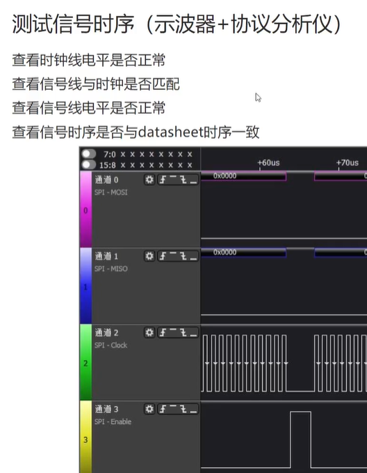
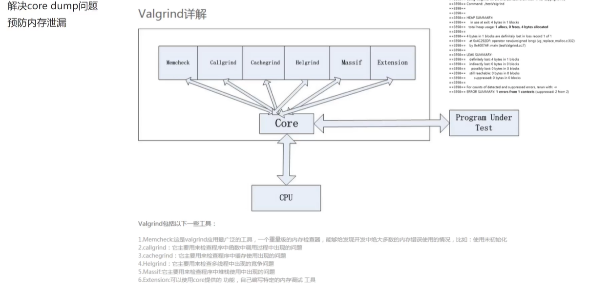
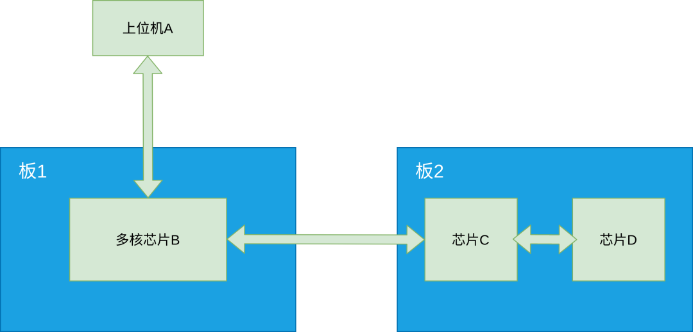

## 嵌入式问题排查方法 - HQ

[TOC]

------

#### 注意

- 

------

## 嵌入式开发问题排查步骤 - HQ

1. 问题排查步骤

   > 

2. 最小功能验证(先把其他模块屏蔽掉)

   > 

3. 查看原理图(datesheel:时序、电气特性、寄存器、引脚)

   > 

4. 查看PCBA（万用表）

   > 

5. 测试电影&时钟（示波器）

   > 

6. 测试信号时序（示波器+逻辑分析仪）

   > 

7. 梳理流程&时序图

   > 

8. Debug调试-gdb

   > 

9. 模块堆栈内存泄漏检测Valgrind

   > 
   >
   > 

10. 自测函数google cmockery

    > 

11. 代码检查Cppcheck

    > 

12. 求助别人，求助原厂


## 嵌入式软件调试方法及几个实用工具

https://mp.weixin.qq.com/s/lxe2Dvk3tLVrOJbNKGvqNw

本次分享一些嵌入式软件的调试经验及一些有用的工具。

需要说明的是：这不是一篇大神教你如何成为大神的文章，因为我还不是大神；而是一名普通嵌入式软件工程师从毫无经验到略有经验的一点调试总结，都很基础。

我们常常说，软件三分写七分调。实际开发中，确实也是这样子的。我工作这几年了，对这体会也越来越深。每当需求一下来，我代码很快就可以写完，但是，调试需要花很多时间。

这里需要明确的是， **`调试的目的不仅仅是调通整个功能需求`** 。调通功能是最基本的要求，还需要进行优化、完善逻辑、完善异常处理。所以，需要非常长的时间。

记得毕业的时候参与的第一个项目，那个项目的硬件架构相对一般产品来说会复杂一些：



我负责的部分就是D芯片的软件。D芯片所做的事情就是跟产品功能比较相近的，当时通过A发数据，经过B、C之后，再到D，产品功能表现得不正常。我当时的 **`第一反应`** 就是我负责得D芯片的逻辑可能出问题了。

A、B、C都是比较有经验的工程师负责的，而且负责C的还是个组长级别的，大家也觉得应该是我负责的D芯片的代码出的问题，因为我是个刚毕业的新人，觉得问题出在我这里的概率比较大。

他们也没有去查是不是他们的问题，每天就是来看看我是否有找到问题。花了几天的时间，我最后才定位出来，是C芯片给我发的数据出问题了~

因为当时缺乏调试经验，所以没能很快就定位出问题所在。要是现在的话，这种问题很快就能查出来的。因为现在积累了一些经验：

### 调试经验

平时开发调试时，可能会有这么两种情况：

- 独立开发，自己调试
- 协作开发，联合调试

#### 1、独立开发

一些小的项目，如果整个项目是我们自己开发的话，调试起来也比较方便，因为是我们自己开发的，所以会比较熟悉一些。

我的习惯是：分模块来进行开发，每开发完一个模块就先想办法测一下这个模块，没问题了再集成到工程里。模块初步开发、测试时，代码可以随意一些，调好了之后，再重新梳理、整理代码，集成到工程里。

自测的方式：有一些代码直接对应着功能，直接测试看功能正不正常；有一些代码可以通过log打印来看是否正常；有一些可能需要在线调试看看是否符合预期；有一些需要数据输入的，可以自己模拟一些数据等。

#### 2、协同开发

协同开发时，可能就比较麻烦一些。特别的，有时候甚至需要跨部门对接调试。

我的习惯是：先开发并自测自己的模块；然后模拟对方，简单地自测通信。

自测自己模块的方式如上面独立开发一样。我们模拟对方进行测试时，需要考虑是不是需要花比较多的时间，如果需要花太多的时间的花就算了，等到联调再一起调。

花时间较少的，可以自测通信的情况可能有如下三种：

- 线程/进程间通信。这应该比较容易，模拟对方线程/进程进行收发测试。可以写一些测试命令，比如发某个命令，触发某条消息发送。
- 板间通信，如串口通信。可以用串口助手模拟对方进行测试，自己对照协议模拟一些协议数据进行收发测试。
- socket通信，如TCP通信。你负责客户端，就模拟服务端；你负责服务端，就模拟客户端。

当然，协作开发也可以不自测通信，看个人习惯。

我模拟自测通信是为了对我自己的模块的通信有一定的把控，联调时出问题时，就可以比较快地指出对方的问题。当然，这不是为了推锅，而是为了能更好地分析、解决联调问题。

比如，我最近的项目中，设备与手机APP对接。配网功能、设备于APP局域网内通信功能。我负责设备端，设备端作为服务器；对方作为客户端。

在与对方联调前，我已经写了一个客户端运行于PC或设备上，模拟对方的手机APP，对我的模块做了基本的自测，也测出了我的模块的一些问题。

然后在与对方正式联调时，出现的大多问题都在对方那边，所以这时候我就可以帮助对方分析问题，提高了联调效率。

上面分享了一些我的经验及思路，下面看看一些具体的调试方法与调试工具：

### 调试方法

#### 1、LOG

我在实际工作中，log打印调试解决了我大多数的问题，一般的问题，通过分析log都可以定位出问题所在。但是，打log也是有很多讲究的，需要我们打印出有助于我们调试的信息。

比如：

- **log的格式**

带时间戳、函数名、行号等有助于分析问题的信息。比如：

```
<xxx ms>[func:100]
```

当然，实际中可能不只包含如上信息，根据需要添加。

- **在一些判断分支要加上log**

这样可以清楚地知道程序跑到分支判断时的执行流程。

- **在一些大的操作的开始处，加上显眼的log**

可以清楚地知道某个操作开始的地方。

- **业务逻辑模块，可以加上特定的标签**

比如统一的log的格式中加上特定标签，比如BUSINESS。如：

```
<xxx ms>[BUSINESS][func:100]
```

因为业务逻辑一般是整个项目地最上层，其它模块都是为它服务的。

我们看log的时候，通过编辑器搜索关键字 **`BUSINESS`** 就可以只列出业务逻辑相关的log，我们只要看这些log，就可以大致知道程序的运行流程。

当然，其它模块也可以根据需要加上标签。

- **控制log打印频率**

与数据打交道的模块可能需要打印一些数据来分析源数据是否正常。可以稍微的控制打印频率，尽可能在不影响数据分析的情况下打印尽可能少的log。

否则，一些log的文件动不动就几百MB，分析起来也很头疼。特别的，log需要保存在flash上时，为了防止log爆满flash，常常需要限制log文件的大小并做log滚动覆盖，这时候无效log太多了可能就会覆盖掉有效的log。

往期关于log调试相关的文章：

[C语言、嵌入式中几个非常实用的宏技巧](http://mp.weixin.qq.com/s?__biz=MzU5MzcyMjI4MA==&mid=2247487218&idx=1&sn=c1bfbb9aed844bc1cda724d81f525005&chksm=fe0d6035c97ae9231886ff879e19ed2a45e30474c02f1324169754cbccc667fec6bbcd5b8775&scene=21#wechat_redirect)

[bug解决不了？使用日志法](https://mp.weixin.qq.com/s?__biz=MzU5MzcyMjI4MA==&mid=2247489180&idx=1&sn=e509eb36d59ac6993338ba9badbc10a2&chksm=fe0d785bc97af14d3d165e9f02777d3335c292afb0b710b7bf5c3d8090c85d7101668c699218&token=1148822446&lang=zh_CN&scene=21#wechat_redirect)

[分享一个极简的log模块！](https://mp.weixin.qq.com/s?__biz=MzU5MzcyMjI4MA==&mid=2247505310&idx=1&sn=1e79214038d20ba06b04b0081cc00a5d&chksm=fe0ebb59c979324f3a8681e38a04227694fe500a70ff6317b53ff4189130bf1bd6ab1559b764&token=1148822446&lang=zh_CN&scene=21#wechat_redirect)

[嵌入式软件打log的一些心得！](https://mp.weixin.qq.com/s?__biz=MzU5MzcyMjI4MA==&mid=2247504186&idx=1&sn=d0a3e3dc84a5c138b1e53e34d5e495b9&chksm=fe0ebffdc97936eb1c1238ef22704d8e08844d98c97b51fadcf23b08e2dfefb26b1620d24caf&token=1148822446&lang=zh_CN&scene=21#wechat_redirect)

#### 2、在线调试

在线调试，可以看到程序运行的更多细节。基本的应该都会吧。

GDB往期相关推文：

[例说GDB调试](http://mp.weixin.qq.com/s?__biz=MzU5MzcyMjI4MA==&mid=2247490016&idx=1&sn=5258b874e09ae12bfd64fcb057ec7446&chksm=fe0d7727c97afe311dd9f1e3f4e494f3699aece3e9676ff251753da954978556f0e80dd044c0&scene=21#wechat_redirect)

[手把手教你使用VSCode + gdb + gdbserver调试ARM程序](http://mp.weixin.qq.com/s?__biz=MzU5MzcyMjI4MA==&mid=2247496372&idx=1&sn=3a65f292edffb02b9a97ec50ecd77986&chksm=fe0e9c73c9791565eaaf64b9386aaf1f94e4bad4036ec41344ca3ca5dbe9df22513d7b74223f&scene=21#wechat_redirect)

[GDB调试器的简单使用(图文)](https://mp.weixin.qq.com/s?__biz=MzU5MzcyMjI4MA==&mid=2247508061&idx=1&sn=9dcc819a521965f8cc36f79f05c2c83d&chksm=fe0ece9ac979478cd99aca06310a024a3e24e2a5776dc1752be792cbba8fc8ddb8dd7703904e&token=1148822446&lang=zh_CN&scene=21#wechat_redirect)

关于keil的调试相关的内容，推荐看一下我同事鱼鹰写的文章（公众号：鱼鹰谈单片机），他对这方面研究得比较深。

#### 3、其它调试工具

我们公众号之前也分享了很多有用的调试相关的工具：

#### （1）VirtLCD

这是一个实用的LCD模拟器，手头上暂时没有LCD或者开发初期，需要频繁下载程序，验证效果的时候，可以使用VirtLCD来提高我们的开发、调试效率。

VirtLCD的介绍及简单使用：

[实用 | 手头上无LCD却又急着开发UI？LCD模拟器了解一下~](https://mp.weixin.qq.com/s?__biz=MzU5MzcyMjI4MA==&mid=2247498696&idx=1&sn=4d7e46e254e9e16a570756bae15e2606&chksm=fe0e950fc9791c1952582fad30615b13348122842337cef947238408f4ca4eeb5704cb608820&token=1148822446&lang=zh_CN&scene=21#wechat_redirect)

#### （2）Wireshark

Wireshark 是一个网络封包分析软件。比如我们在调试socket通信的时候，可以使用Wireshark 监控看看我们有没有发送数据出去，或者有没有收到对方发送的数据。

wireshark的介绍及简单使用：

[wireshark抓包工具的使用及分析](https://mp.weixin.qq.com/s?__biz=MzU5MzcyMjI4MA==&mid=2247490369&idx=1&sn=6adb1326c67d96edda1cc51d41e31bdf&chksm=fe0d7586c97afc90d324eb4c4a58d80c66c3640b6b89ca95a162e69fe081af06bcd86e07e044&token=1148822446&lang=zh_CN&scene=21#wechat_redirect)

#### （3）VSPD

Virtual Serial Port Driver（VSPD）是一个虚拟串口软件。虚拟串口软件是一种模拟物理串行接口的软件，它完全复制了硬件 COM 接口的功能，并且将被操作系统和串行应用程序识别为真实端口。

在编写串口上位机时，需要进行调试。一种方式是与下位机进行通信进行测试；另一种方式是借助虚拟串口软件来进行测试。

VSPD的介绍及简单使用：

[工具 | 虚拟串口软件的使用分享](https://mp.weixin.qq.com/s?__biz=MzU5MzcyMjI4MA==&mid=2247497071&idx=1&sn=77f161c677302b9b1c0e41e527199f2d&chksm=fe0e9ba8c97912beaf1d5a116536f51b3d861d7e69e4a8603754c938c95165a5811ba189d135&token=1148822446&lang=zh_CN&scene=21#wechat_redirect)

#### （4）LVGL GUI Guider

GUI Guider是恩智浦为LVGL开发了一个上位机GUI设计工具，可以通过拖放控件的方式设计LVGL GUI页面，加速GUI的设计。

相关文章：

[实用工具 | LVGL GUI-Guider的使用分享](https://mp.weixin.qq.com/s?__biz=MzU5MzcyMjI4MA==&mid=2247493776&idx=1&sn=dc0bfe992b3c05da4319c7ea27f6ef36&chksm=fe0e8657c9790f415560b18c965dc0e3d3ae9e283149fa55ca56591cddbdd6f54b1caa2779aa&token=1148822446&lang=zh_CN&scene=21#wechat_redirect)

[基于vs2019的lvgl模拟器使用](http://mp.weixin.qq.com/s?__biz=MzU5MzcyMjI4MA==&mid=2247493527&idx=1&sn=3ac3aaefa320ed3062c0648c20e8356e&chksm=fe0e8950c9790046cbb8d0c73bdbe6cee5c372fbb99369d52ad41c7123393b67bbd64f056a6b&scene=21#wechat_redirect)

[lvgl最新版本在STM32上的移植使用](http://mp.weixin.qq.com/s?__biz=MzU5MzcyMjI4MA==&mid=2247493449&idx=1&sn=d4ecd2296ffacfadb1d989485944feb5&chksm=fe0e898ec97900980d5b879be4ab0bc99f7bce45050b75d14f88ba5c27f02e2f0eb69023e54a&scene=21#wechat_redirect)

#### （5）Jlink+JScope

**`J-Scope`** 是  SEGGER 推出的波形显示软件，傻瓜式，简单易上手。需要搭配 **`Jlink仿真器`** （V9或V10）使用。

J-Scope的介绍及简单使用：

[J-Scope的介绍及简单使用](https://mp.weixin.qq.com/s?__biz=MzU5MzcyMjI4MA==&mid=2247486236&idx=1&sn=77ea65e145fa9bb997af10b01e03fc28&chksm=fe0d65dbc97aeccdf67d31323574bd142796ead9bb7577c00f11b713d13c97ebcdbb2940069e&token=1148822446&lang=zh_CN&scene=21#wechat_redirect)

#### （6）SEGGER_RTT

RTT全称是Real Time Transmit（实时传输），是SEGGER 公司推出的，是搭配 **`Jlink仿真器`** （V9或V10）使用的一种调试手段。

SEGGER_RTT的介绍及简单使用：

[SEGGER_RTT的介绍及简单使用](https://mp.weixin.qq.com/s?__biz=MzU5MzcyMjI4MA==&mid=2247485374&idx=1&sn=80152ba1f730579b2cfba18ebf91eae7&chksm=fe0d6979c97ae06fb5e95c486fbd0050d460e22ad4bfb53179dae07b891ab126d66921cf1ab7&token=1148822446&lang=zh_CN&scene=21#wechat_redirect)

#### （7）CmBacktrace

CmBacktrace （Cortex Microcontroller Backtrace）是一款针对 ARM Cortex-M 系列 MCU 的错误代码自动追踪、定位，错误原因自动分析的开源库。

CmBacktrace 的介绍及简单使用：

[CmBacktrace 的介绍及简单使用](https://mp.weixin.qq.com/s?__biz=MzU5MzcyMjI4MA==&mid=2247486112&idx=1&sn=94bd4cb628ecc22f954fb4a8e3f4444a&chksm=fe0d6467c97aed71db9a3f7dc2c0acf6bee65c3d28ea5f44defc627bc797c216419e5161693f&token=1148822446&lang=zh_CN&scene=21#wechat_redirect)

#### （8）VOFA+

VOFA+（伏特加）插件驱动的高自由度上位机。其是一款通用的数据调试工具，它让图形化调试变得像串口调试一样简单。通过打印字符串，或者发送十六进制数字的方式，就能完成数据的可视化操作。

官网：

> https://www.vofa.plus/

VOFA+的介绍及简单使用：

[VOFA+的介绍及简单使用](https://mp.weixin.qq.com/s?__biz=MzU5MzcyMjI4MA==&mid=2247486173&idx=1&sn=ab1f55d7bd49d1bfa467c99c889e3179&chksm=fe0d641ac97aed0c025f664f50db400be25df0479ecaaff15cf473f99d661d3d90c0ebedcaae&token=1148822446&lang=zh_CN&scene=21#wechat_redirect)

#### （9）QEMU

QEMU是一款知名的而且开源的模拟器（官网：https://www.qemu.org/），它能在 X86 PC 上运行能够模拟 Arm、MIPS、RISC-V 等各种 CPU 和开发板，以及 网卡、声卡、键盘、sdcard、emmc、usb等各种外设。

QEMU我还未使用过，之前转载的一篇文章：

[Linux利器：QEMU！用它模拟开发板能替代真开发板？](https://mp.weixin.qq.com/s?__biz=MzU5MzcyMjI4MA==&mid=2247486213&idx=1&sn=c44670bc34ff290efef58b4a67fea7ed&chksm=fe0d65c2c97aecd483769af770ccb3fea6c1ee10a68873dc2aceda0f24107b700a7f85eb52e9&token=1148822446&lang=zh_CN&scene=21#wechat_redirect)

#### （10）Valgrind

Valgrind是一套Linux下，开放源代码（GPL V2）的仿真调试工具的集合。

Valgrind的介绍及简单使用：

[工具 | Valgrind仿真调试工具的使用](https://mp.weixin.qq.com/s?__biz=MzU5MzcyMjI4MA==&mid=2247497934&idx=2&sn=093b82929008e1134c9a30bb0b3c5814&chksm=fe0e9609c9791f1f5c9e00cf277ee0a4d290245a4b2edbb6f0276431b1ad2d69f8d6b79f556c&token=1148822446&lang=zh_CN&scene=21#wechat_redirect)

#### （11）Bus hound

Bus hound是一款为了在pc电脑上进行总线数据包监控以及操控的开发工具。用来捕捉来自设备的协议包和输入输出操作，它是功能强大的总线协议分析器。

之前有与USB上位机联调，通过这个工具可以监控上位机发出的数据是否正确。关于Bus hound的文章我们公众号还没有分享过，先占个坑，之后有机会再分享。


