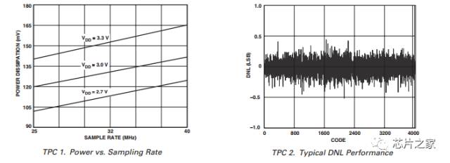
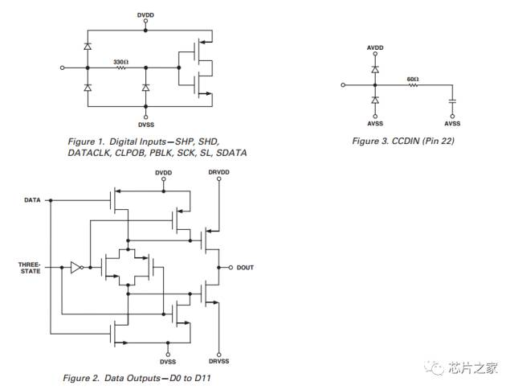
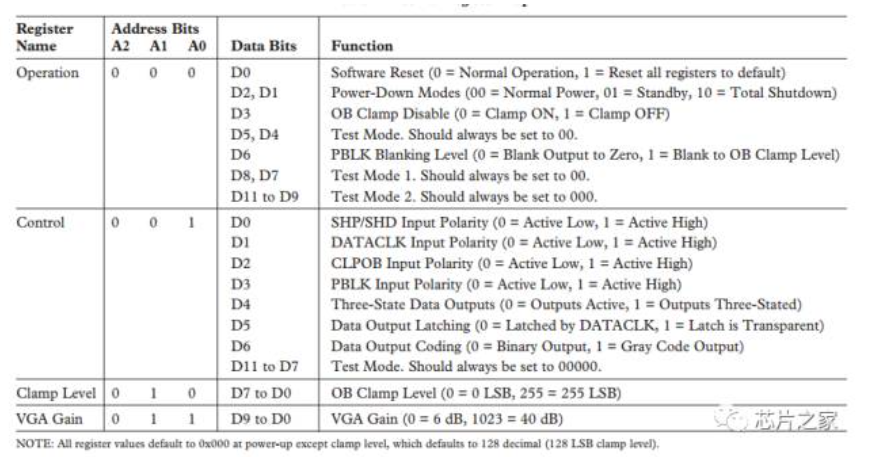
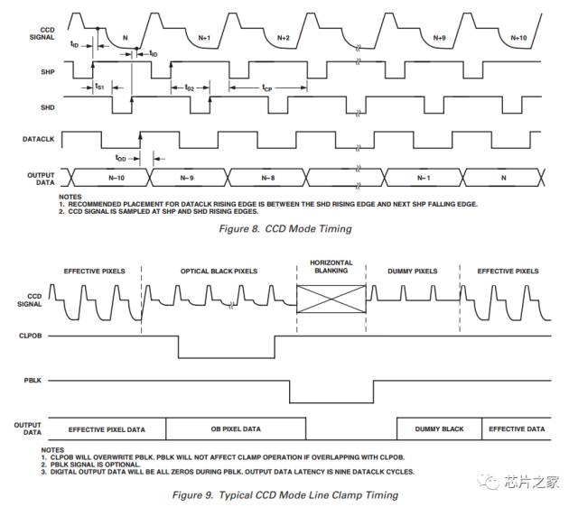

## 如何看芯片数据手册 - HQ

[TOC]

------

#### 注意

- 

------

## 嵌入式开发如何看芯片数据手册 - 摘录

https://mp.weixin.qq.com/s/cvV8hlX9mOuujwrYhor3lQ

不管什么芯片手册，它再怎么写得天花乱坠，本质也只是芯片的使用说明书而已。而说明书一个最显著的特点就是必须尽可能地使用通俗易懂的语句，向使用者交代清楚该产品的特点、功能以及使用方法。无论什么芯片手册，都不会存在生僻的单词语法（专业词汇除外），运用在大学英文知识去分析这些手册足矣。

### 1、阅读手册难点 

Datasheet为何难读？难点有三：

**语言风格** —— 跟平常我们所阅读的新闻、报导都不一样，好多数据手册在 表达意思上的连贯性做得不好，没有太大联系的两句话就放在了一起，没办法，只得接受（莫非这也是中外思维的差异？）

**长句太多** —— 为保证严谨，不至于让读者产生误解，数据手册通常多用长句描述，并且长句所描述问题都比较关键。这很让人头疼，要连贯地理解这些长句，需要较好的记忆力。当然，俺们也有笨办法：按照古老的主谓宾状补结构，把整个长句拆开，对每一个小短句进行分析，最后联系上下文揣摩出整句意思。

**专业词汇多，甚至有字典上都找不到的单词** ——  没办法，一得靠平时的积累，二得善于借助网络资源翻译。不过强调一下：我们没有必要把每一个单词的意思 都完完全全地、准确无误地翻译出来，只要理解它所表达的意思就足够了，就说是只需意会，不必言传倒也合适。

### 2、如何阅读手册 

以AD9945为例，我们可以这么去读芯片数据手册：

**1、先看看芯片的特性（Features）、应用场合（Applications）以及内部框图**。这有助于我们对芯片有一个宏观的了解，此时需要弄清楚该芯片的一些比较特殊的功能，充分利用芯片的特殊功能，对整体电路的设计，将会有极大的好处。比如AD9945可以实现相关双采样（CDS），这可以简化后续信号调理电路，并且抵抗噪声的效果还好。

**2、重点关注芯片的参数，同时可以参考手册给出的一些参数图**（如AD9945的 TPC 1，TPC2等），这是是否采用该芯片的重要依据。像AD9945，就可以关注采样率（maximum clock rate）、数据位数（AD converter）、功耗（power consumption）、可调增益范围（gain range）等。

**3、选定器件后，研究芯片管脚定义、推荐的PCB layout**，这些都是在硬件设计过程中必须掌握的。所有管脚中，要特别留意控制信号引脚或者特殊信号引脚，这是将来用好该芯片的前提。比如AD9945的SHP、SHD、PBLK、CLPOB等。

**4、认真研读芯片内部寄存器，对寄存器的理解程度**，直接决定了你对芯片的掌握程度。比如AD9945就有4个寄存器：Operation、Control、Clamp Level和VGA gain，对于这些寄存器，必须清楚它们上电后的初始值、所能实现的功能、每个bit所代表的含义这些基本情况。

**5、仔细研究手册给出的时序图，这是对芯片进行正确操作的关键。**单个信号的周期、上升时间、下降时间、建立时间、保持时间，以及信号之间的相位关系，所有这些都必须研究透彻。像AD9945的Figure 8 和 Figure 9 就很值得花费时间去仔细研究。

**6、最后提醒初学者**

凡是芯片数据手册中的“**note**”，都必须仔细阅读，一般这都是能否正确使用、或能否把芯片用好的**关键之所在**。

