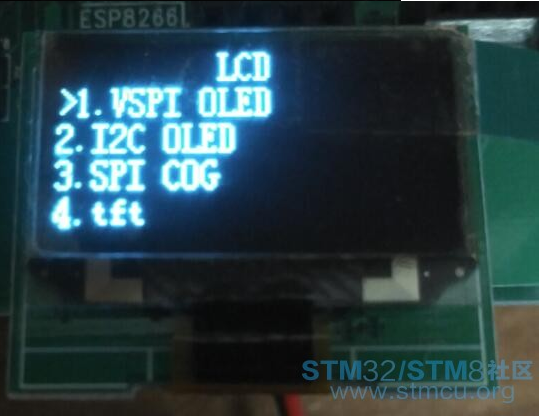
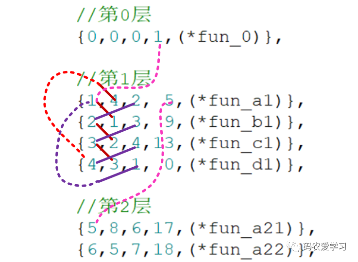

## 嵌入式程序模板框架整理 - HQ

[TOC]

------

#### 注意

- [一个单片机产品菜单设计框架](https://mp.weixin.qq.com/s/zBGxCi-lr29dhFlMFUm7ww)
- [STM32简易多级菜单(数组查表法)](https://mp.weixin.qq.com/s/DNoUMefnMjuln--v-D7xXQ)

------

## 时间片论法程序框架

介于**前后台顺序执行法**和**操作系统**之间的一种程序架构设计方案。该设计方案需能帮助嵌入式软件开发者更上一层楼，在嵌入式软件开发过程中，若遇到以下几点，那么该设计方案可以说是最优选择，适用于程序较复杂的嵌入式系统；

- 目前的需求设计需要完全没有必要上操作系统。
- 任务函数无需时刻执行，存在间隔时间(比如按键，一般情况下，都需要软件防抖，初学者的做法通常是延时10ms左右再去判断，但10ms极大浪费了CPU的资源，在这段时间内CPU完全可以处理很多其他事情)
- 实时性有一定的要求。

该设计方案需要使用一个定时器，一般情况下定时1ms即可（定时时间可随意定，但中断过于频繁效率就低，中断太长，实时性差），因此需要考虑到每个任务函数的执行时间，建议不能超过1ms（能通过程序优化缩短执行时间则最好优化，如果不能优化的，则必须保证该任务的执行周期必须远大于任务所执行的耗时时间），同时要求主循环或任务函数中不能存在毫秒级别的延时。

> “
>
> 如何确定每个函数的任务周期呢？根据任务的耗时和效果决定、如按键扫描任务周期为 10ms(为了提高响应)，指示灯控制任务周期为 100ms（通常情况下最高100ms的闪烁频率正好，特殊需求除外)，LCD/OLED 显示周期为 100ms(通过这种通过SPI/IIC等接口的方式耗时大约在 1~10ms，甚至更长，所以任务周期必须远大于耗时，同时为了满足人眼所能接受的刷屏效果，也不能太长，100ms 的任务周期比较合适)等。
>
> ”

以下介绍两种不同的实现方案，分别针对无函数指针概念的朋友和想进一步学习的朋友。

### 1、无函数指针的设计方式

```
/**
  * @brief      主函数.
  * @param      None.
  * @return     None.
  */

int main(void)
{
    System_Init();
    
    while (1)
    {
        if (TIM_1msFlag)// 1ms
        {
            CAN_CommTask(); // CAN发送/接收通信任务
            
            TIM_1msFlag = 0;
        }        
        if (TIM_10msFlag)  // 10ms
        {
            KEY_ScanTask(); // 按键扫描处理任务
            
            TIM_10msFlag = 0;
        }        
        if (TIM_20msFlag) // 20ms
        {
            LOGIC_HandleTask();// 逻辑处理任务
 
            TIM_20msFlag = 0;
        }        
        if (TIM_100msFlag) // 100ms
        { 
            LED_CtrlTask(); // 指示灯控制任务
            
            TIM_100msFlag = 0;
        }       
        if (TIM_500msFlag)// 500ms
        {
            TIM_500msFlag = 0;
        }        
        if (TIM_1secFlag) // 1s
        {
            WDog_Task(); // 喂狗任务            
            TIM_1secFlag = 0;
        }  
    }
}
 
/**
  * @brief      定时器3中断服务函数.
  * @param      None.
  * @return     None.
  */
void TIM3_IRQHandler(void)
{
    if(TIM_GetITStatus(TIM3,TIM_IT_Update) == SET) //溢出中断
    {
        sg_1msTic++;        
        sg_1msTic % 1 == 0 ? TIM_1msFlag = 1 : 0;        
        sg_1msTic % 10 == 0 ? TIM_10msFlag = 1 : 0;        
        sg_1msTic % 20 == 0 ? TIM_20msFlag = 1 : 0;        
        sg_1msTic % 100 == 0 ? TIM_100msFlag = 1 : 0;       
        sg_1msTic % 500 == 0 ? TIM_500msFlag = 1 : 0;       
        sg_1msTic % 1000 == 0 ? (TIM_1secFlag  = 1, sg_1msTic = 0) : 0;
    }    
    TIM_ClearITPendingBit(TIM3,TIM_IT_Update);  // 清除中断标志位
}
```

### 2、含函数指针的设计方式

```
/**
  * @brief 任务函数相关信息结构体定义.
  */
typedef struct{
    uint8 m_runFlag;                 /*!< 程序运行标记：0-不运行，1运行 */
    uint16 m_timer;                  /*!< 计时器 */
    uint16 m_itvTime;                /*!< 任务运行间隔时间 */
    void (*m_pTaskHook)(void);       /*!< 要运行的任务函数 */
} TASK_InfoType; 
 
#define TASKS_MAX     5              // 定义任务数目
 
/** 任务函数相关信息 */
static TASK_InfoType sg_tTaskInfo[TASKS_MAX] = {
    {0, 1, 1, CAN_CommTask},         // CAN通信任务
    {0, 10, 10, KEY_ScanTask},       // 按键扫描任务
    {0, 20, 20, LOGIC_HandleTask},   // 逻辑处理任务
    {0, 100, 100, LED_CtrlTask},     // 指示灯控制任务
    {0, 1000, 1000, WDog_Task},      // 喂狗任务
};
 
 
/**
  * @brief      任务函数运行标志处理.
  * @note       该函数由1ms定时器中断调用
  * @param      None.
  * @return     None.
  */
void TASK_Remarks(void)
{
    uint8 i; 
    for (i = 0; i < TASKS_MAX; i++)
    {
        if (sg_tTaskInfo[i].m_timer)
        {
            sg_tTaskInfo[i].m_timer--; 
            if (0 == sg_tTaskInfo[i].m_timer)
            {
                 sg_tTaskInfo[i].m_timer = sg_tTaskInfo[i].m_itvTime;
                 sg_tTaskInfo[i].m_runFlag = 1;
            }
        }
   }
}
 
/**
  * @brief      任务函数运行处理.
  * @note       该函数由主循环调用
  * @param      None.
  * @return     None.
  */
void TASK_Process(void)
{
    uint8 i; 
    for (i = 0; i < TASKS_MAX; i++)
    {
        if (sg_tTaskInfo[i].m_runFlag)
        {
             sg_tTaskInfo[i].m_pTaskHook();         // 运行任务
             sg_tTaskInfo[i].m_runFlag = 0;         // 标志清0
        }
    }   
}
 
/**
  * @brief      主函数.
  * @param      None.
  * @return     None.
  */
int main(void)
{
    System_Init();    
    while (1)
    {
        TASK_Process();
    }
}
 
/**
  * @brief      定时器3中断服务函数.
  * @param      None.
  * @return     None.
  */
void TIM3_IRQHandler(void)
{
    if(TIM_GetITStatus(TIM3,TIM_IT_Update) == SET) //溢出中断
    {
        TASK_Remarks();
    }    
    TIM_ClearITPendingBit(TIM3,TIM_IT_Update);// 清除中断标志位
}
```


## 单片机产品菜单设计框架

根据需求，我重新设计了一个菜单结构体：

```
/**
 * @brief  菜单对象
*/
typedef struct _strMenu
{
    MenuLel l;     ///<菜单等级
    char cha[MENU_LANG_BUF_SIZE];   ///中文
    char eng[MENU_LANG_BUF_SIZE];   ///英文
    MenuType type;  ///菜单类型
    s32 (*fun)(void);  ///测试函数

} MENU;
```

  是的，就这么简单，每一个菜单都是这个结构体，用这个结构体填充一个列表。

  这就是我们的菜单了。

```

const MENU EMenuListTest[]=
{
        MENU_L_0,//菜单等级
        "测试程序",//中文
        "test",        //英文
        MENU_TYPE_LIST,//菜单类型
        NULL,//菜单函数，功能菜单才会执行，有子菜单的不会执行

                MENU_L_1,//菜单等级
                "LCD",//中文
                "LCD",        //英文
                MENU_TYPE_LIST,//菜单类型
                NULL,//菜单函数，功能菜单才会执行，有子菜单的不会执行
                        MENU_L_2,//菜单等级
                        "VSPI OLED",//中文
                        "VSPI OLED",        //英文
                        MENU_TYPE_FUN,//菜单类型
                        test_oled,//菜单函数，功能菜单才会执行，有子菜单的不会执行

                        MENU_L_2,//菜单等级
                        "I2C OLED",//中文
                        "I2C OLED",        //英文
                        MENU_TYPE_FUN,//菜单类型
                        test_i2coled,//菜单函数，功能菜单才会执行，有子菜单的不会执行


                MENU_L_1,//菜单等级
                "声音",//中文
                "sound",        //英文
                MENU_TYPE_LIST,//菜单类型
                NULL,//菜单函数，功能菜单才会执行，有子菜单的不会执行
                        MENU_L_2,//菜单等级
                        "蜂鸣器",//中文
                        "buzzer",        //英文
                        MENU_TYPE_FUN,//菜单类型
                        test_test,//菜单函数，功能菜单才会执行，有子菜单的不会执行

                        MENU_L_2,//菜单等级
                        "DAC音乐",//中文
                        "DAC music",        //英文
                        MENU_TYPE_FUN,//菜单类型
                        test_test,//菜单函数，功能菜单才会执行，有子菜单的不会执行

                        MENU_L_2,//菜单等级
                        "收音",//中文
                        "FM",        //英文
                        MENU_TYPE_FUN,//菜单类型
                        test_test,//菜单函数，功能菜单才会执行，有子菜单的不会执行


                MENU_L_1,//菜单等级
                "触摸屏",//中文
                "tp",        //英文
                MENU_TYPE_LIST,//菜单类型
                NULL,//菜单函数，功能菜单才会执行，有子菜单的不会执行

                        MENU_L_2,//菜单等级
                        "校准",//中文
                        "calibrate",        //英文
                        MENU_TYPE_FUN,//菜单类型
                        test_cal,//菜单函数，功能菜单才会执行，有子菜单的不会执行

                        MENU_L_2,//菜单等级
                        "测试",//中文
                        "test",        //英文
                        MENU_TYPE_FUN,//菜单类型
                        test_tp,//菜单函数，功能菜单才会执行，有子菜单的不会执行

                MENU_L_1,//菜单等级
                "按键",//中文
                "KEY",        //英文
                MENU_TYPE_FUN,//菜单类型
                test_key,//菜单函数，功能菜单才会执行，有子菜单的不会执行

        /*最后的菜单是结束菜单，无意义*/                        
        MENU_L_0,//菜单等级
        "END",//中文
        "END",        //英文
        MENU_TYPE_NULL,//菜单类型
        NULL,//菜单函数，功能菜单才会执行，有子菜单的不会执行
};
```

  这个菜单列表有什么特点和要求呢？1 需要一个根节点和结束节点 2 子节点必须跟父节点，类似下面结构。

```
-----------------------------------------------
根节点
        第1个1级菜单
                       第1个子菜单
                       第2个子菜单
                       第3个子菜单
        第2个1级菜单
                       第1个子菜单
                                     第1个孙菜单
                                     第2个孙菜单
                       第2个子菜单
                       第3个子菜单
        第3个1级菜单
        第4个1级菜单
        第5个1级菜单
结束节点
------------------------------------------------
```

  第2个1级菜单有3个子菜单，子菜单是2级菜单，其中第1个子菜单下面又有2个孙菜单（3级菜单）。

  维护菜单，就是维护这个列表，添加删除修改，非常容易。那菜单程序怎么样呢？管他呢。定义好菜单后，通过下面函数运行菜单：

```
emenu_run(WJQTestLcd, (MENU *)&WJQTestList[0], sizeof(WJQTestList)/sizeof(MENU), FONT_SONGTI_1616, 2);
```

- 第1个参数是在哪个LCD上显示菜单，

- 第2个是菜单列表
- 第3个是菜单长度，
- 第4个四字体
- 第5则是行间距

  注意：运行这个菜单需要有rtos，因为菜单代码是while(1)的，陷进去就不出来了。

  需要有其他线程(TASK)维护系统，例如按键扫描。

  代码托管在github：https://github.com/wujique/stm32f407/tree/sw_arch

  相关文件：emenu.c、emenu.h、emenu_test.c

  当前代码： 

- 实现了双列菜单，用数字键选择进入下一层。每页最多显示8个菜单（4*4键盘用1-8键）
- 实现了单列菜单，通过上下翻查看菜单，确认键进入菜单。3 天顶菜单未实现，谁有兴趣可以加上。
- 基于LCD驱动架构，这个简易菜单自适应于多种LCD。

显示效果如下。

128*64 OLED

> 

> 


## STM32简易多级菜单(数组查表法)

单片机开发中，有时会用到屏幕来显示内容，当需要逐级显示内容时，就需要使用多级菜单的形式了。

### 1 多级菜单

多级菜单的实现，大体分为两种设计思路：

- 通过双向链表实现
- 通过数组查表实现

总体思路都是把菜单的各个界面联系起来，可以从上级菜单跳到下级菜单，也可从下级菜单返回上级菜单。

数组查表的方式比较简单，易于理解，本篇就来使用数组查表发在RVB2601上实现多级菜单的显示。

### 2 代码实现

#### 2.1 数组查表

**首先需要定义一个结构体**：

```
typedefstruct
{
	uchar current;
	uchar up;//向上翻索引号
	uchar down;//向下翻索引号
	uchar enter;//确认索引号
	void (*current_operation)();
} key_table;
```

- current：**当前页面**的索引号
- up：按下“**向上翻**“按钮后要跳转到的页面索引号
- down：按下“**向下翻**“按钮后要跳转到的页面索引号
- enter：按下“**确认**“按钮后要跳转到的页面索引号
- current_operation：**当前页面的索引号要执行的显示函数**，这是一个函数指针

注意：对于菜单显示的操作，用到了3个按键，分别是向下、向下和确认，如果单片机上的IO资源较为紧张，还可以把“向上翻”按钮省去，只通过“向下翻”按钮来实现循环访问，对应的结构体也可以去掉该成员。

**然后定义一个表**，用来定义各个页面间如何跳转

```
key_table table[30]=
{
	//第0层
	{0,0,0,1,(*fun_0)},
	
    //第1层
	{1,4,2, 5,(*fun_a1)},
	{2,1,3, 9,(*fun_b1)},
	{3,2,4,13,(*fun_c1)},		
	{4,3,1, 0,(*fun_d1)},
	
    //第2层
	{5,8,6,17,(*fun_a21)},					
	{6,5,7,18,(*fun_a22)},
	{7,6,8,19,(*fun_a23)},						                	
	{8,7,5, 1,(*fun_a24)},
	
	{ 9,12,10,20,(*fun_b21)},					
	{10, 9,11,21,(*fun_b22)},
	{11,10,12,22,(*fun_b23)},						                	
	{12,11, 9, 2,(*fun_b24)},
	
	{13,16,14,23,(*fun_c21)},					
	{14,13,15,24,(*fun_c22)},				                	
	{15,14,16,25,(*fun_c23)},				                	
	{16,15,13, 3,(*fun_c24)},
	
    //第3层
	{17,17,17,5,(*fun_a31)},			                	
	{18,18,18,6,(*fun_a32)},		                	
	{19,19,19,7,(*fun_a33)},
	
	{20,20,20, 9,(*fun_b31)},				                	
	{21,21,21,10,(*fun_b32)},			                	
	{22,22,22,11,(*fun_b33)},
	
	{23,23,23,13,(*fun_c31)},			                	
	{24,24,24,14,(*fun_c32)},			                	
	{25,25,25,15,(*fun_c33)},								
};
```

这里解释一下该表是如何工作的：

- 此表，表示了4级菜单的显示关系（注意第0层其实只是一个欢迎界面）
- 第一层菜单，只有4个选项，因此这里只列了4行（注意最后一个选项用作返回上一级，无实际内容含义）
- 第二层菜单，就是对第一层菜单中的3个实际的选项进行进一步的介绍，每种介绍又有4个子项（注意最后一个选项也是用作返回上一级，无实际内容含义），因此，这里的第二层菜单列了3x4=12行
- 第三层菜单，又是对第二层菜单中的子项进行进一步的介绍（3个分类，每类有3个子项），所以第三层菜单列了9行
- 注意数组中每一行的第1个数组，是索引号，先列举一个实际的例子进行分析：


上图就是一个实际的4级菜单要显示的内容，每个条目前，标记了索引号（0~25），即对应数组在定义的索引号。

比如数组关于第0层和第1层的定义:

```
//第0层
{0,0,0,1,(*fun_0)},

//第1层
{1,4,2, 5,(*fun_a1)},
{2,1,3, 9,(*fun_b1)},
{3,2,4,13,(*fun_c1)},		
{4,3,1, 0,(*fun_d1)},
```

- 先看第一行：**索引是0**，显示欢迎界面；**后面的两个0**表示此时按“上翻”和“下翻”无效，继续显示欢迎界面；**再后面的1**表示按下“确认”按钮后，跳转到索引1处（即显示第1级目录，且指向第1级的第1个子项）；**最后**是此索引要显示的具体内容，fun_0就是控制屏幕显示欢迎界面
- 再看第二行：**索引是1**，显示第1级目录，且指向第1级的第1个子项（天气）；**后面的4**表示此时按“上翻”跳转到索引4，即显示第1级目录，且指向第1级的第4个子项（Return）；**再后面的2**表示此时按“下翻”跳转到索引2，即显示第1级目录，且指向第1级的第2个子项（音乐）；**再后面的5**表示按下“确认”按钮后，跳转到索引5处（即显示第2级目录，且指向第2级的第1个子项-杭州）；**最后**是此索引要显示的具体内容，fun_a1就是控制屏幕显示第1级目录，且指向第1级的第1个子项（天气）
- 其它行的含义与之类似

通过分析，不难发现，这些数组在空间上的关系：



对于菜单的最底层，因为没有上翻和下翻的功能需求，因此每行的前3个数字都是当前的索引号：

```
//第3层
{17,17,17,5,(*fun_a31)},			                	
{18,18,18,6,(*fun_a32)},		                	
{19,19,19,7,(*fun_a33)},

{20,20,20, 9,(*fun_b31)},				                	
{21,21,21,10,(*fun_b32)},			                	
{22,22,22,11,(*fun_b33)},

{23,23,23,13,(*fun_c31)},			                	
{24,24,24,14,(*fun_c32)},			                	
{25,25,25,15,(*fun_c33)},	
```

#### 2.2 具体的显示函数

对于函数要显示的具体内容，根据自己的实现需要显示即可。

这里我使用的是OLED屏幕，借助U8g2图形库进行内容显示，以下是部分显示示例：

```
/*********第1层***********/
void fun_a1()   
{	
	u8g2_DrawStr(&u8g2,0,16,">");
	u8g2_DrawStr(&u8g2,16,16,"[1]Weather");
	u8g2_DrawStr(&u8g2,16,32,"[2]Music");
	u8g2_DrawStr(&u8g2,16,48,"[3]Device Info");
	u8g2_DrawStr(&u8g2,16,64,"<--");																					
}

void fun_b1()   
{	
	u8g2_DrawStr(&u8g2,0,32,">");
	u8g2_DrawStr(&u8g2,16,16,"[1]Weather");
	u8g2_DrawStr(&u8g2,16,32,"[2]Music");
	u8g2_DrawStr(&u8g2,16,48,"[3]Device Info");
	u8g2_DrawStr(&u8g2,16,64,"<--");																						
}

void fun_c1()     
{	
	u8g2_DrawStr(&u8g2,0,48,">");
	u8g2_DrawStr(&u8g2,16,16,"[1]Weather");
	u8g2_DrawStr(&u8g2,16,32,"[2]Music");
	u8g2_DrawStr(&u8g2,16,48,"[3]Device Info");
	u8g2_DrawStr(&u8g2,16,64,"<--");																					
}

void fun_d1()     
{	
	u8g2_DrawStr(&u8g2,0,64,">");
	u8g2_DrawStr(&u8g2,16,16,"[1]Weather");
	u8g2_DrawStr(&u8g2,16,32,"[2]Music");
	u8g2_DrawStr(&u8g2,16,48,"[3]Device Info");
	u8g2_DrawStr(&u8g2,16,64,"<--");																							
}

/*********第2层***********/
void fun_a21()     
{	
	u8g2_DrawStr(&u8g2,0,16,">");
	u8g2_DrawStr(&u8g2,16,16,"* HangZhou");
	u8g2_DrawStr(&u8g2,16,32,"* BeiJing");
	u8g2_DrawStr(&u8g2,16,48,"* ShangHai");
	u8g2_DrawStr(&u8g2,16,64,"<--");																						
}
//省略...
```

#### 2.3 按键切换页面

页面的切换，这里里简单的按钮轮询为例，比如**初始显示欢迎界面的状态**下，按下不同按键后，通过数组查表，确定要跳转到的索引号，然后根据索引号，通过函数指针执行索引号对应的显示函数，即实现了一次页面切换。

然后，就是**在新的页面状态**，收到下一个按钮指令，再切换到下一个显示状态。

```
void (*current_operation_index)(); //定义一个函数指针

//...
while(1)
{
    if((KEY1==0)||(KEY2==0)||(KEY3==0))
    {
        delay_ms(10);//消抖
        if(KEY1==0)
        {
            func_index = table[func_index].up;    //向上翻
            while(!KEY1);//松手检测
        }
        if(KEY2==0)
        {
            func_index = table[func_index].down;    //向下翻
            while(!KEY2);
        }
        if(KEY3==0)
        {
            func_index = table[func_index].enter;    //确认
            while(!KEY3);
        }
    }	

    if (func_index != last_index)
    {
        current_operation_index = table[func_index].current_operation;

        u8g2_ClearBuffer(&u8g2); 
        (*current_operation_index)();//执行当前操作函数
        u8g2_SendBuffer(&u8g2);

        last_index = func_index;
    }
}
```

### 3 总结

本篇介绍了一种简易的多级菜单的显示方法，本质是通过数组查表，实现各级菜单的各个页面（状态）的切换（跳转），并在STM32上编程实现，通过OLED屏幕，以及借助U8g2图形库，测试了多级菜单的显示功能。


