## 硬件知识整理 - HQ

[TOC]

------

#### 注意

- 

------

## 模拟滤波器设计工具

[Filter Design and Analysis](http://sim.okawa-denshi.jp/en/Fkeisan.htm)

[Filter Design Tool](https://webench.ti.com/filter-design-tool/filter-type)

## 8个常见的硬件知识点 - 摘录

https://mp.weixin.qq.com/s/izXDutcIQDANOfeU06XfiQ

### 1、什么是建立时间和保持时间？

建立时间（Setup Time）是指被采样的信号在时钟信号到来之前，数据稳定不变的时间。如果建立时间不够，时钟采到的数据可能刚好在数据的变化沿，那么写入到触发器中数据将是错误的。保持时间（Hold Time）是指稳定的数据在被时钟上升沿采样后，数据还需要保持一定的时间，这个时间被称为保持时间。保持时间不够，数据也无法被写入到触发器中。

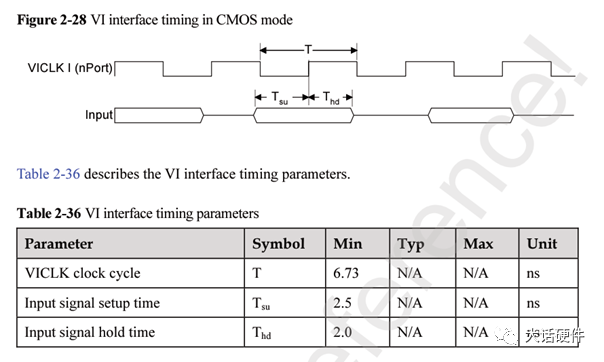

图1. SOC数据手册VI时序

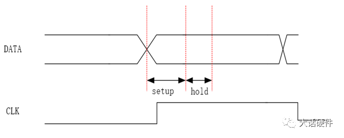

图2. 时钟-数据采样模型

### 2、 锂电池充电的原理和过程？

1.  充电原理：

锂离子电池的负极为石墨晶体，正极通常为二氧化锂。充电时锂离子由正极向负极运动而嵌入石墨中。放电时，锂离子从负极的石墨晶体内脱离，移向正极。

2. 充电过程

锂离子充电过程分为四个阶段：涓流充电（低压预充）、恒流充电，恒压充电以及充电终止。锂离子的充电是限压恒流，都是由IC芯片控制的，典型的方式是：先检测待充电电池的电压，如果电压低于3V，先要进行充电，充电电流为设定电流的1/10，电压升到3V以后，进入标准的充电过程。以设定电流进行恒流充电，如果电压升到4.2V时，改为恒压充电，保持充电电压为4.2V，此时，充电电流逐渐下降，当电流下降到设定电流的1/10时，充电结束。

3. 充电曲线

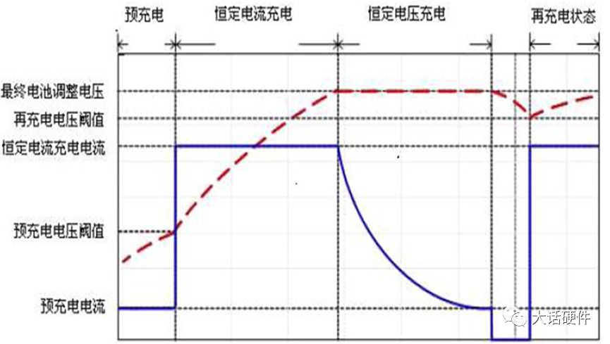

### 3、看门狗有什么作用？

看门狗的作用就是防止程序发生死循环，或者说程序跑飞。

看门狗是一个定时器电路，一般有一个输入，叫喂狗。一个输出到MCU的RST端，MCU正常工作时，每隔一段时间输出一个信号到喂狗端，给 WDT寄存器清零，如果超过规定的时间不喂狗，WDT 定时超过，就会产生一个复位信号给MCU，使MCU复位，防止MCU死机。

STM32有2个看门狗：独立看门狗和窗口看门狗。独立看门狗（IWDG），独立于系统之外，因为有独立时钟，所以不受系统影响的系统故障探测器，主要用于监视硬件错误。窗口看门狗（WWDG）系统内部的故障探测器，时钟与系统相同。如果系统时钟不走了，这个狗也就失去了作用了，主要用于监视软件错误。简单的讲，看门狗就是检测系统故障的，如果因为系统故障而没有及时喂狗，则引发复位重启。

### 4 、电解电容和陶瓷电容的区别？

电解电容的正级是用铝带卷成一个筒后，放在铝壳内。这种方法在获得大容量对的同时，也带来了很多缺陷。其中一个问题就是电解电容的等效电感比较大。而瓷片电容是“平板”结构的电容，简单的说就是在两个平行金属片板上引出的脚，中间利用绝缘材料隔离形成电容。这种电容的容量小，但容量稳定，而且等效电感比较小。一个元件用在什么场合，等效电感是一个重要的参数。

从以上知，电解电容的等效电感较大，决定了它不能用于高频场合，频率越高电感的影响就越明显。电解电容应用的最大频率一般为500KHz的场合，因此一般适用于低频的滤波电路中。而瓷片电容的等效电感小，故可以应用于高频场合，工作频率可以达到百兆以上，因此一般适用于高频滤波电路。

典型应用是两者结合，在电源的输出端一个电解电容和一个瓷片电容并联使用，即“高低搭配”，以取得更好的滤波效果。

### 5、功率放大器的分类

甲类：整个工作周期内晶体管的集电极电流始终是流通的状态。放大器的效率最低，但非线性失真相对较小。一般用于对失真比较敏感的场合，比如HIFI音响。

乙类：半个周期工作，半个周期截止。乙类工作状态又称为B类状态。两只互补的晶体管推挽工作，效率比甲类功放高，但存在交越失真的问题。一般功率放大器都采用这种形式。

甲乙类：它是介于甲类和乙类之间的工作状态，即晶体管工作周期大于半周期，这种功放的特性介于甲类和乙类之间。

丙类：晶体管的工作时间小于半个周期，丙类一般用于高频谐振的功放。

丁类：把声音信号调制为PWM形式，晶体管工作在开关状态，输出端通过LC滤波恢复信号波形，效率高，体积小，高频特性差，用于小型电池供电以及要求高效率的场合。

### 6、 同相比例放大器和反相比例放大器各有什么特点？ 

同相放大器的最大的优点就是输入阻抗接近无穷大，常常作为电压跟随器使用，进行隔离。

反相放大器的最大的优点是输入端的正反相电位差接近为0，只存在差模信号，抗干扰能力强。

同相放大器的最大缺点是输入没有“虚地”，存在较大的共模电压，抗干扰的能力较差，使用时，要求运放有较高的共模抑制比。反相放大器的最大缺点是输入的阻抗很小，等于信号输入端的串联电阻阻值。 

同相运算放大电路，引入的电压串联负反馈。反相运算放大电路，引入的电压并联负反馈，同相和反相的输出电阻都基本为0。因为引入了深度电压负反馈。

共同遵循“虚断”，“虚地”分析规则，也是电路的分析的手段。

### 7、 LED保护电路的分类及功能？

1.LED开路保护电路：

当某只LED突然损坏而开路时，与之并联的LED开路保护器就由关断状态变为导通状态，起到旁路的作用，使其余灯串能够正常工作。

2.LED过电压保护电路：

在LED灯串的两端并联一只双向瞬态电压抑制器（TVS），对过电压起到钳位保护的作用。

3.LED过电流保护电路：

在LED灯串上串联一个正温度系数的热敏电阻（PTCR），对电流起到限流的保护作用。

4.LED浪涌电流保护电路：

在LED灯串上串联一只负温度系数的电阻器（NTCR）,当输入电压发生瞬间变化而产生上千伏的电压或者在拔插LED时，都会在输出端产生浪涌电流；利用NTCR可保护LED免受浪涌电流的损坏；上电后，NTCR变为低阻值，可以忽略。

5.LED浪涌电压保护电路：

在LED灯串两端并联一只压敏电阻器（VSR），对浪涌电压起到钳位作用。

6.ESD保护电路：

利用ESD二极管，ESD矩阵，TVS，气体放电管等保护器件，避免因人体静电放电而造成的LED损坏。

7.共享式防静电保护电路

在LED显示屏中，由多只LED共享一个保护二极管，以较低的成本和较小的空间对全部的LED进行了有效的静电保护，具有占用空间小，成本低，易于实现的优点。

### 8、.什么是SSN噪声？ SSN：大量器件同时开关所需要的瞬时电流，会引起电源平面的电压波动，称之为SSN，或者delta-I噪声，或者电源/地弹噪声。

SSN会减慢信号传输速度，甚至破坏信号传输逻辑。

SSN:  simultaneously switching  noise

地弹：Gronud Bounce  Power Bounce

SSN的本质是多个器件，共享电源和地，且在同一时间状态进行切换，这些状态的切换是以共模的方式进行，所以在电源线上会引起SSN

减小SSN的几个措施：

（1）多增加电源和地引脚，尽可能分散驱动器件在一个共享电源或者地上面的情况

（2）在芯片内部增加电容，改善外部的环境

（3）I/O口和核电源分开，这样的话可以防止SSN对内部逻辑被干扰

（4）根据SSN的公式，可以降低电流，增大时间，还可以降低分布电感

## 存储介质知识整理 - HQ

### NAND Flash 和 eMMC对比

[参考文章](https://www.csdn.net/tags/MtTaEgxsNDA4MzktYmxvZwO0O0OO0O0O.html)

==通俗的来说，eMMC=NAND闪存+闪存控制芯片+标准接口封装。==

1、NAND封装多种，有TSSOP、BGA等，eMMC封装只有BGA；

2、**eMMC的存储核心是NAND，多颗NAND颗粒的容量叠加就组成了eMMC；**

3、NAND存储规格形式多样，对使用者来说，比eMMC要复杂得多；

> [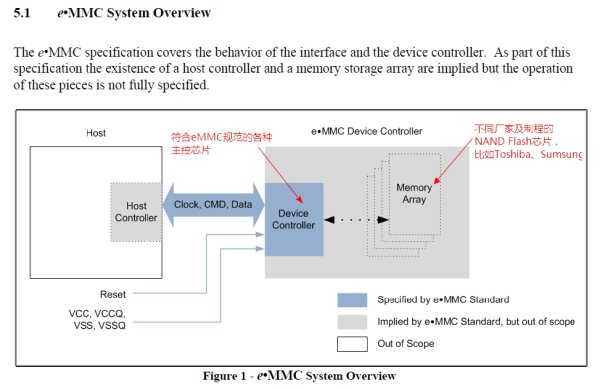

### NAND与NOR对比

#### 一、NAND与NOR的区别

**一般来说，快闪记忆体可分为两大规格，一个是NAND, 一个是NOR。**简单来说，NAND一般以存储数据为主，晶片容量大，容量可以达到2Gb甚至更大，==NAND的读取是以一次读取一块的形式来进行的，通常一次读取512个字节，采用这种技术的Flash比较廉价==；NOR一般以存储程序代码为主，又称为Code Flash，所以可让微处理器直接读取，但晶片容量较低，主流容量512Mb，==NOR采用内存的随机读取技术==。如果利用闪存只是用来存储少量的代码，这是NOR Flash更合适一些。用户不能直接运行NAND Flash上的代码，因此很多使用NAND Flash的Demo Board除了使用NAND Flash以外，**还加上一块小的NOR Flash来运行启动代码。**

#### 二、闪存（flash）

 **FLASH存储器又称闪存，它结合了ROM和RAM的长处，不仅具备电子可擦除可编程（EEPROM）的性能，还不会断电丢失数据同时可以快速读取数据（NVRAM的优势）**，U盘和MP3里用的就是这种存储器。在过去的20年里，嵌入式系统一直使用ROM（EPROM）作为它们的存储设备，然而**近年来Flash全面代替了ROM（EPROM）在嵌入式系统中的地位，用作存储Bootloader以及操作系统或者程序代码或者直接当硬盘使用（U盘）。** 

闪存是一种非易失性（ Non-Volatile ）内存，在没有电流供应的条件下也能够长久地保持数据，其存储特性相当于硬盘，这项特性正是闪存得以成为各类便携型数字设备的存储介质的基础。

闪存的存储单元为三端器件，与场效应管有相同的名称：源极、漏极和栅极。栅极与硅衬底之间有二氧化硅绝缘层，用来保护浮置栅极中的电荷不会泄漏。采用这种结构，使得存储单元具有了电荷保持能力，就像是装进瓶子里的水，当你倒入水后，水位就一直保持在那里，直到你再次倒入或倒出，所以闪存具有记忆能力。

==目前Flash主要有两种NOR Flash和NADN Flash:==

  ==NOR Flash的读取和我们常见的SDRAM的读取是一样，用户可以直接运行装载在NOR FLASH里面的代码，这样可以减少SRAM的容量从而节约了成本。==

  **NAND Flash没有采取内存的随机读取技术，它的读取是以一次读取一块的形式来进行的，通常是一次读取512个字节，采用这种技术的Flash比较廉价**。用户不能直接运行NAND Flash上的代码，因此好多使用NAND Flash的开发板除了使用NAND Flah以外，还作上了一块小的NOR Flash来运行启动代码。 

  一般小容量的用NOR Flash，因为其读取速度快，多用来存储操作系统等重要信息，而大容量的用NAND FLASH，最常见的NAND FLASH应用是嵌入式系统采用的DOC（Disk On Chip）和我们通常用的'闪盘'，可以在线擦除。目前市面上的FLASH 主要来自Intel，AMD，Fujitsu和Toshiba，而生产NAND Flash的主要厂家有Samsung和Toshiba。 

#### 三、内存(RAM或ROM)

1）ROM是Read Only Memory的缩写

>   是一种半导体内存，其特性是一旦储存资料就无法再将之改变或删除。通常用在不需经常变更资料的电子或电脑系统中，资料并且不会因为电源关闭而消失。
>
>   只能读出事先所存数据的固态半导体存储器。英文简称ROM。ROM所存数据，一般是装入整机前事先写好的，整机工作过程中只能读出，而不像随机存储器那样能快速地、方便地加以改写。ROM所存数据稳定 ，断电后所存数据也不会改变；其结构较简单，读出较方便，因而常用于存储各种固定程序和数据。除少数品种的只读存储器（如字符发生器）可以通用之外，不同用户所需只读存储器的内容不同。
>
>   为便于使 用和大批 量 生产 ，进一步发展了可编程只读存储器（PROM）、可擦可编程序只读存储器（EPROM）和电可擦可编程只读存储器（EEPROM）。EPROM需用紫外光长时间照射才能擦除，使用很不方便。20世纪 80 年代制出的 EEPROM ，克服了EPROM的不足，但集成度不高 ，价格较贵。于是又开发出一种新型的存储单元结构同 EPROM 相似的快闪存储器 。其集成度高、功耗低 、体积小 ，又能在线快速擦除 ，因而获得飞速发展，并有可能取代现行的硬盘和软盘而成为主要的大容量存储媒体。大部分只读存储器用金属-氧化物-半导体（MOS）场效应管制成。

2）RAM是Random Access Memory的缩写。

>   又称为随机存取存储器；存储单元的内容可按需随意取出或存入，且存取的速度与存储单元的位置无关的存储器。这种存储器在断电时将丢失其存储内容，故主要用于存储短时间使用的程序。
>
>   简单地说，在计算机中，RAM 、ROM都是数据存储器。RAM 是随机存取存储器，它的特点是易挥发性，即掉电失忆。ROM 通常指固化存储器(一次写入，反复读取)，它的特点与RAM 相反。ROM又分一次性固化、光擦除和电擦除重写两种类型。   
>
>   ROM在系统停止供电的时候仍然可以保持数据，而RAM通常都是在掉电之后就丢失数据，典型的RAM就是计算机的内存。 
>
> RAM分为两大类：
>
> 1）一种称为静态RAM（Static RAM/SRAM），SRAM速度非常快，是目前读写最快的存储设备了，但是它也非常昂贵，所以只在要求很苛刻的地方使用，譬如CPU的一级缓冲，二级缓冲。
>
> 2）另一种称为动态RAM（Dynamic RAM/DRAM），DRAM保留数据的时间很短，速度也比SRAM慢，不过它还是比任何的ROM都要快，但从价格上来说DRAM相比SRAM要便宜很多，计算机内存就是DRAM的。 
>
>    DRAM分为很多种，常见的主要有FPRAM/FastPage、EDORAM、SDRAM、DDR RAM、RDRAM、SGRAM以及WRAM等，这里介绍其中的一种DDR RAM。
>
>    DDR RAM（Date-Rate RAM）也称作DDR SDRAM，这种改进型的RAM和SDRAM是基本一样的，不同之处在于它可以在一个时钟读写两次数据，这样就使得数据传输速度加倍了。这是目前电脑中用得最多的内存，而且它有着成本优势，事实上击败了Intel的另外一种内存标准－Rambus DRAM。在很多高端的显卡上，也配备了高速DDR RAM来提高带宽，这可以大幅度提高3D加速卡的像素渲染能力。

### SRAM和DRAM的区别

**静态随机存取存储器**（**S**tatic **R**andom-**A**ccess **M**emory，**SRAM**）是[随机存取存储器](https://baike.baidu.com/item/随机存取存储器/4099402)的一种。所谓的“静态”，是指这种存储器只要保持[通电](https://baike.baidu.com/item/通电/6798720)，里面储存的数据就可以恒常保持。相对之下，[动态随机存取存储器](https://baike.baidu.com/item/动态随机存取存储器/12717044)（DRAM）里面所储存的数据就需要周期性地更新。==然而，当电力供应停止时，SRAM储存的数据还是会消失（被称为volatile memory），这与在断电后还能储存资料的[ROM](https://baike.baidu.com/item/ROM)或[闪存](https://baike.baidu.com/item/闪存/108500)是不同的。==

**动态随机存取存储器**（**Dynamic Random Access Memory**，**DRAM**）是一种[半导体](https://baike.baidu.com/item/半导体)[存储器](https://baike.baidu.com/item/存储器)，主要的作用原理是利用[电容](https://baike.baidu.com/item/电容/12031635)内存储[电荷](https://baike.baidu.com/item/电荷)的多寡来代表一个[二进制](https://baike.baidu.com/item/二进制)[比特](https://baike.baidu.com/item/比特)（bit）是1还是0。由于在现实中[晶体管](https://baike.baidu.com/item/晶体管/569042)会有漏电电流的现象，导致电容上所存储的电荷数量并不足以正确的判别数据，而导致数据毁损。==因此对于DRAM来说，周期性地充电是一个无可避免的要件。由于这种需要定时刷新的特性，因此被称为“动态”存储器。==相对来说，静态存储器（[SRAM](https://baike.baidu.com/item/SRAM/7705927)）只要存入数据后，纵使不刷新也不会丢失记忆。

SRAM和DRAM都是RAM, 中文名叫**随机存储器**

> 随机是什么意思呢？ 意思是， 给定一个地址， 可以立即访问到数据（访问时间和位置无关）， 而不像咱们熟悉的磁带， 知道最后一首歌在最后的位置， 却没法直接一下子跳到磁带的最后部门， 所以磁带不是随机存储器， 而是顺序存储器。

来看看SRAM的电路：

> 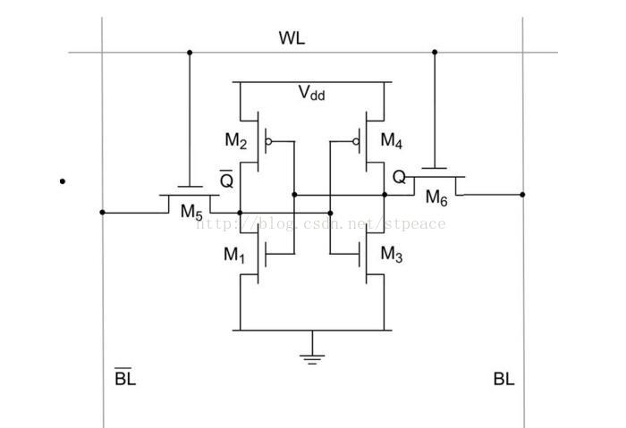

> 上面是能保存SRAM的一个bit，你看看， 这东东， 保存一个bit需要6个晶体管， 所以贵， 造价高啊。 SRAM一般只有几个MB而已， 再多了就不划算， 因为贵！ 从电路图可以看出， 基本都是一些晶体管运算， 速度很快， 所以SRAM一般用来做高速缓存存储器， 既可以放在cpu芯片上， 也可以放在片下。 SRAM中的S是static的意思。

造价这么高， 难道就不能改进吗？ 再看看DRAM电路图：

> 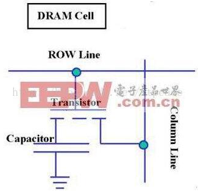

可以看到， 存储一个bit的DRAM只需要一个电容和一个晶体管。 DRAM的数据实际上是存在于电容里面的， 电容会有电的泄露， 损失状态， 故需要对电容状态进行保持和刷新处理， 以维持持久状态， 而这是需要时间的， 所以就慢了。 这个刷新加动态刷新， 而DRAM中的D就是dynamic的意思。

**DRAM比SRAM要慢， 但造价更低， 容量也比SRAM大得多， 在计算机中主要用来做内存， 物尽其用。理解了结构， 就能理解性质， 然后就决定了用途。**

### ROM、RAM、DRAM、SRAM、FLASH的区别

ROM与RAM

- 

SRAM与DRAM

- 

ROM

- 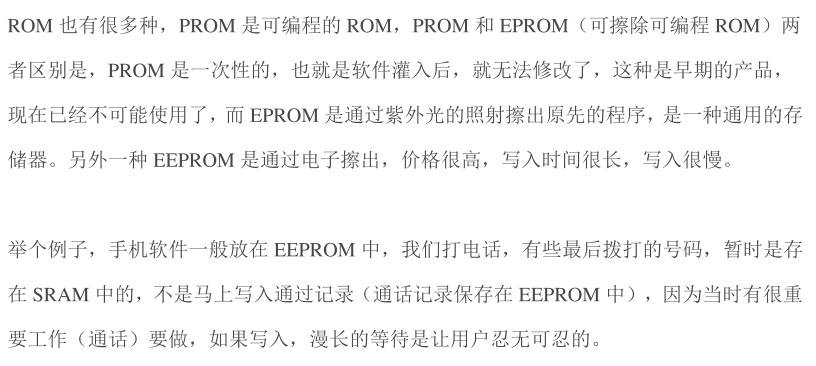

FLASH

- 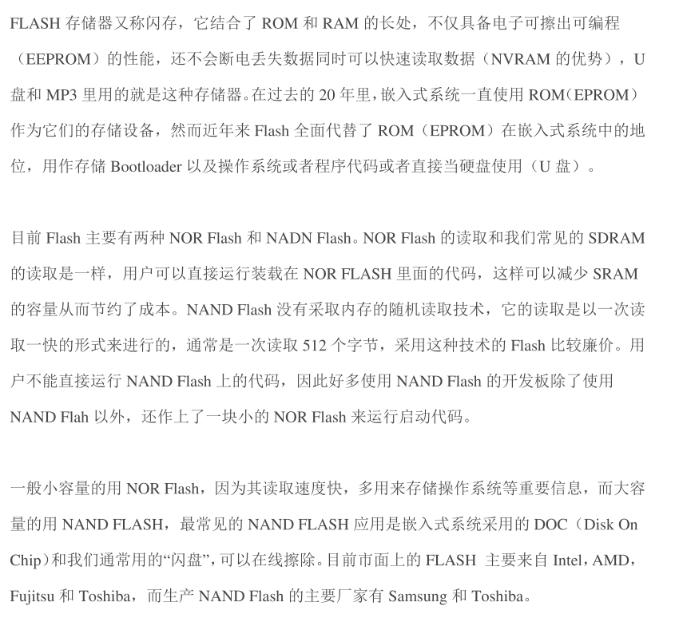

### 内存与闪存区别

**1、性质不同**

- 闪存，一种电子式可清除程序化只读存储器的形式，允许在操作中被多次擦或写的存储器。

- 内存为计算机中重要的部件之一，它是外存与CPU进行沟通的桥梁。计算机中所有程序的运行都是在内存中进行的，因此内存的性能对计算机的影响非常大。

**2、作用不同**

- 内存（Memory)也被称为内存储器和主存储器，用于暂时存放CPU中的运算数据，以及与硬盘等外部存储器交换的数据。只要计算机在运行中，CPU就会把需要运算的数据调到内存中进行运算，当运算完成后CPU再将结果传送出来，内存的运行也决定了计算机的稳定运行。

- 闪存主要用于一般性数据存储，以及在计算机与其他数字产品间交换传输数据，如储存卡与U盘。闪存是一种特殊的、以宏块抹写的EPROM。

**3、特点不同**

- 内存一般采用半导体存储单元，包括随机存储器（RAM），只读存储器（ROM），以及高速缓存（CACHE）。只不过因为RAM是其中最重要的存储器。（synchronous）SDRAM同步动态随机存取存储器：SDRAM为168脚，这是目前PENTIUM及以上机型使用的内存。

- SDRAM将CPU与RAM通过一个相同的时钟锁在一起，使CPU和RAM能够共享一个时钟周期，以相同的速度同步工作，每一个时钟脉冲的上升沿便开始传递数据，速度比EDO内存提高50%。

- DDR（DOUBLE DATA RATE）RAM：SDRAM的更新换代产品，他允许在时钟脉冲的上升沿和下降沿传输数据，这样不需要提高时钟的频率就能加倍提高SDRAM的速度。

- 闪存盘可用来在电脑之间交换数据。从容量上讲，闪存盘的容量从16MB到64GB可选，突破了软驱1.44MB的局限性。从读写速度上讲，闪存盘采用USB接口，读写速度比软盘高许多。从稳定性上讲，闪存盘没有机械读写装置，避免了移动硬盘容易碰伤、跌落等原因造成的损坏。

### 机械硬盘

机械硬盘是磁性原理存储的，不属于RAM或ROM。

- 广泛应用的机械型硬盘的使用寿命与读写次数和读写速度关系非常大，而闪存受影响不大。

- 机械硬盘的写入是靠磁性来写入，闪存则采用电压，数据不会因为时间而消除。

## 元器件选型 - 图片

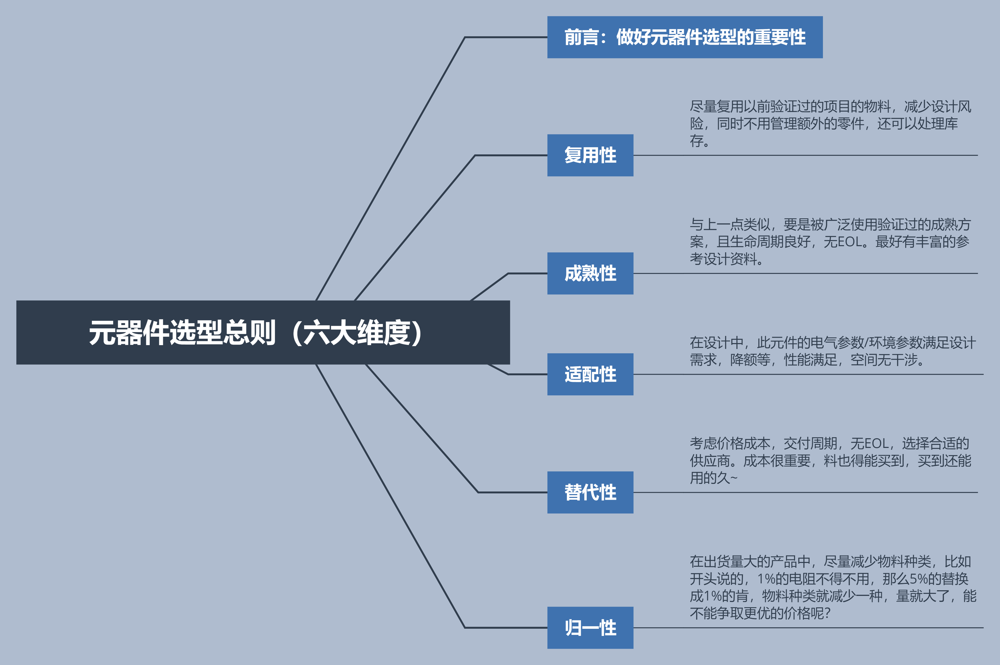

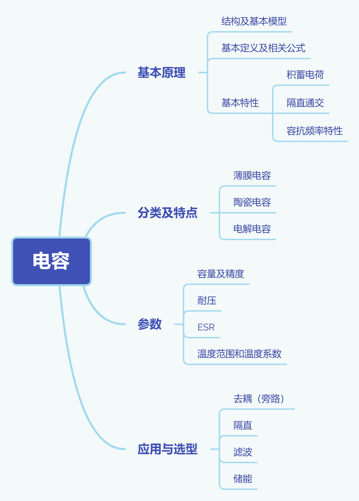

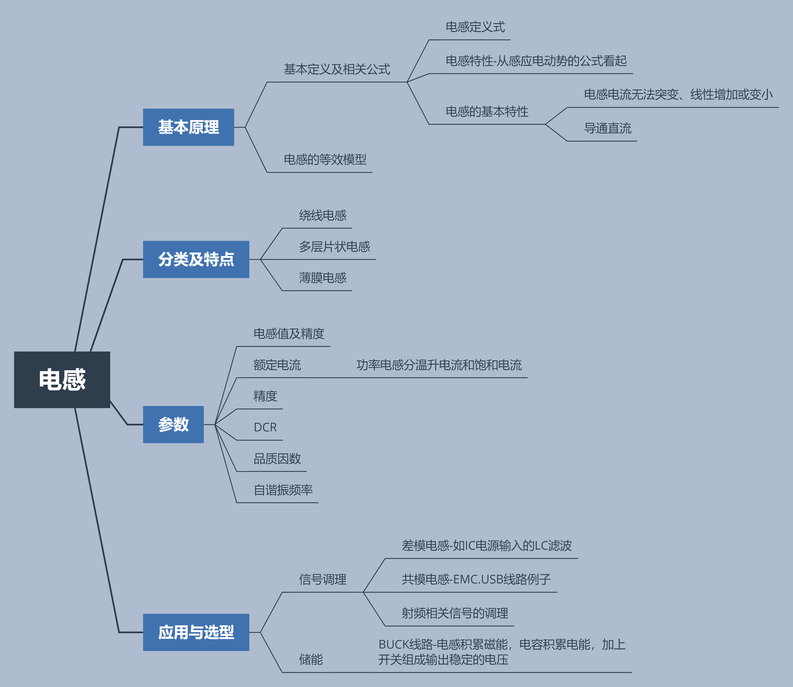

## Sensor 传感器

**先区分 SOC 和 MCU：**

**MCU**：Micro Control Unit，微控制单元，如 STM32 单片机。

**SOC**：System on Chip，芯片上可以跑 Linux、Android 等系统。

**Sensorhub**：智能传感集线器，是一种基于低功耗 MCU 和轻量级 RTOS 操作系统之上的软硬件结合的解决方案，其主要功能是连接并处理来自各种传感器设备的数据。诞生之初的目的主要是为了解决在移动设备端的功耗问题。比如希望手机主控休眠的时候，依旧可以获取数据，MCU 的耗电比 SOC 小多了。

1. 在 CPU 休眠的情况下，实现对传感器的实时控制，从而达到降低功耗的功能。
2. 将不同类型 Sensor 的数据进行融合，实现多种 sensor 数据结合才能实现的功能。

多种物理 sensor 的数据，可以根据需要，拆解或融合成虚拟 sensor，来满足功能需求。

**Sensor Hub 可以执行以下操作：**

1. 手势识别：感测人的手势，如：翻转手机，敲打手机，摇晃手机，拿起手机等手势。可实现案例：翻转静音，拒接电话，摇晃切换背景图片以及拿起接听电话等功能。
2. 设备状态识别：感测设备的状态，如：手机面朝上/朝下，手机在桌子上，还是在口袋里，还是在人手里。可实现案例：手机在口袋里时，自动将来电铃声放至最大；而在桌子上的时候，调至静音震动模式。
3. 用户状态识别：感测用户的状态，如：跑步，走路，站立，坐下等。实现功能：在走路/跑步时，自动打开记步功能，而站立和坐下后，暂停相关功能。
4. 用户交通行为判断：感测用户乘坐交通时的状态，如：开车，坐火车，坐电梯等。实现功能：在开车状态，自动蓝牙连接；而在火车上接电话，开启消噪功能。

### 物理传感器

在嵌入式移动设备中，比如智能手机，智能穿戴，家用医疗设备和其他一些智能硬件设备，所用到的物理传感器一般都是 MEMS 传感器即微机电系统（Microelectro Mechanical System）传感器。和传统的传感器相比，MEMS 传感器体积更小，重量轻，成本低，功耗低，可靠性高，易于集成开发等优势。

目前，MEMS传感器主要有加速度计(Accelerometer)，磁力计(Magnetometer)，陀螺仪(Gyroscope)，光感计(Ambient light sensor)，接近光(Proximity)，气压计(Barometer/pressure)，湿度计(Humidometer)等等，按类型可以分为环境类传感器，运动类传感器，健康类传感器。

**1、加速度传感器**

加速计（Accelerometer）也叫重力传感器，是可以感知任意方向上的加速度（重力加速度则只是地表垂直方向加速度），加速计通过测量组件在某个轴向的受力情况来得到结果，表现形式为轴向的加速度大小和方向（X，Y，Z）。其原理是根据传感器内部的振动结构，由于外界加速度会影响到内部结构的振动特性，来测量到物体的加速度。加速度计的用途很多，只要跟智能硬件（比如手机）运动相关的几乎都与加速度计有关（计步、手机的姿态测量、相关的游戏等等） 。

**2、陀螺仪传感器**

陀螺仪，在传感器内部有个三轴的陀螺。陀螺仪的工作原理是通过测量三维坐标系内陀螺转子的垂直轴与设备之间的夹角，然后来计算角速度，从而可以由夹角和角速度来判别物体在三维空间的运动状态。陀螺仪的用途也非常多，比如数码照相防抖，以及配合加速度计（有的还有磁传感器或者GPS等）形成的融合传感器来完成更高级的功能（如惯性导航）。

**3、磁力计传感器**

磁力计（Magnetic）也叫地磁计、磁感器，可用于测试磁场强度和方向，磁力计的原理跟指南针原理类似，可以测量出当前设备与东南西北四个方向上的夹角。

**4、环境光感传感器**

环境光传感器可以感知周围光线强度。例如，在手机、笔记本、平板电脑等移动应用中，可以根据外界的亮度来实现自动调节背光亮度等，从而降低产品的功耗。

**5、接近光传感器**

接近光传感器用于检测红外信号，其主要检测的是外部的红外线LED的信号。这个LED向外发出红外线，当有物体接近传感器的上方时，进入红外线的发射区域，有些红外线会被发射回传感器。现在还有基于激光的接近光传感器，比如ToF sensor等，可以测距范围在2-4米左右。

**6、气压计传感器**

气压计主要是由一个真空盒式气压传感器，靠气压导致真空盒形变，上下两块电容板距离改变，电容改变来测量大气压值。

**7、湿度计传感器**

主要原理是把空气中的温湿度通过一定检测装置，测量到温湿度后，按一定的规律变换成电信号或其他所需形式的信息输出，从而来检测出当时的温度值。

**8、紫外线传感器**

紫外线传感器（UV）是利用光敏元件将紫外线信号转换为电信号的传感器。

**9、PM2.5传感器**

PM2.5激光传感器是一款通用细微颗粒物浓度传感器，采用激光散射原理。即令激光照射在空气中的悬浮颗粒物上产生散射，同时在某一特定角度用探测器接收散射光，产生的光电流经放大后，得到电信号与颗粒物的对应曲线，经过一系列算法得出单位体积内不同粒径的颗粒物质量。从而获得空气中单 位体积内PM2.5的质量数据。PM2.5传感器主要用于嵌入各种细微颗粒物浓度相关的仪器仪表、环境改善设备，如空气净化器。

### 智能传感器硬件框架

根据不同的终端设备和业务场景需求，当前的传感器硬件框架主要可以分为三种，MCU内置型，MCU外置型和MCU独立型。

**1、MCU内置型**

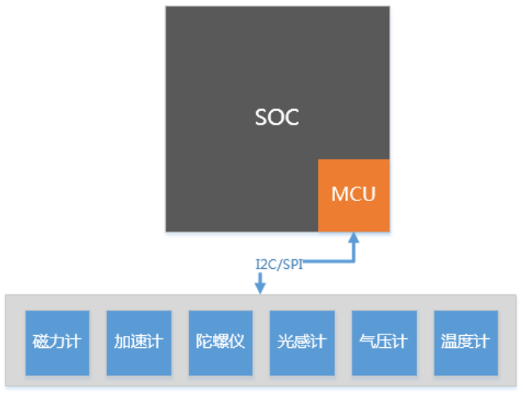

**2、MCU外置型**

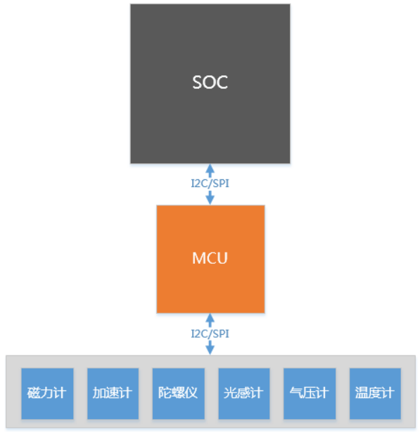

**3、MCU独立型**

这种硬件方案主要是用于各种智能硬件设备，比如智能手环，扫地机器人等等。

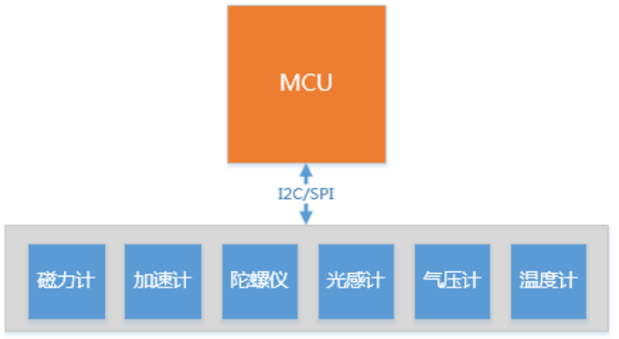

### sensor 供应商

Accelerometer 加速度传感器：主要的供应商有 ST，Bosch，Freescale，ADI，美新等。

Gyro Sensor 角速度传感器：主要的供应商有 Invensesne，ST，Bosch，Panasonic 等。

Geomagnetic 地磁传感器：主要的供应商有 AKM，Yamaha，ST，QST，爱盛等。

Barometer 气压传感器：Bosch，Sensata，Infineon，Denso 等。

**eg：**

指纹识别：AS608、ATK-301

气压计：bosch_bmp180、bmp280、bmp380

温湿度传感器：DHT11

温度传感器：DS18B20

粉尘传感器：GP2Y

红外识别：HC-SR501

磁场传感器：HMC5883L

姿态传感器（六轴）：MPU6050

手势识别：PAJ7620

激光测距：VL53L0X

LDR光敏传感器

三合一光传感器：AP3216C

激光测距：VL53L0X

光流：PMW3901

角度传感器：IMU901

加速度陀螺仪二合一：lsm6dsm、lsm6ds3、lsm6dso、lis2hh12、lis3dh、icm20600、icm20608、icm20645、icm40605、bmi160、bmi2xy

光传感器/接近传感器二合一：vc36658、tmd2750、tcs3701、bu27030、cm36558

磁力计：akm09918、mmc5603

sar 传感器：sx9310、adux1050

一般 sensor 供应商都会提供驱动，大家在 MCU 或 SOC 预留好 I2C 和 SPI 接口即可。

