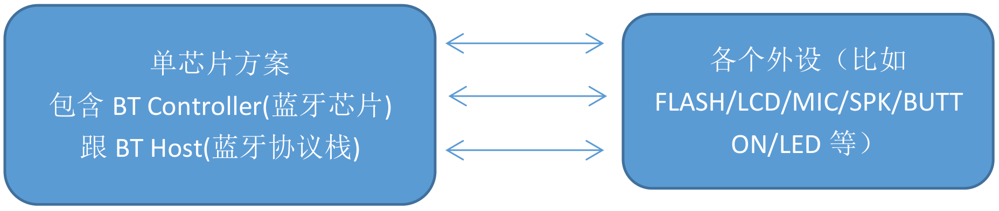
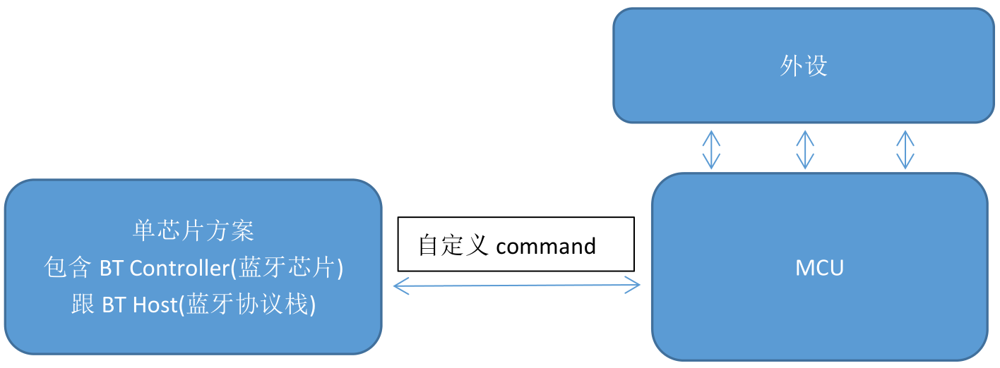
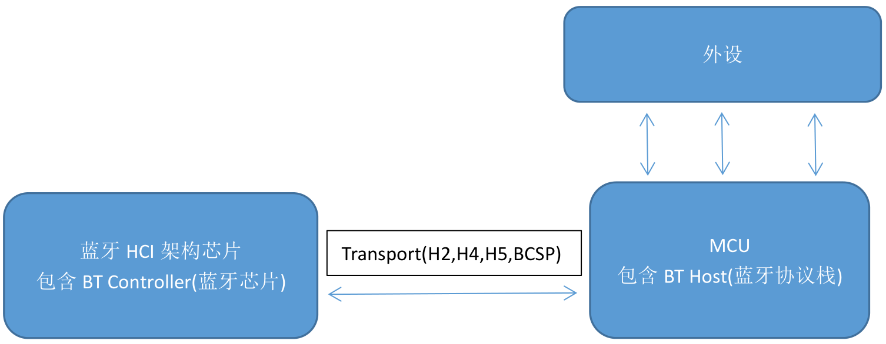
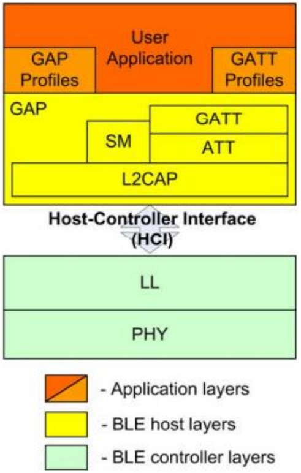

## 蓝牙 - HQ

[TOC]

------

#### 注意

- 

------

## 一文了解蓝牙 - 摘录

https://blog.csdn.net/qq_38769551/article/details/124369822

### 1、蓝牙概念

蓝牙，是一种支持设备短距离通信（一般 10m 内）的无线电技术，能在包括移动电话、PDA、无线耳机、笔记本电脑、相关外设等众多设备之间进行无线信息交换。优点是方便快捷、灵活安全、低成本、低功耗的数据通信和语音通信。

### 2、背景

1998 年 5 月，爱立信、诺基亚、东芝、 IBM 和英特尔公司等五家著名厂商， 在联合开展短程无线通信技术的标准化活动时提出了蓝牙技术，其宗旨是提供一种短距离、低成本的无线传输应用技术。

蓝牙名字的由来： “蓝牙” 这名称来自 10 世纪的丹麦国王哈拉尔德的外号。出身海盗家庭的哈拉尔德统一了北欧四分五裂的国家，成为维京王国的国王。由于他喜欢吃蓝莓，牙齿常常被染成蓝色，而获得“蓝牙”的绰号，当时蓝莓因为颜色怪异的缘故被认为是不适合食用的东西，因此这位爱尝新的国王也成为创新与勇于尝试的象征。1998 年，爱立信公司希望无线通信技术能统一标准而取名“蓝牙” 。

应用领域：手机、游戏、耳机、便捷式电能、汽车、物联网、医疗等。市场对低功耗的要求越来越高。蓝牙 4.0 协议版本是蓝牙 3.0 高速版本基础上增加了低能消耗协议部分。

### 3、发展历程

1999 年：蓝牙 1.0

2001 年：蓝牙 1.1，传输率0.7Mbps

2003 年：蓝牙 1.2

2004 年：蓝牙 2.0，传输率3Mbps

2007 年：蓝牙 2.1

2009 年：蓝牙 3.0，传输率24Mbps

2010 年：蓝牙 4.0，推出低功耗模式，传输距离100米

2013 年：蓝牙 4.1

2014 年：蓝牙 4.2

2016 年：蓝牙 5.0，传输距离300米

2019 年 1 月：蓝牙 5.1

2019 年 12 月 31：蓝牙 5.2

### 4、市面蓝牙介绍

#### 1）SOC 蓝牙

一般是半导体厂商半开源协议栈，基于特定的编译器，把蓝牙协议栈直接烧写到蓝牙芯片中（比如 CSR BC4/5,CSR8670,CSR8675,TI CC2540，NRF51xxx,NRF52xxx，乐鑫 ESP32 等等），架构如下：

此类芯片一般可以直接做为 MCU 用，这类产品一般用于消费类电子，集成度很高，调调部参数可以直接使用，常见的有蓝牙耳机，一般蓝牙耳机之前 CSR 的芯片（CSRBC5/8670/8675）占很大的份额，现在 CSR 被高通并掉后，出来 QCC3，QCC5 系列，现在还有洛达，杰里的低成本方案，在有就是 BLE smart 设备，也有特有的方案

#### 2）SOC 蓝牙 + MCU 方案

在 1）的基础上，通过特定的 interface(UART 居多)，发送自定义的 command 来达到想要的功能，比如发送 0x01 代表搜索周围设备，当然在产品中肯定不会定义这么简单的command，一般要加上 command id + command len + command para data + command checksum 来实现功能，架构如下：

此部分的应用一般用于外设功能相对于复杂，需要驱动很多外设，但是单芯片方案的性能达不到的情况下一般用这种方案。

#### 3）蓝牙 host + controller 分开方案

这种应用算是蓝牙最复杂的应用，适用于蓝牙使用情景较复杂的情况下使用，比如车载蓝牙等。客户需要有很多蓝牙协议，比如蓝牙电话（HFP），蓝牙音频（A2DP），蓝牙音乐控制（AVRCP），蓝牙电话本（PBAP），蓝牙短信（MAP），BLE,HID，如果你说以上还能用 soc做，那么再加上 Carplay 的 IAP/IAP2，Android Auto 的 RFCOMM BT 呢，基本以上就需要这种方案了。

其中 Transport 是一个协议，H2 就是在 USB 的基础上的协议，H4,H5,BCSP 是 UART 基础上的协议，当然还有 SDIO。

### 5、蓝牙协议组成

蓝牙协议由 HOST 层和 CONTROLLER 层组成

#### CONTROLLER 控制器层

1. PHY：基带物理层
2. LL：链路层
3. HCI：主机控制接口

#### HOST 主机层

1. L2CAP：逻辑链路控制和适配器
2. ATT：属性协议
3. GATT：属性协议配置规范
4. SM：安全管理
5. GAP：通用访问规范

再往上层就是应用层，不属于协议层。

大多数的蓝牙从业者，一般都在 HOST 层或者应用层，controller 层比较少。

### 6、学习建议

对于传统蓝牙，底层到应用层我会给出一个顺序：TRANSPORT->HCI->L2CAP->RFCOMM->SPP,中间再了解点SDP的协议

对于传统蓝牙，应用层到底层我会给出一个顺序：SPP->RFOMM->L2CAP->HCI->TRANSPORT,中间再了解点SDP的协议

对于低功耗蓝牙，底层到应用层我会给出一个顺序：TRANSPORT->HCI->L2CAP->ATT->GATT->BAS,中间再了解点SM的协议

对于低功耗蓝牙，应用层到底层我会给出一个顺序：BAS->GATT->ATT->L2CAP->HCI->TRANSPORT,中间再了解点SM的协议

这是跨越层数最少，并且能上下打通的顺序！至于是从底层研究还是从应用层开始研究，这个因人而异，如果你想快速能看到效果，那么我建议你从应用层开始修修改改搞起来，如果底层有不懂的很心虚的，那么我建议你从底层搞起来！

在没有完全研究明白蓝牙协议栈之前，暂时不要碰 Controller 的协议！很难。

