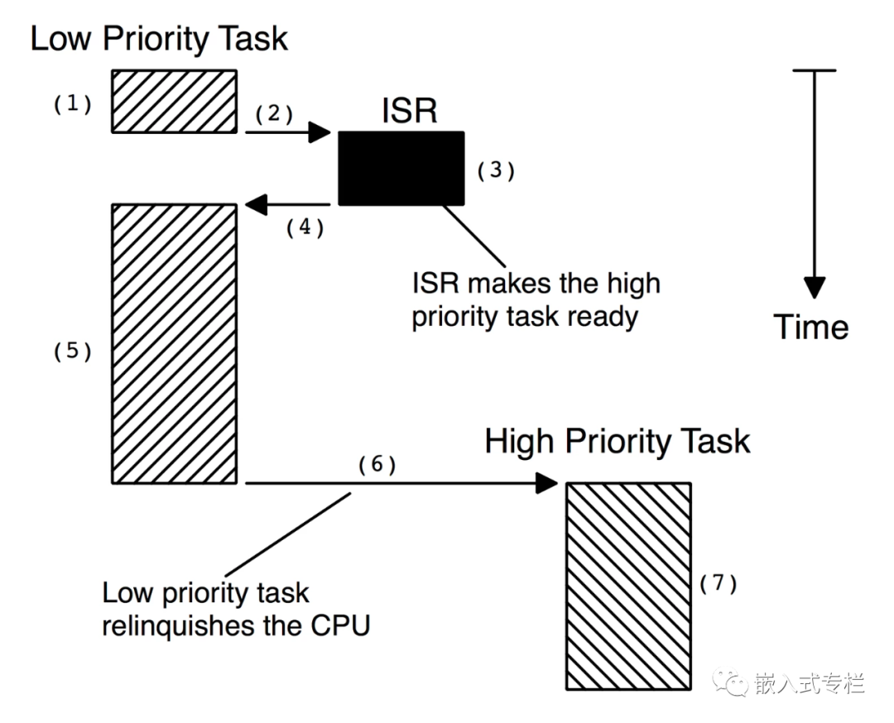
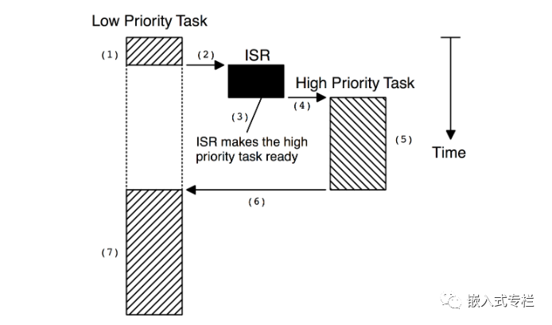

# 操作系统知识汇总整理 - HQ

[TOC]

------

#### 注意

- 

------

## 操作系统抢占、非抢占式内核的区别

https://mp.weixin.qq.com/s/P3seWk5cxtfNq18tET4FrQ

操作系统分为抢占式内核和非抢占式内核，通常[**RTOS**](https://mp.weixin.qq.com/s?__biz=MzI4MDI4MDE5Ng==&mid=2247502058&idx=2&sn=adf2c30eef005c29c51949bb84785e2e&scene=21#wechat_redirect)都是抢占式内核。

下面就来讲讲抢占式内核和非抢占式内核的内容。

### 非抢占式内核

==非抢占式内核要求每个任务（线程）都做一些事情来明确放弃对 CPU 的控制，为了保持多任务并发的错觉，必须要有这一步操作。==

非抢占式调度也称为协作多任务，任务相互协作以共享 CPU，异步事件仍然由 ISR 处理。ISR 可以使更高优先级的任务准备好运行，但 ISR 总是返回到被中断的任务。

**只有当当前任务放弃 CPU 时，新的更高优先级任务才会获得对 CPU 的控制。**

非抢占式内核的优点之一是中断延迟更低，在任务级别，非抢占内核也可以使用不可重入函数。每个任务都可以使用不可重入函数，而不必担心被另一个任务破坏。这是因为每个任务都可以在放弃 CPU 之前运行到完成。但是，不应允许不可重入函数放弃对 CPU 的控制。

**使用非抢占式内核的任务级响应可能比前台/后台系统低得多，因为任务级响应现在由最长任务的时间给出。**

非抢占式内核的另一个优点是较少需要通过使用信号量来保护共享数据。每个任务都拥有 CPU，你不必担心任务会被抢占。当然，这不是绝对的，在某些情况下，仍应使用信号量。共享 I/O 设备可能仍需要使用互斥信号量；例如，任务可能仍需要对打印机的独占访问。

> (1) 任务正在执行但被中断。
>
> (2) 如果中断被使能，CPU 向量（跳转）到 ISR。
>
> (3) ISR 处理事件并使更高优先级的任务准备好运行。
>
> (4) ISR完成后，执行返回指令，CPU返回被中断的任务。
>
> (5) 任务代码在中断指令之后的指令处恢复。
>
> (6) 当任务代码完成时，它调用内核提供的服务，将 CPU 交给另一个任务。
>
> (7) 内核看到更高优先级的任务已经准备好运行，因此，内核执行上下文切换，以便它可以运行（即执行）更高优先级的任务来处理由 ISR 发出信号的事件。

**非抢占式内核最重要的缺点是响应性：**已准备好运行的较高优先级任务可能需要等待很长时间才能运行，因为当前任务应该及时放弃CPU使用权。

与前台/后台系统中的后台执行一样，**非抢占式内核中的任务级响应时间是不确定的；**你永远不知道最高优先级的任务何时才能获得 CPU 的控制权。这个操作由你的应用程序来决定怎么时候放弃对 CPU 的控制。

总而言之，非抢占式内核允许每个任务运行，直到它自愿放弃对 CPU 的控制。中断抢占任务，ISR 完成后，ISR 返回到被中断的任务。任务级响应比前台/后台系统要好得多，但仍然是不确定的，因此，很少有商业内核是非抢占式的。

### 抢占式内核

μC/OS、RTT等大多数实时内核都是抢占式的，准备运行的最高优先级任务始终被赋予 CPU 控制权。

**当一个任务使更高优先级的任务准备好运行时，当前任务被抢占（挂起）并且更高优先级的任务立即获得 CPU 的控制权。**

如果 ISR 使更高优先级的任务准备就绪，当 ISR 完成时，被中断的任务被挂起并恢复新的更高优先级任务。

> (1) 任务正在执行但被中断。
>
> (2) 如果中断被使能，CPU 向量（跳转）到 ISR。
>
> (3) ISR 处理事件并使更高优先级的任务准备好运行。ISR 完成后，调用内核提供的服务（即调用内核提供的函数）。
>
> (4) & (5) 该函数知道一个更重要的任务已经准备好运行，因此内核将执行上下文切换并执行更重要的代码而不是返回到被中断的任务任务。当更重要的任务完成时，内核提供的另一个函数被调用，让任务进入休眠状态，等待事件（即 ISR）发生。
>
> (6) & (7) 然后内核“看到”需要执行一个较低优先级的任务，并完成另一个上下文切换以恢复被中断任务的执行。

**使用抢占式内核，最高优先级任务的执行是确定性的**；你可以确定它何时可以控制 CPU。因此，通过使用抢占式内核可以最大限度地减少任务级响应时间。

**使用抢占式内核的应用程序代码不应使用不可重入函数**，除非通过使用互斥信号量确保对这些函数的独占访问，因为低优先级和高优先级任务都可以使用公共函数。如果较高优先级的任务抢占正在使用该功能的较低优先级的任务，则可能会发生数据损坏。

总而言之，抢占式内核始终执行准备运行的最高优先级任务。中断抢占任务，完成 ISR 后，内核将继续执行准备运行的最高优先级任务（而不是被中断的任务）。任务级别的响应是最佳的和确定性的，当系统响应性很重要时，建议使用抢占式内核。

