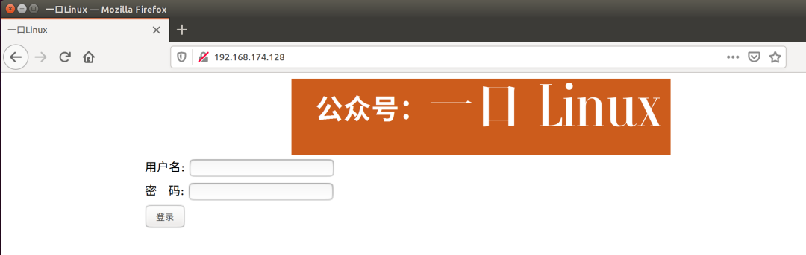
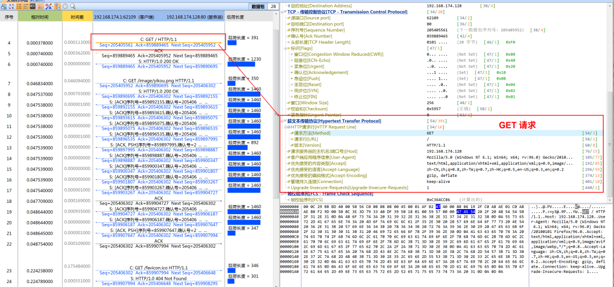
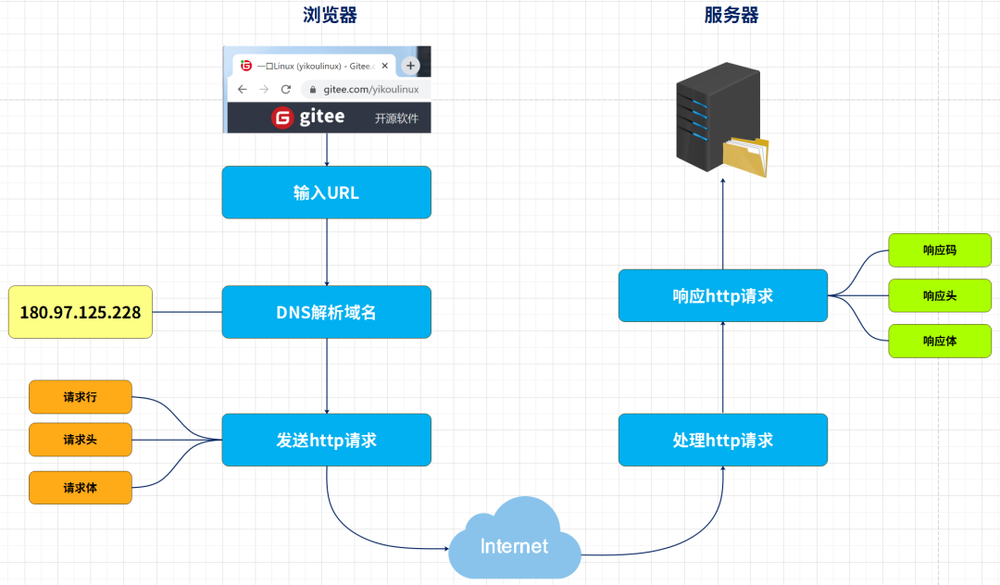
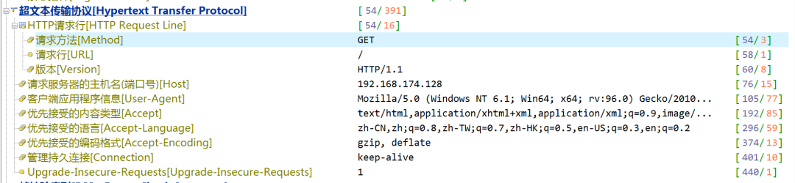

# HTTP & HTTPS协议详解 - HQ

[TOC]

------

#### 注意

- 

------

## Http协议入门 - 一口Linux

https://mp.weixin.qq.com/s/L-KFCE5ny2JjiV3HYVheQw

阅读本文之前，请详细阅读以下几篇文章：

《[一文包你学会网络数据抓包](https://mp.weixin.qq.com/s?__biz=MzUxMjEyNDgyNw==&mid=2247490595&idx=1&sn=11fb56cb4d18da0c3da5cad1cded52b5&chksm=f9686ed7ce1fe7c1de117abf6d3b09ba85b76da3855b5676b65b9f2fd14de807607a1dabf3a2&scene=21&token=1286926452&lang=zh_CN#wechat_redirect)》

《[教你如何抓取网络中的数据包！黑客必备技能](https://mp.weixin.qq.com/s?__biz=MzUxMjEyNDgyNw==&mid=2247491157&idx=1&sn=7c78bb12094fa7415e6fdc56b7cadb77&chksm=f9686ca1ce1fe5b784d65de153901a317e6b97c3043f88e74a2f2e5186d42520207da3e3f4f0&scene=21&token=1286926452&lang=zh_CN#wechat_redirect)》

### 一、什么是http？

Http协议即超文本传送协议 (HTTP-Hypertext transfer protocol) 。

它定义了浏览器（即万维网客户进程）怎样向万维网服务器请求万维网文档，以及服务器怎样把文档传送给浏览器。从层次的角度看，HTTP是面向（transaction-oriented)应用层协议，它是万维网上能够可靠地交换文件（包括文本、声音、图像等各种多媒体文件）的重要基础。并且详细的规定了客户端浏览器与服务器之间互相通信的规则。


### 二、抓包

下面是一口君抓取的访问自己搭建的web服务器交互的所有数据包。以下是浏览器显示信息：以下是实际 index.html内容

```
<!DOCTYPE html PUBLIC "-//W3C//DTD XHTML 1.0 Transitional//EN" >
<html xmlns="http://www.w3.org/1999/xhtml">
<head>
<meta http-equiv="Content-Type" content="text/html; charset=utf-8" />
<title>一口Linux</title>
</head>
<body  >
<div align="center">
 <table width="900" border="0">
   <tr><td>
    <form  onsubmit="return isValidate(myform)" action="cgi-bin/login.cgi" method="post">
  用户名: <input type="text" name="username" id="username" > 
  <td>&nbsp;</td>
    <tr><td>
  密  &nbsp;&nbsp;码: <input type="password" name="userpass" id="userpass"> 
   <td>&nbsp;</td>
    <tr><td>
  <input type="submit" value="登录" id="button"  >
   </form>

   </td></tr>
 </table>
</div>

   <div align="center">
    <table width="900" height="467" border="0" background="./image/yikou.png">
      <tr>
        <td width="126" height="948">&nbsp;</td>
        <td width="351"></td>
        <td width="101">&nbsp;</td>
      </tr>  
  </div>
</body>
</html>
```

下面是用抓包工具抓取的所有HTTP数据包：

浏览器发送的GET请求数据包：服务器回复的页面对应的数据包：

#### 完整的浏览访问服务器数据包交互流程如下：

数据包交互流程，简单总如下：

1. 浏览器会向web服务器发起tcp 3次握手，（http是基于tcp，上图数据包1-3）
2. 浏览器会根据网址栏输入的url，通过DNS协议查找该domain对应的IP地址（如果url中直接给出IP地址，则省略该步骤）
3. 浏览器发送HTTP协议的GET请求，web服务器会回复对应的页面（没有指定的话，一般由配置文件指定默认文件比如index.html，见数据包4-6）
4. 因为页面有图片信息，浏览器再请求获取对应的图片文件（见数据包7-24）
5. 最后会关闭tcp连接，执行4握手（见数据包25-28）

### 三、页面交互流程

下面我们来看一下，从网页输入URL到加载，http究竟做了哪些工作？

浏览器负责发起请求和最后的响应请求，服务器接收请求后，处理请求。

1、输入URL。

不管是链接还是地址栏的输入，情况都是一样的。http协议已经规定了URL的格式，通过http协议中的域名或IP找到服务器。

2、找到服务器的同时，会有http的请求发送过来，告诉服务器我求你做什么？http协议规定了发送请求的格式，这个格式有三部分组成**请求行、请求头、请求体**。

请求行包括请求的方式（get、post或其他）、要求响应的文件、http版本。请求头包括本机信息、浏览器信息等等，当然，也包括URL中？后面的参数。

请求体包括POST传递数据的相关信息，Get方式传值时，请求体为空。

3、请求信息发送至服务器以后，服务器会获取传递过来的相关信息进行后端程序的处理。服务器可以通过数据包中信息获取URL传递过来的值，通过form(表单)获取POST传递过来的值，当然，也是可以获取到所有的其他请求过来的信息，如浏览器信息、cookie信息、操作系统信息等。获取相关的数据以后，服务器就会根据程序进行处理。

4、处理完成以后，服务器会做出响应，向浏览器输出相关信息。http对响应的格式也做出了规定，响应的信息主要包括，**响应码、响应头、响应体**。

响应码用来标识服务器响应的结果，如我们常看到的200、404等。大致的分类如下：

```
1开头的表示消息，
2开头表示成功，
3开头表示重定向，
4开头表示失败，
5开头表示服务器异常。
```

响应头记录服务器相关信息如服务器是否启用压缩、服务器为IIS或Ngnix、程序所用服务端语言等等。当然，缓存也是在这里设置的，通过修改响应头可以修改html在本地缓存的情况，如设置浏览器缓存过期的时间。

响应体主要是我看到的html的相关内容了。

完成以上4步操作以后，浏览器就断开了与服务器的数据连接，不能在进行数据传输，如果需要再次进行数据传输，那么一切就要从输入URL开始。

如此，便是一个完整的网页流程，http从中的作用就是对整个流程进行规定，包括执行步骤，每一步的数据格式。只有了解http协议以及网页是如何产生的以后，才能对网页进行更好的控制，例如控制浏览器缓存、通过非浏览器发送http请求、get和post传值的选择，甚至是建立长连接，这些都是以http协议为基础。

### 四、补充

#### 1. http主要方法


> 1.0 版本和 1.1 版本的描述分别基于 RFC1945 和 RFC2616 除了上图中的内容之外， HTTP 消息中还有一些用来表示附加信息的 头字段。客户端向 Web 服务器发送数据时， 会先发送头字段， 然后再发送 数据。

#### 2. 状态码

收到请求消息之后， Web 服务器会对其中的内容进行解析， 通过 URI和方法来判断“对什么”“进行怎样的操作”， 并根据这些要求来完成自己的工作， 然后将结果存放在响应消息中。在响应消息的开头有一个状态码，它用来表示操作的执行结果是成功还是发生了错误。

当我们访问 Web 服务器时， 遇到找不到的文件就会显示出 404 Not Found 的错误信息， 其实这就是状态码。状态码后面就是头字段和网页数据。响应消息会被发送回客户端， 客户端收到之后， 浏览器会从消息中读出所需的数据并显示在屏幕上。到这里， HTTP 的整个工作就完成了。

HTTP 状态码由三个十进制数字组成，第一个十进制数字定义了状态码的类型。

响应分为五类：`信息响应(100–199)，成功响应(200–299)，重定向(300–399)，客户端错误(400–499)和服务器错误 (500–599)`：

HTTP状态码列表:


## HTTP协议详解 - 摘自博客

摘自文章 https://www.cnblogs.com/xietianjiao/p/13255099.html

### 一、http协议的特性

http协议是==建立在TCP/IP协议之上应用层协议==，默认端口为80,8080

==http协议的的特点是无状态，无连接==


### 二、http协议的请求

利用抓包工具httpwatch可以获取报文

http协议的报文传输的是ASCII码，在TCP/IP协议之上，主要主要分为三部分

**请求行、请求头、请求体**

#### 请求行

第一行，包含三个信息：请求方式，url，http协议版本

GET 请求

```http
 GET /books/?sex=man&name=Professional HTTP/1.1
 Host: www.example.com
 User-Agent: Mozilla/5.0 (Windows; U; Windows NT 5.1; en-US; rv:1.7.6)
 Gecko/20050225 Firefox/1.0.1
 Connection: Keep-Alive
```

POST 请求

```http
 POST / HTTP/1.1
 Host: www.example.com
 User-Agent: Mozilla/5.0 (Windows; U; Windows NT 5.1; en-US; rv:1.7.6)
 Gecko/20050225 Firefox/1.0.1
 Content-Type: application/x-www-form-urlencoded
 Content-Length: 40
 Connection: Keep-Alive

 sex=man&name=Professional 
```

**区别：**

1、url可见性：

get，参数url可见；

post，url参数不可见 

2、数据传输上：

get，通过拼接url进行传递参数；

post，通过body体传输参数

3、缓存性：

get请求是可以缓存的

post请求不可以缓存

4、后退页面的反应

get请求页面后退时，不产生影响

post请求页面后退时，会重新提交请求

5、传输数据的大小

get一般传输数据大小不超过2k-4k（根据浏览器不同，限制不一样，但相差不大）

post请求传输数据的大小根据php.ini 配置文件设定，也可以无限大。

6、安全性

这个也是最不好分析的，原则上post肯定要比get安全，毕竟传输参数时url不可见，但也挡不住部分人闲的没事在那抓包玩。安全性个人觉得是没多大区别的，防君子不防小人就是这个道理。对传递的参数进行加密，其实都一样。

**本质区别：**

GET产生一个TCP数据包；POST产生两个TCP数据包。

对于GET方式的请求，浏览器会把http header和data一并发送出去，服务器响应200（返回数据）；

而对于POST，浏览器先发送header，服务器响应100 continue，浏览器再发送data，服务器响应200 ok（返回数据）。


### 请求头

浏览器向服务器发送一些状态数据，标识数据等等

一个信息一行，包括信息名：信息值 按行分隔

```http
User-Agent: firefox//表示发送请求的浏览器（请求代理端）是firefox
Host: shop.100.com//表示请求的主机域名（基于域名的虚拟主机就是靠这个头判断的）
Cookie:name=itcast//浏览器携带的cookie数据。
Content-Type: application/x-www-form-urlencoded
Content-Length: 40
Connection: Keep-Alive
```

```http

```

注意，请求头信息，需要使用一个空行结束！


### 请求主体

请求代理端项服务器端，发送的请求数据！

典型的就是POST形式发送的表单数据！

get请求，没有请求主体部分！get数据是在请求行中的url上进行传递的！


###  三、http协议的响应

**响应包括：响应行、响应头、响应体**

```http
HTTP/1.1 200 0K
Date: Tue，19 Nov 2013 03:08:55 GMT
Server: Apache/2. 2.22 (Win32) PHP/5.3. 13
X- -Powered -By: PHP/5. 3.13
Content-Length: 16
Content- Type: text/html
```

#### 响应行

**响应行包括：协议版本、状态码、状态消息**

典型的：

1xx:消息

2xx:成功

3xx:请求被重定向

4xx:浏览器端错误

5xx:服务器端错误

典型：

500 服务器内部错误

404 请求的页面没有找到

403 没有权限

200 请求成功

#### 响应头

Content-Type: text/html 内容类型，告知浏览器接下来发送的响应主体数据是什么格式！

Content-Length: 响应主体数据的长度！

Date: 响应的时间。GMT时间！

#### 响应主体

主要的响应数据，在浏览器的主体区域显示的数据都是相应主体！

注意，每行，包括相应行和响应头，都需要一个 \r\n结尾


### 四、持久连接

HTTP 协议采用“请求-应答”模式，当使用普通模式，即非 Keep-Alive 模式时，每个请求/应答客户和服务器都要新建一个连接，完成之后立即断开连接（HTTP 协议为无连接的协议）；当使用 Keep-Alive 模式（又称持久连接、连接重用）时，Keep-Alive 功能使客户端到服务器端的连接持续有效，当出现对服务器的后继请求时，Keep-Alive 功能避免了建立或者重新建立连接。

在 HTTP 1.0 版本中，并没有官方的标准来规定 Keep-Alive 如何工作，因此实际上它是被附加到 HTTP 1.0协议上，如果客户端浏览器支持 Keep-Alive ，那么就在HTTP请求头中添加一个字段 Connection: Keep-Alive，当服务器收到附带有 Connection: Keep-Alive 的请求时，它也会在响应头中添加一个同样的字段来使用 Keep-Alive 。这样一来，客户端和服务器之间的HTTP连接就会被保持，不会断开（超过 Keep-Alive 规定的时间，意外断电等情况除外），当客户端发送另外一个请求时，就使用这条已经建立的连接。

在 HTTP 1.1 版本中，默认情况下所有连接都被保持，如果加入 "Connection: close" 才关闭。目前大部分浏览器都使用 HTTP 1.1 协议，也就是说默认都会发起 Keep-Alive 的连接请求了，所以是否能完成一个完整的 Keep-Alive 连接就看服务器设置情况。

由于 HTTP 1.0 没有官方的 Keep-Alive 规范，并且也已经基本被淘汰，以下讨论均是针对 HTTP 1.1 标准中的 Keep-Alive 展开的。

注意：

- - HTTP Keep-Alive 简单说就是保持当前的TCP连接，避免了重新建立连接。
  - HTTP 长连接不可能一直保持，例如 `Keep-Alive: timeout=5, max=100`，表示这个TCP通道可以保持5秒，max=100，表示这个长连接最多接收100次请求就断开。
  - HTTP 是一个无状态协议，这意味着每个请求都是独立的，Keep-Alive 没能改变这个结果。另外，Keep-Alive也不能保证客户端和服务器之间的连接一定是活跃的，在 HTTP1.1 版本中也如此。唯一能保证的就是当连接被关闭时你能得到一个通知，所以不应该让程序依赖于 Keep-Alive 的保持连接特性，否则会有意想不到的后果。
  - 使用长连接之后，客户端、服务端怎么知道本次传输结束呢？两部分：1. 判断传输数据是否达到了Content-Length 指示的大小；2. 动态生成的文件没有 Content-Length ，它是分块传输（chunked），这时候就要根据 chunked 编码来判断，chunked 编码的数据在最后有一个空 chunked 块，表明本次传输数据结束。


### 五、分块传输

#### Transfer-Encoding

Transfer-Encoding 是一个用来标示 HTTP 报文传输格式的头部值。尽管这个取值理论上可以有很多，但是当前的 HTTP 规范里实际上只定义了一种传输取值——chunked。

如果一个HTTP消息（请求消息或应答消息）的Transfer-Encoding消息头的值为chunked，那么，消息体由数量未定的块组成，并以最后一个大小为0的块为结束。

每一个非空的块都以该块包含数据的字节数（字节数以十六进制表示）开始，跟随一个CRLF （回车及换行），然后是数据本身，最后块CRLF结束。在一些实现中，块大小和CRLF之间填充有白空格（0x20）。

最后一块是单行，由块大小（0），一些可选的填充白空格，以及CRLF。最后一块不再包含任何数据，但是可以发送可选的尾部，包括消息头字段。消息最后以CRLF结尾。

```http
HTTP/1.1 200 OK
Content-Type: text/plain
Transfer-Encoding: chunked

25
This is the data in the first chunk

1A
and this is the second one
0
```


### 六、HTTP Pipelining（HTTP 管线化）

默认情况下 HTTP 协议中每个传输层连接只能承载一个 HTTP 请求和响应，浏览器会在收到上一个请求的响应之后，再发送下一个请求。在使用持久连接的情况下，某个连接上消息的传递类似于`请求1 -> 响应1 -> 请求2 -> 响应2 -> 请求3 -> 响应3`。

HTTP Pipelining（管线化）是将多个 HTTP 请求整批提交的技术，在传送过程中不需等待服务端的回应。使用 HTTP Pipelining 技术之后，某个连接上的消息变成了类似这样`请求1 -> 请求2 -> 请求3 -> 响应1 -> 响应2 -> 响应3`。

注意下面几点：

- - 管线化机制通过持久连接（persistent connection）完成，仅 HTTP/1.1 支持此技术（HTTP/1.0不支持）
  - 只有 GET 和 HEAD 请求可以进行管线化，而 POST 则有所限制
  - 初次创建连接时不应启动管线机制，因为对方（服务器）不一定支持 HTTP/1.1 版本的协议
  - 管线化不会影响响应到来的顺序，如上面的例子所示，响应返回的顺序并未改变
  - HTTP /1.1 要求服务器端支持管线化，但并不要求服务器端也对响应进行管线化处理，只是要求对于管线化的请求不失败即可
  - 由于上面提到的服务器端问题，开启管线化很可能并不会带来大幅度的性能提升，而且很多服务器端和代理程序对管线化的支持并不好，因此现代浏览器如 Chrome 和 Firefox 默认并未开启管线化支持


### 七、http协议的安全性

跨站请求伪造（CSRF篡改本地信息）

跨站脚本攻击（XSS，就是在html总嵌入js脚本）

HTTP头部攻击

OS命令攻击

SQL注入攻击

目录攻击

Dos攻击

Dos攻击主要是有两种
1)是集中利用访问请求，或者攻击者刻意制造访问请求，造成资源过载，资源耗尽，服务停止
2)通过攻击安全漏洞使服务停止


### 八、会话跟踪

1. 什么是会话？

   客户端打开与服务器的连接发出请求到服务器响应客户端请求的全过程称之为会话。

2. 什么是会话跟踪？

   会话跟踪指的是对同一个用户对服务器的连续的请求和接受响应的监视。

3. 为什么需要会话跟踪？

   浏览器与服务器之间的通信是通过HTTP协议进行通信的，而HTTP协议是”无状态”的协议，它不能保存客户的信息，即一次响应完成之后连接就断开了，下一次的请求需要重新连接，这样就需要判断是否是同一个用户，所以才有会话跟踪技术来实现这种要求。

1. 会话跟踪常用的方法:

   1. URL 重写

      URL(统一资源定位符)是Web上特定页面的地址，URL重写的技术就是在URL结尾添加一个附加数据以标识该会话,把会话ID通过URL的信息传递过去，以便在服务器端进行识别不同的用户。

   2. 隐藏表单域

      将会话ID添加到HTML表单元素中提交到服务器，此表单元素并不在客户端显示

   3. Cookie

      Cookie 是Web 服务器发送给客户端的一小段信息，客户端请求时可以读取该信息发送到服务器端，进而进行用户的识别。对于客户端的每次请求，服务器都会将 Cookie 发送到客户端,在客户端可以进行保存,以便下次使用。

      客户端可以采用两种方式来保存这个 Cookie 对象，一种方式是保存在客户端内存中，称为临时 Cookie，浏览器关闭后这个 Cookie 对象将消失。另外一种方式是保存在客户机的磁盘上，称为永久 Cookie。以后客户端只要访问该网站，就会将这个 Cookie 再次发送到服务器上，前提是这个 Cookie 在有效期内，这样就实现了对客户的跟踪。

      Cookie 是可以被客户端禁用的。

   4. Session:

      每一个用户都有一个不同的 session，各个用户之间是不能共享的，是每个用户所独享的，在 session 中可以存放信息。

      在服务器端会创建一个 session 对象，产生一个 sessionID 来标识这个 session 对象，然后将这个 sessionID 放入到 Cookie 中发送到客户端，下一次访问时，sessionID 会发送到服务器，在服务器端进行识别不同的用户。

      Session 的实现依赖于 Cookie，如果 Cookie 被禁用，那么 session 也将失效。


### 九、cookie的传递

HTTP 头中 
Cookie: Cookie变量名=cookie值;expire=到期时间;path=作用路径;domain=作用域


## HTTP协议之HTTPS - 摘自博客

摘自文章 https://www.cnblogs.com/xietianjiao/p/13255408.html

### 一、简介与原理

http协议是明文传输的，因此很容易被截取和解析，泄漏个人数据。

==https协议是在http和tcp之间多添加了一层，进行身份验证和数据加密。==

#### HTTPS 原理

① 客户端将它所支持的算法列表和一个用作产生密钥的随机数发送给服务器 

② 服务器从算法列表中选择一种加密算法，并将它和一份包含服务器公用密钥的证书发送给客户端；该证书还包含了用于认证目的的服务器标识，服务器同时还提供了一个用作产生密钥的随机数 [2] ；

③ 客户端对服务器的证书进行验证（有关验证证书，可以参考数字签名），并抽取服务器的公用密钥；然后，再产生一个称作 pre_master_secret 的随机密码串，并使用服务器的公用密钥对其进行加密（参考非对称加 / 解密），并将加密后的信息发送给服务器 [2] ；

④ 客户端与服务器端根据 pre_master_secret 以及客户端与服务器的随机数值独立计算出加密和 MAC密钥（参考 DH密钥交换算法） [2] ；

⑤ 客户端将所有握手消息的 MAC 值发送给服务器 [2] ； ⑥ 服务器将所有握手消息的 MAC 值发送给客户端


### 二、密码学基础

**明文**： 明文指的是未被加密过的原始数据。
**密文**：明文被某种加密算法加密之后，会变成密文，从而确保原始数据的安全。密文也可以被解密，得到原始的明文。
**密钥**：密钥是一种参数，它是在明文转换为密文或将密文转换为明文的算法中输入的参数。密钥分为对称密钥与非对称密钥，分别应用在对称加密和非对称加密上。

**对称加密**：对称加密又叫做私钥加密，即信息的发送方和接收方使用同一个密钥去加密和解密数据。对称加密的特点是算法公开、加密和解密速度快，适合于对大数据量进行加密，常见的对称加密算法有DES、3DES、TDEA、Blowfish、RC5和IDEA。
其加密过程如下：**明文 + 加密算法 + 私钥 => 密文**
解密过程如下： **密文 + 解密算法 + 私钥 => 明文**

对称加密中用到的密钥叫做私钥，私钥表示个人私有的密钥，即该密钥不能被泄露。
其加密过程中的私钥与解密过程中用到的私钥是同一个密钥，这也是称加密之所以称之为“对称”的原因。由于对称加密的算法是公开的，所以一旦私钥被泄露，那么密文就很容易被破解，所以对称加密的缺点是密钥安全管理困难。

**非对称加密**：非对称加密也叫做公钥加密。非对称加密与对称加密相比，其安全性更好。对称加密的通信双方使用相同的密钥，如果一方的密钥遭泄露，那么整个通信就会被破解。而非对称加密使用一对密钥，即公钥和私钥，且二者成对出现。私钥被自己保存，不能对外泄露。公钥指的是公共的密钥，任何人都可以获得该密钥。用公钥或私钥中的任何一个进行加密，用另一个进行解密。
被公钥加密过的密文只能被私钥解密，过程如下：
**明文 + 加密算法 + 公钥 => 密文， 密文 + 解密算法 + 私钥 => 明文**
被私钥加密过的密文只能被公钥解密，过程如下：
**明文 + 加密算法 + 私钥 => 密文， 密文 + 解密算法 + 公钥 => 明文**

由于加密和解密使用了两个不同的密钥，这就是非对称加密“非对称”的原因。
非对称加密的缺点是加密和解密花费时间长、速度慢，只适合对少量数据进行加密。
在非对称加密中使用的主要算法有：RSA、Elgamal、Rabin、D-H、ECC（椭圆曲线加密算法）等。


### 三、https建立的过程

服务器端的公钥和私钥，用来进行非对称加密

客户端生成的随机密钥，用来进行对称加密

一个HTTPS请求实际上包含了两次HTTP传输，可以细分为8步。
1.客户端向服务器发起HTTPS请求，连接到服务器的443端口

2.服务器端有一个密钥对，即公钥和私钥，是用来进行非对称加密使用的，服务器端保存着私钥，不能将其泄露，公钥可以发送给任何人。

3.服务器将自己的公钥发送给客户端。

4.客户端收到服务器端的证书之后，会对证书进行检查，验证其合法性，如果发现发现证书有问题，那么HTTPS传输就无法继续。严格的说，这里应该是验证服务器发送的数字证书的合法性，关于客户端如何验证数字证书的合法性，下文会进行说明。如果公钥合格，那么客户端会生成一个随机值，这个随机值就是用于进行对称加密的密钥，我们将该密钥称之为client key，即客户端密钥，这样在概念上和服务器端的密钥容易进行区分。然后用服务器的公钥对客户端密钥进行非对称加密，这样客户端密钥就变成密文了，至此，HTTPS中的第一次HTTP请求结束。

5.客户端会发起HTTPS中的第二个HTTP请求，将加密之后的客户端密钥发送给服务器。

6.服务器接收到客户端发来的密文之后，会用自己的私钥对其进行非对称解密，解密之后的明文就是客户端密钥，然后用客户端密钥对数据进行对称加密，这样数据就变成了密文。

7.然后服务器将加密后的密文发送给客户端。

8.客户端收到服务器发送来的密文，用客户端密钥对其进行对称解密，得到服务器发送的数据。这样HTTPS中的第二个HTTP请求结束，整个HTTPS传输完成。


### 四、优缺点

**优点**

使用 HTTPS 协议可认证用户和服务器，确保数据发送到正确的客户机和服务器 ；

HTTPS 协议是由 SSL+HTTP 协议构建的可进行加密传输、身份认证的网络协议，要比 HTTP 协议安全，可防止数据在传输过程中不被窃取、改变，确保数据的完整性 。

HTTPS 是现行架构下最安全的解决方案，虽然不是绝对安全，但它大幅增加了中间人攻击的成本 。

**缺点**

相同网络环境下，HTTPS 协议会使页面的加载时间延长近 50%，增加 10%到 20%的耗电。

HTTPS 协议还会影响缓存，增加数据开销和功耗 。

HTTPS 协议的安全是有范围 中间人攻击 伪造证书


