# 网络数据抓包教程 - HQ

[TOC]

------

#### 注意

- 

------

## 网络数据抓包工具使用教程 - 科来 - 一口Linux 

https://mp.weixin.qq.com/s?__biz=MzUxMjEyNDgyNw==&mid=2247490595&idx=1&sn=11fb56cb4d18da0c3da5cad1cded52b5&chksm=f9686ed7ce1fe7c1de117abf6d3b09ba85b76da3855b5676b65b9f2fd14de807607a1dabf3a2&scene=21&token=1286926452&lang=zh_CN#wechat_redirect

本篇彭老师将图文并茂教你如何使用抓包工具，并在文章最后教大家如何偷取FTP的用户名密码。

### 一、安装

本文为大家介绍一个非常好用的抓包工具，**科来**。

下载地址：

http://www.colasoft.com.cn/

下载科莱

下载完毕，双击直接下一步即可安装。

### 二、界面介绍

双击桌面图标：

> 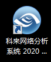

> 科来

启动界面如下：

> 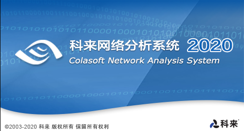

> 启动界面

选择**实时分析**，进入选择网卡界面：

> 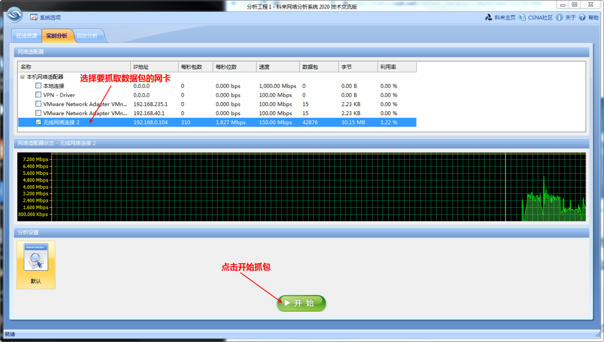选择网卡

彭老师的电脑是通过无线网卡连接路由器，所以选择**无线网络连接2**。【如果是有线网卡，选择**本地连接**】

点击**开始**，即可实现抓包：

> 抓包界面

科来功能十分强大，我们仅介绍常用的一些功能：

1. 选择网卡
2. 开始抓包
3. 停止抓包
4. 设置过滤器
5. 显示IP会话信息
6. 显示TCP会话信息
7. 显示UDP会话信息

每一个按钮详细解释啊如下：

1. 设置网络接口界面

> 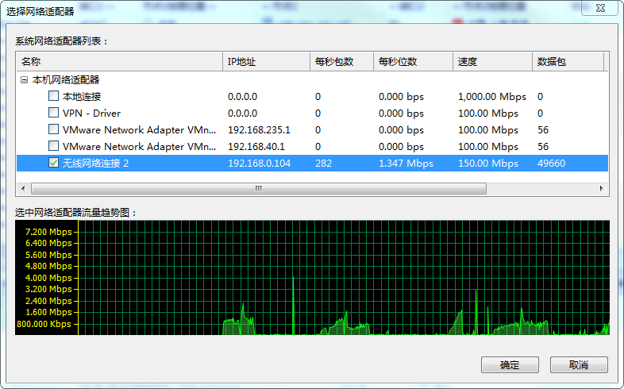选择网卡

1. 设置过滤器 参考第三章
2. 显示IP会话信息科来最大的优点就是把所有的数据根据源和目的进行了归类，这样方便我们根据查找和某个服务器的的进程交互的所有的数据包。

> IP会话

1. 显示TCP会话信息

点击**TCP会话**

> 

点击上方的数据包分类的窗口，科来帮助我们把tcp数据包交互的所有的时序也帮助我们排好了！

彩！

tcp分类

可以清晰的看到TCP通信从3次握手、到数据发送、ack回复，4次握手。

查看数据包内容：

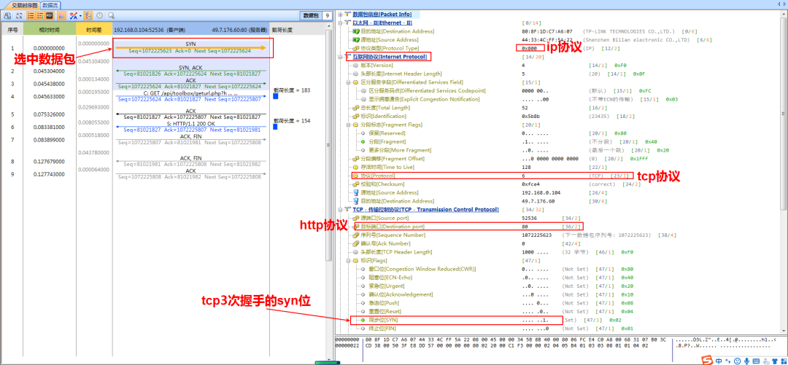

如上图所示，我们选中三次握手的syn包，右侧上方为科来帮我们解析过的数据包头信息，右侧下方为实际数据包的16进制信息。

1. 显示UDP会话信息


点击编号是19的数据包：


### 三、如何过滤数据包

过滤器设置窗口如下：

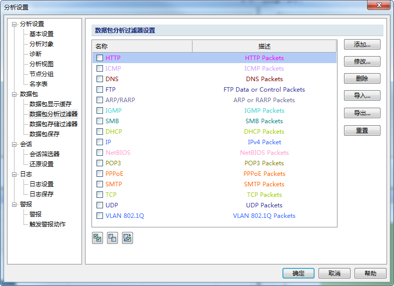

我们可以根据需要选择我们要抓取的数据包，比如我们只想抓取ICMP(ping包)的数据包，只需要选中即可：

> 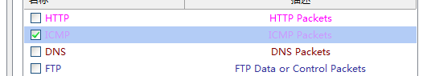
>
> 过滤ICMP

这样我们再次点击**开始**，就只会抓取ICMP的数据包了。

## 1. 过滤端口

点击右侧的**添加**按钮，进入过滤条件设置页面：

> 
>
> 过滤条件设置

然后选中该协议：


在浏览器中输入以下地址：

```
http://sohu.com:8888/
该网址是访问sohu.com对应的服务器的8888端口，rfc1738有关于域名信息的详细解释。
```

点击**开始**，即可抓取到该端口的所有数据包，而非8888端口的数据包就会过滤掉。

> 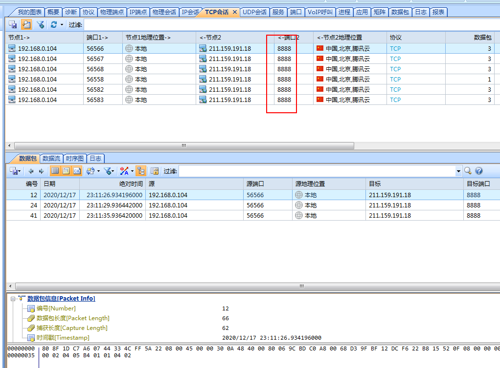port 8888

### 2. 过滤ip地址

我们首先获取baidu服务器的ip地址：

> 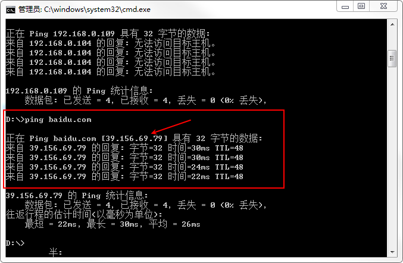ping baidu

可得到 百度服务器地址 **39.156.69.79**

如果我们只想抓取和百度服务器通信的所有数据包，设置如下：


其中：|| 是逻辑或的意思，该表达式表示所有目的ip或者源ip是39.156.69.79的数据包。

选中该过滤条件：


点开**开始**，开启抓包：

然后，ping **39.156.69.79**

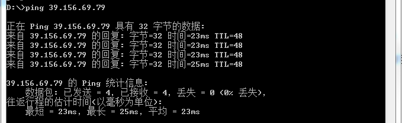

即可抓取到对应的ping包

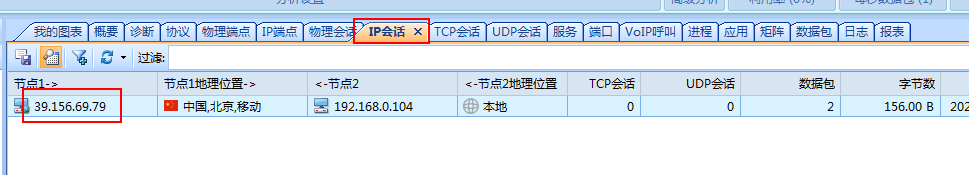

注意，要在IP会话中查看。

点击数据包：

icmp

### 3. 其他

过滤器的表达式还有很多种， 比如：

- **不抓取端口号为8888数据包,表达式为:**

```
port != 8888
```

- **不抓取ip地址为39.156.69.79 的数据包,表达式为:**

```
dstip != 39.156.69.79 && srcip != 39.156.69.79
```

读者可以根据自己的需要来组合搭配对应的过滤条件来高效的抓取自己需要的数据包。

### 四、 其他功能

#### 1. 选择工具->IP地址归属地查询

可以显示制定IP地址所在地。

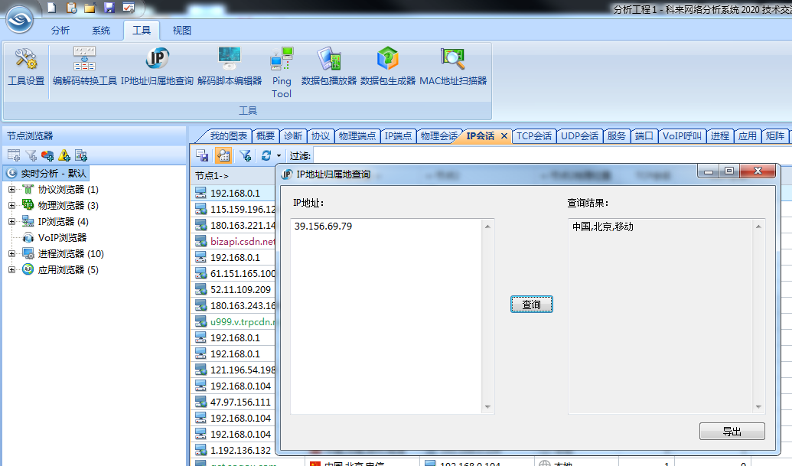IP地址归属地查询

#### 2. 选择工具->Ping Tool

可以实现对某个IP地址的ping。

> Ping Tool

#### 3. 选择**工具->MAC地址扫描器**

使用该工具可以扫描该局域网内所有的IP地址和MAC地址。

MAC地址扫描器

#### 4. 选择工具->数据包生成器

使用该工具可以辅助我们填写制定类型的数据包，并制定对应的网卡发送该数据包，在我们测试通信协议健壮性时，该工具非常实用。

> 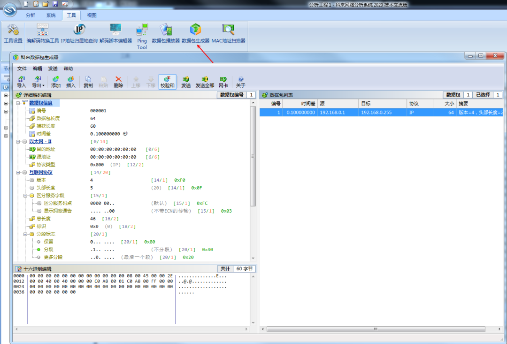数据包生成器

### 五、偷取ftp登录的用户名、密码

下面手把手教大家如何偷取FTP登录的用户名、密码。ftp协议详细流程在此不展开讨论，读者可以自行搜索，网上资料很多。

#### 1. 环境

本次测试环境在本地测试。ftp服务器运行在pc上，ip地址是**192.168.0.104**，端口号用默认的21、22 ftp客户端运行在虚拟机中的ubuntu，IP地址设置为**192.168.0.111**

##### 1）虚拟机设置

一口君pc连接的无线路由器，虚拟机设置的是桥接模式，所以 **编辑->虚拟网络编辑器**，做如下选择，选择**已桥接至**无线网卡。【如果是网线连接路由器，则选择有线网卡】

桥接模式

##### 2）设置虚拟网卡地址

```
ifconfig ens33 192.168.0.111
```

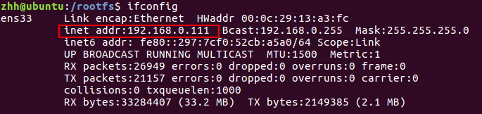虚拟机地址

##### 3）设置FTP服务器

ftp服务器运行在pc上， 用户名：**yikoulinux**密码：**yikoulinux**共享目录：**e:/一口Linux**

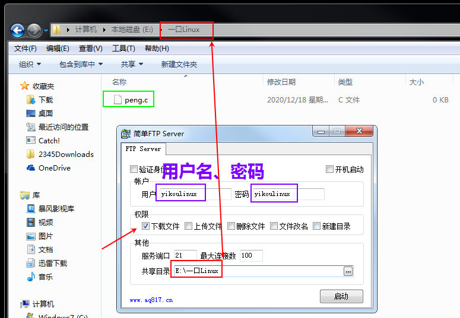FTP server

ftp server的下载安装，本文不再介绍。

#### 2. 抓取数据包

##### 1） 选择无线网卡

因为是桥接模式，所以仍然选择无线网卡，其他环境的话，如果读者不熟悉，可以把所有网卡都选中。

选中网卡

##### 2）设置过滤器

设置FTP协议，我们只需要抓取FTP协议的数据包，规则如下：

```
port = 21 || port = 22
```

> 过滤规则

选中该规则

注意，不要和上一章例子冲突了。

在这里插入图片描述

点击**开始**抓取数据包。

##### 3) 访问ftp server

ubuntu中登录ftp，并输入用户名、密码。

```
ftp 192.168.0.104
键入用户名 yikoulinux
键入密码 yikoulinux
显示根服务器目录 ls
退出 quit 
```


##### 4）FTP协议交互流程

FTP协议的交互流程如下图所示：

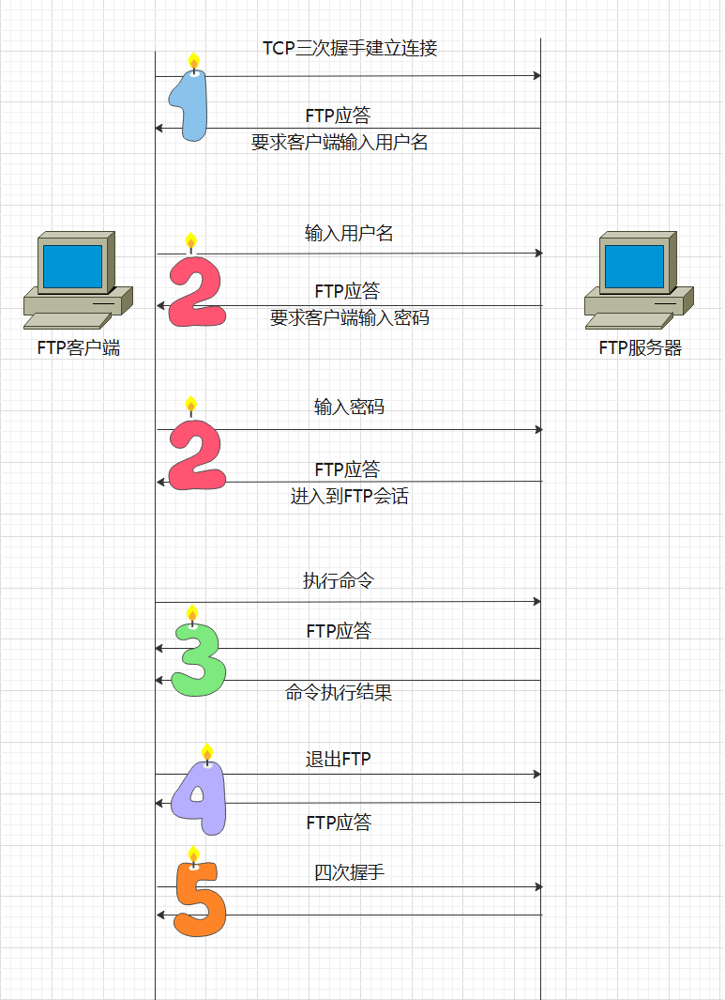FTP 数据交互流程

#### 1. 建立连接阶段

该阶段是 FTP 客户端通过 TCP 三次握手与FTP服务器端进行建立连接。

客户端向 FTP 服务器发出建立连接请求，FTP 服务器对请求进行应答。如果 FTP 服务器上的 21 端口是启用的，可以接受来自其他主机的请求，给出应答 220，表示服务就绪，即告诉客户端需要的 FTP 服务已经准备好了。

返回应答以后，FTP 服务器需要客户端进行身份认证，向客户端发送身份认证请求。

#### 2. 身份认证阶段

身份认证是指客户端需要向FTP服务提供登录所需的用户名和密码。FTP 服务器对客户端输入的用户名和密码都会给出相应的应答。如果客户端输入的用户名和密码正确，将成功登录FTP服务器，此时进入 FTP 会话。

#### 3. 命令交互阶段

在 FTP 会话中，用户可以执行 FTP 命令进行文件传输，如查看目录信息、上传或下载文件等。客户端输入要执行的 FTP 命令后，服务器同样会给出应答。如果输入的执命令正确，服务器会将命令的执行结果返回给客户端。执行结果返回完成后，服务器继续给出应答。

#### 4. 断开连接阶段

当客户端不再与 FTP 服务器进行文件传输时，需要断开连接。客户端向 FTP 服务器发送断开连接请求，服务器收到断开连接后给出相应的应答。

#### 5. tcp断开

tcp断开仍然需要四次握手。

##### 4）截获数据包

截取到数据包一共28个：

> 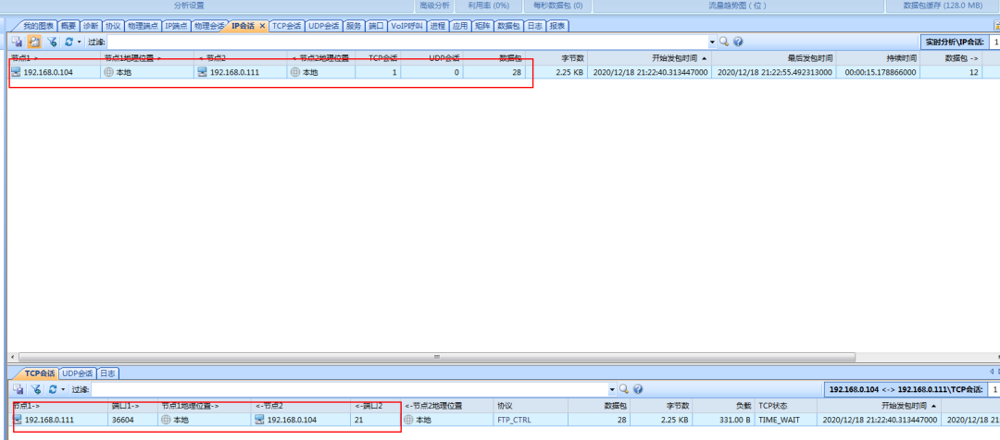ftp数据包

1-14个数据包如下：

1-14包

15-28个数据包如下：

> 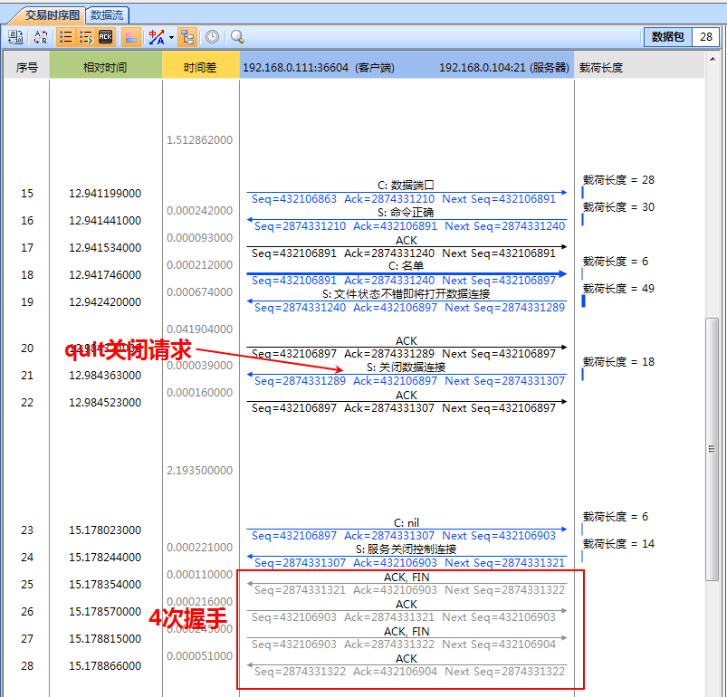15-28包

##### 5） 那么用户名密码怎么获得呢？

查看第6个数据包，

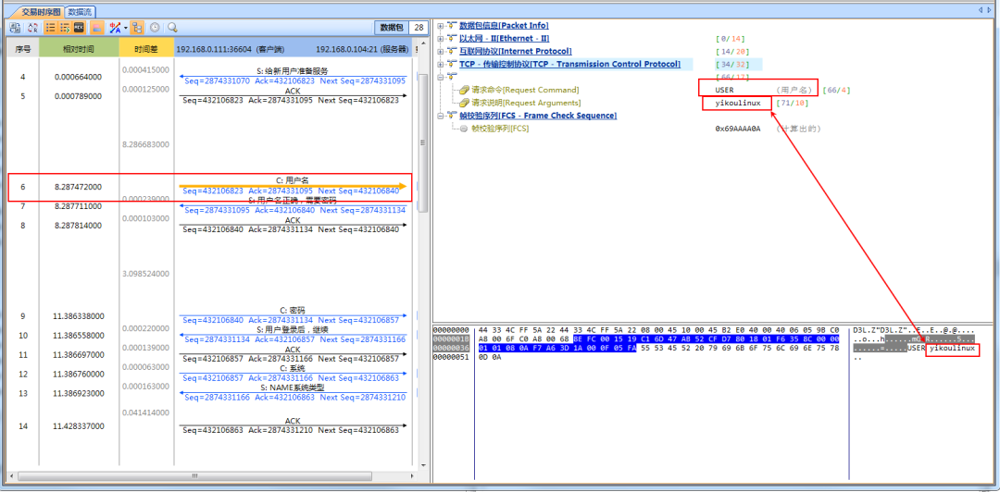用户名

第9个数据包查看密码

密码

可见，我们通过抓包工具获取到了刚才访问FTP 服务器输入的用户名密码！

##### 6) 注意

之所以可以通过数据包得到用户名和密码，是因为访问FTP 服务器时登录用的用户名和密码是明文的，这非常不安全，所以现在传输文件基本上会使用FTPS，ssh、HTTPS等带秘钥的加密协议。要想破解，难度会很大。


