<h1 align="center">📔 皓清的技术笔记</h1>

<strong>开放个人技术学习过程中整理记录的所有笔记文档。<strong>

    
 

## 仓库介绍

- 开放个人技术学习过程中整理记录的所有笔记文档。
- 包含C/C++，算法，Linux基础，Linux驱动，STM32+RTOS；
- 嵌入式，总线协议，操作系统，计算机网络，人工智能；
- 工程实践，项目开发，软件使用，校招面试等等。
- **笔记皆为Markdown语法文档，可直接编辑修改。**

## 笔记总览

#### 0 - 树莓派项目

> 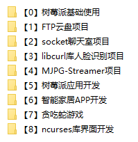

**部分展示**

> 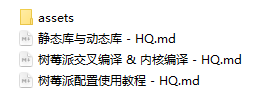
>
> 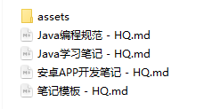
>
> 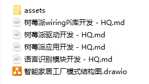

#### 1 - 工程实践

>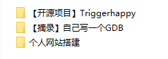

#### 1 - 其他笔记

>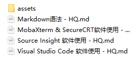

#### 1 - 日常学习

>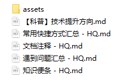

#### 2 - C++笔记

>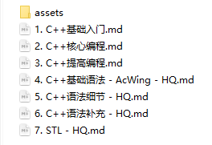

#### 2 - C语言笔记

>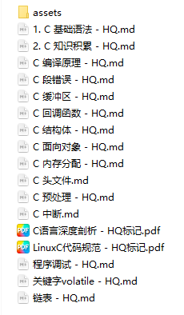

#### 3 - 算法刷题笔记

>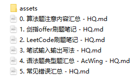

#### 3 - 算法知识笔记

>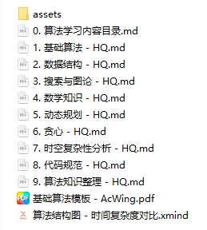

#### 5 - Linux基础学习

>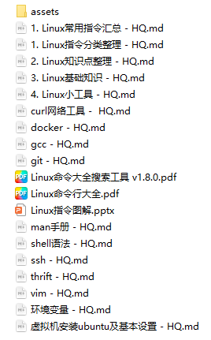

#### 5 - Linux驱动学习

>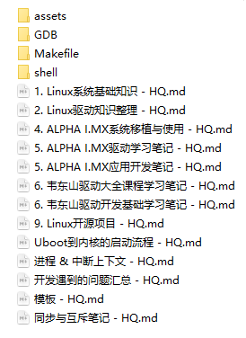

#### 6 - STM32 + RTOS

>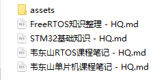

#### 6 - 嵌入式学习

>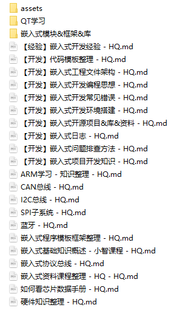

#### 7 - 操作系统

>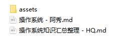

#### 7 - 计算机网络

>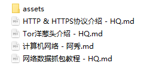

#### 9 - 人工智能

>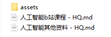

#### 10 - 其他学习

>

## 关于HQ

#### :book: **学习格言**

- *书籍是人类进步的阶梯。  -  高尔基*
- *学知不足，业精于勤。 - 韩愈*
- *博学之，审问之，慎思之，明辨之，笃行之。 - 《礼记》*

#### **📝个人网站**

- ***个人博客 - https://wuxiaolie.github.io/hq.github.io/***
- ***CSDN博客 - https://blog.csdn.net/weixin_45346142***
- ***Gitee仓库 - https://gitee.com/yang-haoqing/***
- ***GitHub仓库 - https://github.com/wuxiaolie***

#### **📋 仓库迭代**

- ***Accumulate day by day and month by month.***

#### **🔨 内卷口号**

- ***God helps those who help themselves.***

#### **🐼 关于皓清**

- ***A xxxxx boy.***

#### 🍖 **咨询交流**

- ***QQ : 970407688***
- ***Email : haoqingboy@163.com***

#### **🎅 友情赞助**

- ***Alipay : 970407688@qq.com***

#### **:orange_book: 勘误与转载**

- ***Welcome. Please leave a message if you have any questions.***
- ***欢迎光临，~~一键三连~~，给个star！***
